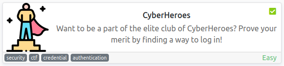
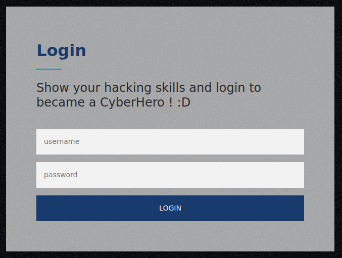
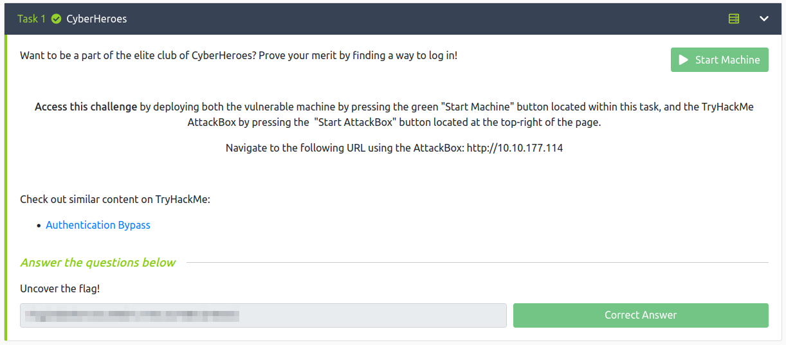

# CyberHeroes
**Date:** August 3rd 2022

**Author:** j.info

**Link:** [**CyberHeroes**](https://tryhackme.com/room/cyberheroes) CTF on TryHackMe

**TryHackMe Difficulty Rating:** Easy

<br>



<br>

## Objectives
- Uncover the flag!

<br>

## Initial Enumeration

### Nmap Scan

`sudo nmap -sV -sC -T4 $ip`

```
ORT   STATE SERVICE VERSION
22/tcp open  ssh     OpenSSH 8.2p1 Ubuntu 4ubuntu0.4 (Ubuntu Linux; protocol 2.0)
80/tcp open  http    Apache httpd 2.4.48 ((Ubuntu))
|_http-title: CyberHeros : Index
```

<br>

### Gobuster Scan

Not necessary for this CTF.

<br>

## Website Digging

Visiting the main page:


Navigating over to the login page:



Looking at the source code gives us the username and password:

```js
  <script>
    function authenticate() {
      a = document.getElementById('uname')
      b = document.getElementById('pass')
      const RevereString = str => [...str].reverse().join('');
      if (a.value=="h3ck3rBoi" & b.value==RevereString("<REDACTED>")) { 
        var xhttp = new XMLHttpRequest();
        xhttp.onreadystatechange = function() {
          if (this.readyState == 4 && this.status == 200) {
            document.getElementById("flag").innerHTML = this.responseText ;
            document.getElementById("todel").innerHTML = "";
            document.getElementById("rm").remove() ;
          }
        };
        xhttp.open("GET", "RandomLo0o0o0o0o0o0o0o0o0o0gpath12345_Flag_"+a.value+"_"+b.value+".txt", true);
        xhttp.send();
      }
      else {
        alert("Incorrect Password, try again.. you got this hacker !")
      }
    }
  </script>
```

Logging in with those credentials:


<br>

With that we've completed this CTF!



<br>

## Conclusion

A quick run down of what we covered in this CTF:

- Basic enumeration with **nmap**
- Viewing the page source and finding the username and password listed in a block of javascript code

<br>

Many thanks to:
- [**cmantic**](https://tryhackme.com/p/cmnatic) for creating this CTF
- **TryHackMe** for hosting this CTF

<br>

You can visit them at: [**https://tryhackme.com**](https://tryhackme.com)