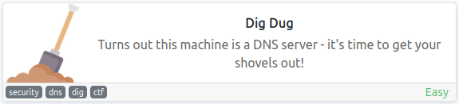
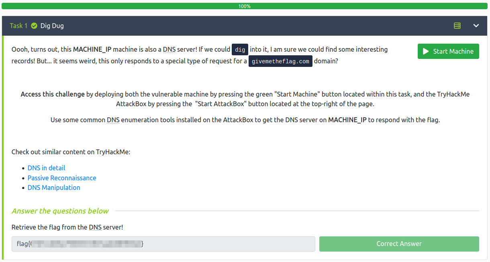

# Dig Dug
**Date:** August 7th 2022

**Author:** j.info

**Link:** [**Dig Dug**](https://tryhackme.com/room/digdug) CTF on TryHackMe

**TryHackMe Difficulty Rating:** Easy

<br>



<br>

## Objectives
- Retrieve the flag from the DNS server!

<br>

## Dig Digging

Instructions on THM:

Oooh, turns out, this 10.10.15.233 machine is also a DNS server! If we could dig into it, I am sure we could find some interesting records! But... it seems weird, this only responds to a special type of request for a givemetheflag.com domain?

Solution:

So I run a dig command against the IP address and specify givemetheflag.com as a parameter:

`dig @10.10.15.233 givemetheflag.com`

```
; <<>> DiG 9.18.4-2-Debian <<>> @10.10.15.233 givemetheflag.com
; (1 server found)
;; global options: +cmd
;; Got answer:
;; ->>HEADER<<- opcode: QUERY, status: NOERROR, id: 2982
;; flags: qr aa; QUERY: 1, ANSWER: 1, AUTHORITY: 0, ADDITIONAL: 0

;; QUESTION SECTION:
;givemetheflag.com.             IN      A

;; ANSWER SECTION:
givemetheflag.com.      0       IN      TXT     "flag{<REDACTED>}"

;; Query time: 76 msec
;; SERVER: 10.10.15.233#53(10.10.15.233) (UDP)
;; WHEN: Sun Aug 07 23:04:39 EDT 2022
;; MSG SIZE  rcvd: 86
```

<br>

With that we've completed this CTF!



<br>

## Conclusion

A quick run down of what we covered in this CTF:

- Using the **dig** command to get information from the DNS server

<br>

Many thanks to:
- [**cmantic**](https://tryhackme.com/p/cmnatic) for creating this CTF
- **TryHackMe** for hosting this CTF

<br>

You can visit them at: [**https://tryhackme.com**](https://tryhackme.com)