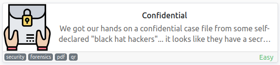
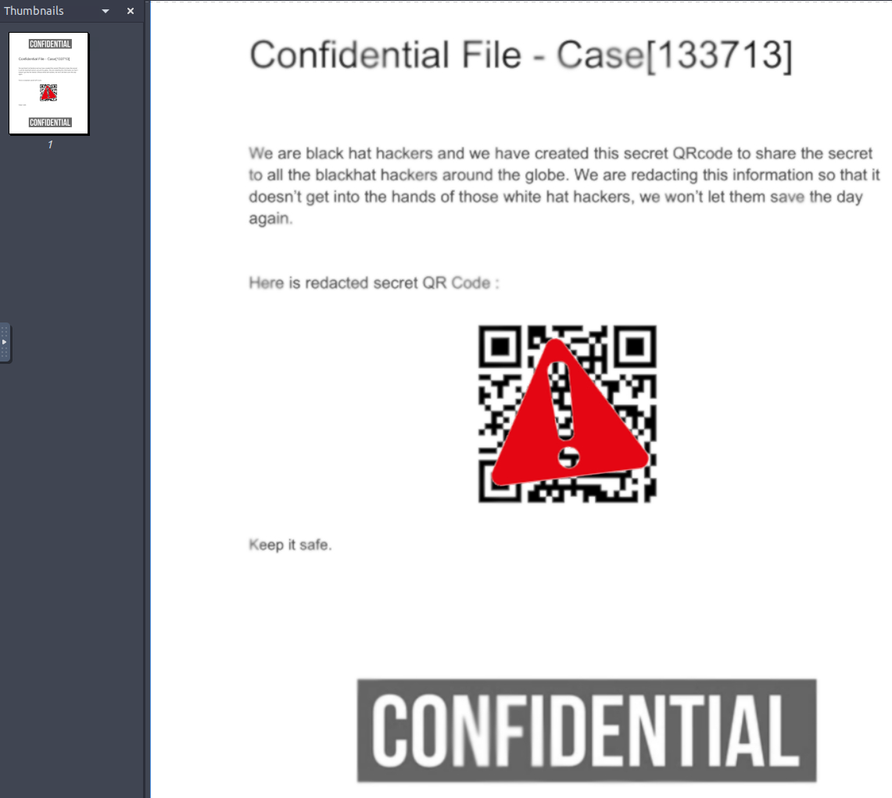
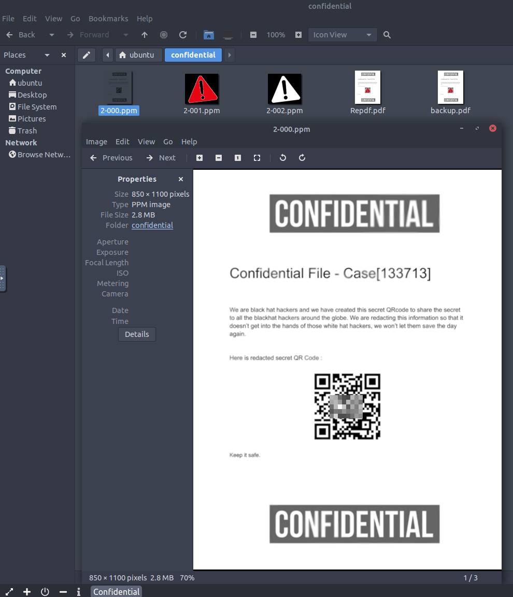
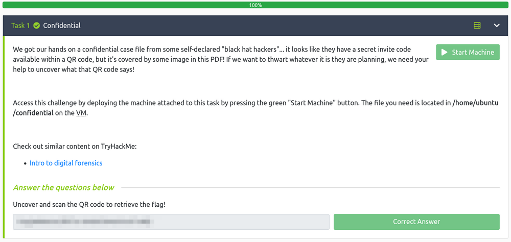

# Confidential
**Date:** August 21st 2022

**Author:** j.info

**Link:** [**Confidential**](https://tryhackme.com/room/confidential) CTF on TryHackMe

**TryHackMe Difficulty Rating:** Easy

<br>



<br>

## Objectives
- Uncover and scan the QR code to retrieve the flag!

<br>

## PDF File Digging

We're provided the following instructions for this machine:

> We got our hands on a confidential case file from some self-declared "black hat hackers"... it looks like they have a secret invite code available within a QR code, but it's covered by some image in this PDF! If we want to thwart whatever it is they are planning, we need your help to uncover what that QR code says!

It doesn't look like we need to do any of the normal enumeration with nmap, etc, and we have to use the provided attack box to access the system.

Opening up the attack box and displaying that .pdf file:



First I create a backup of the .pdf file in case I mess it up somehow:

`cp Repdf.pdf backup.pdf`

I'm not really sure which tool to use so I just look to see what pdf related tools are installed on the system by typing pdf and hitting tab twice:

```bash
ubuntu@thm-confidential:~/confidential$ pdf
pdf2dsc      pdfdetach    pdfinfo      pdftocairo   pdftops      
pdf2ps       pdffonts     pdfseparate  pdftohtml    pdftotext    
pdfattach    pdfimages    pdfsig       pdftoppm     pdfunite
```

I first tried **pdfdetach** but didn't have any success with that one.

I next tried **pdfimages** and this one I did have luck with. Help for the command:

```bash
pdfimages version 0.86.1
Copyright 2005-2020 The Poppler Developers - http://poppler.freedesktop.org
Copyright 1996-2011 Glyph & Cog, LLC
Usage: pdfimages [options] <PDF-file> <image-root>
  -f <int>       : first page to convert
  -l <int>       : last page to convert
  -png           : change the default output format to PNG
  -tiff          : change the default output format to TIFF
  -j             : write JPEG images as JPEG files
  -jp2           : write JPEG2000 images as JP2 files
  -jbig2         : write JBIG2 images as JBIG2 files
  -ccitt         : write CCITT images as CCITT files
  -all           : equivalent to -png -tiff -j -jp2 -jbig2 -ccitt
  -list          : print list of images instead of saving
  -opw <string>  : owner password (for encrypted files)
  -upw <string>  : user password (for encrypted files)
  -p             : include page numbers in output file names
  -q             : don't print any messages or errors
  -v             : print copyright and version info
  -h             : print usage information
  -help          : print usage information
  --help         : print usage information
  -?             : print usage information
```

I run the following to see what images are inside the .pdf file:

`pdfimages -list Repdf.pdf`

```bash
page   num  type   width height color comp bpc  enc interp  object ID x-ppi y-ppi size ratio
--------------------------------------------------------------------------------------------
   1     0 image     850  1100  gray    1   8  image  yes       10  0    73    73 85.7K 9.4%
   1     1 image     187   169  rgb     3   8  image  yes       13  0    73    73 9060B 9.6%
   1     2 smask     187   169  gray    1   8  image  yes       13  0    73    73 3150B  10%
```

That's a start. I figured the ones that list gray as the color are the big confidential banners at the top and bottom or the QR code itself, and the rgb one is the red exclaimation mark over the QR code.

I then run the following:

`pdfimages -j Repdf.pdf 0`

After running this command we see it split out the images from the .pdf file into separate files. 2-001.ppm and 2-002.ppm are the overlay on top of the QR code but opening up 2-000.ppm shows us the QR code without the other images covering it up:



<br>

With that we've completed this CTF!



<br>

## Conclusion

A quick run down of what we covered in this CTF:

- Using the **pdfimages** tool to extract image files that allow us to view an unobstructed QR code which then allows us to get the flag for this challenge

<br>

Many thanks to:
- [**cmantic**](https://tryhackme.com/p/cmnatic) for creating this CTF
- **TryHackMe** for hosting this CTF

<br>

You can visit them at: [**https://tryhackme.com**](https://tryhackme.com)