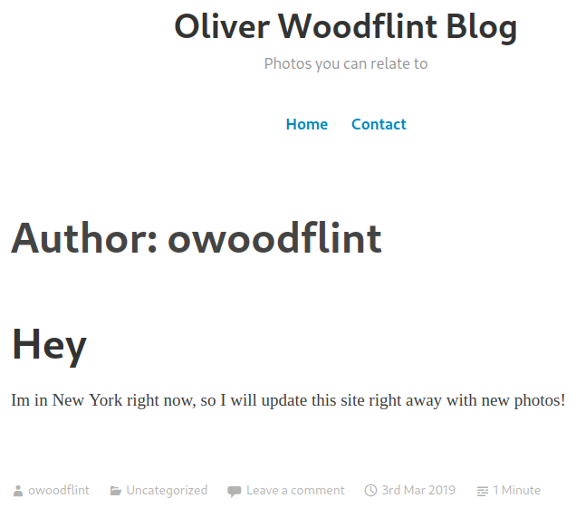

# OhSINT
**Date:** October 31st 2022

**Author:** j.info

**Link:** [**OhSINT**](https://tryhackme.com/room/ohsint) CTF on TryHackMe

**TryHackMe Difficulty Rating:** Easy

 

 

## Objectives
- What is the users avatar of?
- What city is this person in?
- Whats the SSID of the WAP he connected to?
- What is his personal email address?
- What site did you find his email address on?
- Where has he gone on holiday?
- What is this persons password?

 

## Investigation

To start we download the attached task file and end up with a pictuer named WindowsXP.jpg

I run `exiftool WindowsXP.jpg` to see what metadata is available and find a GPS location on where it was taken as well as a name in the copyright tag:

Searching google for the name OWoodflint shows us a Twitter account as well as some other sites like a GitHub page. Not sure if they are all connected to the same person just yet:

And visiting their Twitter shows us they like taking photos and open source projects. This likely points to us being in the right spot. We're also given a basic service set (BSSID) to investigate:

The [**wigle.net website**](https://wigle.net) can be used to search for SSID / BSSID to gather some information as well as pinpoint a location. On the menu bar at the top choose View -> Basic Search and type in the BSSID:

It won't automatically center the map for you so zoom way out until you see a pink circle on the map, that's the location you're looking for:

Now zoom really far in on the pink circle until you can see the SSID name of the WiFi network:

So at this point we can answer the first 3 questions of the avatar, city, and SSID name.

I don't see much else on Twitter other than some base64 encoded text that other users have replied to his tweets with that hint you towards wigle.net.

Let's check out the GitHub page we saw on the google search earlier:

And we have the email address and where to find it.

We also saw a wordpress blog for owoodflint. Checking that out shows us where they are on holiday:

That leaves us a password to find.

This one took me awhile I'll admit. Eventually I looked at the page source of his blog and saw a strange entry:

So that changes the font color to white (#ffffff), and given the background of the blog is white you wouldn't actually be able to see this text unless you select everything on the page:

And that answers our last question.

 

With that we've completed this CTF!

 

## Conclusion

A quick run down of what we covered in this CTF:

- Looking through picture metadata to find additional information using **exiftool**
- Searching for information on social media platforms **Twitter** and **GitHub**
- Finding specific location information using **wigle.net** by providing it BSSID details
- Viewing web page **source code** to find hidden information on a website

 

Many thanks to:
- **TryHackMe** for creating and hosting this CTF

 

You can visit them at: [**https://tryhackme.com**](https://tryhackme.com)