# Lian_Yu
**Date:** November  2022

**Author:** j.info

**Link:** [**Lian_Yu**](https://tryhackme.com/room/lianyu) CTF on TryHackMe

**TryHackMe Difficulty Rating:** Easy

<br>

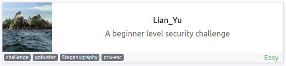

<br>

## Objectives
- What is the Web Directory you found?
- What is the file name you found?
- What is the FTP Password?
- What is the file name with SSH password?
- user.txt
- root.txt

<br>

## Initial Enumeration

### Nmap Scan

`sudo nmap -sV -sC -T4 $ip`

```
PORT    STATE SERVICE VERSION
21/tcp  open  ftp     vsftpd 3.0.2
22/tcp  open  ssh     OpenSSH 6.7p1 Debian 5+deb8u8 (protocol 2.0)
80/tcp  open  http    Apache httpd
|_http-title: Purgatory
111/tcp open  rpcbind 2-4 (RPC #100000)
| rpcinfo: 
|   program version    port/proto  service
|   100000  2,3,4        111/tcp   rpcbind
|   100000  2,3,4        111/udp   rpcbind
|   100000  3,4          111/tcp6  rpcbind
|   100000  3,4          111/udp6  rpcbind
|   100024  1          34263/tcp   status
|   100024  1          35768/udp   status
|   100024  1          36907/tcp6  status
|_  100024  1          56700/udp6  status
```

An all ports scan shows us an additional open port:

```
PORT      STATE SERVICE VERSION
34263/tcp open  status  1 (RPC #100024)
```

<br>

### Gobuster Scan

`gobuster dir -u http://$ip -t 50 -r -x php,txt,html -w dir-med.txt`

```
/index.html           (Status: 200) [Size: 2506]
/island               (Status: 200) [Size: 345]
```

Scanning /island:

```
/index.html           (Status: 200) [Size: 345]
/2100                 (Status: 200) [Size: 292]
```

That answers question #1.

<br>

## Website Digging

Visiting the main page:

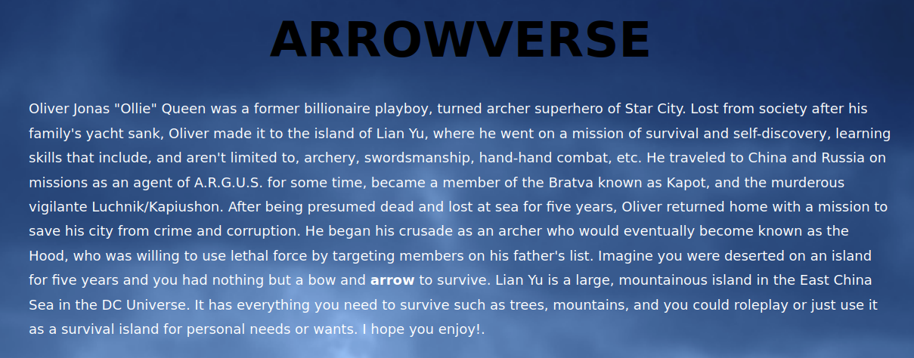

Looking at /island:

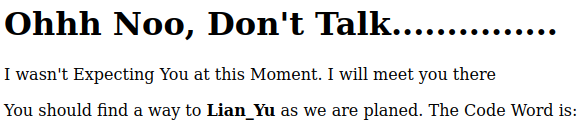

The code word isn't displayed but looks like it should be. I highlight everything on the page and find:

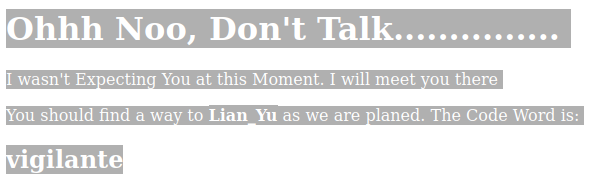

And checking out /island/2100/ brings up a page with a YouTube video that's no longer available and some text that reads "How Oliver Queen finds his way to Lian_Yu?".

Looking at the page source code shows us:

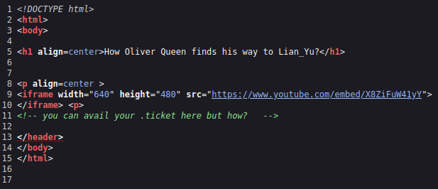

I'm not entirely sure what that means but .ticket could be a file extension and I decide to gobuster scan the /island/2100/ directory with that and see what happens:

`gobuster dir -u http://$ip/island/2100 -t 50 -r -x ticket -w dir-med.txt`

```
/green_arrow.ticket   (Status: 200) [Size: 71]
```

That answers question #2.

Visiting that page gives us a string of encoded text:

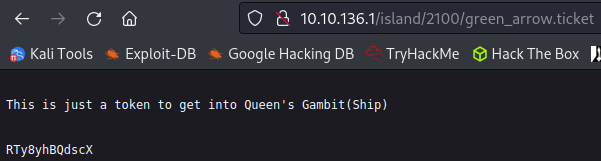

After identifying that it's base 58 we end up with:

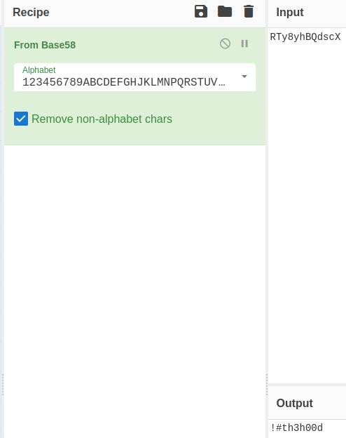

That answers question #3.

It works on the FTP site but not with SSH:

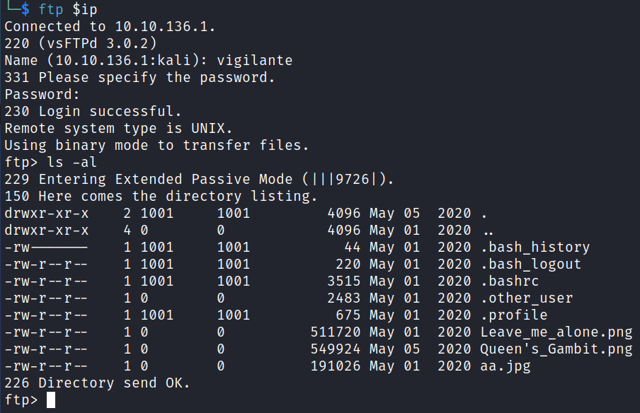

I download all the files and start looking at them. .bash_history shows:

```
Sorry I couldn't Help Other user Might help
```

.other_user gives some back story on Arrow:

```
Slade Wilson was 16 years old when he enlisted in the United States Army, having lied about his age. After serving a stint in Korea, he was later assigned to Camp Washington where he had been promoted to the rank of major. In the early 1960s, he met Captain Adeline Kane, who was tasked with training young soldiers in new fighting techniques in anticipation of brewing troubles taking place in Vietnam. Kane was amazed at how skilled Slade was and how quickly he adapted to modern conventions of warfare. She immediately fell in love with him and realized that he was without a doubt the most able-bodied combatant that she had ever encountered. She offered to privately train Slade in guerrilla warfare. In less than a year, Slade mastered every fighting form presented to him and was soon promoted to the rank of lieutenant colonel. Six months later, Adeline and he were married and she became pregnant with their first child. The war in Vietnam began to escalate and Slade was shipped overseas. In the war, his unit massacred a village, an event which sickened him. He was also rescued by SAS member Wintergreen, to whom he would later return the favor.

Chosen for a secret experiment, the Army imbued him with enhanced physical powers in an attempt to create metahuman super-soldiers for the U.S. military. Deathstroke became a mercenary soon after the experiment when he defied orders and rescued his friend Wintergreen, who had been sent on a suicide mission by a commanding officer with a grudge.[7] However, Slade kept this career secret from his family, even though his wife was an expert military combat instructor.

A criminal named the Jackal took his younger son Joseph Wilson hostage to force Slade to divulge the name of a client who had hired him as an assassin. Slade refused, claiming it was against his personal honor code. He attacked and killed the kidnappers at the rendezvous. Unfortunately, Joseph's throat was slashed by one of the criminals before Slade could prevent it, destroying Joseph's vocal cords and rendering him mute.

After taking Joseph to the hospital, Adeline was enraged at his endangerment of her son and tried to kill Slade by shooting him, but only managed to destroy his right eye. Afterwards, his confidence in his physical abilities was such that he made no secret of his impaired vision, marked by his mask which has a black, featureless half covering his lost right eye. Without his mask, Slade wears an eyepatch to cover his eye.
```

That leaves us 3 pictures. Steganography time?

`stegseek -wl rockyou.txt aa.jpg`

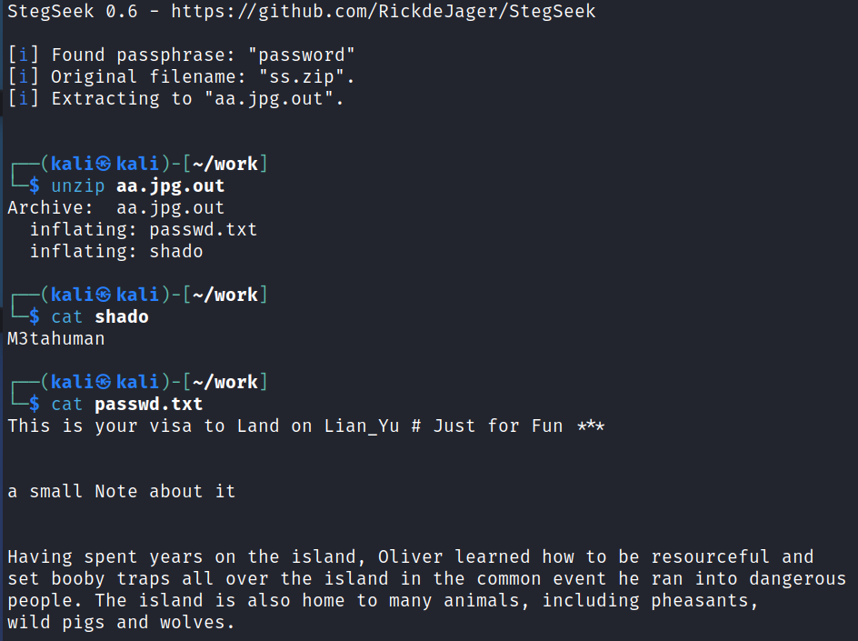

That answers question #4.

That looks like a potential password to me.

I check out the other pictures but don't find anything hidden in them using stegseek, steghide, and foremost. But I do find something interesting with Leave_me_alone.png. When trying to open the file to view the picture it gives an error and doesn't display anything.

I take a look at the file with xxd and see that the magic number at the top is incorrect. It's set to:

```
00000000: 58 45 6F AE 0A 0D 1A 0A 00 00 00 0D 49 48 44 52  XEo.........IHDR
```

I use the `hexedit` tool to modify the first 8 pairs to the correct PNG magic header number and it ends up looking like this:

```
00000000   89 50 4E 47  0D 0A 1A 0A  00 00 00 0D  49 48 44 52  00 00 03 4D  .PNG........IHDR
```

And now when viewing the picture we get:


That's a nice little easter egg!

Viewing the other 2 pictures:

aa.jpg:

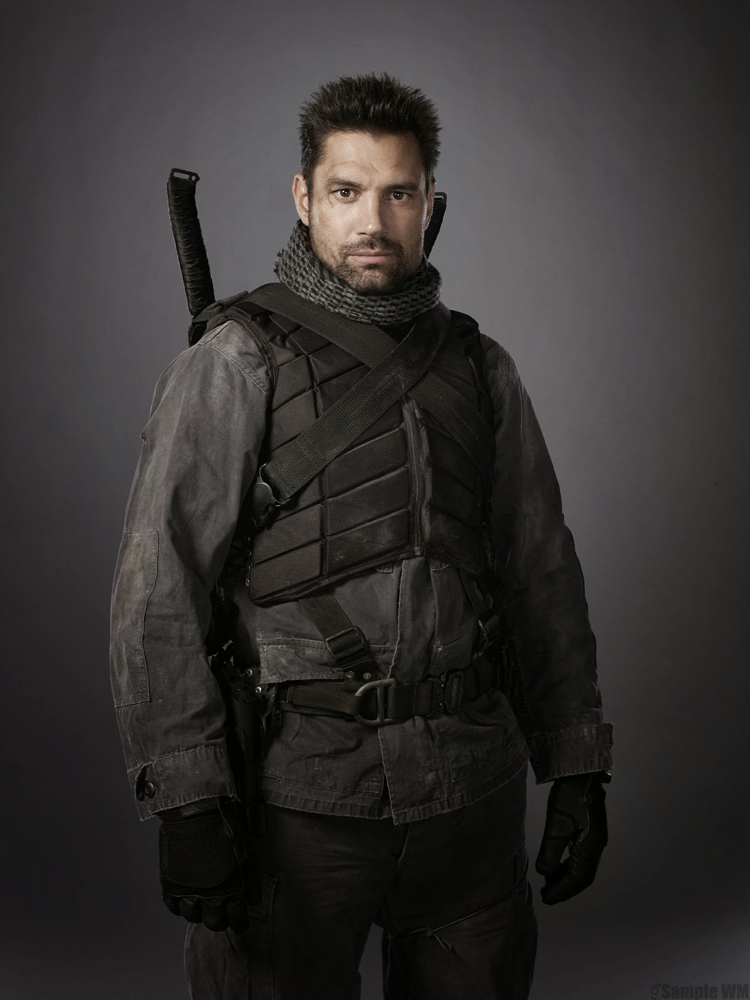

Queen's_Gambit.png:


<br>

## System Access

I try and SSH over as vigilante with the new password we found but it doesn't work. Given the .other_user file from the FTP site had several names it in I start going through them to see if any of those work.

We get lucky with the first name in the file:

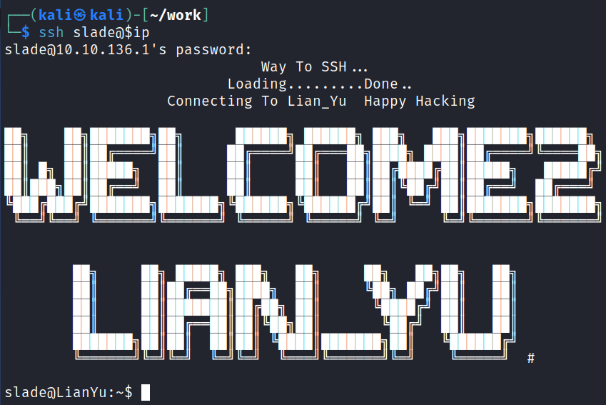

<br>

## System Enumeration

Waiting for us in our home directory is the user.txt flag.

`wc -c /home/slade/user.txt`

```
63 /home/slade/user.txt
```

I check for SUID files with `find / -perm /4000 2>/dev/null` but don't find anything out of the ordinary.

Looking at `sudo -l` shows us something we can use:

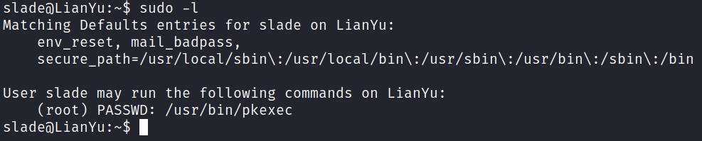

And GTFOBins info on that:

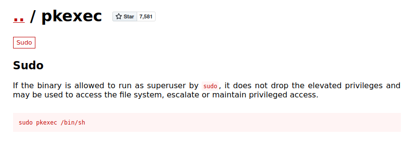

<br>

## Root

I give that a try and get root:

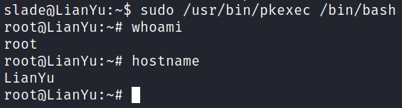

The root.txt flag is waiting for us in /root:

`wc -c /root/root.txt`

```
340 /root/root.txt
```

<br>

With that we've completed this CTF!

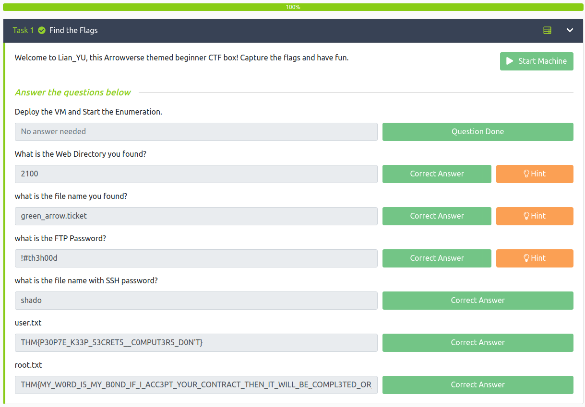

<br>

## Conclusion

A quick run down of what we covered in this CTF:

- Basic enumeration with **nmap** and **gobuster**
- Decoding **base58 encoded** text
- Using **stegseek** to find hidden information in an image file
- Fixing the file **magic number** for an image file using **hexedit** so that it would display properly
- Finding we can run **pkexec** as root and using that to escalate our privileges

<br>

Many thanks to:
- [**Deamon**](https://tryhackme.com/p/Deamon) for creating this CTF
- **TryHackMe** for hosting this CTF

<br>

You can visit them at: [**https://tryhackme.com**](https://tryhackme.com)