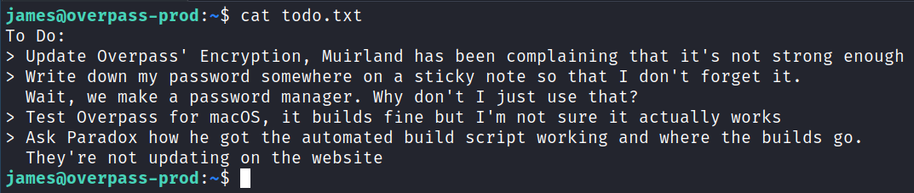

# Overpass
**Date:** December 29th 2022

**Author:** j.info

**Link:** [**Overpass**](https://tryhackme.com/room/overpass) CTF on TryHackMe

**TryHackMe Difficulty Rating:** Easy

<br>


<br>

## Objectives
- Hack the machine and get the flag in user.txt
- Escalate your privileges and get the flag in root.txt

<br>

## Initial Enumeration

### Nmap Scan

`sudo nmap -sV -sC -T4 $ip`

```
PORT   STATE SERVICE VERSION
22/tcp open  ssh     OpenSSH 7.6p1 Ubuntu 4ubuntu0.3 (Ubuntu Linux; protocol 2.0)
80/tcp open  http    Golang net/http server (Go-IPFS json-rpc or InfluxDB API)
|_http-title: Overpass
```

<br>

### Gobuster Scan

`gobuster dir -u http://$ip -t 30 -r -x php,txt,html -w dir-med.txt`

```
/index.html           (Status: 200) [Size: 2431]
/img                  (Status: 200) [Size: 183]
/admin                (Status: 200) [Size: 1525]
/css                  (Status: 200) [Size: 79]
/downloads            (Status: 200) [Size: 1987]
/aboutus              (Status: 200) [Size: 1749]
/404.html             (Status: 200) [Size: 782]
```

<br>

## Website Digging

Visiting the main page:


Looking at the page source code:

```html
<p>Overpass allows you to securely store different passwords for every service, protected using military grade

<!--Yeah right, just because the Romans used it doesn't make it military grade, change this?-->

cryptography to keep you safe.
</p>
```

Looking at the About Us page gives us some potential usernames:


The /admin page has a login:


I try a few default password combos but don't have any luck.

Looking at the source for /admin shows us 3 JavaScript files it uses:

```html
    <script src="/main.js"></script>
    <script src="/login.js"></script>
    <script src="/cookie.js"></script>
```

Looking in login.js

```js
async function login() {
    const usernameBox = document.querySelector("#username");
    const passwordBox = document.querySelector("#password");
    const loginStatus = document.querySelector("#loginStatus");
    loginStatus.textContent = ""
    const creds = { username: usernameBox.value, password: passwordBox.value }
    const response = await postData("/api/login", creds)
    const statusOrCookie = await response.text()
    if (statusOrCookie === "Incorrect credentials") {
        loginStatus.textContent = "Incorrect Credentials"
        passwordBox.value=""
    } else {
        Cookies.set("SessionToken",statusOrCookie)
        window.location = "/admin"
    }
```

Looking at that code shows that if a login is successful a SessionToken cookie gets set. When looking at my session storage the cookie isn't there, so I try and manually add it:


And then refresh the page, which gives us a SSH key and the username it's associated with:


I save the SSH key to my system and try and connect over, but it requires a password:

```
Enter passphrase for key 'id_rsa': 
james@10.10.30.178's password:
```

I use ssh2john to create a crackable hash of the key:

`ssh2john id_rsa > hash`

Then start up John the Ripper to crack it:

`john hash --wordlist=rockyou.txt`


<br>

## System Access

With that I try and connect over again after entering the cracked password:


<br>

## System Enumeration

Looking in our home directory shows that the user.txt flag is there waiting for us:

`wc -c /home/james/user.txt`

```
38 /home/james/user.txt
```

There is also a file called todo.txt:



There is also a .overpass file with what appears to be an encrypted password:

```
,LQ?2>6QiQ$JDE6>Q[QA2DDQiQD2J5C2H?=J:?8A:4EFC6QN.
```

I head back to the website and look at the /downloads section, and download the source code. Looking at the encryption algorithm shows us that they're using rot47! It's also pretty funny that that's why we saw the boasting of "Military Grade Encryption" earlier.

```go
//Secure encryption algorithm from https://socketloop.com/tutorials/golang-rotate-47-caesar-cipher-by-47-characters-example
func rot47(input string) string {
	var result []string
	for i := range input[:len(input)] {
		j := int(input[i])
		if (j >= 33) && (j <= 126) {
			result = append(result, string(rune(33+((j+14)%94))))
		} else {
			result = append(result, string(input[i]))
		}
	}
	return strings.Join(result, "")
}
```

So now that we know what's going on behind the scenes let's run that encrypted password we found through a rot47 on CyberChef:


So we have what is probably the password for James. I check `sudo -l` and use that password and it confirms that theory, but we can't run anything as root.

Looking at `id` shows us nothing special:

```
uid=1001(james) gid=1001(james) groups=1001(james)
```

No interesting files with capabilities when checking `getcap -r / 2>/dev/null`.

Same goes with checking or SUID files using `find / -perm /4000 2>/dev/null`.

Looking at users on the system with shells:

```
root:x:0:0:root:/root:/bin/bash
tryhackme:x:1000:1000:tryhackme:/home/tryhackme:/bin/bash
james:x:1001:1001:,,,:/home/james:/bin/bash
```

I'm unable to view files in /home/tryhackme.

Looking to see if anything is in /etc/crontab shows us:

```
* * * * * root curl overpass.thm/downloads/src/buildscript.sh | bash
```

I look in my web browser and go to IP/downloads/src and see the script file there. Looking at the script shows that it builds source code into ~/src/overpass.go.

What's interesting is it's referencing overpass.thm. I look in /etc/hosts and see:

```
127.0.0.1 localhost
127.0.1.1 overpass-prod
127.0.0.1 overpass.thm
```

Looking at the /etc/hosts permissions:

```
-rw-rw-rw- 1 root root 250 Jun 27  2020 /etc/hosts
```

So we're able to modify it, and should be able to create our own buildscript.sh file on our home system and have it reach out and get it, and it looks like it runs as root. So, we should be able to run whatever we want as root here.

I create the /downloads/src/buildscript.sh on my home system with the standard nc mkfifo reverse shell:


And modify the /etc/hosts file to point overpass.thm to my system:


<br>

## Root

I start up a python webserver on my system, and also a netcat listener in another tab, and wait for it to connect over and grab the script which it does after about a minute:


And looking at my listener tab shows it worked, and we have a root shell:


I grab our root.txt flag:

`wc -c /root/root.txt`

```
38 /root/root.txt
```

<br>

With that we've completed this CTF!


<br>

## Conclusion

A quick run down of what we covered in this CTF:

- Basic enumeration with **nmap** and **gobuster**
- Viewing the JavaScript that handles the login process and finding we can just **set a cookie to bypass authentication**
- Using **ssh2john** and **John the Ripper** to crack the password on a private SSH key we got off the website
- Looking at the **source code** for the **Overpass password manager** and seeing they just used **rot47**
- Finding a **.overpass** file with a "Military Grade Encryption" encoded password, which I use **CyberChef** to decode
- Seeing that the root user is running a **cronjob** that connects to **overpass.thm** to pipe a **bash script into a bash shell**
- Creating our own **bash script** that will reverse shell back to us and **modifying /etc/hosts** so that the target system will reach out and get our script rather than the one it previously was, and this resulted in a root shell on the system

<br>

Many thanks to:
- [**NinjaJc01**](https://tryhackme.com/p/NinjaJc01) for creating this CTF
- **TryHackMe** for hosting this CTF

<br>

You can visit them at: [**https://tryhackme.com**](https://tryhackme.com)