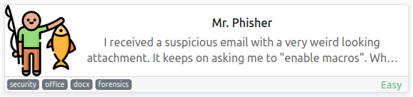
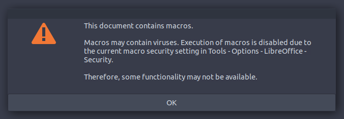
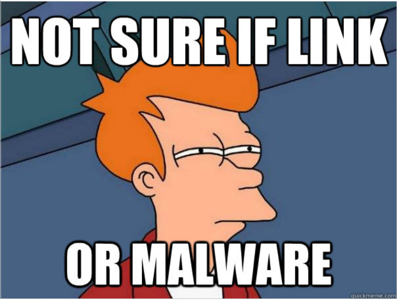
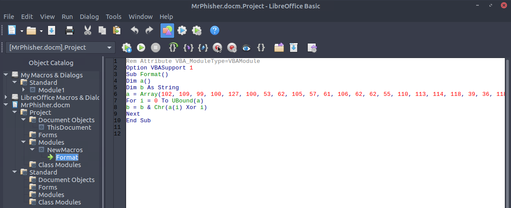
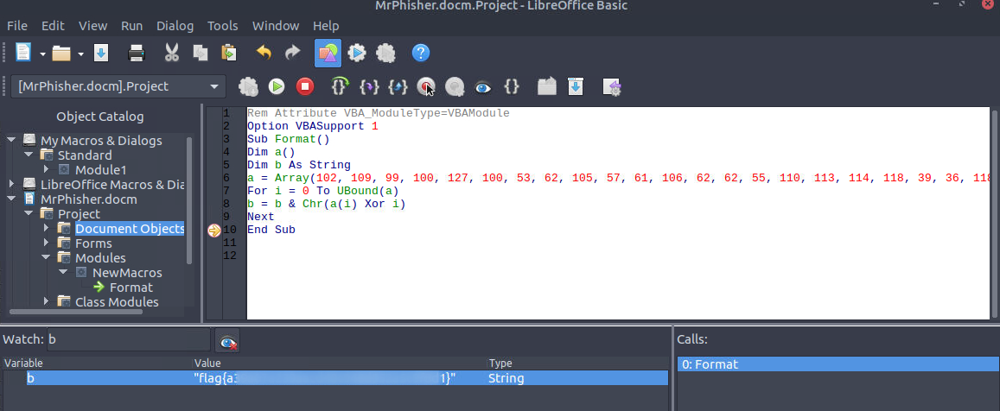

# Mr.Phisher
**Date:** February 1st 2023

**Author:** j.info

**Link:** [**Mr.Phisher**](https://tryhackme.com/room/mrphisher) CTF on TryHackMe

**TryHackMe Difficulty Rating:** Easy

<br>



<br>

## Objectives
- Uncover the flag in the email attachment!

<br>

## Initial Enumeration

This CTF is a bit different and requires you to launch the machine they ask you to in split screen in order to interact with it. You can nmap scan the box but there aren't any open ports.

<br>

## Investigation

I find a folder that's already open in the GUI located at /home/ubuntu/mrphisher. In it are 2 files: MrPhisher.docm and mr-phisher.zip.

Inside the zip file it looks like another copy of the .docm file.

Opening the .docm takes quite some time, and the box itself is also very slow in general so you'll have to be patient on this one. Once you open the file you're confronted with a warning about the macros:



And clicking ok opens up the document which contains only an image:



I right click the image and choose properties, then look through them all but don't find anything useful.

TIP: Since this box is very slow it helps quite a bit if you select the image and delete it to increase the screen load speed. You won't harm anything by removing it and will still be able to complete the challenge.

I'd guess what we're looking for are the macro's embedded in this document so I find that they're located under the Tools menu and then going to Macros -> Edit Macros.

Looking through everything we find one macro named Format that's nested under Mrphisher.docm -> Project -> Modules -> NewMacros.



And this is the VBA code inside the macro, which definitely looks suspiciously obfuscated:

```vba
Rem Attribute VBA_ModuleType=VBAModule
Option VBASupport 1
Sub Format()
Dim a()
Dim b As String
a = Array(102, 109, 99, 100, 127, 100, 53, 62, 105, 57, 61, 106, 62, 62, 55, 110, 113, 114, 118, 39, 36, 118, 47, 35, 32, 125, 34, 46, 46, 124, 43, 124, 25, 71, 26, 71, 21, 88)
For i = 0 To UBound(a)
b = b & Chr(a(i) Xor i)
Next
End Sub
```

I'm not a Visual Basic guy but looking at the code it appears to be doing the following:

- Creating a sub procedure called Format
- Initializing the a array
- Initializing the b string
- Populating the a array
- Looping from 0 to the upper limit of the array, aka doing something to each and every item in the array
- For each pass through the loop it converts an item in the array to a character and runs it through XOR before appending it to the b string

So in this case it's pretty clear this macro is harmless so I'm going to enable macros and run it to hopefully see what our flag is.

NOTE: For obvious reasons never run actual macro code unless you've looked through it and are sure it's not malicious.

I enable macros by going to: Tools -> Options -> LibreOffice -> Security -> Macro Security -> Low.

I navigate back to editing the macro and then select line 10 and press the button with a red circle in the middle to create a break point. You should see a symbol next to line 10 if done correctly.

Then in the watch section below I add the b variable to our watch list.

Finally I run the macro with the play button:



So essentially what we did there was told the program to stop after it finished doing everything it was supposed to, but not exit. That combined with setting a watch on the b variable allows us to see it in it's finished form giving us the flag.

There are some other things we could have done here like use [**oledump.py**](https://blog.didierstevens.com/programs/oledump-py/) which is a tool specifically designed for this sort of task.

<br>

With that we've completed this CTF!


<br>

## Conclusion

A quick run down of what we covered in this CTF:

- Investigating a macro enabled word document using LibreOffice
- Examining an embedded macro and determining it was safe to run
- Setting a breakpoint and watch value on a variable so we can capture the final result for it

<br>

Many thanks to:
- [**cmantic**](https://tryhackme.com/p/cmnatic) for creating this CTF
- **TryHackMe** for hosting this CTF

<br>

You can visit them at: [**https://tryhackme.com**](https://tryhackme.com)