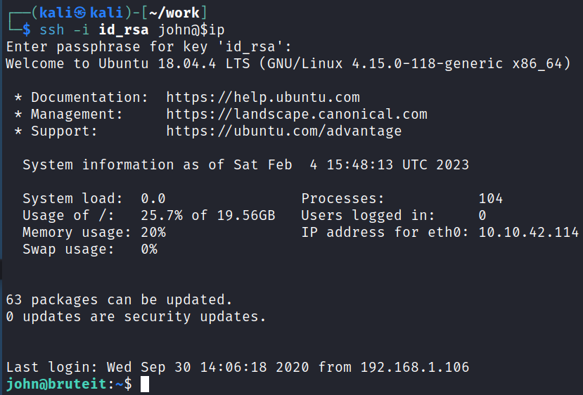

# Brute It
**Date:** February 4th 2023

**Author:** j.info

**Link:** [**Brute It**](https://tryhackme.com/room/bruteit) CTF on TryHackMe

**TryHackMe Difficulty Rating:** Easy

<br>


<br>

## Objectives
- How many ports are open?
- What version of SSH is running?
- What version of Apache is running?
- Which Linux distribution is running?
- What is the hidden directory?
- What is the user:password of the admin panel?
- What is John's RSA Private Key passphrase?
- user.txt
- Web flag
- What is the root's password?
- root.txt

<br>

## Initial Enumeration

### Nmap Scan

`sudo nmap -sV -sC -T4 $ip`

```
PORT   STATE SERVICE VERSION
22/tcp open  ssh     OpenSSH 7.6p1 Ubuntu 4ubuntu0.3 (Ubuntu Linux; protocol 2.0)
80/tcp open  http    Apache httpd 2.4.29 ((Ubuntu))
|_http-title: Apache2 Ubuntu Default Page: It works
```

That answers the first 4 questions under the reconnaissance task.

<br>

### Gobuster Scan

`gobuster dir -u http://$ip -t 30 -r -x php,txt,html -w dir-med.txt`

```
/index.html           (Status: 200) [Size: 10918]
/admin                (Status: 200) [Size: 671]
```

That answers the last task 2 question.

<br>

## Website Digging

Visiting the main page shows us a default Apache2 "It works" page so nothing there.

There isn't a robot.txt and nothing useful was found viewing the source either.

Looking at /admin:


Given the name of this CTF I'm going to go out on a limb here and say we probably need to brute force our way into this admin login page. Looking at view source for the /admin page shows us the following:


So that gives us a username to attempt to brute force, and also the name for the username and password fields that we can plug into hydra. We can also see the login button name is just LOGIN.

I open up the Firefox dev tools and attempt to login to figure out what type of request this login page uses and see that it's a POST request, and also capture what the failed login message is which we'll need for hydra:


Ok let's start this brute force up:

`hydra -l admin -P rockyou.txt 10.10.42.114 http-post-form "/admin/index.php:user=^USER^&pass=^PASS^&Login=LOGIN:Username or password invalid" -V`

And we find it after about 20 seconds:


That answers the first question under task 3.

Logging in takes us to /admin/panel:


That gives us the last question under task 3.

That's rather nice of them to give us an SSH key to use! Clicking on it:


I copy the private key to my system and try to connect over:

```
john@10.10.42.114's password:
```

Let's run our key through ssh2john and crack it:

`ssh2john id_rsa > hash`

`john hash --wordlist=rockyou.txt`


That answers the second question in task 3.

<br>

## System Access

With that done I use the SSH key to connect over to the system as john:

`ssh -i id_rsa john@$ip`



<br>

## System Enumeration

Looking at the files in our home directory reveals the user.txt flag which answers the third question in task 3:


I check `sudo -l` and find it doesn't require a password and shows us the following:


Looking at [**GTFOBins**](https://gtfobins.github.io/gtfobins/cat/#sudo) shows us we can use it to view or escalate our privileges:


You can run `sudo cat /root/root.txt` and it will give you the final flag but you can potentially escalate your privileges and I'm going give that a try.

<br>

## Root

I use `sudo cat /etc/shadow` and copy the hash for the root user into a file on my home system called hash.txt.

Then I run the hash through hashcat:

`hashcat -m 1800 -w 3 hash.txt rockyou.txt`

And in less than a minute we've cracked the root users password hash:


That gives us the first question in task 4.

And looking at the /root/root.txt flag gives us the final question:


<br>

With that we've completed this CTF!


<br>

## Conclusion

A quick run down of what we covered in this CTF:

- Basic enumeration with **nmap** and **gobuster**
- Using **hydra** to brute force a website login page
- Finding a password protected private SSH key and using **ssh2john** and **John the Ripper** to crack it, and then SSH over to the system
- Being allowed to run the **cat** command as root and using that to capture the root users password hash from /etc/shadow
- Using **hashcat** to crack the root users hash, and then logging in as root

<br>

Many thanks to:
- [**ReddyyZ**](https://tryhackme.com/p/ReddyyZ) for creating this CTF
- **TryHackMe** for hosting this CTF

<br>

You can visit them at: [**https://tryhackme.com**](https://tryhackme.com)