# Investigating Windows
**Date:** February 5th 2023

**Author:** j.info

**Link:** [**Investigating Windows**](https://tryhackme.com/room/investigatingwindows) CTF on TryHackMe

**TryHackMe Difficulty Rating:** Easy

<br>

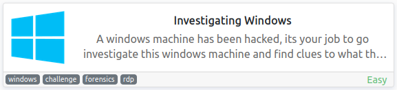

<br>

## Objectives
- Whats the version and year of the windows machine?
- Which user logged in last?
- When did John log onto the system last?
- What IP does the system connect to when it first starts?
- What two accounts had administrative privileges (other than the Administrator user)?
- Whats the name of the scheduled task that is malicous.
- What file was the task trying to run daily?
- What port did this file listen locally for?
- When did Jenny last logon?
- At what date did the compromise take place?
- At what time did Windows first assign special privileges to a new logon?
- What tool was used to get Windows passwords?
- What was the attackers external control and command servers IP?
- What was the extension name of the shell uploaded via the servers website?
- What was the last port the attacker opened?
- Check for DNS poisoning, what site was targeted?

<br>

## Initial Enumeration

### Nmap Scan

`sudo nmap -sV -sC -T4 $ip`

```
PORT     STATE SERVICE       VERSION
3389/tcp open  ms-wbt-server Microsoft Terminal Services
| ssl-cert: Subject: commonName=EC2AMAZ-I8UHO76
| Not valid before: 2023-02-04T14:53:01
|_Not valid after:  2023-08-06T14:53:01
|_ssl-date: 2023-02-05T14:56:50+00:00; +1s from scanner time.
| rdp-ntlm-info: 
|   Target_Name: EC2AMAZ-I8UHO76
|   NetBIOS_Domain_Name: EC2AMAZ-I8UHO76
|   NetBIOS_Computer_Name: EC2AMAZ-I8UHO76
|   DNS_Domain_Name: EC2AMAZ-I8UHO76
|   DNS_Computer_Name: EC2AMAZ-I8UHO76
|   Product_Version: 10.0.14393
|_  System_Time: 2023-02-05T14:56:50+00:00
```

<br>

## Windows Investigation

This CTF gives us credentials and asks us to RDP over to the machine which I do using xfreerdp:

`xfreerdp /v:$ip /u:Administrator /p:letmein123!`

#### 1 - Whats the version and year of the windows machine?

There are several ways to do this. You can go to the control panel, right click the my computer icon in file explorer, go to a command prompt and type winver or systeminfo, and other ways as well.

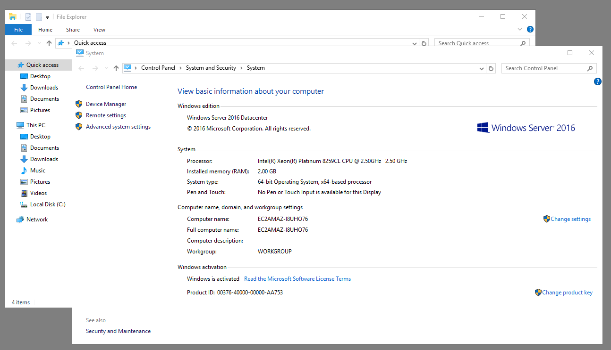

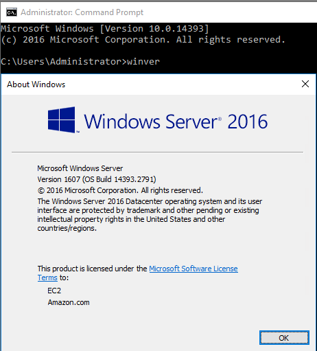

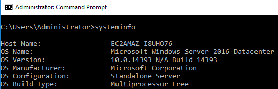

#### 2 - Which user logged in last?

I chose to use PowerShell to check this with the following command:

`Get-LocalUser | Select Name, Lastlogon`

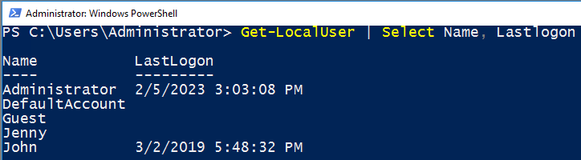

#### 3 - When did John log onto the system last?

The command I ran in question 2 also displayed this. See above.

#### 4 - What IP does the system connect to when it first starts?

I got this answer out of the Windows registry by opening up `regedit` and then navigating to:

HKLM -> SOFTWARE -> Microsoft -> Windows -> CurrentVersion -> Run

Which shows you items that automatically run on system startup.

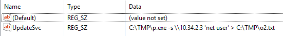

#### 5 - What two accounts had administrative privileges (other than the Administrator user)?

You can find this using the `net localgroup Administrators` command on the command line:

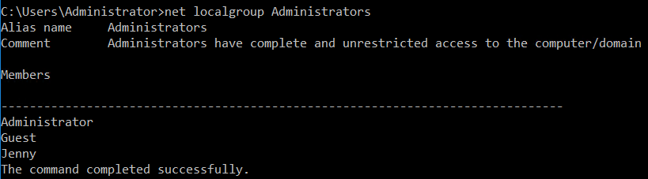

#### 6 - Whats the name of the scheduled task that is malicous.

I open up the task scheduler and find more than one task that definitely seems malicious, but it's looking for the one called "Clean file system" in this case. You can see that it runs once a day and runs a PowerShell version of netcat to start a listener on port 1348.

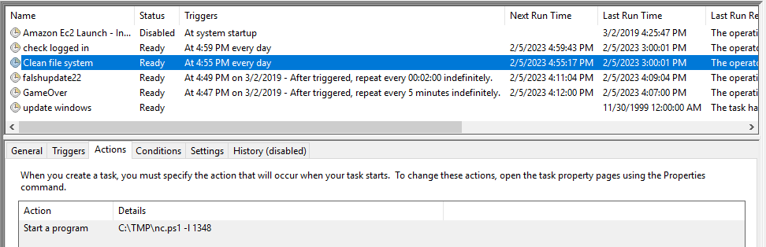

#### 7 - What file was the task trying to run daily?

Answered above. See question 6.

#### 8 - What port did this file listen locally for?

Answered above. See question 6.

#### 9 - When did Jenny last logon?

Answered above. See question 2.

#### 10 - At what date did the compromise take place?

Looking at the task scheduler you can see that both of the malicious scheduled tasks were created on 3/2/2019. You can also look in the c:\TMP directory and see that mimikaz and other tools were put there on the same day.

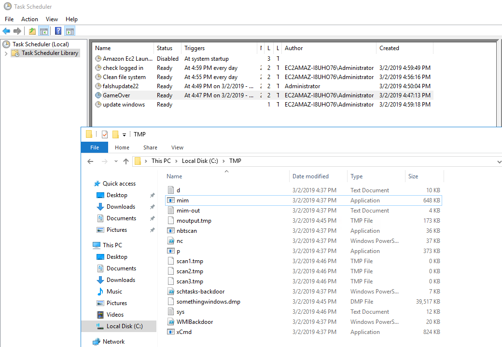

#### 11 - At what time did Windows first assign special privileges to a new logon?

I am pretty sure they screwed this one up in some manner. If you open the event viewer up and go to Windows Logs -> Security and then filter by event ID 4672 it will give you a list of logins with special privileges. The first one is on 2/13. If you discount those on 2/13 because the compromise happened on 3/2 the first one would be on 3/2/2019 at 4:02:58 PM. That's not the correct answer on THM either. It's actually looking for one further down the list on 3/2/2019 at 4:04:49 PM and I'm not sure why.

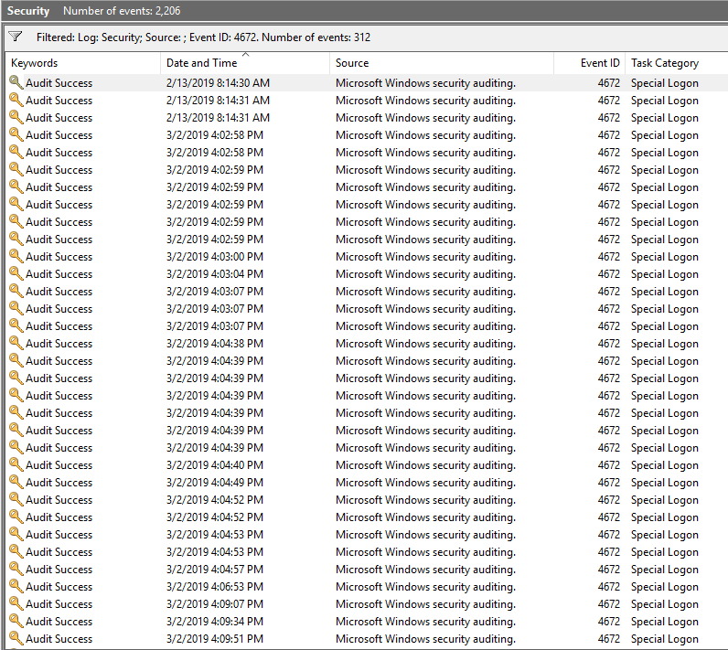

#### 12 - What tool was used to get Windows passwords?

The GameOver scheduled task runs mim.exe which is actually mimikatz. If you run the mim.exe program or open up the mim-out.txt file in c:\TMP you can see that.

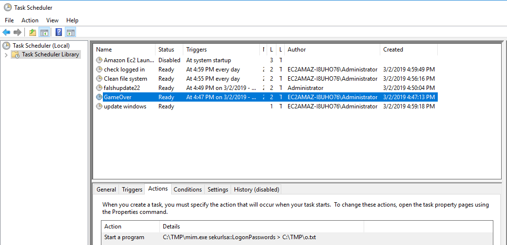

#### 13 - What was the attackers external control and command servers IP?

I looked around in the firewall rules to see if there were any that looked suspicious but didn't find any. I also looked at all the scheduled tasks to see if they had any IP's listed in outbound traffic. Looked in the c:\TMP files as well to see if it had a hardcoded IP address and none of those did. I eventually found the answer in the hosts file. The google.com entry has the IP set to 76.32.97.132 which isn't a valid Google IP address.

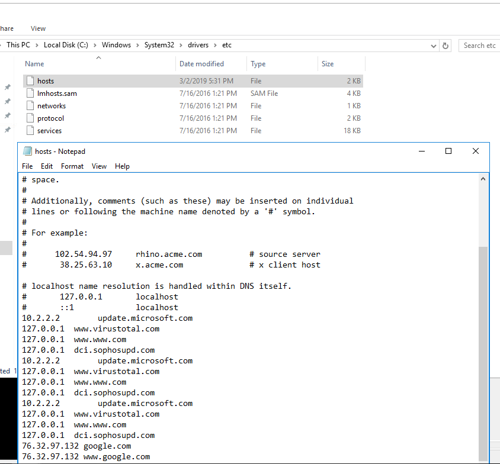

#### 14 - What was the extension name of the shell uploaded via the servers website?

Given this is a Windows machine the website was located in c:\inetpub\wwwroot and the shell ended up being tests.jsp. Opening that file you can see that it asks for a command to run, and then passes it through .exec to run it.

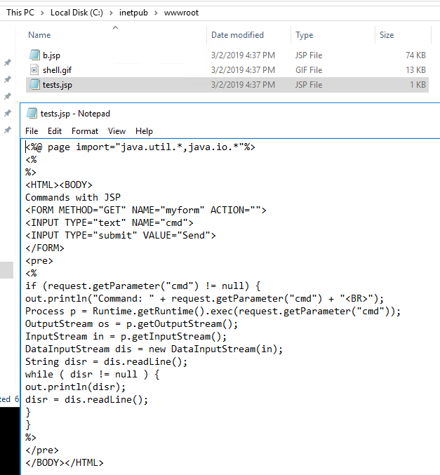

#### 14 - What was the last port the attacker opened?

Looking at the inbound firewall rules shows the answer to this one.

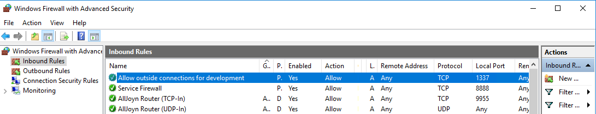

#### 15 - Check for DNS poisoning, what site was targeted?

This was answered in question 13. The hosts file points google.com to the attackers IP address.

<br>

With that we've completed this CTF!

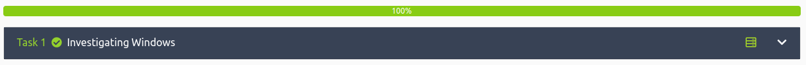

<br>

## Conclusion

A quick run down of what we covered in this CTF:

- Using **xfreerdp** to establish an RDP session
- Using the **cmd.exe** to find various pieces of information
- Running **PowerShell** commands to gather user login information
- Looking at the Windows registry with **regedit** to find autorun programs
- Examining **scheduled tasks** and finding malicious tasks
- Using the **event viewer** to look through logs
- Discovering several IoC's such as a **firewall rule**, a **.jsp webshell**, a modified **hosts** file, and more

<br>

Many thanks to:
- **TryHackMe** for creating and hosting this CTF

<br>

You can visit them at: [**https://tryhackme.com**](https://tryhackme.com)