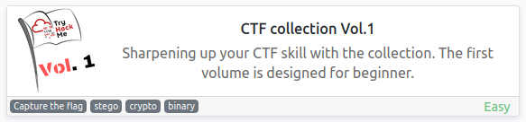
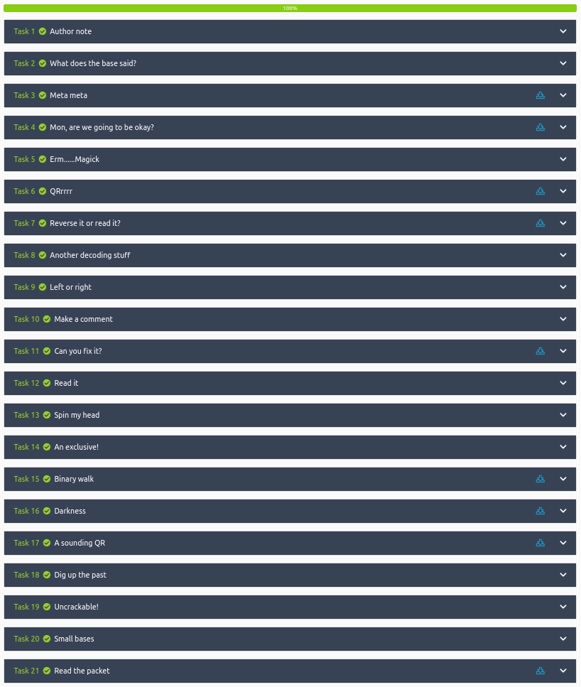

# CTF collection Vol.1
**Date:** February 8th 2023

**Author:** j.info

**Link:** [**CTF collection Vol.1**](https://tryhackme.com/room/ctfcollectionvol1) CTF on TryHackMe

**TryHackMe Difficulty Rating:** Easy

<br>



<br>

## Objectives
- Feed me the flag!
- I'm hungry, I need the flag.
- It is sad. Feed me the flag.
- Did you find the flag?
- More flag please!
- Found the flag?
- Oh, Oh, Did you get it?
- What did you get?
- I'm hungry now... I need the flag
- What is the content?
- Did you found the hidden flag?
- Can you decode it?
- Did you crack it? Feed me now!
- Flag! Flag! Flag!
- What does the flag said?
- What does the bot said?
- Did you found my past?
- The deciphered text
- What is the flag?
- Did you captured my neighbor's flag?

<br>

### What does the base said?

We're asked:
```
Can you decode the following?

VEhNe2p1NTdfZDNjMGQzXzdoM19iNDUzfQ==
```

This is a simple base64 encoded string and I just run it through base64 on the command line:

`echo "VEhNe2p1NTdfZDNjMGQzXzdoM19iNDUzfQ==" | base64 -d`

```
THM{ju57_d3c0d3_7h3_b453}
```

<br>

### Meta meta

Download the task file which gives us an image named Findme.jpg.

You can either use `strings` or `exiftool` to find the flag on this one:

`exiftool Findme.jpg`

```
Owner Name                      : THM{3x1f_0r_3x17}
```

<br>

### What does the base said?Mon, are we going to be okay?

Download the task file which gives us an image named Extinction.jpg.

This one has steganography which you can use steghide to uncover. Leave the password blank and just hit enter.

`steghide extraft -sf Extinction.jpg`

```
Enter passphrase: 
wrote extracted data to "Final_message.txt".
```

Looking at the .txt file:

```
It going to be over soon. Sleep my child.

THM{500n3r_0r_l473r_17_15_0ur_7urn}
```

<br>

### Erm......Magick

We have hidden text on this one and you can uncover it by just highlighting with your mouse, or looking at the page source code.

```
Huh, where is the flag? THM{wh173_fl46}
```

```html
<p>Huh, where is the flag? <span style="color:rgb(255, 255, 255);"><span style="background-color:rgb(255, 255, 255);">THM{wh173_fl46}</span></span><br></p>
```

<br>

### QRrrrr

Download the task file which gives us a QR code image named QR.png.

I'm sure it would have been fine to open it with my phone, but I chose to use a command line tool that can decode QR codes and give you the encoded message. It's called zbarimg and you can install it with `sudo apt-get install zbar-tools`.

`zbarimg QR.png`

```
QR-Code:THM{qr_m4k3_l1f3_345y}
scanned 1 barcode symbols from 1 images in 0.01 seconds
```

<br>

### Reverse it or read it?

Download the task file which gives you a file named hello.hello.

This file looks to be a binary after analyzing it with `file hello.hello`:

```
hello.hello: ELF 64-bit LSB pie executable, x86-64, version 1 (SYSV), dynamically linked, interpreter /lib64/ld-linux-x86-64.so.2, BuildID[sha1]=02900338a56c3c8296f8ef7a8cf5df8699b18696, for GNU/Linux 3.2.0, not stripped
```

Reverse engineering it doesn't sound like something I want to do at the moment so I examine the file with xxd.

`xxd hello.hello`

And find this:

```
00002000: 0100 0200 0000 0000 5448 4d7b 3334 3579  ........THM{345y
00002010: 5f66 316e 645f 3334 3579 5f36 307d 0000  _f1nd_345y_60}..
00002020: 4865 6c6c 6f20 7468 6572 652c 2077 6973  Hello there, wis
00002030: 6820 796f 7520 6861 7665 2061 206e 6963  h you have a nic
00002040: 6520 6461 7900 0000 011b 033b 4400 0000  e day......;D...
```

<br>

### Another decoding stuff

We're given some cipher text "3agrSy1CewF9v8ukcSkPSYm3oKUoByUpKG4L". The first thing to do is determine what cipher is used to encode the text and you can use several different tools to do that if it's not readily apparent just by looking at it.

This website will help you identify the cipher type on cipher text.

[**https://www.dcode.fr/cipher-identifier**](https://www.dcode.fr/cipher-identifier)

Which it tells me is base58, and I then run that through the command line base58 tool:

`echo "3agrSy1CewF9v8ukcSkPSYm3oKUoByUpKG4L" | base58 -d`

```
THM{17_h45_l3553r_l3773r5}
```

Another popular way to handle encoded text is to use CyberChef.

[**https://gchq.github.io/CyberChef/**](https://gchq.github.io/CyberChef/)

A quick way to identify the cipher type and decode it is pasting the cipher text in the input section and then adding the "magic" to the recipe section and clicking BAKE! Which in this case works perfectly.

<br>

### Left or right

```
Left, right, left, right... Rot 13 is too mainstream. Solve this

MAF{atbe_max_vtxltk}
```

It ends up being ROT7 instead or ROT13. Given the format of the text I guessed that it should start with the standard flag format of THM and if you rotate MAF by 7 each it equals THM.

```
THM{hail_the_caesar}
```

<br>

### Make a comment

You're not given much to go on with this one. I inspect the page source code and don't find anything. I inspect the actual element you type the flag into and find the value set to the flag we're looking for:

```html
<input type="text" class="form-control room-answer-field" placeholder="Answer format: ***{************************}" value="THM{4lw4y5_ch3ck_7h3_c0m3mn7}" disabled="">
```

<br>

### Can you fix it?

We're given an image named spoil.png to download but the picture isn't working. Considering we're supposed to fix it I'm going to guess that the files "magic number" isn't set correctly and if we hex edit it back to the proper magic number we will be able to load it.

Magic numbers are the first few bits of a file that help to identify what type of file it is. It's what the `file` command uses. Checking that out:

`file spoil.png`

```
spoil.png: data
```

I start up the hex editing tool with `hexedit spoil.png` and we're given:

```
00000000   23 33 44 5F  0D 0A 1A 0A  00 00 00 0D  49 48 44 52  00 00 03 20  #3D_........IHDR...
00000014   00 00 03 20  08 06 00 00  00 DB 70 06  68 00 00 00  01 73 52 47  ... ......p.h....sRG
00000028   42 00 AE CE  1C E9 00 00  00 09 70 48  59 73 00 00  0E C4 00 00  B.........pHYs......
0000003C   0E C4 01 95  2B 0E 1B 00  00 20 00 49  44 41 54 78  9C EC DD 79  ....+.... .IDATx...y

```

There are plenty of places to look up but I used:

[**https://en.wikipedia.org/wiki/List_of_file_signatures**](https://en.wikipedia.org/wiki/List_of_file_signatures)

Which says that .png files should start with:

```
89 50 4E 47 0D 0A 1A 0A
```

That definitely does not match what's showing in the hex editor. The last 8 characters are fine, but the first 8 are not. I change the first 8 characters to match what it's supposed to be and save the file using CTRL + X. The file should now look like this:

```
00000000   89 50 4E 47  0D 0A 1A 0A  00 00 00 0D  49 48 44 52  00 00 03 20  .PNG........IHDR...
00000014   00 00 03 20  08 06 00 00  00 DB 70 06  68 00 00 00  01 73 52 47  ... ......p.h....sRG
00000028   42 00 AE CE  1C E9 00 00  00 09 70 48  59 73 00 00  0E C4 00 00  B.........pHYs......
0000003C   0E C4 01 95  2B 0E 1B 00  00 20 00 49  44 41 54 78  9C EC DD 79  ....+.... .IDATx...y

```

And running the `file spoil.png` command:

```
spoil.png: PNG image data, 800 x 800, 8-bit/color RGBA, non-interlaced
```

And looking at it in an image viewer now works as well and gives you the flag:

```
THM{y35_w3_c4n}
```

<br>

### Read it

Again we're not given much to go on other than we can find a flag on a TryHackMe social account. This was a pain in the butt but eventually I found it was on reddit. I google searched for "tryhackme deskel flag" and a few links down ends up being the correct link:

[**https://www.reddit.com/r/tryhackme/comments/eizxaq/new_room_coming_soon/**](https://www.reddit.com/r/tryhackme/comments/eizxaq/new_room_coming_soon/)

```
THM{50c14l_4cc0un7_15_p4r7_0f_051n7}
```

Deskel is the author of the CTF so I figured he probably posted it somewhere and decided to search for him + THM + flag.

<br>

### Spin my head

We're given the following:

```
++++++++++[>+>+++>+++++++>++++++++++<<<<-]>>>++++++++++++++.------------.+++++.>+++++++++++++++++++++++.<<++++++++++++++++++.>>-------------------.---------.++++++++++++++.++++++++++++.<++++++++++++++++++.+++++++++.<+++.+.>----.>++++.
```

I knew this one from running into it before but you can head back to this website to identify the type:

[**https://www.dcode.fr/cipher-identifier**](https://www.dcode.fr/cipher-identifier)

CyberChef actually does not help with this one.

This website will decode the text:

[**https://www.splitbrain.org/_static/ook/**](https://www.splitbrain.org/_static/ook/)

```
THM{0h_my_h34d}
```

<br>

### An exclusive!

You're given the following:

```
Exclusive strings for everyone!

S1: 44585d6b2368737c65252166234f20626d
S2: 1010101010101010101010101010101010
```

The exclusive hint and the S2 make me think it's XOR based. I use the following website for XOR:

[**https://md5decrypt.net/en/Xor/**](https://md5decrypt.net/en/Xor/)

Paste S1 into the left box, S2 into the key field, and change the type dropdown to hexadecimal then click decrypt. You're left with:

```
54484d7b3378636c75353176335f30727d
```

We then need to convert that hex string into readable text so I find a hex to ASCII converter here:

[**https://www.rapidtables.com/convert/number/hex-to-ascii.html**](https://www.rapidtables.com/convert/number/hex-to-ascii.html)

It should be from hexadecimal to text and paste the hex number we ended up with on the previous website into the box. Then choose ASCII character encoding and click convert which displays our flag:

```
THM{3xclu51v3_0r}
```

<br>

### Binary walk

Download the task file which is an image named hell.jpg. You can use `strings hell.jpg` and at the very end notice something out of place, which means steganography is likely used:

```
hello_there.txtUT
```

There's a tool called binwalk to work with steganography and given that's the name of the task we'll use that.

`binwalk -e hell.jpg`

```
DECIMAL       HEXADECIMAL     DESCRIPTION
--------------------------------------------------------------------------------
0             0x0             JPEG image data, JFIF standard 1.02
30            0x1E            TIFF image data, big-endian, offset of first image directory: 8
265845        0x40E75         Zip archive data, at least v2.0 to extract, uncompressed size: 69, name: hello_there.txt
266099        0x40F73         End of Zip archive, footer length: 22
```

You can see it extract that hello_there.txt we saw with the strings command. Change over to the _hell.jpg.extracted directory and cat the file for your flag:

```
Thank you for extracting me, you are the best!

THM{y0u_w4lk_m3_0u7}
```

<br>

### Darkness

We're given the hint "There is something lurking in the dark". Downloading the task file gives us an image named dark.png.

Opening up that image doesn't show us anything other than a black box.

I've also ran into channeleges like this previously and messags are hidden in the bits of images. This website does what we're looking for here:

[**https://incoherency.co.uk/image-steganography/#unhide**](https://incoherency.co.uk/image-steganography/#unhide)

Click the browse button and add dark.png. The image that appears on the right side will give you your flag, and you can click the download full-size image button to make it large enough to read.

```
THM{7h3r3_15_h0p3_1n_7h3_d4rkn355}
```

<br>

### A sounding QR

Again we're given a QR code image which when running it through `zbarimg QRCTF.png` gives us:

```
QR-Code:https://soundcloud.com/user-86667759/thm-ctf-vol1
scanned 1 barcode symbols from 1 images in 0.01 seconds
```

Listening to the audio file you get your flag:

```
THM{SOUNDINGQR}
```

<br>

### Dig up the past

This is an easy one using the Wayback Machine. Go here:

[**https://web.archive.org/**](https://web.archive.org/) and enter the website they give you into the URL search box at the top.

Click on 2020 to isolate things to that year since we're looking for Jan 2nd 2020.

Hover over Jan 2nd and then click the snapshot listed as 13:12:52.

Scroll down a little and you'll see the flag:

```
What did you just say? flag? THM{ch3ck_th3_h4ckb4ck}
```

<br>

### Uncrackable!

We're given the following:

```
Can you solve the following? By the way, I lost the key. Sorry >.<

MYKAHODTQ{RVG_YVGGK_FAL_WXF}

Flag format: TRYHACKME{FLAG IN ALL CAP}
```

After messing around with Caesar ciphers it doesn't appear to be that but there is a pattern when comparing MYKAHODTQ to TRYHACKME. So it's kind of like a Caesar cipher but each position is shifted differently according to a repeating pattern:

```
M -> T = +7
Y -> R = -7
K -> Y = +14
A -> H = +7
H -> A = -7
O -> C = +14
D -> K = +7
T -> M = -7
Q -> E = +14
```

If you then put RVG_YVGGK_FAL_WXF through the same pattern as above you end up with your flag:

```
TRYHACKME{YOU_FOUND_THE_KEY}
```

<br>

### Small bases

We're given:

```
581695969015253365094191591547859387620042736036246486373595515576333693
```

So we have a really long number in decimal format.

I try and convert decimal to some differenet formats but nothing comes back looking like a flag so it's probably a multi-stage conversion. I end up finding it's decimal to hex to ascii.

Decimal to hex value:

```
54484D7B31375F6A7535375F346E5F307264316E3472795F62343533357D
```

Hex to ASCII value:

```
THM{17_ju57_4n_0rd1n4ry_b4535}
```

I used the RapidTables website to make these conversions:

[**https://www.rapidtables.com/convert/number/decimal-to-hex.html**](https://www.rapidtables.com/convert/number/decimal-to-hex.html)

[**https://www.rapidtables.com/convert/number/hex-to-ascii.html**](https://www.rapidtables.com/convert/number/hex-to-ascii.html)

<br>

### Read the packet

Our final challenge. In this one we download a task file which ends up being a .pcapng file so it looks like we're going to be using Wireshark.

When opening the file up everything at first glance appears to be encrypted traffic, but if you change your filter to http you'll see a request info listed as:

```
506 GET /flag.txt HTTP/1.1
```

And the line directly below that will have the actual flag in it. Click this:

```
455 HTTP/1.1 200 OK  (text/plain)
```

Branch out the very bottom option "Line-based text data: text/plain (3 lines)"

And you'll see the flag:

```
THM{d0_n07_574lk_m3}
```

You can also just right click that last line and choose Follow -> HTTP Stream and it will display in a nicer format for you.

That was a lot to go through! So much so that I had to shrink my Firefox screen in order to screen capture the completion image.

<br>

With that we've completed this CTF!



<br>

## Conclusion

A quick run down of what we covered in this CTF:

- Decoding various encoded text types using command line and web tools.
- Examining file metadata
- Examining several images using different steganography tools such as steghide, binwalk, and online resources
- Using command line tools to extract information from QR codes
- Using a hex editor to repair the "magic number" of a damaged image file
- Finding hidden information on a website by looking at it with dev tools
- Using the Wayback Machine to dig up old information
- Packet analysis with Wireshark to find specific information hidden in the .pcap file

<br>

Many thanks to:
- [**DesKel**](https://tryhackme.com/p/DesKel) for creating this CTF
- **TryHackMe** for hosting this CTF

<br>

You can visit them at: [**https://tryhackme.com**](https://tryhackme.com)