# c4ptur3-th3-fl4g
**Date:** February 10th 2023

**Author:** j.info

**Link:** [**c4ptur3-th3-fl4g**](https://tryhackme.com/room/c4ptur3th3fl4g) CTF on TryHackMe

**TryHackMe Difficulty Rating:** Easy

<br>

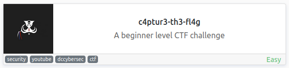

<br>

## Objectives
- c4n y0u c4p7u23 7h3 f149?
- 01101100 ...
- MRQX...
- RWFj...
- 68 65 78 ...
- Ebgngr zr 13 cynprf!
- *@F DA:? ...
- . .-.. ...
- 85 110 112 ...
- Unpack this BCD
- LS0tLS0g...
- Download the file
- Decode the image to reveal the answer.
- Download and get 'inside' the file. What is the first filename & extension?
- Get inside the archive and inspect the file carefully. Find the hidden text.

<br>

## Task 1

```
Translate, shift and decode the following;

Answers are all case sensitive.
```

<br>

### 1 - c4n y0u c4p7u23 7h3 f149?

This one is just "leet speak":

```
can you capture the flag?
```

<br>

### 2 - 01101100 ...

You can manually convert this, but I chose to use CyberChef:

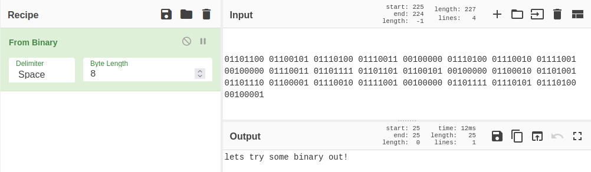

<br>

### 3 - MRQX...

This is base32 encoded text and I just use the base32 decode command:

`echo "MJQXGZJTGIQGS4ZAON2XAZLSEBRW63LNN5XCA2LOEBBVIRRHOM======" | base32 -d`

```
base32 is super common in CTF's
```

<br>

### 4 - RWFj...

And this one is base64:

`echo "RWFjaCBCYXNlNjQgZGlnaXQgcmVwcmVzZW50cyBleGFjdGx5IDYgYml0cyBvZiBkYXRhLg==" | base64 -d`

```
Each Base64 digit represents exactly 6 bits of data.
```

<br>

### 5 - 68 65 78 ...

This one is in hexadecimal and I use CyberChef again:

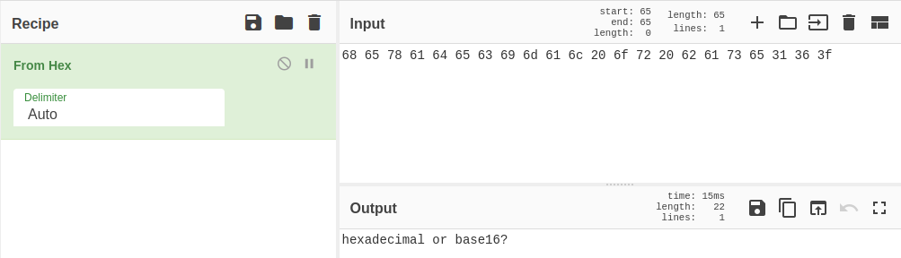

<br>

### 6 - Ebgngr zr 13 cynprf!

They give you a hint in this one with the number 13. It's a ROT13 and I use CyberChef:

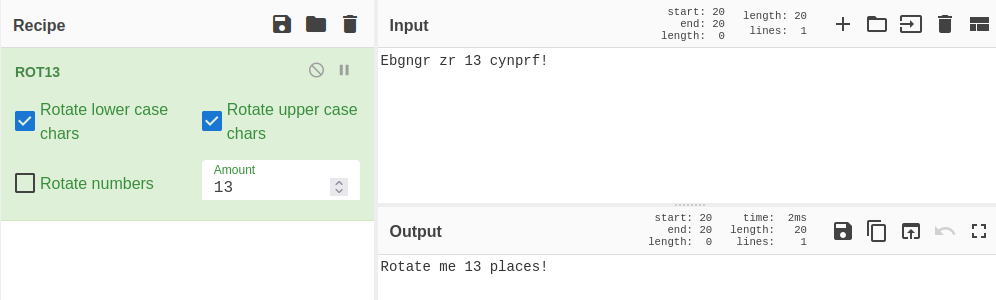

<br>

### 7 - *@F DA:? …

Not as much of a clue here, but it ends up being ROT47, which CyberChef can also help with:

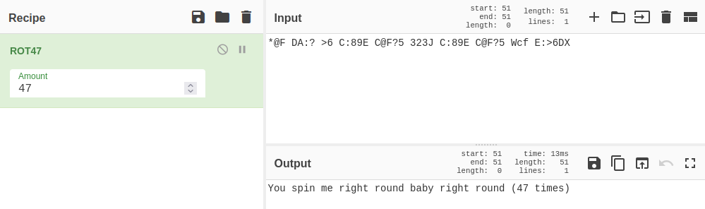

<br>

### 8 - - . .-.. ...

This one is easily recognizable as morse code:

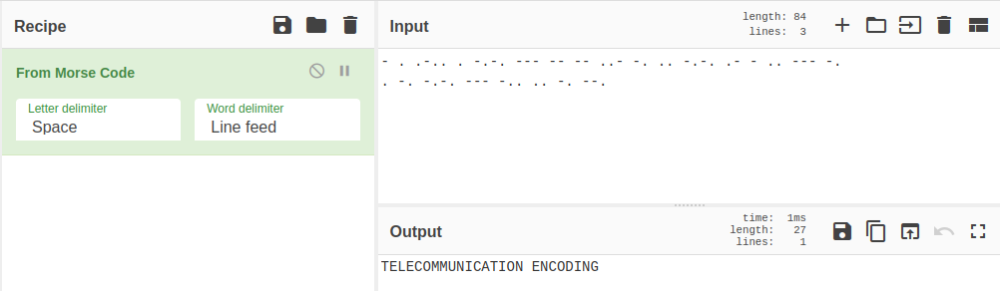

<br>

### 9 - 85 110 112 …

These are obviously just decimal numbers and trying to convert them from decimal to ascii gives us our flag. I used the [**RapidTables website**](https://www.rapidtables.com/convert/number/ascii-hex-bin-dec-converter.html) to convert:

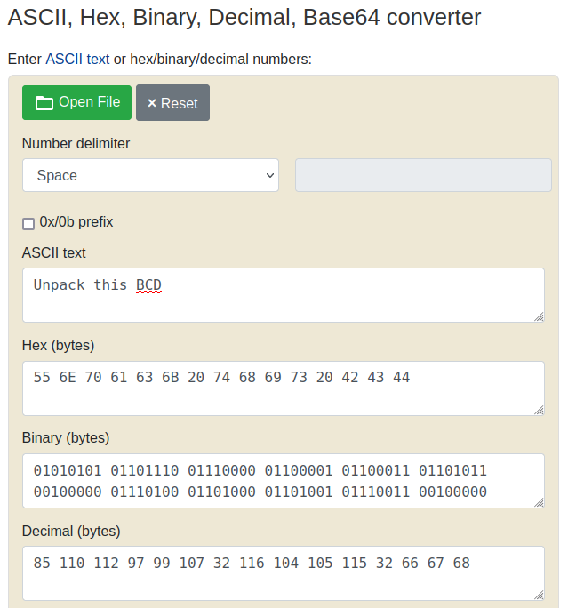

<br>

### 10 - LS0tLS0g…

This ended up being a combination of what we've used so far. If you decode the initial string from base64 it gives you morse code, which gives you binary, which gives you ROT47, which gives you decimal. I used CyberChef to do this all in one go:

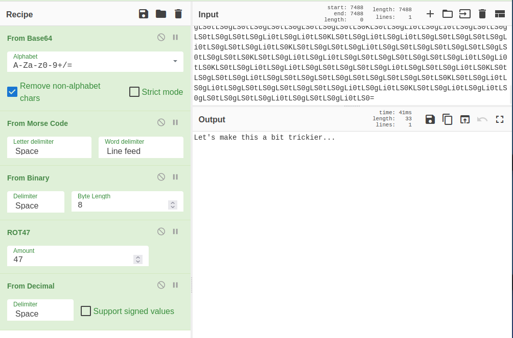

<br>

## Task 2

A spectrogram is a visual representation of the spectrum of frequencies of a signal as it varies with time. When applied to an audio signal, spectrograms are sometimes called sonographs, voiceprints, or voicegrams. When the data is represented in a 3D plot they may be called waterfalls.

<br>

### 1 - Download the file

I happened to have Audacity installed on my computer and used that to view the spectrogram.

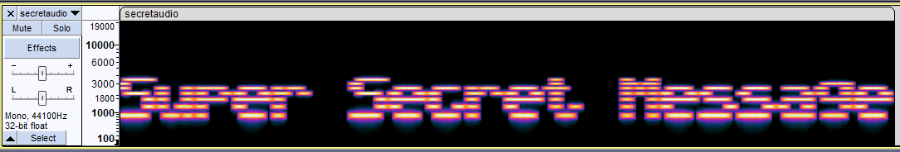

You can also use this [**Spectrum Analyzer website**](https://academo.org/demos/spectrum-analyzer/).

<br>

## Task 3

Steganography is the practice of concealing a file, message, image, or video within another file, message, image, or video.

<br>

### 1 - Decode the image to reveal the answer

There are many many tools you can use to solve this. I used stegseek:

`stegseek -wl ~/work/rockyou.txt stegosteg.jpg`

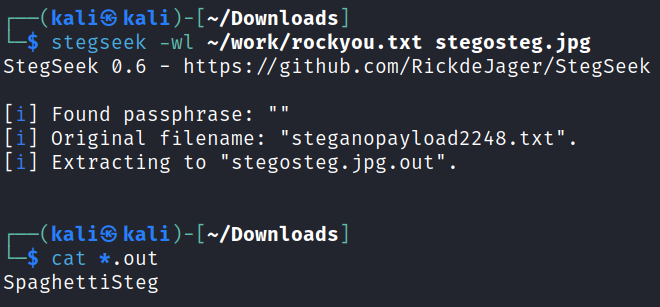

You can also use steghide:

`steghide extract -sf stegosteg.jpg`

<br>

## Task 4

Security through obscurity is the reliance in security engineering on the secrecy of the design or implementation as the main method of providing security for a system or component of a system.

<br>

When you download the file it's called meme.jpg and loads an actual meme if you open it.


I run it through stegseek, steghide, and exiftool but it doesn't reveal anything.

I move on and try binwalk and have some luck:

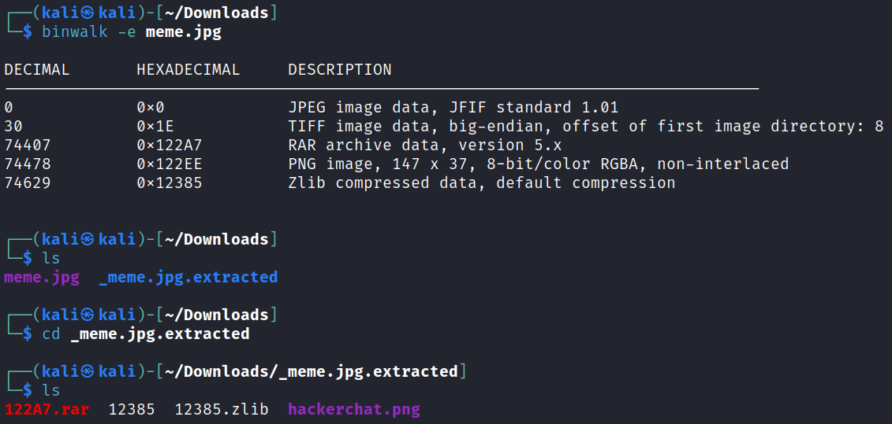

Opening the new image file:


So we have the answer to the first question that's asking for a filename and extension.

I run a strings command on the image files to see if there is any hidden text and the last flag is at the end:

```
2$Es
i2Mc
IEND
"AHH_YOU_FOUND_ME!"
```

<br>

With that we've completed this CTF!

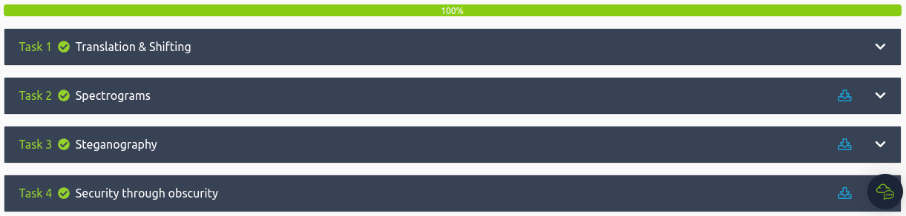

<br>

## Conclusion

A quick run down of what we covered in this CTF:

- Decoding various things such as binary, base32, base64, morse code, and more using CyberChef and other tools
- Analyzing spectrograms in an audio file to uncover a secret message
- Using tools such as binwalk, stegseek, steghide, and others to solve several steganography challenges

<br>

Many thanks to:
- [**dcdavidlee**](https://tryhackme.com/p/dcdavidlee) for creating this CTF
- **TryHackMe** for hosting this CTF

<br>

You can visit them at: [**https://tryhackme.com**](https://tryhackme.com)