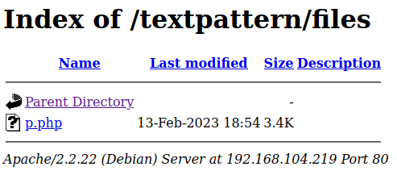

# DriftingBlues6
**Date:** February 13th 2023

**Author:** j.info

**Link:** [**Proving Grounds**](https://portal.offensive-security.com/proving-grounds/play) on Offensive Security

**PG Difficulty Rating:** Easy

<br>


<br>

## Objectives
- proof.txt flag

<br>

## Initial Enumeration

### Nmap Scan

`sudo nmap -sV -sC -T4 $ip`

```
PORT   STATE SERVICE VERSION
80/tcp open  http    Apache httpd 2.2.22 ((Debian))
|_http-title: driftingblues
| http-robots.txt: 1 disallowed entry 
|_/textpattern/textpattern
```

<br>

### Gobuster Scan

`gobuster dir -u http://$ip -t 100 -r -x php,txt,html,zip -w dir-med.txt`

```
/index.html           (Status: 200) [Size: 750]
/robots.txt           (Status: 200) [Size: 110]
/db                   (Status: 200) [Size: 53656]
/index                (Status: 200) [Size: 750]
/spammer.zip          (Status: 200) [Size: 179]
```

<br>

## Website Digging

Visiting the main page:


Viewing the source code shows a comment saying they keep getting hacked and asking us to hack the people hacking them instead.

Looking at robots.txt:

```
User-agent: *
Disallow: /textpattern/textpattern

dont forget to add .zip extension to your dir-brute
;)
```

Well, now I need to redo my gobuster with .zip added!

Looking at /db just shows us it's actually /db.png and it's the image on the main page.

I download the spammer.zip file which is password protected. Using zip2john and then cracking the password let's us unzip the archive and find a file called creds.txt which has credentials inside it:


Visiting /textpattern from the robots.txt file shows us that it's a Textpattern CMS:


Most of the links take you to the full disallow entry from robots.txt which is /textpattern/textpattern:


Logging in with the credentials we found earlier pops up a couple warnings about unsafe settings being used on the site but clicking ok several times will take you to he write menu:


I navigate to Admin -> Users and see that we're the only user on the CMS:


I look around the menu more and find the Content -> Files section which looks like it lets you upload files. I upload the pentestmonkey php reverse shell.


Running a new gobuster scan on /textpattern shows us:

```
/README               (Status: 200) [Size: 6311]
/files                (Status: 200) [Size: 938]
/themes               (Status: 200) [Size: 748]
/images               (Status: 200) [Size: 748]
/index.php            (Status: 200) [Size: 28256]
/LICENSE              (Status: 200) [Size: 15170]
/rpc                  (Status: 501) [Size: 15]
/HISTORY              (Status: 200) [Size: 68051]
```

<br>

## System Access

Looking at /files shows the file we uploaded waiting for us:



I set up a listener and click the file, which gives us a shell back as www-data:


<br>

## System Enumeration

We can't run `sudo -l`.

Running `find / -perm /4000 2>/dev/null` doesn't show us any out of the ordinary SUID files out there.

Checking `getcap -r / 2>/dev/null` doesn't give us any capabilities we can use for escalation.

Looking around the system for config files with hard coded credentials doesn't provide anything useful.

I search for all files I can write to and no luck there either.

There are no other users on the system so no files in /home to examine.

I decide to look for kernel exploits. Running `uname -a` shows us:

```
Linux driftingblues 3.2.0-4-amd64 #1 SMP Debian 3.2.78-1 x86_64 GNU/Linux
```

Doing a google search shows us that it looks like this kernel is vulnerable to Dirty COW. I end up at this [**Exploit-DB link**](https://www.exploit-db.com/exploits/40839).

First I look over the code, then I download the exploit to my system and transfer it over to the target machine. The instructions on Exploit-DB tell you how to compile it which I do with:

`gcc -pthread 40839.c -o cow -lcrypt`

And then run it with this to set the password to just password:

`./cow password`


<br>

## Root

It looks like it was successful but it asks you to check /etc/passwd to make sure the user was written successfully. It was, and after fixing my shell I'm able to switch over to the user that was created and gain root access:


And looking at our proof.txt flag:

`wc -c /root/proof.txt`

```
33 /root/proof.txt
```

NOTE: There is no local.txt flag on this machine, just proof.txt.

<br>

With that we've completed this CTF!


<br>

## Conclusion

A quick run down of what we covered in this CTF:

- Basic enumeration with **nmap** and **gobuster**
- Cracking a .zip file using **zip2john** and **John the Ripper** to find a set of credentials
- Using those credentials to login to the **Textpattern CMS**
- Uploading a reverse php shell to the CMS system and using it for our initial foothold
- Using the **Dirty COW kernel exploit** to escalate to root

<br>

Many thanks to:
- [**Offensive Security**](https://www.offensive-security.com/) for hosting this CTF
